# Scratchpad

This is a scratchpad for writing down vague ideas for building this LLM chat app for personal use. The goal is to provide a clear specification so that the coding agent can later build the app with minimal human intervention while still aligning with the user's vision.

This file will be collaboratively updated by the human user and the coding agent. It serves as the single source of truth for the project specification.

## Review Status

**Final Review Complete:** The Database Schema, XState UI definitions, and UX guidelines have been critically reviewed and finalized. All previous open questions have been resolved and incorporated directly into the specifications below. The specifications are now comprehensive and ready for implementation.

## Implementation Tasks

A detailed step-by-step implementation checklist for coding agents has been created based on this specification. It can be found in [docs/implementation-tasks.md](./implementation-tasks.md). Coding agents should follow that checklist sequentially to build the application.

## Tech stack

- Deployed to GitHub Pages as static client side-only application. Build pipeline may use Node scripts/dependencies. Offline support / PWA is out of scope; standard browser caching is sufficient for asset loading, as core LLM integration requires active internet connectivity anyway.
- LangGraph.js `@langchain/langgraph/web` for LLM agent orchestraion in-browser.
- React frontend.
- XState and `@xstate/react`, all the application and UI states should be fully driven by state machine(s).
- Carbon Design System `@carbon/react` as the base component library. Do NOT add custom "premium aesthetics" like glassmorphism, custom micro-animations, or external fonts. Adhere strictly to Carbon Design System components and tokens. Support switching between dark and light mode, defaulting to system settings. Provide a selector in the Global Settings to manually override it to "Light" or "Dark", saving this preference as a global setting in IndexedDB.
- TypeScript: Install package `@typescript/native-preview` instead of package `typescript`.
- Lint: `oxlint-tsgolint@latest` instead of ESLint.
  - Turn on type-aware linting and react/vitest plugins inside `.oxlintrc.json`.
  - The `package.json` scripts should simply call `oxlint` and `oxlint --fix` without command-line parameter overrides.
- Formatting: `oxfmt` instead of Prettier.
- Zod v4 for parsing/validating data.
- Vite for bundling.
- Vitest for tests. "Write tests. Not too many. Mostly integration." Test coverages should be configured and monitored.
- `msw` for mocking requests (https://vitest.dev/guide/mocking/requests). In general, no mocks are allowed except for API mocks.
- No E2E test.
- Persistence with IndexedDB via `idb` (and `fake-indexeddb` in test) instead of localStorage/sessionStorage. This is to ensure the storage has higher quota.
- Markdown & Math Rendering: `react-markdown`, `rehype-katex`, `remark-gfm`, and `remark-math` for rendering markdown messages and LaTeX equations.
- Support using OpenRouter and Gemini API as LLM API provider, and potentially switching to another provider in the future.
  - Prefer using the official `@openrouter/sdk` and `@google/genai` client libraries within custom LangGraph nodes to execute direct browser API calls rather than a custom fetch wrapper, while retaining full control over streaming and reasoning configurations.
  - **Security & Connectivity Guidelines**:
    - **API Key Storage**: API keys are stored in IndexedDB in plain text without encryption. No master password, encryption, or key locking mechanism is supported or required.
    - **CORS Support**: All direct API calls are made from the browser. CORS does not need to be handled because both OpenRouter and Gemini API support CORS natively. No CORS proxy configuration, validation, or settings are supported.
- `AGENTS.md` should be kept up-to-date to run the tool chains e.g. formatting, typecheck, lint with autofix, test, build.

Fill in anything missing.

## Features and use cases to support

"Be yet another poweruser LLM chat app" so the LLM chat UI basics and some features need to be there, plus:

- The user is always chatting with a workflow (an orchestration graph with 0-many LLM agents) directly instead of a single agent.
  - The normal chat feature for chatting to one single LLM agent like in an average LLM chat app still works, just that behind the scene it should go through the same code path as if chatting with an orchestration with many LLM agents.
  - The default selected workflow when creating a new chat is still the good old workflow where there is only 1 human user and 1 agent with a system prompt like "you are a helpful assistant".
  - The UI should also support running orchestration workflow without user input (but still requires the user to manually approve to start such a workflow).
- Workflow management CRUD:
  - Workflow = agent orchestration graph like for LangGraph
    - Built-in workflow can be anything LangGraph supported.
    - User-defined workflow needs to be able to be serialized to/deserialized from persistence.
    - The editing interface for custom workflows is a text-based JSON editor (no graphical/visual editor required). See the [Workflow JSON Editor State Machine](#l-workflow-json-editor-state-machine) section for details.
    - Here is where the user can define which are the agents involved in an orchestration and their system prompts.
    - _Safety Rules_: The user cannot delete built-in workflows. Deleting a custom workflow that is currently in use by any threads is blocked, and an inline notification is displayed showing the active threads referencing it.
  - Node execution sequence and underlying LLM threads should be visible in the chat feed, rendered as flatly as possible so they look like working within one single thread, including reasoning tokens.
    - Multi-agent rendering MUST make it clearly understandable which agent is speaking. Each message bubble from an agent MUST display the agent's name (and optionally an auto-generated avatar based on the name) at the top of the bubble.
    - Tool calls made by a specific agent should be nested or visibly linked to that agent's message block, so users know which agent initiated the tool call.
  - To begin with, there should be a built-in debate workflow, where the user should be able to seed the debate with a topic, then let 2 agents debate infinitely in a loop until they come to consensus, the agents come to consensus by making tool call to suggest leaving the debate loop, then finally another agent summarize the debate for the user to review.
- LLM provider preset management CRUD:
  - Preset = combination of LLM API provider, API key, LLM model, and configs like reasoning/thinking level, API retry policy, budget policy (e.g. force asking for human approval after X steps or Y tokens in the workflow execution cycle without human user sending a message).
  - When opening a new chat thread, the thread selects the default preset as the initial preset. The selected preset ID is saved per thread in the database.
  - When switching back to an old thread: if the saved preset is still available, it is used; otherwise, it falls back to the default preset.
  - Onboarding and First-Time User Experience: Guides users on first load if no presets or API keys exist. See the [Global Settings Form State Machine](#s-global-settings-form-state-machine) for warning banner details. When the application is launched for the first time and IndexedDB is initialized, if the `workflows` store is empty, the application automatically seeds the built-in workflows (Standard 1-agent, Debate workflow) into the `workflows` store. When the user configures and saves their API keys for the first time, the application automatically seeds a set of default presets ("Default Gemini Flash" using `gemini-2.5-flash` and "Default OpenRouter Flash" using `google/gemini-2.5-flash`) into the database, setting the `default_preset_id` in the `settings` store.
  - _Safety Rules_: The user cannot delete the designated global default preset (the preset whose ID matches `default_preset_id` in global settings). Deleting a custom preset that is currently set as the active preset for any threads or referenced in any workflow node definitions is blocked, and the UI displays an inline notification listing the referencing threads or workflows.
- Thread management CRUD
  - Current thread ID is synced with the URL so refreshing leads to the same thread.
  - Thread-level presets are strictly inherited from the selected preset. The active preset is displayed as a dropdown trigger in the Chat Header, allowing quick switching. A configure icon next to it allows editing the preset in a modal panel. If a built-in preset is edited, the UI prompts the user to "Clone and Customize" to create a new custom preset copy.
  - Cascading deletes for thread checkpoints, checkpoint writes, and messages are performed in batched transactions (deleting up to 500 records per chunk) scheduled asynchronously via `requestIdleCallback` to keep the UI responsive. See the [Left Sidebar State Machine](#j-left-sidebar-state-machine) section for complete transaction and scheduling details.
  - Active thread workflows use a snapshot (`workflowSnapshot`) stored in the thread record. If the custom workflow definition is modified in the Workflow Manager, it does not affect already active/paused threads. Users can manually sync the thread to the latest workflow definition via a "Sync to Latest Workflow" button in the thread settings. The sync feature automatically detects if the update is a simple update to system prompts or presets (i.e. identical node IDs and edges). If so, it performs a "Soft Sync" that updates the `workflowSnapshot` inline without clearing the message history or checkpoints, allowing execution to resume with the new prompts/presets. If the graph topology has changed (nodes or edges added, removed, or renamed), it performs a "Hard Sync" (destructive) which prompts the user for confirmation, updates the snapshot, and purges all checkpoints/messages for the thread. A Hard Sync purges all checkpoints and message history, resetting the thread's chat feed to an empty state, while preserving the thread's metadata (such as its title, creation date, and selected preset ID).
- System message management CRUD for automatically inserting system message to agents upon API request, but these automatically inserted messages shouldn't be persisted in the chat history.
  - Should support insertion depth (similar to SillyTavern, should be able to specify to attach system message at the Nth message from the beginning/end of the chat messages thread).
  - Configured via a global settings list. See the [Global Settings Form State Machine](#s-global-settings-form-state-machine) for details.
- Render agent and user messages with rich markdown formatting, GitHub Flavored Markdown, and LaTeX math support using the specified rendering packages.
- Render reasoning tokens (collapsed by default).
- Render tool call message and tool result message (collapsed by default).
  - Custom tools will remain strictly built-in for the initial release to keep execution simple, secure, and performant. Users can configure custom workflows by composing existing built-in tools within their graph definitions.
  - There should be a built-in "ask_questions" tool which LLM can invoke to render a specific form directly in the chat feed to let users answer questions with check-boxes and comments.
  - There should be built-in tools for creating/updating custom workflows interactively via LLM chat. Any database-modifying tools (like custom workflow creation) require explicit user confirmation via an inline approval card.
- Manual history edit and branching: Allow editing/deleting any message in history, inserting new messages with selectable roles (prefill), and branching threads. Editing or deleting a message (say, message M at sequence `idx`) in-place in a thread's history truncates the history and rolls back the LangGraph state using these steps:
  1. Identify the preceding checkpoint by traversing backward starting from the message immediately preceding the edited/deleted message (i.e. from sequence index `idx - 1`) until a message is found whose `checkpointId` is both non-null AND different from the `checkpointId` of the edited/deleted message itself. If no such message exists (e.g., we reach a message with a null checkpoint or the beginning of the thread), the target checkpoint is set to `null` (resets the thread to the beginning). This ensures that if a single execution step produced multiple messages sharing the same checkpoint ID, the rollback reverts to the checkpoint created at the end of the _previous_ execution step (before the current step started).
  2. Set the thread's `latestCheckpointId` and `latestCheckpointNs` to those of the preceding checkpoint.
  3. Delete all checkpoints and checkpoint writes whose creation timestamp is greater than the preceding checkpoint's creation timestamp, or that descend from it in parent-child lineage traversal.
  4. Truncate the message history by deleting all messages in that thread where `sequence >= idx` (for deletion) or `sequence > idx` (for inline editing).
     Following any truncation, edit, or branching, the cumulative token statistics for the affected thread(s) are recalculated by summing the usage metadata of their remaining messages, and the thread record is updated in IndexedDB.
     _Note on Message Role Behaviors and State Synchronization_: For inline editing of any message role (user, assistant, or system), the database message at sequence `idx` is updated, and all subsequent messages are deleted. Since LangGraph's internal checkpoint state contains the historical messages array, editing a message requires updating the checkpoint. When execution is subsequently resumed, the runner automatically detects if the database message at sequence `idx` is newer than the latest message in the loaded preceding checkpoint. If so, it invokes `graph.updateState` passing the target config and the edited message (retaining its original message ID) to update the checkpointer state and append the edited message to the state graph's message history, creating a new checkpoint from which execution streams.
- API Payload Preview: Allow inspecting the exact payload sent to the LLM API (including injected system messages).
- _Note_: See the UI Component State Machines section below for the exact layout and component details for all the above elements.

## Technical Architecture Proposals

### 1. Database Schema (IndexedDB)

We propose using the following stores in the `in-browser-llm-chat-db` database:

- **`settings`**: For global configs (API keys stored in plain text, active theme, default presets).
  - Key: `key` (string, e.g., `"api_keys"`, `"ui_config"`, `"default_preset_id"`, `"injected_system_messages"`)
  - Value: `{ value: any }` where the shape per key is:
    - `"api_keys"`: `{ value: { openRouter?: string, gemini?: string } }`
    - `"ui_config"`: `{ value: { theme: "light" | "dark" | "system" } }`
    - `"default_preset_id"`: `{ value: string }` (UUID of the default preset)
    - `"injected_system_messages"`: `{ value: Array<{ content: string, depth: number }> }`
- **`presets`**: LLM configurations.
  - Key: `id` (UUID)
  - Fields: `name`, `provider` (`"openrouter" | "gemini"`), `model` (string), `apiKey` (stored as a plain string; optional, defaults to empty), `temperature`, `maxTokens`, `reasoningLevel`, `budgetPolicy` (`{ maxStepsWithoutUser: number, maxTokensPerRun: number | null }`)
  - _API Key Fallback Behavior_: A preset can optionally specify an `apiKey`. If the preset's `apiKey` is empty or omitted, the graph runner falls back to using the corresponding provider's global API key stored in the `settings` store. If both are empty, the preset is considered unconfigured/invalid for API execution.
  - _Model Selection Behavior_: Popular models are hardcoded as static lists in a preset schema definition to ensure they are instantly available offline or when API keys are not yet configured, with a manual text field option to input custom model identifiers in the UI.
- **`workflows`**: Serialized LangGraph definitions.
  - Key: `id` (string/UUID)
  - Fields: `name`, `description`, `isBuiltIn` (boolean), `nodes` (Array of node definitions), `edges` (Array of transition definitions), `injectedSystemMessages` (optional Array of `{ content: string, depth: number }`)
- **`threads`**: Chat sessions.
  - Key: `id` (UUID)
  - Fields: `title`, `workflowId`, `workflowSnapshot` (a copy of workflow configuration JSON, copied from the workflow definition upon thread creation for both built-in and custom workflows to ensure execution stability against schema modifications), `activePresetId`, `createdAt`, `updatedAt`, `parentThreadId` (null or parent UUID for branched threads), `parentMessageId` (null or parent message UUID at which branching occurred), `status` (`"inactive" | "executing" | "awaiting_input" | "error" | "deleting"`), `activeInterrupt` (null or object specifying active interrupt details e.g., `{ type: "ask_questions" | "approval" | "budget_exceeded", toolCallId?: string, budgetDetails?: { currentTokens: number, maxTokens: number | null, stepCount: number } }`), `draftAnswers` (optional Record<string, any> keyed by toolCallId mapping to draft/partial answers), `errorMessage` (null or string), `latestCheckpointId` (null or string), `latestCheckpointNs` (null or string), `tokenStats` (`{ promptTokens: number, completionTokens: number, totalTokens: number } | null`)
  - _Branching Behavior_: When branching a thread, the messages from the parent thread up to and including the `parentMessageId` are copied (cloned) to the new thread in the `messages` store under the new thread's ID (with their `sequence` order preserved). The `workflowSnapshot` is also copied from the parent thread to the new thread's record in the `threads` store to preserve execution consistency. The new thread's `latestCheckpointId` and `latestCheckpointNs` are set to the `checkpointId` and `checkpointNs` of the highest-sequence copied message that contains a non-null checkpoint reference, or `null` if no copied messages contain checkpoints. To ensure that the branched thread's history can be edited or rewound later, ALL checkpoints and `checkpoint_writes` associated with the copied messages must be copied/cloned to the `checkpoints` and `checkpoint_writes` stores under the `newThreadId`. Subsequent checkpoints are not copied. To identify the checkpoints and writes associated with the copied messages, the cloning process gathers the set of all unique non-null `[checkpointNs, checkpointId]` pairs stored in the `checkpointNs` and `checkpointId` fields of the copied messages (messages with sequence <= parent message's sequence). It then queries the `checkpoints` and `checkpoint_writes` stores for records matching the parent `threadId` and these gathered namespace/ID pairs, and clones them to the new `threadId` in IndexedDB. Child threads remain fully functional even if their parent thread is later deleted (as they hold independent clones of historical messages and checkpoints); in such cases, their `parentThreadId` is retained for provenance but resolves to null/absent in reference checks.
- **`messages`**: Individual messages in threads.
  - Key: `id` (UUID)
  - Fields: `threadId` (indexed for query performance, ideally using a compound index `[threadId, sequence]`), `sequence` (integer index within thread for deterministic sorting and truncation), `role` (`"system" | "user" | "assistant" | "tool"`), `content`, `type` (`"text" | "reasoning" | "tool_call" | "tool_result"`), `toolCallId` (optional), `name` (agent/tool name), `createdAt`, `metadata` (reasoning tokens, raw response, etc.), `checkpointId` (null or string), `checkpointNs` (null or string)
  - _Message Compilation for LLM APIs_: To ensure compatibility with strict LLM API providers (like Gemini, Anthropic, or OpenRouter) that enforce strictly alternating user/assistant message roles and forbid consecutive messages of the same role, the compiler compiles the history for any given active agent node's LLM call using these rules:
    1. **Identify the Active Agent**: Identify the specific agent node making the LLM call.
    2. **Assign Roles**:
       - The active agent's own previous messages are kept as `assistant` role.
       - The active agent's own tool calls/results are kept in their native roles (`assistant` for tool calls, `tool` for results) and kept in sequence.
       - All other messages (actual user messages, historical system messages, other agents' messages, and other agents' tool calls/results) are mapped to the `user` role.
    3. **On-the-fly Context Pruning**: If the agent node specifies `maxHistoryMessages`, the compiler truncates the base history on-the-fly before preparing the API payload. It traverses the compiled messages backward from the latest message, keeping up to `maxHistoryMessages` messages.
    4. **Pruning Boundary Adjustment**: If the cutoff point falls within a tool call/response transaction (i.e., a tool result is kept but its preceding tool call is excluded, or vice versa), the compiler adjusts the cutoff boundary backward to include the complete tool transaction. The compiler must never split a tool call and its corresponding tool result. Let the resulting list of pruned messages be `H`.
    5. **Compile and Inject System Messages (Conflict Resolution & Merging Rules)**:
       System messages can be injected automatically at runtime from two sources: global settings and workflow-specific node definitions. Conflicts (multiple messages targeting the same insertion index) and duplication are resolved using the following deterministic steps:
       - **Calculate Absolute Indices**: First, calculate the absolute `targetIndex` for each system message based on the original pruned history list `H` (where `H` has length `L`, before any insertions are made).
         - For positive depth `D >= 0`, `targetIndex = D`.
         - For negative depth `D < 0`, `targetIndex = L + D` (e.g., `D = -1` targets index `L - 1`, which is right before the last message).
         - Clamp each index: `targetIndex = Math.max(0, Math.min(L, targetIndex))`.
       - **Group by Target Index**: Map each calculated `targetIndex` to a list of system messages scheduled to be inserted at that index.
       - **Deduplication (Within and Across Groups)**: If two system messages have identical content, keep only one:
         - A workflow-specific system message takes precedence over a global system message.
         - If both are global or both are workflow-specific, keep the one configured/defined earlier (or with the smaller depth / index).
         - Discard the duplicate message entirely from all groups.
       - **Resolve Conflicts and Merge at Same Target Index**: If multiple distinct system messages target the same `targetIndex`:
         - Order them by source precedence: workflow-specific messages are ordered first, followed by global system messages.
         - Within each source category (workflow-specific or global), preserve their relative configuration order.
         - Merge all of their textual contents into a single compound system message using double newlines (`\n\n`) as the separator.
         - For example, if workflow message `W1` and global message `G1` both target index `2`, they are merged into a single system message at index `2` with content: `W1.content + "\n\n" + G1.content`.
       - **Perform Insertion**: To ensure that the calculated target indices remain valid and do not shift during the array insertion process, the compiler inserts the resolved unique/merged system messages into `H` in descending order of their `targetIndex` (from the end of the history array back to the beginning).
    6. **Assign Prefix and Format for Strict APIs**:
       - For messages in `H` mapped to the `user` role that did not originate from the human user (such as other agents' messages or tool results), prefix the content with the sender's name/identifier (e.g., `[Agent Name]: ...` or `[Tool Name Result]: ...`).
       - For APIs that do not support arbitrary `system` role messages in the conversation contents (like Gemini):
         - If a system message is at index `0` (the very start), merge it into the main `systemInstruction` or `systemPrompt` parameter of the LLM call (concatenated with double newlines).
         - If a system message is at index `> 0`, convert its role to `user` and prefix its content with `[System Notification]: ...`.
    7. **Merge Consecutive Messages of the Same Role**:
       - Merge consecutive `user` messages (including actual user messages, mapped-to-user messages, and converted system messages) into a single logical `user` message, concatenating their content with double newlines.
       - Merge consecutive `assistant` messages from the active agent (e.g. separate reasoning, text, or tool_call entries) into a single logical `assistant` message, combining text/reasoning contents and populating the `tool_calls` array.
         This maintains strictly alternating user/assistant roles (or user/assistant/user/assistant) and ensures compatibility with strict API providers without losing the distinct identities of the debating agents.
- **`checkpoints`**: LangGraph checkpointer state to enable resuming active graph execution and supporting history rewinding/branching.
  - Key: `[threadId, checkpointNs, checkpointId]` (compound key)
  - Indices: `threadId` (indexed to support cascading cleanup on thread deletion)
  - Fields:
    - `threadId`: `string`
    - `checkpointNs`: `string`
    - `checkpointId`: `string`
    - `checkpoint`: `any` (the serialized LangGraph checkpoint state)
    - `metadata`: `any` (serialized LangGraph checkpoint metadata, e.g. timestamp, step, source)
    - `parentCheckpointId`: `string | null` (referenced parent checkpoint ID for lineage)
    - `createdAt`: `number` (timestamp for sorting and rollbacks)
- **`checkpoint_writes`**: Stores intermediate writes for LangGraph tasks.
  - Key: `[threadId, checkpointNs, checkpointId, taskId, idx]` (compound key)
  - Indices: `threadId` (indexed to support cascading cleanup on thread deletion)
  - Fields:
    - `threadId`: `string`
    - `checkpointNs`: `string`
    - `checkpointId`: `string`
    - `taskId`: `string`
    - `idx`: `number`
    - `channel`: `string`
    - `value`: `any`
    - `createdAt`: `number`

### 2. Custom Workflow JSON Serialization

To allow serializing graphs in IndexedDB, we define a declarative schema that is compiled into a LangGraph graph at runtime. There is no limit to the topology size or complexity, allowing users to define any custom workflow just as if they were hand-coding it:

```typescript
interface WorkflowNode {
  id: string; // unique within graph
  type: "agent" | "input" | "tool" | "consensus_check" | "summary";
  name: string;
  systemPrompt?: string;
  presetId?: string; // inherits default if empty
  tools?: string[]; // e.g. ["ask_questions"]
  loopHeader?: boolean; // designates a node where a new loop round starts
  maxHistoryMessages?: number; // optional message pruning/trimming threshold to control API cost
  excludeToolsBeforeRound?: { [toolName: string]: number }; // optional mapping of tool name to the 1-indexed loop round number before which the tool is excluded from LLM bindings (e.g. {"declare_consensus": 3} forces 2 rounds of loop before the tool becomes available in round 3)
  maxLoopLimit?: number; // optional max loop iterations limit for consensus check nodes (defaults to 5 if omitted)
}

interface WorkflowEdge {
  from: string;
  to: string; // The destination node
  condition?: "on_tool_call" | "on_tool_result" | "on_consensus" | "on_no_consensus";
}

interface GraphState {
  messages: any[]; // message history reducer to append/update messages
  lastAgentId: string | null; // records the ID of the agent node executed last (resolves routing back after tool runs)
  consensusReached: boolean; // boolean flag populated by consensus_check nodes for conditional routing
  forceSummarize: boolean; // boolean flag set by FORCE_SUMMARIZE to bypass consensus check and route directly to summary node
  turnCount: number; // tracks total steps/messages in execution
  currentRound: number; // tracks active loop iterations
}
```

During runtime, a factory function converts this JSON schema into a compiled `@langchain/langgraph` `StateGraph`. The factory maps each `WorkflowNode` type to its concrete execution behavior:

- **`agent`**: Invokes the LLM specified by `presetId` (or the default preset) using the `systemPrompt`, passing the thread's message history. It binds the tools specified in the `tools` array. During execution, the agent node also updates the `lastAgentId` state property in the `GraphState` to its own node ID, ensuring that subsequent tool nodes can route results back to it. If the `presetId` is missing or has been deleted from the database, compilation and execution will not fail; instead, the compiler automatically falls back to the thread's active preset, and if that is also invalid, it falls back to the global default preset, displaying a non-blocking warning notification in the execution control panel.
- **`input`**: Execution is interrupted/paused, waiting for a user message (uses a LangGraph interrupt).
- **`tool`**: Executes tool calls returned by agent nodes (e.g. `ask_questions`, `declare_consensus`, or other custom database tools) and generates the corresponding `tool` messages.
- **`consensus_check`**: Runs an LLM node or rule-based evaluator to analyze the message history and determine if consensus is reached, routing the graph outcome to the next state based on the consensus evaluation. If a `consensus_check` node has a configured `systemPrompt`, it runs as an LLM-based evaluator that analyzes the message history and updates the state's `consensusReached` flag. If `systemPrompt` is omitted or empty, the node operates as a pure rule-based evaluator that only checks if the `consensusReached` state flag has been set to `true` (e.g. by a previous tool call such as `declare_consensus`), bypassing any LLM API call to conserve tokens. The system prompt for LLM-based `consensus_check` nodes is defined in the workflow's node configuration (`systemPrompt` field) and uses standard evaluation guidelines, instructing the LLM to output a JSON structure containing `{"consensusReached": boolean, "reasoning": string}`. If LLM JSON parsing fails, the evaluator logs a warning and defaults `consensusReached` to `false` to avoid false positives and allow the loop to continue. The node also enforces loop termination at `maxLoopLimit` iterations (loaded from the node's `maxLoopLimit` property, defaulting to 5).
- **`summary`**: Runs a specialized LLM node to summarize the chat history up to the current point.

#### Conditional Routing and Edge Compilation Rules

During graph compilation, the factory function maps conditional routes by creating custom router functions passed to `StateGraph.addConditionalEdges`:

- **Agent Routing**: If an `agent` node has tools, the graph needs to check if the agent produced a tool call. The compiled graph evaluates whether the state's last message is a tool call request. If yes, it routes along the edge with `condition: "on_tool_call"` (typically to a `tool` node). If no, it routes along the direct/unconditional edge (typically to a user input or another agent node).
- **Tool Node Routing**: A `tool` node routes back to the agent node that triggered the tool call. The routing logic inspects `lastAgentId` in the `GraphState` and routes along the outgoing edge whose destination (`to`) matches `lastAgentId` with `condition: "on_tool_result"`.
- **Consensus Routing**: A `consensus_check` node routes to the next node based on the evaluation of loop termination conditions. The compiled router function evaluates whether the loop should terminate (i.e. `consensusReached` is `true`, `forceSummarize` is `true`, or `currentRound >= maxLoopLimit`). If any of these conditions are met, the router function returns `"on_consensus"` to route along the edge with `condition: "on_consensus"` (typically to the `summary` node). Otherwise, it returns `"on_no_consensus"` to route along the edge with `condition: "on_no_consensus"` (typically to the opposing agent/debater node).
- **Default Fallback**: If a node has multiple outbound edges and none of the specific conditions match the node execution outcome, the compiler uses the unconditional edge (i.e. where `condition` is omitted) as the default fallback target. If no fallback is defined, execution throws an error.

#### Custom Workflow Structural Validation Rules

Before a custom workflow is compiled or saved, the editor performs structural validation. The validation checks must verify:

1. **Connectivity**: Every node (except the initial input/entry node) must have at least one incoming path from the entry node, and there must be no completely isolated nodes.
2. **Edge Validity**: The `from` and `to` properties of every edge must reference existing node IDs in the `nodes` array.
3. **Graph Entry Point**: There must be exactly one entry point node (defined either as an `input` node or a node with no incoming edges). If multiple entry nodes or none are found, compilation fails.
4. **Loop Exit Paths**: Any loop/cycle in the graph must contain at least one conditional routing node (such as a `consensus_check` node or an `agent` node with tool capabilities) that can branch out of the loop, preventing compile-time or run-time infinite loop errors.
5. **Topology Restrictions**: The workflow topology must be restricted to sequential and conditional execution DAGs. Parallel execution branches (where a node has multiple concurrent outgoing paths executing at once) are not supported.
6. **No Ambiguous Routing**: To prevent non-deterministic routing, no node may have more than one unconditional outbound edge. Additionally, except for `tool` nodes with `on_tool_result` edges (which route dynamically based on `lastAgentId`), no node may have multiple outbound edges with the same `condition`.
7. **Consensus Check Routing**: For `consensus_check` nodes, there must be edges defined for both `on_consensus` and `on_no_consensus` conditions, OR one conditional edge and one unconditional edge acting as the default fallback.
8. **Routing Completeness**: To prevent runtime routing failures, any node with conditional outgoing edges must have outgoing paths covering all possible outcomes (e.g. both `on_consensus` and `on_no_consensus` for `consensus_check` nodes; both `on_tool_call` and an unconditional default fallback edge for `agent` nodes), or a single default fallback unconditional edge.
9. **Agent-Tool Wiring**: For any `agent` node that has tools configured, there must be an outbound edge from that agent node with `condition: "on_tool_call"` to a `tool` node, and a corresponding inbound edge from that `tool` node back to the agent node with `condition: "on_tool_result"`.
10. **Tool Routing Back-Edges**: For any `tool` node, there must be corresponding `on_tool_result` edges from the tool node back to each agent node that can call it, matching their identifiers.

#### Dynamic Prompt Placeholders

To allow workflows to adapt to different user requests, system prompts in `WorkflowNode` definitions support dynamic placeholders (e.g. `{{user_input}}` or `{{topic}}`). The LangGraph runner resolves these placeholders dynamically during node execution (using the thread's first message or title/topic from the state) rather than once at compilation time, ensuring they are correctly populated even when execution starts on an empty thread. This enables creating re-usable, dynamic multi-agent workflows.

### 3. XState Application States

A single high-level state machine will coordinate the application using two parallel regions to decouple view/navigation from background graph execution:

- **`ViewState` (Navigation Region)**:
  - `initializing`: Reads config, API keys, presets, workflows, and active thread from IndexedDB.
  - `onboarding`: Blocker state active when no API keys are configured.
  - `idle`: Main screen active with no loaded thread.
  - `chatting`: Thread view active, showing message history and enabling input.
  - `presetConfig`: Active when modifying or creating an LLM preset.
  - `workflowConfig`: Active when modifying or creating workflows in the JSON editor.
  - `globalSettings`: Active when configuring API keys, themes, and injected system messages.
- **`ExecutionState` (Execution Region)**:
  - `inactive`: No active workflow execution.
  - `checkingStatus`: Asynchronously queries IndexedDB to resolve execution checkpoints and active background runner status on route/thread changes.
  - `executing`: Running `@langchain/langgraph/web` steps in the browser.
  - `awaitingHumanInput`: Paused/interrupted (e.g. for `ask_questions` tool input or database-modifying approvals).
  - `error`: Active when execution or API error occurs.

### 4. `ask_questions` Tool Schema & Flow

The `ask_questions` tool is defined as:

- **Input Parameters (Zod)**:
  ```typescript
  const AskQuestionsSchema = z.object({
    questions: z.array(
      z.object({
        id: z.string(),
        text: z.string(),
        type: z.enum(["single-select", "multi-select", "free-text"]).default("multi-select"),
        options: z.array(z.string()).optional(), // suggested options (required for select types)
        allowFreetext: z.boolean().default(true), // allows comments/free-text alongside select options
        required: z.boolean().default(true), // if true, the user must provide an answer/selection before submitting
      }),
    ),
  });
  ```
- **Output Parameters (Response Schema)**:
  ```typescript
  interface AskQuestionsResponse {
    answers: {
      [questionId: string]: {
        selected?: string[]; // Selected options (for single-select / multi-select options)
        text?: string; // Freetext input or comment
        refused?: boolean; // True if the user clicked "Refuse to Answer" for this question
        refusalReason?: string; // Optional reasoning for refusal
      };
    };
  }
  ```
- **Flow**:
  1. The LLM agent invokes `ask_questions` with specific questions.
  2. The LangGraph runner intercepts the tool call and pauses execution (using LangGraph interrupts), writing the active interrupt to `activeInterrupt` in the `threads` store.
  3. The UI detects the pending interrupt and renders a premium inline card form directly in the chat feed. On entry and on `UPDATE_ANSWER`, draft answers are stored in `draftAnswers` (a dictionary keyed by `toolCallId` inside the thread's record) to survive page reloads or switching threads without conflicts.
  4. The form displays checkboxes, text areas, and comment fields based on the question definitions. If a question has `required: false`, it is marked optional and can be left blank; if `required: true`, the submit button remains disabled until it is filled or the user opts to refuse the entire form.
  5. **Restoration on Page Load**: When rendering the chat feed, if a `"tool_call"` message for `ask_questions` is found at the end of history without a corresponding `"tool"` result message, the UI initializes the form card in its active state (restoring drafts from `draftAnswers` matching the `toolCallId`). If a matching tool result message is found, the form card is rendered as a read-only historical record displaying the submitted answers.
  6. Once submitted, the user's answers are formatted according to the `AskQuestionsResponse` structure as a `tool` role message, `draftAnswers` for this `toolCallId` and `activeInterrupt` in the thread record are cleared, and execution resumes.

### 5. `declare_consensus` Tool Schema

The `declare_consensus` tool is used by debating agents to signal agreement and exit the loop. Unlike interactive tools, the `declare_consensus` tool is non-interactive: when invoked by a debater agent, the tool node executes automatically, updates the graph state's `consensusReached` flag to `true`, and the workflow continues execution without pausing or requiring user input.

- **Input Parameters (Zod)**:
  ```typescript
  const DeclareConsensusSchema = z.object({
    reasoning: z
      .string()
      .describe("The reasoning details explaining how consensus has been reached"),
    agreedPoints: z
      .array(z.string())
      .describe("A list of key points and conclusions both sides have agreed upon"),
  });
  ```

### 6. Workflow Creation and Modification Tools Schema

These tools allow LLM agents to interactively create or modify custom workflows in the database, subject to user approval via an inline approval card.

- **`create_workflow` Input Parameters (Zod)**:

  ```typescript
  const CreateWorkflowSchema = z.object({
    name: z.string().describe("The name of the new custom workflow"),
    description: z.string().describe("A short description of what the workflow does"),
    nodes: z
      .array(
        z.object({
          id: z.string().describe("A unique node identifier within the graph"),
          type: z.enum(["agent", "input", "tool", "consensus_check", "summary"]),
          name: z.string().describe("Human-readable name of the node"),
          systemPrompt: z
            .string()
            .optional()
            .describe("System prompt for agent/summary/consensus_check nodes"),
          presetId: z.string().optional().describe("Preset ID to use for LLM execution"),
          tools: z.array(z.string()).optional().describe("List of bound tool names"),
          loopHeader: z.boolean().optional().describe("True if node represents a loop boundary"),
          maxHistoryMessages: z.number().optional(),
          excludeToolsBeforeRound: z.record(z.number()).optional(),
        }),
      )
      .describe("The nodes comprising the workflow graph"),
    edges: z
      .array(
        z.object({
          from: z.string().describe("Source node ID"),
          to: z.string().describe("Destination node ID"),
          condition: z
            .enum(["on_tool_call", "on_tool_result", "on_consensus", "on_no_consensus"])
            .optional(),
        }),
      )
      .describe("The transition edges connecting the nodes"),
    injectedSystemMessages: z
      .array(
        z.object({
          content: z.string().describe("System message text to inject"),
          depth: z.number().describe("Insertion depth (0 for start, N/ -N for relative position)"),
        }),
      )
      .optional()
      .describe("Workflow-specific system messages to inject at runtime"),
  });
  ```

- **`update_workflow` Input Parameters (Zod)**:
  ```typescript
  const UpdateWorkflowSchema = z.object({
    id: z.string().uuid().describe("The UUID of the workflow to update"),
    name: z.string().optional(),
    description: z.string().optional(),
    nodes: z
      .array(
        z.object({
          id: z.string(),
          type: z.enum(["agent", "input", "tool", "consensus_check", "summary"]),
          name: z.string(),
          systemPrompt: z.string().optional(),
          presetId: z.string().optional(),
          tools: z.array(z.string()).optional(),
          loopHeader: z.boolean().optional(),
          maxHistoryMessages: z.number().optional(),
          excludeToolsBeforeRound: z.record(z.number()).optional(),
        }),
      )
      .optional(),
    edges: z
      .array(
        z.object({
          from: z.string(),
          to: z.string(),
          condition: z
            .enum(["on_tool_call", "on_tool_result", "on_consensus", "on_no_consensus"])
            .optional(),
        }),
      )
      .optional(),
    injectedSystemMessages: z
      .array(
        z.object({
          content: z.string(),
          depth: z.number(),
        }),
      )
      .optional(),
  });
  ```

### 7. Debate Workflow Execution Details

- **Graph State Variable Initialization**:
  When starting a new debate thread:
  - `messages`: Initialized as an empty array (the first user-provided message/topic is appended to the graph state upon start).
  - `lastAgentId`: Initialized to `null`.
  - `consensusReached`: Initialized to `false`.
  - `forceSummarize`: Initialized to `false`.
  - `turnCount`: Initialized to `0`.
  - `currentRound`: Initialized to `1`.

- **Nodes and Edge Routing Logic**:
  - `Initiator`:
    - Receives the initial topic/user input message.
    - Invokes the active preset's LLM to generate a seeding response (introducing the topic, setting the stage, and formulating the core questions for the debaters).
    - Appends the generated message to the history.
    - Sets `lastAgentId` to `"Initiator"`.
    - Increments `turnCount` by 1.
    - Routes unconditionally (default fallback edge) to the `Debater_A` node.
  - `Debater_A` (designated as the `loopHeader` node):
    - When entered, the graph runner increments `currentRound` by 1 if the execution transitioned from `Consensus_Evaluator_B` (detecting a loop boundary entry).
    - Invokes the LLM using the `Debater_A` system prompt and message history. The agent can output a response, call `ask_questions`, or call `declare_consensus`.
    - Appends the response to the history, sets `lastAgentId` to `"Debater_A"`, and increments `turnCount` by 1.
    - Routes unconditionally (default fallback edge) to `Consensus_Evaluator_A`.
  - `Debater_B`:
    - Invokes the LLM using the `Debater_B` system prompt and message history. The agent can output a response, call `ask_questions`, or call `declare_consensus`.
    - Appends the response to the history, sets `lastAgentId` to `"Debater_B"`, and increments `turnCount` by 1.
    - Routes unconditionally (default fallback edge) to `Consensus_Evaluator_B`.
  - `Consensus_Evaluator_A` & `Consensus_Evaluator_B` (Consensus Check Nodes):
    - Check if the maximum loop limit (`maxLoopLimit`, loaded from node config, defaulting to 5 rounds) has been reached. If `currentRound >= maxLoopLimit`:
      - Set `consensusReached` in the graph state to `false`.
      - Bypasses LLM evaluation to conserve tokens, and routes directly to the `Summarizer` node along the `on_consensus` edge (acting as a loop termination override, where the router function returns `"on_consensus"` to exit the loop, while leaving `consensusReached` as `false` in the state).
    - Check if `consensusReached` is already `true` (set by a preceding `declare_consensus` tool call). If so:
      - Bypasses LLM evaluation and routes to the `Summarizer` node along the `on_consensus` edge.
    - Check if `forceSummarize` is `true` (set by a preceding manual override `FORCE_SUMMARIZE` action). If so:
      - Bypasses LLM evaluation and routes to the `Summarizer` node along the `on_consensus` edge (acting as a manual early exit override, where the router function returns `"on_consensus"` to exit the loop, while leaving `consensusReached` as `false` unless actual consensus was already declared).
    - Otherwise, runs an LLM evaluation call (using the active preset and its custom evaluation prompt) to analyze the debate history. The evaluator LLM is instructed to return a JSON object `{"consensusReached": boolean, "reasoning": string}`.
      - If parsing succeeds and the result is `{"consensusReached": true}`: Sets the state's `consensusReached` to `true` and routes to `Summarizer` along the `on_consensus` edge.
      - If parsing succeeds and the result is `{"consensusReached": false}`: Routes to the opposing debater along the `on_no_consensus` edge.
      - If JSON parsing fails, logs the error, defaults `consensusReached` to `false`, and routes to the opposing debater along the `on_no_consensus` edge.
    - If the evaluator LLM returns `{"consensusReached": false}`:
      - Routes to the opposing debater (`Consensus_Evaluator_A` routes to `Debater_B`, and `Consensus_Evaluator_B` routes to `Debater_A`) along the `on_no_consensus` edge.
  - `Summarizer`:
    - Invokes a specialized summarization LLM node to analyze the entire debate history.
    - Appends the compiled final summary message to the history.
    - If `consensusReached` is `true`, the summarizer compiles a consensus summary highlighting the agreed points. If `consensusReached` is `false` (either from reaching the loop limit or manual early termination via `forceSummarize`), the summarizer compiles a summary of the opposing arguments and notes that the debate was terminated without reaching full consensus.
    - Sets `lastAgentId` to `"Summarizer"`, increments `turnCount` by 1, and terminates the workflow execution (transitions graph status to `"inactive"`).

- **Safety / Cost Control & Loop Controls**:
  - Max loop limit (default: 5 rounds of debate / 10 turns) to prevent infinite loops and runaway API costs.
  - The debaters themselves must call a `declare_consensus` tool when they agree, which terminates the loop.
  - **Tool Exclusion Policy**: The workflow configuration must support forcing a minimum of X rounds of loop before the `declare_consensus` tool is given to the debaters (X can be set to 0 to disable this forced loop). During the first X rounds, the compiler excludes the `declare_consensus` tool from the tool bindings for the debater LLM calls, making the tool unavailable to them.
  - **General Loop Control Panel**: Any workflow with loops (including the debate workflow) should render a control card in the UI showing the current round, number of turns, and token usage, with buttons to Pause, Resume, or Force Consensus / Summarize early. On mobile viewports, the panel collapses into a compact, sticky bottom bar (or overlay) showing the round count and token statistics, where a single tap opens a full-screen control overlay detailing all stats and controls.
  - **Budget Policy and Run Enforcement Details**:
    - **Definition of an Execution Run**: An execution run (or cycle) is the sequence of automated graph steps executed from the moment the user triggers execution (either by sending a new message or clicking "Resume" / "Increase Budget & Resume") until the workflow pauses (e.g., at an `input` node, tool interrupt, or error) or terminates.
    - **Run-Level Tracking Context**: The `Graph Runner Actor` maintains three local tracking variables in its context:
      - `stepsInCurrentRun`: A counter tracking the number of graph node execution steps completed during this run.
      - `tokensInCurrentRun`: A counter tracking the sum of all tokens (both prompt and completion) consumed during this run.
      - `budgetOverride`: A temporary budget configuration structure `{ maxStepsWithoutUser: number, maxTokensPerRun: number | null } | null`, initialized to `null`.
    - **Verification and Enforcement Checks**: Immediately after each step of the LangGraph execution is completed:
      1. If the step generated an LLM response containing token usage statistics inside the message's `metadata.usage`, the runner actor extracts `prompt_tokens` and `completion_tokens`.
      2. It adds these counts to the `tokensInCurrentRun` counter (as well as updating the cumulative thread stats in the database).
      3. It increments `stepsInCurrentRun` by `1`.
      4. It resolves the active budget limits: if `budgetOverride` is not `null`, it uses the overridden limits; otherwise, it falls back to the preset's configured `maxStepsWithoutUser` and `maxTokensPerRun`.
      5. It checks if the budget is exceeded:
         - If `stepsInCurrentRun >= activeMaxSteps`
         - Or if `activeMaxTokens !== null` and `tokensInCurrentRun >= activeMaxTokens`
      6. If either condition is met, it halts execution, persists the current checkpoint to IndexedDB, dispatches a `BUDGET_EXCEEDED` event (containing `currentTokens: tokensInCurrentRun`, `maxTokens: activeMaxTokens`, and `stepCount: stepsInCurrentRun`) to the parent coordinator machine, and transitions its own state to `interrupted.budgetExceeded`.
    - **Temporary Budget Overrides**:
      - Upon receiving `BUDGET_EXCEEDED`, the parent coordinator machine transitions its `ExecutionState` to `awaitingHumanInput.budgetExceeded`, causing the chat feed to render the inline `Budget Exceeded Card` and disabling the main chat text input.
      - If the user clicks "Increase Budget & Resume" in the card, the card transitions to `resuming` and dispatches `RESUME_WITH_BUDGET_OVERRIDE` to the parent coordinator.
      - The parent coordinator calculates the temporary override limits:
        - `stepsOverride = stepsInCurrentRun + originalMaxSteps` (or `+10` if `originalMaxSteps` was 0).
        - `tokensOverride = tokensInCurrentRun + (originalMaxTokens || 100000)`.
      - The parent coordinator transitions back to `executing`, sends the `RESUME` event with these overrides to the runner actor, and dispatches `RESUME_SUCCESS` to the card (transitioning the card state to `completed`).
      - The runner actor saves these overrides to its local `budgetOverride` context, transitions to `running`, and resumes execution.
    - **Resetting Run Trackers and Overrides**:
      - The runner's local trackers (`stepsInCurrentRun` and `tokensInCurrentRun`) and the `budgetOverride` context are reset to `0` and `null` respectively when the execution run concludes (transitions to `completed` or `paused` due to normal termination or user input interrupts), or when the user submits a new message (which begins a new execution run).
  - **Force Consensus / Force Summarize early**:
    - **Force Consensus**: Sets the state's `consensusReached` flag to `true` via `graph.updateState` and resumes the graph execution, causing the routing logic to bypass further debate rounds and transition straight to the summarizer node.
    - **Force Summarize early**: Bypasses any remaining evaluation and uses a state update or routing override (via `graph.updateState` or router override logic) to transition the graph execution directly to the summarizer node.
    - **Availability**: Force Consensus and Force Summarize early are available when execution is paused/inactive. If the graph is running, the user must first click Pause to suspend the run before these buttons become active, avoiding concurrent state update conflicts.
  - **Error Recovery and Resume Policy**:
    - The application performs automatic retries with exponential backoff (up to 3 times) for transient API or network errors. If the error persists, the graph runner pauses execution, transitions the state machine to the `error` state, and displays a "Retry Step" button in the UI to allow manually resuming execution from the last successful checkpoint.
  - **Abort and Token Preservation on Interruption**:
    - When thread execution is paused or the user switches threads, the `AbortController` aborts any active API request immediately. Any partially received tokens/content for the active node execution step are discarded. Upon resumption, execution restarts from the beginning of the interrupted node using the state stored in the last persisted checkpoint.
  - **Loop Round & Turn Tracking**: `turnCount` is defined as the total number of agent execution steps (nodes executed or messages generated) during the active run. `currentRound` tracks loop iterations and is incremented each time execution transitions back to a designated loop header node (e.g. `Debater_A` in the debate workflow). The workflow JSON schema supports designating a node as the `loopHeader` to identify where a round boundary is.
  - **Step-by-Step Execution and Pausing**: Pausing a loop is implemented using LangGraph's step-by-step streaming capability. The graph runner consumes the stream generator step-by-step. When "Pause" is clicked or the thread is switched, the runner stops pulling from the generator, aborts any active streaming LLM connection using an `AbortController` (to save costs and prevent orphaned calls), persists the current checkpoint, and transitions the state machine to `awaitingHumanInput` or `inactive`.
  - **Cost and Token Tracking Details**: Each LLM request response stores usage statistics (e.g., `prompt_tokens`, `completion_tokens`) inside the message's `metadata` field under `metadata.usage`. The LangGraph runner updates the `loopControl.tokenStats` context property in real-time by summing up the usage statistics from new messages generated during the current execution run, tracking both `promptTokens` and `completionTokens` separately, and persists these updated stats to the active thread's record in IndexedDB at the completion of each execution step. The token statistics in `loopControl.tokenStats` are cumulative for the entire thread. When loading a thread, the stats are populated from the thread's persisted `tokenStats` in IndexedDB. During execution, the runner actor updates these stats by adding the tokens consumed in each new step, and the updated cumulative stats are written back to the thread record in IndexedDB. If a thread is truncated or edited (such as when editing/deleting messages or branching), the thread's cumulative tokenStats are dynamically recalculated by summing the token usage in the metadata of all remaining messages in the thread, ensuring the stats remain accurate and synchronized.
  - **Streaming Buffer & Performance**: To prevent performance bottlenecks during real-time streaming, text tokens and reasoning tokens are buffered within the `graphRunnerActor`'s local state and sent to the parent machine's context via throttled events (e.g., every 100ms) for UI display. The cumulative stream content is only written to the IndexedDB `messages` store upon completion of the active node execution step, rather than on every individual token received. This prevents excessive database write transactions and UI re-renders.

### 8. LangGraph Runner and Checkpointer Integration Details

To run orchestration graphs directly in the browser, the application integrates `@langchain/langgraph/web` with a custom checkpointer class and a dedicated runner lifecycle.

#### IndexedDB Checkpointer Mapping to LangGraph Saver

A custom checkpointer class extending `@langchain/langgraph`'s `BaseCheckpointSaver` maps LangGraph's internal persistence protocol to the `checkpoints` and `checkpoint_writes` IndexedDB stores.

The checkpointer implements the following core API mapping:

- **`getTuple(config: RunnableConfig): Promise<CheckpointTuple | undefined>`**
  1. Retrieves the `thread_id` and `checkpoint_id` (and optionally `checkpoint_ns`) from the `config.configurable` object.
  2. If `checkpoint_id` is not specified, it queries the `checkpoints` store to retrieve the latest checkpoint record for the matching `threadId` and `checkpointNs` (sorted by `createdAt` descending).
  3. If no matching checkpoint is found in IndexedDB, it returns `undefined`, prompting LangGraph to initialize the graph state from scratch.
  4. Retrieves the checkpoint record using the compound key `[threadId, checkpointNs, checkpointId]`.
  5. Queries the `checkpoint_writes` store to retrieve all intermediate writes matching `threadId`, `checkpointNs`, and `checkpointId`.
  6. Maps and returns the retrieved values as a `CheckpointTuple` containing:
     - `config`: The associated thread configuration.
     - `checkpoint`: The parsed checkpoint state (containing the `GraphState` variables).
     - `metadata`: The checkpoint metadata (timestamps, step number, parent links).
     - `pendingWrites`: Reconstructed write tasks from the retrieved `checkpoint_writes`.
     - `parentConfig`: A configuration object pointing to the parent checkpoint ID (stored in `metadata.parent_checkpoint_id`).

- **`put(config: RunnableConfig, checkpoint: Checkpoint, metadata: CheckpointMetadata): Promise<RunnableConfig>`**
  1. Extracts `threadId` and `checkpointNs` from `config.configurable`. Generates or extracts `checkpointId` for the new checkpoint.
  2. Writes a complete record to the `checkpoints` store in IndexedDB:
     ```typescript
     {
       threadId: string,
       checkpointNs: string,
       checkpointId: string,
       checkpoint: any, // LangGraph state values (messages, consensusReached, etc.)
       metadata: any,
       parentCheckpointId: string | null, // extracted from metadata
       createdAt: number // Date.now()
     }
     ```
  3. Updates the `threads` store record for the corresponding thread, setting `latestCheckpointId` and `latestCheckpointNs` to point to this new checkpoint.
  4. Returns the updated `RunnableConfig` containing the new `checkpoint_id`.

- **`putWrites(config: RunnableConfig, writes: PendingWrite[], taskId: string): Promise<void>`**
  1. Extracts `threadId`, `checkpointNs`, and `checkpointId` from `config.configurable`.
  2. For each write in the `writes` array at index `idx`, saves a record to the `checkpoint_writes` store in IndexedDB:
     ```typescript
     {
       threadId: string,
       checkpointNs: string,
       checkpointId: string,
       taskId: string,
       idx: number,
       channel: string,
       value: any,
       createdAt: number // Date.now()
     }
     ```

- **`list(config: RunnableConfig, limit?: number, before?: RunnableConfig): AsyncGenerator<CheckpointTuple>`**
  1. Extracts `threadId` and `checkpointNs` from `config.configurable`.
  2. Queries the `checkpoints` store to retrieve all checkpoint records matching the thread and namespace, sorted by `createdAt` descending.
  3. If `before` is provided (containing a `checkpoint_id`), filters out all checkpoints created at or after the timestamp of that checkpoint.
  4. Yields a stream of `CheckpointTuple` objects up to the optional `limit`.

#### Rollback and Resubmission Sequence

When a user deletes or edits a message at sequence index `idx` (message M), or branches a thread, the thread's execution checkpoint is rolled back:

1. **Find Target Checkpoint**: Identify the preceding checkpoint by traversing backward starting from the message immediately preceding the edited/deleted message (i.e. from sequence index `idx - 1`) until a message is found whose `checkpointId` is both non-null AND different from the `checkpointId` of M. If no such message exists (e.g. we reach a message with a null checkpoint or the beginning of the thread), the target checkpoint is set to `null` (resets the thread to the beginning). This ensures we roll back to the checkpoint saved at the end of the _previous_ execution step.
2. **Truncate Messages Store**: Perform a transaction on the `messages` store to delete all records for the active thread where `sequence >= idx` (for deletions) or `sequence > idx` (for inline editing).
3. **Purge Descendant Checkpoints**: Query the `checkpoints` store using the `threadId` index. Delete all checkpoints (and matching writes in `checkpoint_writes`) where `createdAt` is strictly greater than the target checkpoint's `createdAt` timestamp.
4. **Update Thread Reference**: Update the active thread record in the `threads` store:
   - Set `latestCheckpointId` and `latestCheckpointNs` to those of the target checkpoint (or `null` if resetting to start).
   - Recalculate the cumulative `tokenStats` by summing up the token usage fields in the `metadata` of all remaining messages in the thread, and update the thread's `tokenStats` record.
5. **Automatic Checkpoint Synchronization on Resume**:
   - If the user resubmitted an edited message (of any role: user, assistant, or system) or inserted a prefilled assistant message:
     - Save the new or edited message to the `messages` store with `sequence = idx` (the message keeps its original unique message ID).
     - When the `graphRunnerActor` compiles the `StateGraph` and initializes the runner config, it loads the target preceding checkpoint $C_{prev}$ (using `latestCheckpointId` and `latestCheckpointNs`).
     - Prior to starting the graph execution stream, the runner compares the database messages list with the loaded checkpoint's messages list. It automatically detects any newer database messages (with `sequence >= idx`) that are not yet in the checkpoint state.
     - For each such message, the runner invokes `await graph.updateState(config, { messages: [newerMessage] })`. Since the edited message retains its original ID, LangGraph's default message reducer replaces the old message in the state if it existed, or appends it, writing a new synchronized checkpoint $C_{new}$.
     - The thread's `latestCheckpointId` and `latestCheckpointNs` are updated in the database to point to $C_{new}$.
     - If the message role at `idx` is `user`, the runner then calls `graph.stream(null, config)` (with config pointing to $C_{new}$) to resume execution.
     - If the message role is `assistant` or `system`, the runner halts in a paused/inactive state, allowing the user to either review the edited response, write a new user message, or manually click Resume to run the next step.
   - If resuming a paused execution without any new or edited messages (e.g. resuming after clicking Resume on a loop control card):
     - Initialize the runner config with `{ configurable: { thread_id: threadId, checkpoint_ns: latestCheckpointNs || "", checkpoint_id: latestCheckpointId || undefined } }`.
     - Invoke `graph.stream(null, config)` directly to resume execution from the last persisted checkpoint.

### 9. System Message Injection Details

- System messages to automatically inject are configured per workflow or globally.
- **Integration with Pruning**: The compilation pipeline performs system message injection _after_ "On-the-fly Context Pruning" has been applied to the message history. The insertion depth indices are computed and applied relative to the pruned base history `H` rather than the unpruned total history. This ensures injected system messages are correctly positioned within the active context window sent to the LLM and are not lost during truncation.
- **Insertion Depth**:
  - Depth `0`: Prepend to the very beginning of the message list (target index `0`).
  - Depth `N` (positive): Insert after the N-th message (target index `N` in the 0-indexed list).
  - Depth `-N` (negative): Insert N messages from the end of the history (target index `H.length - N` in the 0-indexed list). For example, depth `-1` inserts the message right before the last message (target index `H.length - 1`).
  - _Note_: The calculated target index is clamped to the range of valid insertion indices: `targetIndex = Math.max(0, Math.min(H.length, targetIndex))`.
- **Deduplication**: If two or more system messages have the exact same `content`, only one copy is kept to prevent redundant prompt pollution. Precedence is determined as follows:
  - Workflow-specific system messages take precedence over global system messages.
  - If multiple duplicates are of the same configuration type (e.g., both are global), the one configured with the shallower insertion depth (yielding the smaller target index) is kept.
- **Merging at Same Index**: If multiple distinct system messages (after deduplication) resolve to the exact same `targetIndex`, they are merged into a single system message by concatenating their text content with double newlines (`\n\n`). In this merged message, workflow-specific system messages are ordered before global system messages, and if they are of the same type, they are sorted by their original configuration order.
- **Dynamic On-the-Fly Injection**: When sending context to the LLM API, these messages are injected dynamically immediately prior to calling the LLM within the agent node execution. They are **never** persisted to the IndexedDB `messages` store or stored in the LangGraph state/checkpoint history. This ensures that the message list in the checkpoint remains clean and matches the user's persisted database messages. Injected messages are invisible in the main chat feed, and can only be viewed/previewed within a "Preview API Payload" overlay or in the workflow settings panel.
- **Role Mapping and Compatibility with Strict APIs**:
  - For models/APIs that support `system` role messages at arbitrary positions (like OpenRouter), injected system messages are sent in the payload as `role: "system"`.
  - For APIs that do not support arbitrary system messages (like Gemini, which expects a single `systemInstruction` in the API configuration and only `user`/`model` roles in the contents list):
    - If an injected system message resolves to index `0` (the very start of the payload), the compiler concatenates its content with the model's main system prompt (`systemInstruction`), separated by double newlines.
    - If an injected system message resolves to index `> 0`, it is mapped to a `user` role message with a prefix `[System Notification]: ...` to ensure compatibility with alternating role requirements while conveying the injected context.

### 10. Asynchronous Batched Cascading Deletions

To delete a thread and all of its associated records (messages, checkpoints, and checkpoint writes) without locking the IndexedDB database or blocking the main browser thread (which would freeze the React UI), the deletion is performed using a scheduled, chunked asynchronous transaction pipeline.

#### A. DB Stores Involved and Indexes

- **`threads`**: Stores the thread metadata. Key: `id`.
- **`messages`**: Stores conversation history. Key: `id`. Indexed by `threadId` to support quick range queries.
- **`checkpoints`**: Stores LangGraph checkpoints. Compound key: `[threadId, checkpointNs, checkpointId]`. Indexed by `threadId` to support range queries.
- **`checkpoint_writes`**: Stores intermediate writes. Compound key: `[threadId, checkpointNs, checkpointId, taskId, idx]`. Indexed by `threadId` to support range queries.

#### B. The Asynchronous Batched Deletion Algorithm

When the user confirms the deletion of a thread:

1. **Phase 1: UI Optimistic Invalidation (Immediate)**:
   - The deletion processor opens a quick, atomic read-write transaction on the `threads` store.
   - It updates the thread record's status to `"deleting"`.
   - The Left Sidebar navigation immediately filters out any thread with status `"deleting"` from the rendered thread list context. To the user, the deletion appears instantaneous and zero-latency. If the active thread was deleted, the UI immediately redirects the URL route to a new empty chat view or the next available thread.
2. **Phase 2: Asynchronous Chunking Pipeline**:
   - The deletion processor initiates an asynchronous execution loop, scheduling batches using `requestIdleCallback` (with a timeout configuration of `1000ms` as a fallback) to run during the browser's idle periods. If `requestIdleCallback` is unavailable, `setTimeout(..., 0)` or microtasks are used.
   - Each scheduled execution run performs the deletion of **at most 500 records** in a single database transaction across the child stores to keep transaction execution time under `16ms` (one frame at 60fps).
3. **Phase 3: Delete Messages (Batch Size: 500)**:
   - The loop checks the `messages` store first.
   - Open a transaction on `messages` in `readwrite` mode.
   - Retrieve a cursor using the `threadId` index: `index("threadId").openCursor(IDBKeyRange.only(threadId))`.
   - Delete up to 500 matching message records using `cursor.delete()`.
   - If the cursor reaches the end of the batch (500 records deleted) and indicates there are more records (via `cursor.continue()`), commit the transaction and schedule the next batch in the next idle callback.
   - If the cursor returns `null` (all messages for the thread are deleted), transition to Phase 4.
4. **Phase 4: Delete Checkpoint Writes (Batch Size: 500)**:
   - Open a transaction on `checkpoint_writes` in `readwrite` mode.
   - Retrieve a cursor using the `threadId` index: `index("threadId").openCursor(IDBKeyRange.only(threadId))`.
   - Delete up to 500 checkpoint write records.
   - If more records exist, commit the transaction and schedule the next batch.
   - If cursor returns `null`, transition to Phase 5.
5. **Phase 5: Delete Checkpoints (Batch Size: 500)**:
   - Open a transaction on `checkpoints` in `readwrite` mode.
   - Retrieve a cursor using the `threadId` index: `index("threadId").openCursor(IDBKeyRange.only(threadId))`.
   - Delete up to 500 checkpoint records.
   - If more records exist, commit the transaction and schedule the next batch.
   - If cursor returns `null`, transition to Phase 6.
6. **Phase 6: Finalize Thread Purge**:
   - Open a transaction on `threads` in `readwrite` mode.
   - Delete the single thread record from the `threads` store using its `id`.
   - Commit the transaction.
   - Dispatch `DELETE_SUCCESS` to the Left Sidebar State Machine.
7. **Phase 7: Error Recovery / Startup Sweep**:
   - If the user closes the browser tab or refreshes the page during the chunking loop, some messages or checkpoints will remain in the database, and the thread record will still exist with status `"deleting"`.
   - During the application initialization phase (the `ViewState.initializing` state), the coordinator queries the `threads` store for any records matching `status == "deleting"`.
   - For each found thread, it automatically restarts the asynchronous batched deletion pipeline from Phase 3, ensuring that storage is eventually fully reclaimed and no orphaned records leak.

### 11. Error Rendering and Graph Runner Actor Error Transitions

When a workflow run fails (due to API failures, network dropouts, or graph compilation problems), the app avoids global page blocks. Instead, it transitions to structured error states and displays contextual recovery options directly inside the conversation thread.

#### A. Error Rendering Bubble UI

If the thread execution fails and the coordinator enters `ExecutionState.error`, a dedicated, styled error bubble is rendered inline at the very end of the chat feed (as the latest item in the sequence, representing the failed execution turn).

- **Visual Style**: Structured using a Carbon `Tile` or `InlineNotification` styled with Carbon's danger theme (`theme="danger"`, red border, light-red background, and a warning/error icon). Sized with a minimum of `44x44px` touch targets for interactive items.
- **Content**: Displays:
  - The name of the agent node that was executing when the error occurred.
  - The specific error type/code (e.g. `401 Unauthorized`, `429 Rate Limit Exceeded`, `Timeout`, `CORS Blocked`).
  - A detailed descriptive message of the error (e.g. API response body details or network diagnostics).
- **Interactive Recovery Controls**:
  - **"Retry" Button**: Re-initiates execution from the last successful checkpoint. Triggers `RETRY_STEP`.
  - **"Change Preset" Dropdown**: Displays a selection dropdown listing alternative LLM presets. Selecting a preset updates the thread's `activePresetId` in the database, reloads the preset configs, and enables a "Resume with New Preset" action.
  - **"Edit Last Message" Shortcut**: Focuses the inline message editor on the user's preceding message, prompting them to change their input or configuration and resubmit (which automatically performs rollback/truncation, clearing the error state).
  - **"Dismiss" Button**: Clears the active error, transitions `ExecutionState` to `inactive`, and updates the thread's database status to `"inactive"`.

#### B. Graph Runner Actor State Machine Error Transitions

The child `graphRunnerActor` manages its internal error states as follows:

- **`failed` Substates**:
  - `failed.apiError`: Entered when the LLM API provider returns an error status (e.g. `400`, `401`, `429`, `500` status codes).
  - `failed.networkError`: Entered when a connection fails, requests are blocked by CORS policies, or a step timeout (e.g., 30s) occurs.
  - `failed.graphError`: Entered when LangGraph compilation fails, a node throws a validation exception, or routing fails.
- **Error Transitions**:
  - On entering any `failed` substate, the actor:
    1. Triggers its internal cleanup, aborting any pending fetch requests via `AbortController`.
    2. Writes the error type, code, and description to the thread record's `errorMessage` in the database, and sets the thread's `status` to `"error"`.
    3. Dispatches `ERROR` (with error details) to the parent coordinator machine.
  - The actor listens for the following recovery events while in `failed`:
    - `RETRY_STEP`: Transitions the actor back to `initializing`, which re-loads the thread configuration, re-compiles the graph, and transitions to `running.requesting` to execute from the thread's `latestCheckpointId`.
    - `CHANGE_PRESET_AND_RESUME` (contains new `presetId`): Updates the runner's preset config, transitions back to `initializing`, re-compiles the graph using the updated preset, and retries the failed node.
    - `RESET_TO_CHECKPOINT` (contains `checkpointId`): Rolls back active checkpointer context and transitions the runner actor to `paused` (awaiting manual start or new inputs).

### 12. Explicit DB Read/Write and API Request/Response Sequences

#### API Request/Response Sequences (LLM Providers)

All API calls are executed directly from the browser using `@openrouter/sdk` or `@google/genai`.

1. **Compilation Phase**:
   - Read active preset and thread message history from IndexedDB.
   - Compile pruned history `H` applying `maxHistoryMessages`.
   - Inject system messages based on depths.
2. **Execution Phase**:
   - Dispatch `fetch` to provider API (e.g., `https://openrouter.ai/api/v1/chat/completions` or Gemini equivalent).
   - Listen to `ReadableStream` for chunks.
   - For each chunk:
     - Update UI state (e.g. `running.streaming`).
     - Emit partial tokens to `GraphRunnerActor`.
3. **Completion Phase**:
   - Reconstruct final message string and extract any reasoning tokens or tool calls.
   - Append resulting assistant/tool message to the graph state.
   - Checkpointer executes batched DB Writes (see below).

#### Database Read/Write Sequences (IndexedDB `idb`)

1. **Thread Creation**:
   - _Write_: Insert new record into `threads`.
   - _Write_: (If branched) Copy parent messages into `messages` and checkpoints into `checkpoints`.
2. **Graph Execution Step (Checkpointer)**:
   - _Read_: Fetch latest checkpoint from `checkpoints` by `threadId` and `checkpointNs`.
   - _Read_: Fetch intermediate writes from `checkpoint_writes`.
   - _Write_: On step completion, insert new checkpoint into `checkpoints`.
   - _Write_: Append new LLM/Tool output to `messages`.
   - _Write_: Update `threads` with `latestCheckpointId` and updated `tokenStats`.
3. **Cascading Deletions (Batched)**:
   - _Read_: Query `messages`, `checkpoints`, `checkpoint_writes` for specific `threadId`.
   - _Write_: Delete up to 500 records per chunk via `requestIdleCallback` to avoid blocking main thread.
   - _Write_: Remove `threads` record once all children are deleted.

## User Interface (UI) Specification

The application layout is built using the Carbon Design System (`@carbon/react`) out-of-the-box. There are no custom styling overrides (no custom glassmorphism, HSL custom palettes, or custom animations). The UI is structured into a persistent navigation layout with a primary content area that switches depending on the active view.

### 1. Global Navigation and Layout

- **Left Sidebar Navigation (Carbon `SideNav`)**:
  - **Header Area**: App branding, manual theme toggle selector (Light / Dark / Auto-sync with System), and a hamburger menu button.
  - **Thread List**: A scrollable list of chat threads, showing thread titles, active workflow/preset indicators, and a branch indicator if a thread was cloned.
  - **Quick Links / Accordion**: Dedicated tabs or accordion navigation options to switch the main content area between:
    - **Chat Interface** (Active Thread)
    - **Workflow Management**
    - **LLM Preset Settings**
    - **Global Settings**
  - **Mobile Adaptation**: On viewports `< 672px`, the sidebar collapses completely. Tapping the header's hamburger icon slides the sidebar in from the left as an overlay (max-width `280px` to leave a tap-to-close backdrop area). Tapping any menu item or the backdrop auto-collapses it.

### 2. Main Chat Interface

- **Chat Header**:
  - Displays the active thread's title.
  - Displays the active workflow.
  - **Preset Dropdown Switcher**: The active preset is displayed as a dropdown trigger in the Chat Header, allowing quick preset switching. Next to it, a configure icon allows editing the preset in a modal panel. If a built-in preset is edited, the UI prompts the user to "Clone and Customize" to create a new custom preset copy.
  - **Preview API Payload Button**: Clicking it opens a Modal showing the exact JSON structure of messages (including injected system messages) that would be sent to the LLM API next. Injected messages are highlighted with a distinct background/border and marked with an `[INJECTED]` badge to assist debugging. Since a workflow may contain multiple agents, the modal includes a dropdown selector showing all agents in the current workflow (defaulting to the workflow's entry agent node if the thread is empty, or the next scheduled agent based on the graph's execution checkpoint) so the user can inspect the preview payload for any specific agent. For new or empty threads with no message history, the payload preview displays the initial system prompt configuration for the selected agent, combined with any active injected system messages. During active background execution, the preview button is disabled to prevent race conditions with running state updates.
- **Execution & Loop Control Panel (Sticky)**:
  - **Desktop**: Rendered as a sticky control bar at the top of the chat area.
  - **Mobile**: Collapses into a compact, sticky status bar at the top or bottom of the viewport to save vertical space (avoiding custom Floating Action Buttons (FABs) to adhere strictly to Carbon layout patterns); tapping it opens a modal overlay containing detailed turn counters and control actions.
  - **Controls**: Displays the current execution stats. For workflows with loops, it shows the current loop round, turn count, and token usage. For sequential workflows, it shows the current node/step, turn count, and token usage (prompt and completion tokens tracked separately, without currency calculation). Contains buttons to Pause, Resume, or Abort execution, plus "Force Consensus" / "Summarize early" buttons specifically visible during loop workflows.
- **Chat Feed**:
  - **Message Bubbles**: Render user and assistant/agent messages with rich markdown formatting, GitHub Flavored Markdown (e.g. tables, checkboxes), and LaTeX math support (both inline and block equations). During active streaming, the rendering of Markdown and LaTeX will be debounced by 100ms. A lightweight streaming text renderer will display incoming text immediately without full Markdown/LaTeX compilation. When the 100ms debounce interval is reached, or when the stream naturally completes a chunk, the full `react-markdown` compilation is triggered. This maintains smooth 60fps scrolling while ensuring math and formatted text appear promptly. Before passing the streamed string to `react-markdown`, the rendering layer checks the count of triple backticks (` ``` `). If the count is odd (meaning a block is open), it automatically appends `\n``` ` to the end of the streaming text to handle unclosed code blocks safely.
    - **Multi-Agent Distinction**: To ensure multi-agent orchestrations are readable, assistant messages MUST clearly display the name of the agent (e.g. "Debater A", "Summarizer") in a header above the message text. If multiple agents participate, assign a subtle, distinct background tint or left-border color to each agent's message bubble, making the conversation easy to follow even on small mobile screens.
  - **Performance & Virtualization**: The message feed uses standard browser rendering. Virtualization (only rendering messages in the viewport) is deferred unless performance benchmarks degrade for threads exceeding 200+ messages.
  - **Message Options Menu**: Each message bubble includes a small, low-profile overflow button (three-dots icon) with a minimum `44x44px` target. This button is permanently visible (with a light opacity like `0.6`) on both desktop and mobile viewports (no hover-only requirements; this no-hover, permanently visible approach is globally applied for all UI elements). Clicking/tapping it opens a Carbon `OverflowMenu` (or a native Carbon `Modal` on mobile viewports for easier touch interaction) containing "Edit", "Delete", and "Branch Thread" options.
  - **Inline Message Editing**: Clicking "Edit" transforms the message bubble inline into a text area to save changes.
  - **Reasoning Process Accordion**: Collapsed by default under a "Reasoning Process" header inside the assistant's message. Capped at `max-height: 250px` with vertical scrollbars. Both reasoning tokens and text content are streamed in real-time. The accordion must remain collapsed by default during streaming and after response completion. Use a fallback renderer or debounced updates to handle malformed partial markdown or math blocks.
  - **Tool Call / Result Accordion**: Collapsed by default under a "Tool: [Name]" header. Expanding reveals a formatted JSON block of arguments or return outputs. The accordion MUST also clearly indicate which agent triggered the tool (e.g. "Agent A called Tool X"). Note: the `ask_questions` tool card form is rendered inline directly in the chat feed and must render/remain visible even when the tool call message itself is collapsed.
  - **Scroll Anchoring**: Expanding accordions preserves chat scroll anchoring so the user does not lose their viewing position.
  - **`ask_questions` Tool Card Form**: Rendered inline directly in the chat feed (using a Carbon `Tile` component to structure the form contents) when execution is interrupted. Sized with a minimum of `44x44px` touch targets. The form displays options using Carbon `RadioButtonGroup`/`RadioButton` for `single-select` questions, `Checkbox` for `multi-select` questions, and `TextArea`/`TextInput` fields for `free-text` comments and inputs. Includes a "Refuse to Answer" button. The user must either answer all questions in the card or explicitly click "Refuse to Answer" to submit the form. The form controls become read-only once submitted. The Chat Feed layout dynamically calculates the height of the sticky Chat Input Area and Execution Control Panel (e.g., using a `ResizeObserver`) and assigns this value to the `padding-bottom` of the chat feed container. Furthermore, when an inline form enters the `active.editing` state, the Chat Feed Auto-Scroll State Machine is triggered to smoothly scroll the top of the form element to the vertical center of the viewport, ensuring it is never obscured on mobile viewports.
  - **Budget Exceeded Card**: Rendered inline directly in the chat feed if the cumulative execution token limit is exceeded. Shows token usage and options to "Increase Budget & Resume" (temporarily raising the token threshold for the active execution run) or "Abort".
  - **Proposed Action Card**: Rendered inline for database-modifying tools (e.g., creating/updating a workflow). Shows a diff or description of the changes, with "Approve" or "Deny" buttons.
- **Chat Input Area**:
  - A main auto-resizing text input area.
  - **Role Selector Dropdown**: Next to the text input (defaulting to "User"), allowing the user to select "Assistant" or "System" to manually insert/prefill messages at the end of the history.
  - Send button.
  - **Input Blocking**: To prevent users from entering arbitrary messages that violate the graph state, the main chat input field is managed dynamically:
    - **Enabled**: When the parent coordinator's `ExecutionState` is `inactive` (allowing users to submit messages to start/resume runs), or when it is in `awaitingHumanInput` and the active interrupt is an `input` node.
    - **Disabled**: When the parent coordinator's `ExecutionState` is `executing` or `checkingStatus`, or when it is in `awaitingHumanInput` and the active interrupt is NOT an `input` node (e.g. waiting for `ask_questions` form submission, database approval, or budget overrides), or when it is in `error`.
    - **Onboarding blocker**: Also disabled when the `ViewState` is in `onboarding` due to missing API keys.
    - All form controls are sized with a minimum of 44x44px touch targets.
- **New Chat Selection Panel**:
  - When no thread is active (i.e. the `ViewState` is in `idle`), the main content area displays a "New Chat" panel. This panel includes a dropdown selector to choose a Workflow (defaulting to the standard 1-agent workflow), a dropdown selector to choose a Preset (defaulting to the global default preset), and a text input for the initial message/topic. Submitting this form creates a new thread in IndexedDB with a copy of the selected workflow in `workflowSnapshot`, updates the URL to sync with the new thread ID, and initiates the execution.

### 3. Workflow Management CRUD View

- **Workflow List**: Scrollable list of built-in and user-defined workflows, each with active edit/delete buttons.
- **Workflow JSON Editor Pane**:
  - Text-based JSON editor containing a `TextArea` displaying the JSON content.
  - **Mobile**: Rendered as a simple `TextArea` with word-wrap and scrolling, relying on the native mobile keyboard (no helper keyboard bar or custom virtual buttons).
  - **Import/Export & Clipboard**: Includes buttons to "Export to File" (downloads the active workflow configuration as a `.json` file), "Import from File" (allows uploading a `.json` configuration file), and "Copy JSON" to quickly copy the schema to the clipboard.
  - Validation: Performed when the user clicks "Save" (or dynamically as they type, debounced). If invalid, helper text describing the schema validation errors is displayed directly under the `TextArea`, and the "Save" button is disabled. No modal dialog validation interrupts should be used.

### 4. LLM Preset CRUD View

- **Preset List**: List of configured LLM presets with options to edit or delete.
- **Preset Configuration Panel**:
  - Fields for configuring Name, Provider (`"openrouter" | "gemini"`), Model ID (string), API Key (optional override), Temperature, Max Tokens, Reasoning/Thinking Level, and Budget Policy (e.g. max steps without user message, max tokens per run limit).
  - **Connection Testing**: Includes a "Test Connection" button next to the API Key field to verify custom or local provider settings. Clicking it triggers an asynchronous mock API request (e.g. querying the `/v1/models` endpoint or requesting a 1-token dummy response) using the configured API Key and model, passing any custom headers. Displays a loading spinner while testing, a green success badge (showing provider/model and latency), or a red warning banner detailing status codes, CORS block warnings, or network errors on failure. This test is optional and non-blocking.

### 5. Global Settings View

- **Global Config Form**:
  - **API Keys & Security Section**: Password-masked input fields (masked by default with a show/hide toggle button) for OpenRouter and Gemini API keys. Includes visual status indicators (spinner, green check for valid, red cross for invalid) that asynchronously perform lightweight validation requests immediately on-save.
  - **Theme Override Selector**: Selector for manually forcing Light/Dark mode.
  - **Injected System Messages Section**: Global UI list configuration for system messages that apply to all workflows.
  - **Thread Operations Section**: Includes a "Compact Thread" button to allow manual purging of older checkpoints (preserving only the latest active checkpoint) for the active thread to reclaim IndexedDB storage. A confirmation dialog warns the user that compacting deletes the execution checkpoint history, which prevents rewinding, editing, or branching from older messages.
- **Onboarding / Warning Banner**:
  - Displays a persistent, clickable warning banner at the very top of the workspace: `"No API keys configured. Click here to configure settings."`.
  - Disables the main chat input field until a preset/API key is successfully configured in Settings.

## State Machine Specification

### UI State Machine Detail Policy

All UI elements, interactive controls, buttons, fields, forms, and modals that possess any form of dynamic behavior must have their state management fully and explicitly driven by XState state machines. This policy mandates that:

- Every interactive element (e.g., each button's disabled/active/loading/focused state, each form field's validation/dirty status, and each modal's transition states) must map directly to states, events, and transitions defined in the respective component's state machine.
- Micro-interactions, loading indicators, API request phases, retry actions, and inline error states must be explicitly modeled in the machine definitions.
- The state machines must not omit transition rules for edge cases, error recovery, or cancel actions, ensuring the UI remains robust, predictable, and fully testable under all conditions.

### Global UX/UI Guidelines

To ensure the application UI is readable and clearly understandable on both desktop and mobile, all UI components must adhere to the following rules:

- **Mobile Readability**: To prevent iOS auto-zoom on focus, all input elements (text inputs, textareas, dropdowns, and form fields in inline tools like `ask_questions`) MUST use a minimum font-size of 16px.
- **Touch Targets**: All interactive elements (buttons, links, form controls, accordion toggles) MUST have a minimum tap target size of 44x44px.
- **Viewport Constraints**: Modals and off-canvas elements (like the Left Sidebar) must never exceed `100vw` or `100vh`. Use appropriate `max-height` and `overflow-y: auto` for internal content to allow scrolling within the bounds of the viewport.
- **Loading & Transitions**: Skeleton loaders, spinners, or localized "Thinking..." text should always replace or overlay empty views when executing API calls or database operations to give the user immediate feedback and prevent confusing "dead" states.
- **Empty States**: All lists (threads, presets, workflows) MUST have beautifully designed empty states with a clear call-to-action (e.g., "Create your first thread") and explanatory text, rather than just showing a blank table or list.
- **Dynamic Input Resizing**: Chat input textareas should dynamically grow in height as the user types (up to a maximum height constraint) to ensure visibility of long prompts before submitting.

The application state is managed by a central XState machine (the Parent Coordinator Machine) configured with parallel state regions. This design decouples UI view navigation from LangGraph background execution, allowing background workflows to run concurrently (in active-only execution mode) while the user navigates settings or configurations.

### State Transition Graph

```mermaid
stateDiagram-v2
    state ApplicationMachine {
        state ViewState {
            [*] --> initializing
            initializing --> onboarding : [No API Keys]
            initializing --> idle : [API Keys Configured & No Active Thread]
            initializing --> chatting : [API Keys Configured & Active Thread]
            initializing --> error : INIT_FAILURE [IndexedDB Inaccessible]

            error --> initializing : RETRY_INIT

            onboarding --> globalSettings : OPEN_SETTINGS
            globalSettings --> onboarding : CLOSE_SETTINGS [Still No Keys]
            globalSettings --> idle : CLOSE_SETTINGS [Keys Configured, No Active Thread] / API_KEYS_CONFIGURED [No Active Thread]
            globalSettings --> chatting : CLOSE_SETTINGS [Keys Configured, Active Thread] / API_KEYS_CONFIGURED [Active Thread]

            idle --> chatting : ROUTE_CHANGED [Thread Selected]
            idle --> presetConfig : OPEN_PRESET_EDIT
            idle --> workflowConfig : OPEN_WORKFLOW_EDIT
            idle --> globalSettings : OPEN_SETTINGS

            chatting --> idle : ROUTE_CHANGED [No Thread Selected]
            chatting --> chatting : ROUTE_CHANGED [Different Thread Selected]
            chatting --> presetConfig : OPEN_PRESET_EDIT
            chatting --> workflowConfig : OPEN_WORKFLOW_EDIT
            chatting --> globalSettings : OPEN_SETTINGS

            presetConfig --> chatting : CLOSE_PRESET_EDIT [If thread active]
            presetConfig --> idle : CLOSE_PRESET_EDIT [If no thread active]
            presetConfig --> chatting : ROUTE_CHANGED [Thread Selected]
            presetConfig --> idle : ROUTE_CHANGED [No Thread Selected]

            workflowConfig --> chatting : CLOSE_WORKFLOW_EDIT [If thread active]
            workflowConfig --> idle : CLOSE_WORKFLOW_EDIT [If no thread active]
            workflowConfig --> chatting : ROUTE_CHANGED [Thread Selected]
            workflowConfig --> idle : ROUTE_CHANGED [No Thread Selected]

            globalSettings --> chatting : CLOSE_SETTINGS [If thread active]
            globalSettings --> idle : CLOSE_SETTINGS [If no thread active]
            globalSettings --> chatting : ROUTE_CHANGED [Thread Selected & Keys Configured]
            globalSettings --> idle : ROUTE_CHANGED [No Thread Selected & Keys Configured]
            globalSettings --> onboarding : ROUTE_CHANGED [No Keys Configured]

            chatting --> onboarding : API_KEYS_REMOVED
            idle --> onboarding : API_KEYS_REMOVED
            presetConfig --> onboarding : API_KEYS_REMOVED
            workflowConfig --> onboarding : API_KEYS_REMOVED
        }
        --
        state ExecutionState {
            [*] --> inactive

            inactive --> executing : START_EXECUTION / SUBMIT_MESSAGE / FORCE_CONSENSUS / FORCE_SUMMARIZE

            executing --> awaitingHumanInput : INTERRUPT / ASK_QUESTIONS_TRIGGER / PAUSE / BUDGET_EXCEEDED
            executing --> executing : FORCE_CONSENSUS / FORCE_SUMMARIZE
            executing --> inactive : EXECUTION_COMPLETE
            executing --> error : EXECUTION_ERROR

            awaitingHumanInput --> executing : RESUME / SUBMIT_TOOL_RESPONSE / SUBMIT_APPROVAL / RESUME_WITH_BUDGET_OVERRIDE / FORCE_CONSENSUS / FORCE_SUMMARIZE
            awaitingHumanInput --> inactive : CANCEL_EXECUTION

            executing --> inactive : API_KEYS_REMOVED
            awaitingHumanInput --> inactive : API_KEYS_REMOVED

            error --> inactive : DISMISS_ERROR
            error --> executing : RETRY_STEP / RESUME

            %% Route Change & Initial Checkpoint Loading
            inactive --> checkingStatus : ROUTE_CHANGED [apiKeysConfigured] / INITIALIZE_CHECKPOINT [apiKeysConfigured] / API_KEYS_CONFIGURED
            executing --> checkingStatus : ROUTE_CHANGED [apiKeysConfigured, Pause current actor] / INITIALIZE_CHECKPOINT [apiKeysConfigured]
            awaitingHumanInput --> checkingStatus : ROUTE_CHANGED [apiKeysConfigured] / INITIALIZE_CHECKPOINT [apiKeysConfigured]
            error --> checkingStatus : ROUTE_CHANGED [apiKeysConfigured] / INITIALIZE_CHECKPOINT [apiKeysConfigured]

            checkingStatus --> inactive : DB_CHECK_INACTIVE
            checkingStatus --> awaitingHumanInput : DB_CHECK_INTERRUPTED
            checkingStatus --> executing : DB_CHECK_RUNNING [If background execution is active]
            checkingStatus --> error : DB_CHECK_ERROR
        }
    }
```



### 1. Parent Coordinator Machine Context (State Schema)

The parent coordinator state machine context maintains the following variables:

- `currentThreadId`: `string | null` - The ID of the currently selected chat thread (synced with the URL path).
- `activeWorkflowId`: `string | null` - The ID of the workflow loaded for the active thread.
- `activePresetId`: `string | null` - The ID of the LLM configuration preset selected for the active thread.
- `editingPresetId`: `string | null` - The ID of the preset currently being modified.
- `editingWorkflowId`: `string | null` - The ID of the custom workflow configuration currently being modified.
- `loopControl`:
  - `currentRound`: `number` - Current iteration count of the executing graph.
  - `turnCount`: `number` - Total messages or turns exchanged in the current run.
  - `tokenStats`: `{ promptTokens: number; completionTokens: number; totalTokens: number } | null` - Statistics tracking input and output tokens for the current execution.
- `errorMessage`: `string | null` - Details of the most recent execution or database error.
- `apiKeysConfigured`: `boolean` - Indicates whether required API keys are configured. It is `true` if and only if there is a non-empty global OpenRouter API key or Gemini API key in the `settings` store, or at least one preset in the `presets` store has a non-empty `apiKey` defined.
- `graphRunnerActor`: `any` - A reference to the active spawned child actor managing LangGraph execution.

### 2. State Descriptions

#### ViewState (Navigation Region)

- **`initializing`**: Reads the configuration settings, API keys, presets, custom workflows, and active thread ID from the database.
  - _Interactive Controls_: None. A global page skeleton loader is displayed.
  - _Database Startup Sweep_: Upon entry, the machine executes a sweep transaction that automatically updates any thread records with `status == "executing"` to `"inactive"` in IndexedDB (resolving abrupt browser closure), and restarts the Asynchronous Batched Deletion Pipeline for any threads with `status == "deleting"`.
- **`error`**: Blocked state when initialization fails (e.g., IndexedDB is blocked or inaccessible).
  - _Interactive Controls_: Global error banner with a "Retry" button (triggers `RETRY_INIT`).
- **`onboarding`**: A blocker state when API keys are not yet configured.
  - _Interactive Controls_:
    - Global Warning Banner: Clickable, triggers `OPEN_SETTINGS` to open the Global Settings view.
    - Main Chat Input: Disabled.
    - Send/Role Select Buttons: Disabled.
- **`idle`**: Ready for user interactions, with no thread loaded.
  - _Interactive Controls_:
    - Sidebar menu links: Enabled.
    - New Chat Selection Form:
      - Workflow Dropdown Selector: Enabled.
      - Preset Dropdown Selector: Enabled.
      - Initial message/topic input field: Enabled.
      - Submit Button: Enabled. If initial message input is empty, it starts the workflow without a user input message. Shows loader if submitting.
- **`chatting`**: Viewing an active thread. The main input is enabled and ready to accept user messages.
  - _Interactive Controls_:
    - Main Chat Input: Enabled (unless blocked by `ExecutionState` executing/awaiting approval).
    - Role Selector Dropdown: Enabled (User / Assistant / System).
    - Send Message Button: Enabled if chat input is not empty, and `ExecutionState` is not in `executing` or `checkingStatus`.
    - Message list: Options menus for each message are enabled.
    - Chat Header controls (Preset Dropdown Switcher, Configure Preset Icon, API Payload Preview Button, Thread Settings): Enabled.
- **`presetConfig`**: Modifying or creating an LLM preset.
  - _Interactive Controls_:
    - Preset configuration forms (inputs for Name, Provider, Model, temperature, policies): Enabled.
    - Save / Cancel / Delete buttons: Enabled.
- **`workflowConfig`**: Modifying or creating custom workflows in the JSON `TextArea` editor.
  - _Interactive Controls_:
    - JSON text area input, Clipboard copy/paste, Import/Export buttons: Enabled. The JSON editor will remain accessible on mobile for power users, but a dismissible warning banner is displayed at the top: "Editing complex workflows on mobile devices is not recommended and may lead to syntax errors."
    - Save / Cancel / Delete buttons: Enabled.
- **`globalSettings`**: Modifying API keys, manual theme override, and injected system messages.
  - _Interactive Controls_:
    - API keys input fields, toggle show/hide buttons: Enabled.
    - Injected messages inputs: Enabled.
    - Thread Compaction controls: Enabled.
    - Save / Close buttons: Enabled.

#### ExecutionState (Execution Region)

- **`inactive`**: No background workflow execution is running for the active thread.
  - _Interactive Controls_:
    - Send button: Triggers `SUBMIT_MESSAGE` when clicked. The parent coordinator is responsible for the explicit database write. When `SUBMIT_MESSAGE` is received, the parent coordinator generates a new UUID and sequence number, writes the user's message to the `messages` store in IndexedDB, and appends it to the thread's state using `graph.updateState(config, { messages: [new_message] })` to create a checkpoint. Only after this checkpoint is persisted does it transition to `executing` and spawn the runner actor to continue the graph.
    - "Run Workflow" / "Resume" buttons in execution control panel: Enabled.
- **`checkingStatus`**: A transient state that queries IndexedDB asynchronously to load the active thread's execution checkpoint and status. Checks the thread record's `status` and `activeInterrupt` fields. If `activeInterrupt` is not null, it transitions to `awaitingHumanInput` (substates `idle` or `budgetExceeded` based on the interrupt type) and restores the pending form states.
  - _Interactive Controls_:
    - Execution Control Panel: All buttons are disabled.
    - Main Chat Input / Send Button: Disabled.
- **`executing`**: Running `@langchain/langgraph/web` steps in the browser.
  - _Interactive Controls_:
    - Execution Control Panel:
      - Pause button: Enabled, triggers `PAUSE`.
      - Resume button: Disabled.
      - Force Consensus / Summarize Early buttons: Enabled (specifically during debate or other loop phases), triggers `FORCE_CONSENSUS` or `FORCE_SUMMARIZE` (aborts current step, updates DB checkpoint state with override flag, and restarts runner).
      - Abort button: Enabled, triggers `CANCEL_EXECUTION`.
    - Main Chat Input / Send Button: Disabled.
    - Preset switcher dropdown: Disabled.
    - API Payload Preview button: Disabled.
- **`awaitingHumanInput`**: Graph execution is suspended (either due to a manual approval card, an `ask_questions` tool interrupt, or a step/token budget limit being exceeded).
  - Substates:
    - `idle`: Paused at an interactive tool/approval card.
      - _Interactive Controls_:
        - Main Chat Input: Disabled.
        - Inline Tool Cards (`ask_questions` fields, checkboxes, submits): Enabled.
        - Inline Database Approval Card (Approve / Deny): Enabled.
        - Execution Control Panel:
          - Pause / Resume: Disabled.
          - Force Consensus / Summarize Early: Enabled.
          - Abort: Enabled, triggers `CANCEL_EXECUTION`.
    - `budgetExceeded`: Paused because step or token execution limits have been exceeded.
      - _Interactive Controls_:
        - Main Chat Input / Send Button: Disabled.
        - Inline Budget Exceeded Card buttons ("Increase Budget & Resume", "Abort"): Enabled.
        - Execution Control Panel:
          - Pause / Resume: Disabled.
          - Force Consensus / Summarize Early: Enabled.
          - Abort: Enabled, triggers `CANCEL_EXECUTION`.
- **`error`**: Displays error details inline inside the Error Bubble at the end of the chat feed.
  - _Interactive Controls_:
    - Inline Error Bubble controls:
      - Retry button: Enabled, triggers `RETRY_STEP` (re-spawns/resumes the runner actor).
      - Preset selector dropdown: Enabled, allows selecting an alternative preset, triggering `CHANGE_PRESET_AND_RESUME`.
      - Edit & Resubmit button: Triggers message editor scroll/focus.
      - Dismiss button: Enabled, triggers `DISMISS_ERROR` (transitions parent `ExecutionState` to `inactive` and updates the thread status to `"inactive"` in IndexedDB).
    - Main Chat Input: Disabled.
    - Execution Control Panel: Resume button enabled (acts as Retry); other buttons disabled.

### 3. Resolved State Machine Design Decisions

- **Navigation during active graph execution**: Resolved using XState **parallel states** (separate `ViewState` and `ExecutionState` regions). Users can navigate away to edit presets, customize workflows, or adjust global settings.
  - **Active-Only Execution Mode**: Switching away from a thread pauses the runner actor, and the thread state in the DB is saved as paused (resolving to `inactive` or `awaitingHumanInput` when queried again). This mode is used to prevent resource runaway and simplify client-side DB tracking.
- **React Router integration**: Resolved by making **React Router the single source of truth** for thread navigation. URL route changes emit a `ROUTE_CHANGED` event containing the route details (e.g. `threadId`), triggering the corresponding state machine transitions (e.g., loading the selected thread). Non-route navigation (such as opening settings modals or CRUD sub-views) is driven directly by XState events. Direct redirects initiated by XState (e.g., redirecting to settings on first-load key checking) are executed as side effects that call React Router's `navigate` function.
- **LangGraph execution state storage**: Resolved by using the **XState Actor Model**. The state machine invokes or spawns a child actor (`graphRunnerActor`) whenever entering the `executing` state. This actor encapsulates the non-serializable LangGraph `CompiledStateGraph` instance and manages execution handles, streaming promises, and DB connections. The parent machine context only stores serializable metadata and handles state transitions by receiving events (`STEP`, `INTERRUPT`, `COMPLETE`, `ERROR`) from the child actor. Any transition exiting the `executing` state (or stopping the spawned actor) triggers the actor's cleanup sequence which immediately aborts active LLM streaming/HTTP requests via `AbortController.abort()` to prevent dangling requests and save costs.
- **IndexedDB Checkpointer Integration**: A custom checkpointer class extending `@langchain/langgraph`'s `BaseCheckpointSaver` is implemented. When compilation of a workflow happens, this checkpointer is passed to the LangGraph compilation routine. It interfaces directly with the `checkpoints` and `checkpoint_writes` stores in IndexedDB, automatically loading and saving state transitions keyed by `threadId`, `checkpointNs`, and `checkpointId` during graph execution steps.
- **View-Level Database Error Handling**: Errors occurring during CRUD operations (e.g., editing/deleting threads, presets, or workflows) do not trigger execution-level `ExecutionState.error` transitions. Instead, they write to the context's `errorMessage` property and render a transient Carbon inline notification (`InlineNotification`) in the active CRUD panel or sidebar, allowing the user to retry the action without interrupting any ongoing background execution.
- **API Key Removal Behavior**: If API keys are removed or invalidated in settings, a global event `API_KEYS_REMOVED` is dispatched. This triggers the `ViewState` to transition to `onboarding` from any other state, and the `ExecutionState` to transition to `inactive` (pausing/terminating the current runner actor).

- **Thread Status and Checkpoint Mapping to Database**: To maintain strict consistency between the in-memory XState coordinator states, the active LangGraph execution checkpoint state, and the persistent IndexedDB records:
  - **Thread `status` DB Mapping**: The `status` field of the active thread record in the `threads` store is updated in IndexedDB whenever the `ExecutionState` transitions:
    - `ExecutionState.inactive` -> `status: "inactive"`
    - `ExecutionState.checkingStatus` -> No DB update (transient states).
    - `ExecutionState.executing` -> `status: "executing"`
    - `ExecutionState.awaitingHumanInput` (all substates: `idle`, `budgetExceeded`) -> `status: "awaiting_input"`
    - `ExecutionState.error` -> `status: "error"`
  - **Checkpoint Consistency and Thread Truncation**: Every successful execution step completes by persisting a new checkpoint to the `checkpoints` and `checkpoint_writes` stores. The thread record's `latestCheckpointId` and `latestCheckpointNs` are updated in the same write transaction. When the user edits or deletes a message in history, the rollback procedure (deleting downstream checkpoints/messages and updating `latestCheckpointId`/`latestCheckpointNs`) must be completed in a single batched database transaction before the parent coordinator is notified via `SAVE_SUCCESS` / `DELETE_SUCCESS`. Upon receiving this success event, the parent coordinator dispatches `INITIALIZE_CHECKPOINT` to query the updated checkpoint references from IndexedDB and reset the active execution state to `inactive` (with a clean, rolled-back state ready to resume).
  - **Active-Only Execution on Route Switch**: Switching threads in the UI triggers `ROUTE_CHANGED`. If the parent coordinator is in `ExecutionState.executing`, the router event triggers an automatic pause: the parent coordinator dispatches `STOP` to the child `graphRunnerActor` (which calls `AbortController.abort()` to terminate active fetch requests), updates the active thread's `status` to `"inactive"` in the database, and transitions `ExecutionState` to `inactive`. If the parent coordinator is in `ExecutionState.awaitingHumanInput`, the active thread's `status` in the database remains `"awaiting_input"` (preserving the pending interrupt state), but the active child runner actor is still stopped/cleaned up to prevent resource leaks. The new thread is then initialized via `checkingStatus`. This prevents multi-thread run conflicts and database write race conditions.

### 4. UI Component State Machines

To support rich user interactions and manage complex local UI lifecycle, several key UI components are governed by their own structured state machines:

#### A. Preset Connection Tester State Machine

Governs the "Test Connection" button lifecycle within the LLM Preset Configuration panel.

- **Context**:
  - `latency`: `number | null`
  - `errorMessage`: `string | null`
  - `details`: `any`
  - `abortController`: `AbortController | null` (used to abort in-flight requests)
- **States**:
  - `idle`: Initial state. Displays the "Test Connection" button.
    - _Test Connection Button_: Enabled. Focused.
    - _Cancel Button_: Hidden.
    - _Fields (API Key)_: Enabled.
  - `testing`: Asynchronously executing a lightweight dummy request using the configured API Key. A 10-second timeout timer is started upon entry.
    - _Test Connection Button_: Disabled, displays loading spinner.
    - _Cancel Button_: Visible and enabled, allowing user to abort the request.
    - _Fields (API Key)_: Disabled.
  - `success`: Test succeeded. Displays a green badge showing the latency and model info.
    - _Test Connection Button_: Enabled, label updated to "Test Connection". Focused.
    - _Badge_: Visible, displays latency (e.g., `120ms`) and model name.
  - `failure`: Test failed. Displays a red banner detailing status codes or network errors.
    - _Test Connection Button_: Enabled, label updated to "Retry Test". Focused.
    - _Error Banner_: Visible below inputs, shows error string and recommendations.
- **Transitions / Events**:
  - `TEST_CONNECTION` (contains config): Aborts any active in-flight request via `abortController`, instantiates a new `AbortController`, updates context with parameters, and transitions `idle`, `success`, or `failure` to `testing`.
  - `TEST_SUCCESS` (contains latency and metadata): Transitions `testing` to `success` (updates context).
  - `TEST_FAILURE` (contains error details): Transitions `testing` to `failure` (updates context).
  - `TIMEOUT`: Triggered if the 10-second test request timer expires. Aborts the request via `abortController` and transitions `testing` to `failure` (updates `errorMessage` to "Connection test timed out after 10s").
  - `INPUT_CHANGED` (when preset fields are modified): Transitions `success` or `failure` back to `idle`.
  - `CANCEL`: Aborts active request via `abortController` and transitions to `idle`.
- **API Request/Response Sequence**:
  - Gemini: `POST https://generativelanguage.googleapis.com/v1beta/models/{model}:generateContent?key={apiKey}` with body `{ contents: [{ parts: [{ text: "ping" }] }], generationConfig: { maxOutputTokens: 1 } }`. Returns `candidates[0].content.parts[0].text`.
  - OpenRouter: `POST https://openrouter.ai/api/v1/chat/completions` with headers `Authorization: Bearer {apiKey}` and body `{ model: "{model}", messages: [{ role: "user", content: "ping" }], max_tokens: 1 }`. Returns `choices[0].message.content`.
- **Database Reads/Writes**: None (reads key and config directly from active memory form context).

#### B. `ask_questions` Tool Form State Machine

Governs the lifecycle of the inline form rendered in the chat feed when execution is interrupted by the `ask_questions` tool. All events are dispatched to the parent coordinator machine, which handles routing/forwarding events to the active `graphRunnerActor`.

- **Context**:
  - `toolCallId`: `string`
  - `questions`: `Array<Question>`
  - `answers`: `Record<QuestionId, { selected?: string[]; text?: string }>`
  - `isValid`: `boolean`
  - `validationErrors`: `Record<QuestionId, string>` (field name mapping to error descriptions)
  - `refusalReason`: `string`
  - `errorMessage`: `string | null`
- **States**:
  - `active`: The form card is rendered and editable.
    - `active.editing`: User is interacting with form controls. On entry and on `UPDATE_ANSWER`, the current state of `answers` is persisted to the thread's record in IndexedDB under a `draftAnswers` dictionary keyed by `toolCallId` to ensure it survives page reloads or switching threads without conflicts.
      - _Form inputs (Radio, Checkbox, Text Area)_: Enabled.
      - _Submit Button_: Disabled if `isValid` is false. Focused if valid.
      - _Refuse to Answer Button_: Enabled.
    - `active.validating`: Auto-checking validation constraints. For each question in `questions`, if `required` is true, verifies that `answers[questionId]` is defined and non-empty (i.e. has at least one selected option or non-empty text input). If `required` is false, it is treated as optional.
      - _Form inputs (Radio, Checkbox, Text Area)_: Disabled.
      - _Submit/Refuse Buttons_: Disabled.
  - `submitting`: Sending responses back to the parent coordinator machine.
    - _Form inputs_: Disabled.
    - _Submit Button_: Disabled, displays loading spinner.
    - _Refuse Button_: Disabled.
  - `submitted`: Response successfully submitted. Form controls become disabled/read-only. Clears the `draftAnswers[toolCallId]` entry from the thread's database record.
    - _Form inputs_: Disabled (Read-only view).
    - _Submit Button_: Hidden.
    - _Refuse Button_: Hidden.
    - _Badge_: Shows "Submitted" in green.
  - `refused`: User clicked "Refuse to Answer". Form controls become disabled/read-only, showing the refusal reason. Clears the `draftAnswers[toolCallId]` entry from the thread's database record.
    - _Form inputs_: Disabled (Read-only view).
    - _Submit Button_: Hidden.
    - _Refuse Button_: Hidden.
    - _Refusal details_: Displays refusal reason text entered by user.
    - _Badge_: Shows "Refused" in red.
- **Transitions / Events**:
  - `LOAD_QUESTIONS` (contains toolCallId, questions, and optional draftAnswers): Transitions to `active.editing` (populates `toolCallId` and `questions`, and initializes `answers` with `draftAnswers[toolCallId]` if available).
  - `UPDATE_ANSWER` (contains questionId and answer): Transitions to `active.validating` (updates the `answers` record).
  - `VALIDATION_RESULT` (contains isValid and validationErrors): Transitions back to `active.editing` (updates `isValid` and `validationErrors` context).
  - `SUBMIT` (guard: `isValid` is true): Transitions to `submitting`.
  - `SUBMIT_SUCCESS`: Transitions to `submitted`.
  - `SUBMIT_FAILURE` (contains error): Transitions `submitting` back to `active.editing` (updates `errorMessage` to display the submission failure).
  - `REFUSE` (contains refusalReason): Transitions to `refused` (formats the refusal response, marking all questions as `refused: true` with the provided `refusalReason`, and dispatches `SUBMIT_TOOL_RESPONSE` containing the compiled `AskQuestionsResponse` JSON payload to the parent coordinator machine).
- **Database Reads/Writes**:
  - **Read**: Reads `draftAnswers` dictionary from active thread record in `threads` store during `LOAD_QUESTIONS`.
  - **Write**: On `UPDATE_ANSWER`, updates the thread's `draftAnswers[toolCallId]` object in the `threads` store via a read-write transaction.
  - **Clear and Commit**: On submission/refusal success, removes `draftAnswers[toolCallId]` and clears `activeInterrupt` from `threads` store, and appends a tool response message to the `messages` store in a single transaction.
- **API Request/Response Sequence**: None (local state/DB operation; compiled answers are formatted and routed to the runner actor in the parent coordinator).

#### C. Proposed Action Card (Approval Form) State Machine

Governs database-modifying tool calls (like creating or updating a workflow) that require explicit user approval before execution. Displays a visual diff (highlighting additions in green and deletions in red) for workflow updates, or a structured key-value list for new workflow creations. All events are dispatched to the parent coordinator machine, which handles routing/forwarding events to the active `graphRunnerActor`.

- **Context**:
  - `toolCallId`: `string`
  - `actionDetails`: `any` (diff or description)
  - `errorMessage`: `string | null`
- **States**:
  - `pending`: Active card with "Approve" and "Deny" buttons.
    - _Approve Button_: Enabled, triggers `APPROVE`. Focused.
    - _Deny Button_: Enabled, triggers `DENY`.
    - _Restoration on Page Load_: When rendering the chat feed, if a `"tool_call"` message for a database-modifying action is found without a corresponding `"tool"` result message, the UI initializes the card in this `pending` state. If a matching tool result message exists in the database, the card is initialized directly into the `approved` or `denied` state depending on the status stored in that result message.
  - `approving`: Asynchronously executing the database modification transaction.
    - _Approve Button_: Disabled, displays loading spinner.
    - _Deny Button_: Disabled.
  - `approved`: Successfully completed. Buttons disabled, status badge shown.
    - _Approve/Deny Buttons_: Hidden.
    - _Badge_: Shows "Approved" in green.
  - `denied`: User denied the action. Form controls become disabled/read-only, showing the denial message.
    - _Approve/Deny Buttons_: Hidden.
    - _Badge_: Shows "Denied" in red.
  - `error`: Database write failed. Shows retry button and error details.
    - _Approve Button_: Hidden.
    - _Deny Button_: Enabled.
    - _Retry Button_: Visible and enabled, triggers `RETRY_APPROVE`. Focused.
    - _Error text_: Displays DB error details inline.
- **Transitions / Events**:
  - `LOAD_CARD` (contains toolCallId, actionDetails, and optional toolResult): If a toolResult is provided, transitions directly to `approved` or `denied` matching its status. Otherwise, transitions to `pending` (populates `toolCallId` and `actionDetails`).
  - `APPROVE`: Transitions `pending` or `error` to `approving`.
  - `DENY`: Transitions `pending` to `denied` (dispatches `SUBMIT_TOOL_RESPONSE` with a standardized "Operation denied by user" tool result to the parent coordinator machine to be forwarded to the active runner actor).
  - `APPROVE_SUCCESS` (contains tool result): Transitions `approving` to `approved` (dispatches `SUBMIT_TOOL_RESPONSE` with the successful database transaction results as the tool result to the parent coordinator machine to be forwarded to the active runner actor).
  - `APPROVE_FAILURE` (contains error): Transitions `approving` to `error` (updates `errorMessage`).
  - `RETRY_APPROVE`: Transitions `error` to `approving`.
- **Database Reads/Writes**:
  - **Reads**: During feed load, scans messages to resolve current state.
  - **Writes**: On approval, runs the database action (e.g. updating `workflows` store or `presets` store with the parsed content) and appends the success `"tool"` result to `messages` store, clearing `activeInterrupt` in the `threads` store. On denial, appends the denial `"tool"` result to `messages` store, clearing `activeInterrupt` in the `threads` store.
- **API Request/Response Sequence**: None (local DB transactions).

#### D. Budget Exceeded Card State Machine

Rendered inline within the chat feed when a running thread execution cycle exceeds its token budget or step limits.

- **Context**:
  - `currentTokens`: `number` (extracted from `tokensInCurrentRun` when the interrupt triggered)
  - `maxTokens`: `number | null` (the token budget limit that was exceeded)
  - `stepCount`: `number` (the step limit that was exceeded)
  - `errorMessage`: `string | null`
- **States**:
  - `prompting`: Displays warning card inline. "Increase Budget & Resume" and "Abort" buttons are active.
    - _Increase Budget Button_: Enabled, triggers `INCREASE_BUDGET`. Focused.
    - _Abort Button_: Enabled, triggers `ABORT`.
  - `resuming`: User clicked resume; waiting for parent machine to apply override, notify the runner actor, and restart execution.
    - _Increase Budget Button_: Disabled, displays loading spinner.
    - _Abort Button_: Disabled.
  - `aborted`: User clicked abort; waiting for parent machine to cancel execution, terminate runner actor, and mark thread status as inactive.
    - _Increase Budget Button_: Disabled.
    - _Abort Button_: Disabled, displays loading spinner.
  - `completed`: The card's actions are disabled/read-only (transitioned once execution is successfully resumed or aborted).
    - _All Buttons_: Hidden.
    - _Status badge_: Shows "Resumed" or "Aborted" matching the final action.
- **Transitions / Events**:
  - `INCREASE_BUDGET`: Transitions `prompting` to `resuming` (sends `RESUME_WITH_BUDGET_OVERRIDE` to parent machine).
  - `ABORT`: Transitions `prompting` to `aborted` (sends `CANCEL_EXECUTION` to parent machine).
  - `RESUME_SUCCESS`: Transitions `resuming` to `completed` (dispatched by parent machine upon starting the resumed run).
  - `RESUME_FAILURE` (contains error): Transitions `resuming` back to `prompting` (updates `errorMessage`).
  - `ABORT_SUCCESS`: Transitions `aborted` to `completed` (dispatched by parent machine upon terminating the run).
  - `ABORT_FAILURE` (contains error): Transitions `aborted` back to `prompting` (updates `errorMessage`).
- **Database Reads/Writes**:
  - **Writes**: On Resume/Abort selection, the parent coordinator machine updates the active thread's `status` to `"executing"` or `"inactive"`, and deletes the `activeInterrupt` value from the thread record in the `threads` store.
- **API Request/Response Sequence**: None (coordinated locally).

#### E. Workflow Syncing (Soft/Hard Sync) State Machine

Triggered from Thread Settings to synchronize a thread's workflow snapshot with the latest definition in the database.

- **Context**:
  - `threadId`: `string`
  - `isDestructive`: `boolean` (true if graph topology node/edge structure changed, false if only system prompts/presets changed)
  - `diffDetails`: `any`
  - `errorMessage`: `string | null`
- **States**:
  - `idle`: Initial state. Button visible in thread settings.
    - _Sync Button_: Enabled when the parent coordinator `ExecutionState` is not `executing` or `checkingStatus`. Otherwise, disabled.
  - `analyzing`: Diffing `workflowSnapshot` against the latest database workflow.
    - _Sync Button_: Disabled, displays loading spinner.
  - `promptingSoftSync`: Prompts confirmation to update prompts/presets without clearing messages/checkpoints.
    - _Modal Overlay_: Visible.
    - _Confirm Button_: Enabled. Focused.
    - _Cancel Button_: Enabled.
  - `promptingHardSync`: Displays destructive update warning, confirming messages/checkpoints will be purged.
    - _Modal Overlay_: Visible.
    - _Confirm Button_: Enabled, colored red (Carbon danger button). Focused.
    - _Cancel Button_: Enabled.
  - `syncing`: Updating thread record and optionally purging checkpoints/messages in DB.
    - _Modal controls_: All disabled.
    - _Confirm Button_: Disabled, shows loading spinner.
  - `success`: Sync complete. Displays success inline message.
    - _Modal_: Closed.
    - _Notification_: Shows "Sync completed successfully" in green for 3 seconds, then returns to `idle`.
  - `failure`: Sync failed, showing error.
    - _Modal_: Closed.
    - _Notification_: Shows error banner with error details.
    - _Dismiss Button_: Enabled, returns to `idle`. Focused.
- **Transitions / Events**:
  - `START_SYNC`: Transitions `idle` to `analyzing`.
  - `ANALYSIS_COMPLETE` (contains `isDestructive` and diff details):
    - If `isDestructive` is true, transitions to `promptingHardSync`.
    - If `isDestructive` is false, transitions to `promptingSoftSync`.
  - `ANALYSIS_FAILURE` (contains error): Transitions `analyzing` to `failure` (updates `errorMessage`).
  - `CONFIRM_SYNC` (from prompting states): Transitions to `syncing`.
  - `CANCEL_SYNC`: Transitions prompting/analyzing states back to `idle`.
  - `SYNC_SUCCESS`: Transitions `syncing` to `success` (updates the thread record in the database. If a Hard Sync was performed, deletes all message, checkpoint, and checkpoint write records for the thread. The deletion is performed in a single database transaction if the total message count is small (e.g., < 100 messages), or delegates to the asynchronous chunked cascading deletion pipeline if larger, to keep the UI responsive. Resets the thread's `latestCheckpointId`, `latestCheckpointNs`, and `tokenStats` to `null` in IndexedDB, and dispatches `INITIALIZE_CHECKPOINT` to the parent coordinator to reset the active execution state to `inactive` and reload the empty thread state).
  - `SYNC_FAILURE` (contains error): Transitions `syncing` to `failure` (updates `errorMessage`).
  - `DISMISS`: Transitions `success` or `failure` back to `idle`.
- **Database Reads/Writes**:
  - **Reads**: During `analyzing`, fetches the workflow snapshot from `threads` store and the master workflow record from `workflows` store to perform structural comparison.
  - **Writes**: Opens transaction on `threads` to overwrite `workflowSnapshot`. If a Hard Sync is confirmed, also opens transactions on `messages`, `checkpoints`, and `checkpoint_writes` to delete all records matching `threadId`, setting checkpointer configuration references to `null`.
- **API Request/Response Sequence**: None (coordinated locally).

#### F. API Payload Preview Modal State Machine

Governs the modal displaying compiled messages and injected system messages for LLM API calls.

- **Context**:
  - `selectedAgentId`: `string | null`
  - `payload`: `any | null`
  - `errorMessage`: `string | null`
- **States**:
  - `closed`: Hidden.
  - `opened`: Visible.
    - `opened.loading`: Compiling payload, fetching messages, resolving injected system messages for the selected agent.
      - _Agent Selection Dropdown_: Disabled.
      - _Loading Status_: Skeleton screen displayed inside the modal content.
      - _Close Button_: Enabled.
    - `opened.displaying`: Displaying compiled JSON payload.
      - _Agent Selection Dropdown_: Enabled. Focused.
      - _JSON Code block view_: Rendered with scrollbars.
      - _Close Button_: Enabled.
    - `opened.error`: Fetching or compilation failed, showing error details.
      - _Agent Selection Dropdown_: Enabled.
      - _Error Banner_: Visible.
      - _Close Button_: Enabled. Focused.
- **Transitions / Events**:
  - `OPEN`: Transitions `closed` to `opened.loading` (sets default `selectedAgentId`).
  - `LOADED` (contains compiled payload): Transitions `opened.loading` to `opened.displaying`.
  - `LOAD_FAILURE` (contains error): Transitions `opened.loading` to `opened.error` (updates `errorMessage`).
  - `CHANGE_AGENT` (contains agentId): Transitions `opened.displaying` or `opened.error` to `opened.loading` (updates `selectedAgentId`).
  - `CLOSE`: Transitions any `opened` state to `closed` (clears context).
  - `ROUTE_CHANGED`: Transitions any `opened` state to `closed` (clears context) to prevent showing outdated payload data from a previous thread.
- **Database Reads/Writes**:
  - **Reads**: Queries `threads` store to load active thread snapshot and `messages` store to fetch all historical messages. Queries `presets` and `settings` stores to load configurations and injected system message presets.
  - **Writes**: None.
- **API Request/Response Sequence**: None (compilation is processed entirely locally).

#### G. Checkpoint Compaction Dialog State Machine

Triggered in Global Settings or Thread Settings to purge old checkpoints of a thread.

- **Context**:
  - `threadId`: `string`
  - `errorMessage`: `string | null`
- **States**:
  - `idle`: Button visible.
    - _Compact Button_: Enabled when the parent coordinator `ExecutionState` is not `executing` or `checkingStatus`. Otherwise, disabled.
  - `confirming`: Displaying warning dialog.
    - _Modal_: Visible.
    - _Confirm Compact Button_: Enabled, colored red (Carbon danger button). Focused.
    - _Cancel Button_: Enabled.
  - `compacting`: Executing database deletion of historical checkpoints.
    - _Modal buttons_: Disabled.
    - _Confirm Compact Button_: Disabled, displays loading spinner.
  - `success`: Compaction complete. Displays confirmation.
    - _Modal_: Closed.
    - _Status Notification_: Inline success banner displayed.
    - _Dismiss Button_: Enabled, returns to `idle`. Focused.
  - `failure`: Compaction failed. Displays error details.
    - _Modal_: Closed.
    - _Status Notification_: Inline error banner displayed.
    - _Dismiss Button_: Enabled, returns to `idle`. Focused.
- **Transitions / Events**:
  - `START_COMPACT`: Transitions `idle` to `confirming`.
  - `CONFIRM_COMPACT`: Transitions `confirming` to `compacting`.
  - `CANCEL_COMPACT`: Transitions `confirming` to `idle`.
  - `COMPACT_SUCCESS`: Transitions `compacting` to `success`.
  - `COMPACT_FAILURE` (contains error): Transitions `compacting` to `failure` (updates `errorMessage`).
  - `DISMISS`: Transitions `success` or `failure` back to `idle`.
- **Database Reads/Writes**:
  - **Reads**: Reads the active thread's `latestCheckpointId` and `latestCheckpointNs` from the `threads` store.
  - **Writes**: Opens a transaction on the `checkpoints`, `checkpoint_writes`, and `messages` stores. Deletes all checkpoints and checkpoint writes for the thread except the latest active IDs. Sets all compacted messages' `checkpointId` and `checkpointNs` references to `null` to disable branching/editing from them.
- **API Request/Response Sequence**: None (coordinated locally).

_Note on Compaction Consequences_: Once compaction deletes historical checkpoints, the message options to Edit, Delete, or Branch from those historical messages (whose associated checkpoints were purged) are disabled in the UI, and a descriptive tooltip is shown explaining that historical checkpoints have been compacted. Specifically, these options are enabled if:

1. The parent coordinator execution state is `inactive` or `error` (no active run).
2. AND either:
   a. The message has a non-null `checkpointId` and `checkpointNs` in the database.
   b. OR the message is the initial user message (sequence 0) and we can roll back the thread to the very beginning (setting the checkpoint references to `null`).
   c. OR traversing backward from the message to the beginning of the thread finds only messages with `checkpointId == null` (indicating that no checkpoints have been established yet).
   If the thread has active checkpoints but the target message's checkpoint references are `null`, it indicates the checkpoint has been compacted, and the options are disabled.

#### H. Inline Message Editor & Action State Machine

Governs the lifecycle of editing, deleting, and branching a single message in the chat history. Note: The Edit, Delete, and Branch options are disabled if the message's corresponding checkpoint was removed (e.g., due to compaction) as per the enabling rules above.

- **Context**:
  - `messageId`: `string`
  - `originalContent`: `string`
  - `editContent`: `string`
  - `role`: `string`
  - `isValidContent`: `boolean`
  - `branchNameInput`: `string`
  - `errorMessage`: `string | null`
- **States**:
  - `viewing`: Standard rendering mode.
    - `viewing.idle`: Standard message bubble display, overflow options menu is closed.
      - _Message Content_: Rendered as markdown.
      - _Overflow Menu Trigger Button_: Enabled. Focused. On mobile viewports, this button is persistently visible to ensure accessibility without hover.
    - `viewing.menuOpen`: Message overflow options menu is open, displaying action choices.
      - _Edit / Delete / Branch options in OverflowMenu_: Enabled subject to the compaction enabling rules (parent coordinator `ExecutionState` is `inactive` or `error`, and either the checkpoint references are non-null OR it is an initial/pre-checkpoint sequence message). Focused.
  - `editing`: Textarea input is active.
    - `editing.idle`: User is editing the content.
      - _Text Area Field_: Enabled, focused.
      - _Save Button_: Disabled if `isValidContent` is false.
      - _Cancel Button_: Enabled.
    - `editing.validating`: Validation active (e.g. checks that the message content is non-empty for `user` roles).
      - _Text Area Field_: Disabled.
      - _Save/Cancel Buttons_: Disabled.
  - `promptingDiscard`: Confirmation dialog displayed to prevent accidental loss of edits when cancelling.
    - _Confirmation Modal_: Visible.
    - _Confirm Discard Button_: Enabled. Focused.
    - _Cancel Discard Button_: Enabled.
  - `saving`: Truncating history/checkpoints and writing new message content in the database.
    - _Text Area Field_: Disabled.
    - _Save Button_: Disabled, shows loading spinner.
    - _Cancel Button_: Disabled.
  - `promptingDelete`: Confirmation dialog for deleting the message.
    - _Confirmation Modal_: Visible.
    - _Confirm Delete Button_: Enabled, colored red (Carbon danger button). Focused.
    - _Cancel Button_: Enabled.
  - `deleting`: Truncating history/checkpoints in the database to remove this message and subsequent items.
    - _Controls/Buttons_: Disabled, shows loading spinner.
  - `promptingBranch`: Modal dialog prompting the user to name the new branched thread.
    - _Branch Name Input Field_: Enabled, prefilled with "Branch of [Parent Thread Title]". Focused.
    - _Confirm Branch Button_: Enabled.
    - _Cancel Button_: Enabled.
  - `branching`: Cloning the historical messages and checkpoints up to this message in the database into a new thread.
    - _Controls/Buttons_: Disabled, shows loading spinner.
  - `error`: Action failed (saving, deleting, or branching), showing retry/error inline.
    - _Text Area Field / Modal controls_: Enabled.
    - _Save/Confirm Buttons_: Enabled. Focused.
    - _Cancel Button_: Enabled.
    - _Error text_: Displayed inline.
- **Transitions / Events**:
  - `OPEN_MENU`: Transitions `viewing.idle` to `viewing.menuOpen`.
  - `CLOSE_MENU`: Transitions `viewing.menuOpen` to `viewing.idle`.
  - `EDIT`: Transitions `viewing.menuOpen` to `editing.idle` (clones `originalContent` to `editContent` and closes menu).
  - `UPDATE_CONTENT` (contains content): Transitions to `editing.validating` (updates `editContent`).
  - `VALIDATION_RESULT` (contains isValid): Transitions back to `editing.idle` (updates `isValidContent` flag).
  - `SAVE` (guard: `isValidContent` is true): Transitions `editing.idle` or `error` to `saving`.
  - `SAVE_SUCCESS`: Transitions `saving` to `viewing` (updates thread cumulative token stats in the database and dispatches `INITIALIZE_CHECKPOINT` to the parent coordinator to reload the thread's checkpoint state and update UI execution controls).
  - `SAVE_FAILURE` (contains error): Transitions `saving` to `error` (updates `errorMessage`).
  - `CANCEL_EDIT`:
    - If `editContent === originalContent`, transitions directly to `viewing`.
    - If `editContent !== originalContent`, transitions to `promptingDiscard`.
  - `CONFIRM_DISCARD`: Transitions `promptingDiscard` to `viewing` (discards edits).
  - `ABORT_DISCARD`: Transitions `promptingDiscard` back to `editing.idle`.
  - `TRIGGER_DELETE`: Transitions `viewing` to `promptingDelete`.
  - `CONFIRM_DELETE`: Transitions `promptingDelete` to `deleting`.
  - `CANCEL_DELETE`: Transitions `promptingDelete` to `viewing`.
  - `DELETE_SUCCESS`: Transitions `deleting` to `viewing` (clears message and dispatches `INITIALIZE_CHECKPOINT` to the parent coordinator to reload the thread's checkpoint state).
  - `DELETE_FAILURE` (contains error): Transitions `deleting` to `error` (updates `errorMessage`).
  - `TRIGGER_BRANCH`: Transitions `viewing` to `promptingBranch`.
  - `UPDATE_BRANCH_NAME` (contains name): Updates `branchNameInput` in context.
  - `CONFIRM_BRANCH`: Transitions `promptingBranch` to `branching` (triggers IndexedDB cloning transaction).
  - `CANCEL_BRANCH`: Transitions `promptingBranch` to `viewing`.
  - `BRANCH_SUCCESS` (contains newThreadId): Transitions `branching` to `viewing` (triggers parent navigation to the newly branched thread).
  - `BRANCH_FAILURE` (contains error): Transitions `branching` to `error` (updates `errorMessage`).
- **Database Reads/Writes**:
  - **Inline Editing (Saving)**: Opens a read-write transaction on the `messages`, `checkpoints`, `checkpoint_writes`, and `threads` stores. It:
    1. Traverses the thread's message history backward starting from the message immediately preceding the edited message (sequence index `idx - 1`) until a message is found whose `checkpointId` is both non-null AND different from the `checkpointId` of the edited message itself (or sets to `null` if none found).
    2. Deletes all checkpoints and checkpoint writes with `createdAt` strictly greater than this target checkpoint's `createdAt`, or that descend from it in parent-child lineage traversal. To implement this lineage traversal in IndexedDB without recursive queries, the transaction loads all checkpoints for the thread, builds a parent-child adjacency tree, runs a depth-first search (DFS) starting from the preceding checkpoint to collect all descendant checkpoint IDs, and deletes them along with their associated checkpoint writes.
    3. Deletes all messages in the thread with `sequence > idx`.
    4. Updates the message at `sequence = idx` in the `messages` store with `content = editContent` and sets its `checkpointId` and `checkpointNs` to `null` (since its old checkpoint was invalidated by the edit).
    5. Updates the active thread record in `threads`, setting `latestCheckpointId` and `latestCheckpointNs` to point to the target preceding checkpoint (or `null`), and sets the thread's `status` to `"inactive"`.
    6. Recalculates cumulative `tokenStats` from the remaining messages and updates the thread record.
  - **Deleting a Message**: Opens a read-write transaction on the `messages`, `checkpoints`, `checkpoint_writes`, and `threads` stores. It:
    1. Traverses backward starting from sequence index `idx - 1` until a message is found whose `checkpointId` is both non-null AND different from the `checkpointId` of the deleted message itself (or sets to `null` if none found).
    2. Deletes all checkpoints and checkpoint writes with `createdAt` strictly greater than this preceding checkpoint's `createdAt`, or that descend from it in parent-child lineage traversal (using the same in-memory DFS lineage traversal implementation).
    3. Deletes all messages in the thread with `sequence >= idx`.
    4. Updates the active thread record, setting `latestCheckpointId` and `latestCheckpointNs` to point to the preceding checkpoint (or `null`), and sets the thread's `status` to `"inactive"`.
    5. Recalculates cumulative `tokenStats` and updates the thread record.
  - **Branching (Cloning)**: Opens a read-write transaction on the `threads`, `messages`, `checkpoints`, and `checkpoint_writes` stores. It:
    1. Creates a new thread record in the `threads` store with a newly generated UUID `newThreadId`, cloning the parent's `workflowSnapshot`, `activePresetId`, and settings, and setting `parentThreadId = parentThreadId`, `parentMessageId = parentMessageId`, and `status = "inactive"`.
    2. Queries the `messages` store for all messages in the parent thread where `sequence <= parentMessage.sequence`.
    3. For each queried message, copies it into the `messages` store, updating `threadId` to `newThreadId` and keeping `sequence`.
    4. Gathers all unique non-null `[checkpointNs, checkpointId]` pairs stored in the copied messages.
    5. Queries the `checkpoints` and `checkpoint_writes` stores for records matching the parent `threadId` and these gathered namespace/ID pairs, and clones them under `newThreadId`.
    6. Finds the highest-sequence copied message containing a non-null checkpoint, and sets the branched thread's `latestCheckpointId` and `latestCheckpointNs` to these values.
    7. Recalculates `tokenStats` for the copied messages and writes them to the new thread record.
- **API Request/Response Sequence**: None (coordinated locally).

#### I. Main Application Layout State Machine

Governs the top-level application shell, responsive navigation drawer, and global UI theme.

- **Context**:
  - `sidebarOpen`: `boolean` (mobile menu expanded status)
  - `theme`: `"light" | "dark" | "system"`
  - `currentRoute`: `string`
  - `isMobile`: `boolean`
- **States**:
  - `idle`: Layout is loaded and active. On entry, resolves the theme preference. It registers a media query listener for `(prefers-color-scheme: dark)` which dispatches `SYSTEM_THEME_CHANGED` dynamically on change. The media query listener remains active globally, but its event is ignored by the state handler if the theme is explicitly set to `"light"` or `"dark"`.
    - _Theme Dropdown_: Enabled. Focused.
    - _Hamburger Menu Button_: Enabled (visible only on mobile viewports).
    - _Sidebar Backdrop_: Clickable if `sidebarOpen` is true and in mobile viewport.
- **Transitions / Events**:
  - `TOGGLE_SIDEBAR`: Toggles `sidebarOpen` boolean status.
  - `OPEN_SIDEBAR`: Sets `sidebarOpen` to `true`.
  - `CLOSE_SIDEBAR`: Sets `sidebarOpen` to `false`.
  - `SET_THEME` (contains theme): Updates `theme` in context. If theme is `"light"` or `"dark"`, it forces the document element to that theme class immediately, bypassing OS settings. If theme is `"system"`, it queries the active system color scheme and applies it. Writes setting to IndexedDB settings.
  - `SYSTEM_THEME_CHANGED` (contains `isDark`): When in `idle` and the `theme` context is `"system"`, dynamically updates the document's applied theme classes matching `isDark` (without altering the saved `theme` context value) to ensure real-time synchronization with OS dark/light mode switches.
  - `WINDOW_RESIZED` (contains isMobile): Updates `isMobile` context. If `isMobile` transitions to `false`, forces `sidebarOpen` to `false`.
  - `SWIPE_RIGHT`: On mobile touch surfaces, sets `sidebarOpen` to `true`.
  - `SWIPE_LEFT`: On mobile touch surfaces, sets `sidebarOpen` to `false`.
  - `ROUTE_CHANGED` (contains route): Updates `currentRoute`. If `isMobile` is `true`, sets `sidebarOpen` to `false` to close the navigation overlay.
- **Database Reads/Writes**:
  - **Reads**: On initialization, reads the `"ui_config"` setting record from the `settings` store to resolve the default saved theme.
  - **Writes**: On `SET_THEME`, opens a read-write transaction on the `settings` store to write the updated `{ key: "ui_config", value: { theme: selectedTheme } }` record.
- **Theme Class Details**:
  - When the active theme resolves to light, the document's root element (`<html>` or `<body>`) is set to the Carbon white theme class `cds--theme--white` / `cds--theme--g10`.
  - When it resolves to dark, the root element is set to the Carbon dark theme class `cds--theme--g100` / `cds--theme--g90`.
  - Transitions are applied instantly to prevent flashing.
- **API Request/Response Sequence**: None (coordinated locally).

#### J. Left Sidebar State Machine

Manages the active thread list loading, searching, and thread-level cascading deletion interactions. Supports page-based infinite scrolling to efficiently handle lists with thousands of threads.

- **Context**:
  - `threads`: `Array<Thread>`
  - `searchQuery`: `string`
  - `activeThreadId`: `string | null`
  - `deletingThreadId`: `string | null`
  - `page`: `number` (1-indexed page counter for infinite scroll)
  - `pageSize`: `number` (default 50)
  - `hasMore`: `boolean` (indicates if there are more threads to load)
  - `errorMessage`: `string | null`
- **States**:
  - `loadingInitial`: Querying the database to fetch the first page of threads.
    - _Search Input Field_: Disabled.
    - _Thread list items_: Hidden/disabled. Shows skeleton loader.
  - `idle`: Displaying the search input and thread list.
    - _Search Input Field_: Enabled.
    - _Thread list items_: Enabled, clicking triggers navigation.
    - _Delete icons_: Enabled, clicking triggers `TRIGGER_DELETE`.
    - _New Chat button_: Enabled. Focused.
  - `loadingMore`: Triggered when the user scrolls to the bottom of the thread list to fetch the next page of threads.
    - _Search Input Field_: Enabled.
    - _Thread list items_: Enabled.
    - _Loading indicator_: Spinner visible at the bottom of the list.
  - `confirmingDelete`: Displaying confirmation popover/modal for deleting `deletingThreadId`.
    - _Confirmation Modal_: Visible.
    - _Confirm Delete Button_: Enabled, colored red (Carbon danger button). Focused.
    - _Cancel Button_: Enabled.
    - _Search input / Thread list_: Blocked/disabled.
  - `deleting`: Asynchronously executing database transactions to delete the thread and its checkpoints.
    - _Modal buttons_: Disabled.
    - _Confirm Delete Button_: Disabled, displays loading spinner.
    - _Cancel Button_: Disabled.
    - _Background Behavior_: Triggers optimistic invalidation by setting the thread status to `"deleting"`, removing it from local sidebar search list, and launching the chunked async deletion loop.
- **Transitions / Events**:
  - `LOAD_INITIAL_THREADS`: Transitions `idle` or startup to `loadingInitial`.
  - `LOAD_INITIAL_SUCCESS` (contains threads and hasMore): Transitions `loadingInitial` to `idle` (replaces `threads`, updates `hasMore`, sets `page` to 1).
  - `LOAD_INITIAL_FAILURE` (contains error): Transitions `loadingInitial` to `idle` (updates `errorMessage`).
  - `LOAD_MORE`: If `hasMore` is true, transitions `idle` to `loadingMore`.
  - `LOAD_MORE_SUCCESS` (contains threads and hasMore): Transitions `loadingMore` to `idle` (appends threads, updates `hasMore`, increments `page`).
  - `LOAD_MORE_FAILURE` (contains error): Transitions `loadingMore` to `idle` (updates `errorMessage`).
  - `FILTER_THREADS` (contains query): Updates `searchQuery`, resets `page` to 1, and transitions to `loadingInitial` to perform a filtered database query.
  - `TRIGGER_DELETE` (contains threadId): Sets `deletingThreadId` and transitions to `confirmingDelete`.
  - `CONFIRM_DELETE`: Transitions `confirmingDelete` to `deleting` (triggers optimistic UI updates by setting the thread status to `"deleting"`, immediately navigates the URL route to root or another thread if the deleted thread was active, and schedules background async chunked deletion).
  - `CANCEL_DELETE`: Transitions `confirmingDelete` back to `idle` (clears `deletingThreadId`).
  - `DELETE_SUCCESS`: Transitions `deleting` back to `idle` (clears `deletingThreadId`).
  - `DELETE_FAILURE` (contains error): Transitions `deleting` to `idle` (sets `errorMessage` and displays sidebar error warning, clears `deletingThreadId`).
- **Database Reads/Writes**:
  - **Loading Threads**: Queries the `threads` store. Orders threads by `updatedAt` descending, skipping any records where `status == "deleting"`. Uses cursors to paginate. Supports keyword filters by matching against the thread title.
  - **Chunked Deletion Pipeline**:
    - **Optimistic Phase**: Opens a transaction on `threads` to set the target thread's `status` to `"deleting"`.
    - **Cascading Loop**: Launches an asynchronous idle loop (batch size 500) scheduling tasks via `requestIdleCallback` (fallback `setTimeout`).
      - Batch deletes child messages matching `threadId` in `messages`.
      - Batch deletes writes matching `threadId` in `checkpoint_writes`.
      - Batch deletes checkpoints matching `threadId` in `checkpoints`.
      - Finally, deletes the thread record from `threads` and dispatches `DELETE_SUCCESS`.
- **API Request/Response Sequence**: None (coordinated locally).

#### K. Preset Editor State Machine

Governs the lifecycle of modifying or creating an LLM Preset Configuration.

- **Context**:
  - `presetId`: `string | null` (null if creating a new preset)
  - `presetData`: `PresetData` (containing name, provider, model, API keys, temperature, policies, etc.)
  - `originalData`: `PresetData | null` (stored for dirty checking and reset operations)
  - `validationErrors`: `Record<string, string>` (field name mapping to error descriptions)
  - `isDirty`: `boolean`
  - `isBuiltIn`: `boolean`
  - `errorMessage`: `string | null`
- **States**:
  - `idle`: Rendering editor input fields.
    - `idle.clean`: Data matches `originalData`. Can exit safely.
      - _Form Fields_: Enabled.
      - _Save Button_: Disabled.
      - _Cancel Button_: Enabled. Focused.
      - _Delete Button_: Enabled (if custom and not default preset).
      - _Test Connection Button_: Enabled.
    - `idle.dirty`: Data differs. Exiting requires dirty confirmation warning.
      - _Form Fields_: Enabled.
      - _Save Button_: Enabled. Focused.
      - _Cancel Button_: Enabled.
      - _Delete Button_: Enabled.
      - _Test Connection Button_: Enabled.
  - `validating`: Parsing fields (requires a non-empty name, model string, valid temperature between 0.0 and 2.0, temperature/maxTokens formatting, etc.).
    - _Form controls_: Disabled.
    - _Save/Cancel/Delete/Test buttons_: Disabled.
  - `promptingClone`: Prompting "Clone and Customize" for built-in presets when edits are submitted.
    - _Modal Overlay_: Visible.
    - _Clone and Save Button_: Enabled, triggers `CONFIRM_CLONE`. Focused.
    - _Cancel Button_: Enabled.
  - `saving`: Running IndexedDB transaction to insert or update the preset.
    - _Form controls / Modal buttons_: Disabled.
    - _Save Button / Clone Button_: Disabled, shows loading spinner.
  - `savingSuccess`: DB write succeeded. Navigates back / closes the preset configurator.
  - `deleting`: Executing safety validation and database deletion of the preset.
    - _Form controls_: Disabled.
    - _Delete Button_: Disabled, shows loading spinner.
  - `promptingDiscard`: Active modal prompting confirmation to discard unsaved edits.
    - _Confirmation Modal_: Visible.
    - _Confirm Discard Button_: Enabled. Focused.
    - _Cancel Discard Button_: Enabled.
  - `error`: DB transaction failed.
    - _Form controls_: Enabled.
    - _Save Button_: Enabled. Focused.
    - _Cancel Button_: Enabled.
    - _Error Notification Banner_: Visible, displays DB transaction error.
- **Transitions / Events**:
  - `LOAD_PRESET` (contains data): Populates `presetData`, `originalData`, `isBuiltIn`, and sets `isDirty` to `false`. Transitions to `idle.clean`.
  - `EDIT_FIELD` (contains field and value): Updates `presetData` field, sets `isDirty` to `true`, and transitions to `idle.dirty`.
  - `SAVE`: Transitions `idle.dirty` or `error` to `validating`.
  - `VALIDATION_SUCCESS`:
    - If `isBuiltIn` is true, transitions to `promptingClone`.
    - Otherwise, transitions to `saving`.
  - `CONFIRM_CLONE`: Generates a new UUID for `presetId`, sets `isBuiltIn` to false, prefixes name with `"Copy of "`, and transitions to `saving`.
  - `CANCEL_CLONE`: Transitions back to `idle.dirty`.
  - `VALIDATION_FAILURE` (contains errors): Transitions back to `idle.dirty` (populates `validationErrors` to display inline under invalid fields).
  - `SAVE_SUCCESS`: Transitions to `savingSuccess`.
  - `SAVE_FAILURE` (contains error): Transitions to `error` (updates `errorMessage`).
  - `DELETE_PRESET` (contains presetId): Transitions `idle` or `error` to `deleting`. Checks if the preset is the designated global default preset, or is active in any threads/workflows. If blocked, transitions back to `idle` (updates `errorMessage` with blocking details). If safe, performs the delete and transitions to `savingSuccess`.
  - `CANCEL`:
    - If `isDirty` is `false`, exits/closes editor.
    - If `isDirty` is `true`, transitions to `promptingDiscard`.
  - `CONFIRM_DISCARD`: Closes preset editor and discards unsaved edits.
  - `ABORT_DISCARD`: Transitions back to `idle.dirty`.
- **Database Reads/Writes**:
  - **Loading Preset**: Reads the target preset from the `presets` store using its UUID `presetId`.
  - **Saving Preset**: Opens a read-write transaction on the `presets` store to write the updated or new preset record, then commits.
  - **Deleting Preset**: Opens a read-write transaction on the `presets` store. Verifies that `presetId` is not the global default preset (stored in `settings` as `default_preset_id`), is not referenced in any active `threads` as `activePresetId`, and is not referenced in any `workflows` nodes. If safe, deletes the record and commits the transaction.
- **API Request/Response Sequence**: None (coordinated locally).

#### L. Workflow JSON Editor State Machine

Governs the JSON editor interface used to inspect or build custom agent orchestration workflows.

- **Context**:
  - `workflowId`: `string | null` (null if creating a new workflow)
  - `jsonContent`: `string`
  - `originalContent`: `string`
  - `isDirty`: `boolean`
  - `isBuiltIn`: `boolean`
  - `validationErrors`: `Array<string>` (JSON parse or structural schema check failures)
  - `errorMessage`: `string | null`
- **States**:
  - `viewing`: Read-only JSON view for built-in workflows (editing disabled).
    - _Textarea_: Read-only.
    - _Save/Delete Buttons_: Hidden/Disabled.
    - _Clone Workflow Button_: Enabled. Triggers `CLONE_WORKFLOW`.
    - _Clipboard Copy, Export to File Buttons_: Enabled. Focused.
    - _Import from File Button_: Disabled.
  - `editing`: Textarea input is active.
    - `editing.clean`: Text content matches `originalContent`.
      - _Text Area Field_: Enabled. Focused.
      - _Save Button_: Disabled.
      - _Cancel Button_: Enabled.
      - _Delete Button_: Enabled (if custom).
      - _Clone Workflow Button_: Enabled. Triggers `CLONE_WORKFLOW`.
      - _Clipboard / Import / Export buttons_: Enabled.
    - `editing.dirty`: Text content modified.
      - _Text Area Field_: Enabled. Focused.
      - _Save Button_: Enabled.
      - _Cancel Button_: Enabled.
      - _Delete Button_: Enabled.
      - _Clipboard / Import / Export buttons_: Enabled.
  - `validating`: Parsing JSON syntax and evaluating structural constraints (Connectivity, Entry Point, Loop Exit Paths, Routing Completeness, etc.).
    - _Editor controls_: Disabled.
  - `saving`: Executing IndexedDB transaction to save the workflow definition.
    - _Editor controls / buttons_: Disabled.
    - _Save Button_: Disabled, shows loading spinner.
  - `deleting`: Executing safety validation and database deletion of the workflow.
    - _Editor controls_: Disabled.
    - _Delete Button_: Disabled, shows loading spinner.
  - `promptingDiscard`: Confirmation dialog for exiting editor with unsaved changes.
    - _Confirmation Modal_: Visible.
    - _Confirm Discard Button_: Enabled.
    - _Cancel Discard Button_: Enabled.
  - `error`: DB transaction failed.
    - _Text Area Field_: Enabled. Focused.
    - _Save Button_: Enabled.
    - _Cancel Button_: Enabled.
    - _Error Notification Banner_: Visible, displays DB transaction error.
- **Transitions / Events**:
  - `LOAD_WORKFLOW` (contains id, content, and isBuiltIn): Sets `workflowId`, `jsonContent`, `originalContent`, `isBuiltIn`, `isDirty` to `false`, and transitions to `viewing` (if `isBuiltIn` is true) or `editing.clean` (if `isBuiltIn` is false).
  - `CLONE_WORKFLOW`: Sets `workflowId` to `null` (treats as new), sets `isBuiltIn` to `false`, sets `isDirty` to `true`, prefixes the workflow name in the JSON with `"Copy of "`, and transitions to `editing.dirty`.
  - `EDIT_JSON` (contains content): Updates `jsonContent` in context, sets `isDirty` to `true`, and transitions to `editing.dirty`.
  - `SAVE`: Transitions `editing.dirty` or `error` to `validating`.
  - `VALIDATE_SUCCESS`: Transitions to `saving`.
  - `VALIDATE_FAILURE` (contains errors): Transitions back to `editing.dirty` (populates `validationErrors` list rendered under the editor text area).
  - `SAVE_SUCCESS`: Transitions to `editing.clean` (updates `originalContent`, navigates back to list).
  - `SAVE_FAILURE` (contains error): Transitions to `error` (updates `errorMessage`).
  - `DELETE_WORKFLOW` (contains workflowId): Transitions `editing` or `viewing` to `deleting`. Checks if the workflow is built-in, or is currently in use by any threads. If blocked, transitions back to `editing` / `viewing` (updates `errorMessage` with referencing threads). If safe, performs the delete and transitions to `DELETE_SUCCESS`.
  - `DELETE_SUCCESS`: Transitions to the workflow list view (navigates away) and resets the editor context.
  - `CANCEL`:
    - If `isDirty` is `false`, transitions to list view.
    - If `isDirty` is `true`, transitions to `promptingDiscard`.
  - `CONFIRM_DISCARD`: Transitions to workflow list view.
  - `ABORT_DISCARD`: Transitions back to `editing.dirty`.
- **Database Reads/Writes**:
  - **Loading Workflow**: Reads the target workflow from the `workflows` store using `workflowId`.
  - **Saving Workflow**: Opens a read-write transaction on the `workflows` store to write the updated or new workflow record, then commits.
  - **Deleting Workflow**: Opens a read-write transaction on the `workflows` store. Verifies that `workflowId` is not built-in (`isBuiltIn === false`) and is not referenced by any active/inactive `threads` (scans all threads in the database). If safe, deletes the record and commits the transaction.
- **API Request/Response Sequence**: None (coordinated locally).

#### M. Graph Runner Actor State Machine

Governs the lifecycle of the LangGraph background execution runner, which runs as a spawned child actor.

- **Context**:
  - `threadId`: `string`
  - `workflowSnapshot`: `any`
  - `presetConfig`: `any`
  - `abortController`: `AbortController | null`
  - `currentStepIndex`: `number`
  - `stepsInCurrentRun`: `number` (tracks steps in the active execution cycle)
  - `tokensInCurrentRun`: `number` (tracks cumulative tokens in the active execution cycle)
  - `budgetOverride`: `{ maxStepsWithoutUser: number; maxTokensPerRun: number | null } | null` (active temporary budget override values)
- **States**:
  - `initializing`: Compiles the `StateGraph` using the `workflowSnapshot`, instantiates the custom checkpointer, and prepares the runner. Loads the thread's latest checkpoint config. Queries the `messages` store for any messages with `sequence` higher than the sequence of the latest message in the loaded checkpoint. If newer messages exist in the database, applies them to the graph state via `graph.updateState(config, { messages: newerMessages })`, updating the latest checkpoint references.
  - `running`: Actively invoking `graph.stream()` or resuming the stream generator step-by-step.
    - `running.requesting`: Sending request to LLM API (direct client call).
      - _UX Note_: While in this state, the UI should render a temporary "Thinking..." or "Evaluating..." skeleton bubble at the bottom of the chat feed to provide visual feedback that execution is actively in progress before streaming begins.
    - `running.streaming`: Buffering text and reasoning tokens in real-time, throttling UI updates.
  - `paused`: Suspended, persisting state and waiting for further instructions.
  - `interrupted`: Suspended awaiting human action, response, or decisions.
    - `interrupted.awaitingToolInput`: Paused at a tool call interrupt (such as the `ask_questions` tool).
    - `interrupted.awaitingApproval`: Paused at a database-modifying action tool requiring user approval.
    - `interrupted.budgetExceeded`: Paused because step or token execution limits have been exceeded.
  - `completed`: Workflow has finished execution successfully.
  - `failed`: An unhandled execution or connection error occurred.
- **Transitions / Events**:
  - `START`: Transition from `initializing` to `running.requesting`.
  - `RECEIVE_TOKEN` (contains token, reasoning, and delta): Updates buffering state, emits throttled event to parent.
  - `STEP_COMPLETE` (contains message, checkpointId, and usage): Writes message and token usage to database, persists checkpoint, updates `currentStepIndex`, updates `stepsInCurrentRun` and `tokensInCurrentRun`, and performs budget checks:
    - If budget limits (from `budgetOverride` or `presetConfig`) are exceeded, sends `BUDGET_EXCEEDED` to parent coordinator and transitions to `interrupted.budgetExceeded`.
    - Otherwise, routes to next node.
  - `PAUSE`: Aborts active API requests via `abortController`, persists checkpoint, transitions to `paused` (notifies parent machine).
  - `STOP` (triggered during thread switches or unspawning): Aborts any active request, cleans up listeners, and terminates.
  - `TIMEOUT`: Triggered if the active step API call exceeds the timeout (e.g. 30 seconds without response/token activity). Aborts request and transitions to `failed` (updates thread status to `"error"`, notifies parent machine).
  - `INTERRUPT` (contains interrupt details/form schema): Persists checkpoint, transitions to `interrupted.awaitingToolInput` (for interactive form tool calls) or `interrupted.awaitingApproval` (for DB modification tool calls) and notifies parent machine.
  - `SUBMIT_TOOL_RESPONSE` (contains tool response): Transition from `interrupted.awaitingToolInput` or `interrupted.awaitingApproval` back to `running.requesting` (passes tool response to graph state, and resets `stepsInCurrentRun` and `tokensInCurrentRun` to `0` and `budgetOverride` to `null` due to human intervention/new execution cycle).
  - `RESUME_WITH_BUDGET_OVERRIDE` (contains stepOverride and tokenOverride): Transition from `interrupted.budgetExceeded` back to `running.requesting` (stores overrides in `budgetOverride` and resumes).
  - `COMPLETE`: Persists final state, updates thread status to `"inactive"`, transitions to `completed`.
  - `ERROR` (contains error details): Transitions to `failed` (updates thread status to `"error"`, notifies parent machine).
- **Database Reads/Writes & API Request/Response Sequences**:
  - **Reads**: During `initializing`, uses custom LangGraph checkpointer to load state from `checkpoints` and `checkpoint_writes` stores. Syncs missing DB messages.
  - **Writes**: During `STEP_COMPLETE`, opens a read-write transaction to write the new message to `messages` store, save graph checkpoint config to `checkpoints` and `checkpoint_writes`, and update `latestCheckpointId`, `latestCheckpointNs`, and cumulative `tokenStats` in the `threads` store.
  - **LLM API Streaming Request/Response Sequence**:
    - **Gemini**: `POST https://generativelanguage.googleapis.com/v1beta/models/{model}:streamGenerateContent?alt=sse&key={apiKey}` with body `{ contents: [...], systemInstruction: {...}, tools: [...], generationConfig: {...} }`. Returns Server-Sent Events (SSE) where each `data:` chunk is a JSON containing `candidates[0].content.parts[0].text`, `candidates[0].content.parts[0].functionCall`, and optionally `usageMetadata`.
    - **OpenRouter**: `POST https://openrouter.ai/api/v1/chat/completions` with headers `Authorization: Bearer {apiKey}` and body `{ model: "{model}", messages: [...], tools: [...], stream: true }`. Returns Server-Sent Events (SSE) where each `data:` chunk is a JSON containing `choices[0].delta.content` or `choices[0].delta.tool_calls`, and optionally `usage` statistics in the final chunk.
    - Both are consumed via chunked transfer, buffering text and reasoning, and dispatching throttled events to the UI.

#### N. Execution & Loop Control Panel State Machine

Governs the state, buttons, counters, and mobile overlay visibility of the execution control panel. All execution events are dispatched to the parent coordinator machine, which handles routing/forwarding to the active `graphRunnerActor`.

- **Context**:
  - `threadId`: `string`
  - `workflowType`: `"loop" | "sequential"`
  - `currentRound`: `number` (only applicable for loop workflows)
  - `turnCount`: `number`
  - `tokenStats`: `{ promptTokens: number; completionTokens: number; totalTokens: number }`
  - `isMobileOverlayOpen`: `boolean`
  - `isExpanded`: `boolean` (desktop control panel expanded/collapsed state, default true)
  - `errorMessage`: `string | null`
- **States**:
  - `hidden`: Hidden if the active thread is empty and has no loaded workflow snapshot or message history.
  - `visible`: Rendered in the UI.
    - **Mobile Overlay Region**:
      - `overlayClosed`: The full-screen mobile control overlay is closed. The compact sticky bottom status bar (or header bar) is visible on mobile viewports.
      - `overlayOpened`: The full-screen mobile control overlay is open, displaying all counters and control actions. Focused.
    - **Action Region**:
      - `idle`: No user action is currently in progress.
      - `requestingPause`: User clicked "Pause"; dispatches `PAUSE` to parent coordinator and disables control actions.
      - `requestingResume`: User clicked "Resume"; dispatches `RESUME` to parent coordinator and disables control actions.
      - `requestingAbort`: User clicked "Abort"; dispatches `CANCEL_EXECUTION` to parent coordinator and disables control actions.
      - `requestingForceConsensus`: User clicked "Force Consensus"; dispatches `FORCE_CONSENSUS` to parent coordinator and disables control actions.
      - `requestingForceSummarize`: User clicked "Force Summarize"; dispatches `FORCE_SUMMARIZE` to parent coordinator and disables control actions.
      - `actionError`: Action failed (e.g. database write or command dispatch failed). Displays an inline error notification within the panel.
- **Transitions / Events**:
  - `SHOW_PANEL` (contains workflowType and initial stats): Transition from `hidden` to `visible.overlayClosed`.
  - `HIDE_PANEL`: Transition from `visible` to `hidden`.
  - `TOGGLE_MOBILE_OVERLAY`: Transition between `overlayClosed` and `overlayOpened` (only on mobile viewports).
  - `CLOSE_MOBILE_OVERLAY`: Transition `overlayOpened` to `overlayClosed`.
  - `TOGGLE_PANEL_EXPANDED`: Toggles the desktop view panel between expanded and collapsed to save vertical/horizontal screen space, setting the `isExpanded` boolean in context.
  - `CLICK_PAUSE`: Transitions `idle` or `actionError` to `requestingPause`.
  - `CLICK_RESUME`: Transitions `idle` or `actionError` to `requestingResume`.
  - `CLICK_ABORT`: Transitions `idle` or `actionError` to `requestingAbort`.
  - `CLICK_FORCE_CONSENSUS`: Transitions `idle` or `actionError` to `requestingForceConsensus`.
  - `CLICK_FORCE_SUMMARIZE`: Transitions `idle` or `actionError` to `requestingForceSummarize`.
  - `ACTION_SUCCESS` / `PARENT_STATE_CHANGED`: Transition from any `requesting*` state back to `idle`.
  - `ACTION_FAILURE` (contains error): Transition from any `requesting*` state to `actionError` (updates `errorMessage`).
  - `UPDATE_STATS` (contains round, turns, tokenStats): Updates the context stats in real-time.
  - `DISMISS_ERROR`: Transition `actionError` to `idle` (clears `errorMessage`).
- **Database Reads/Writes**: None directly (updates are triggered by the parent coordinator which modifies the execution states in IndexedDB).
- **API Request/Response Sequence**: None.
  - `ACTION_FAILURE` (contains error): Transition from any `requesting*` state to `actionError` (updates `errorMessage`).
  - `UPDATE_STATS` (contains round, turns, tokenStats): Updates the context stats in real-time.
  - `DISMISS_ERROR`: Transition `actionError` to `idle` (clears `errorMessage`).

- **Button State Rules driven by Parent ExecutionState**:
  - **Pause Button**:
    - Visible: Always.
    - Enabled: When parent coordinator `ExecutionState` is `executing` and `Action Region` is `idle`.
    - Disabled: Otherwise.
  - **Resume Button**:
    - Visible: Always.
    - Enabled: When parent coordinator `ExecutionState` is `inactive` (and thread has a saved checkpoint) or `error`, and `Action Region` is `idle`.
    - Disabled: Otherwise.
  - **Abort/Cancel Button**:
    - Visible: Always.
    - Enabled: When parent coordinator `ExecutionState` is `executing` or `awaitingHumanInput`, and `Action Region` is `idle`.
    - Disabled: Otherwise.
  - **Force Consensus / Force Summarize Buttons**:
    - Visible: Only when `workflowType === "loop"`.
    - Enabled: When parent coordinator `ExecutionState` is `executing` or `awaitingHumanInput` (specifically during the debate or other loop phases), and `Action Region` is `idle`.
    - Disabled: Otherwise.

#### O. Code Block Control State Machine

Governs copy/download actions and clipboard states for code blocks rendered in assistant messages.

- **Context**:
  - `code`: `string` (the raw code content)
  - `language`: `string` (inferred programming language, e.g., `"typescript"`)
  - `fileName`: `string` (inferred filename based on code block comments or language default, e.g., `"script.ts"`)
  - `errorMessage`: `string | null`
- **States**:
  - `idle`: Ready for user action.
    - _Copy Button_: Enabled. Label: `"Copy Code"`. Icon: Copy icon. Focused.
    - _Download Button_: Enabled. Label: `"Download"`. Icon: Download icon.
  - `copying`: Asynchronously writing code to the system clipboard via `navigator.clipboard.writeText`.
    - _Copy Button_: Disabled. Label: `"Copying..."`. Shows loading spinner.
    - _Download Button_: Disabled.
  - `copied`: Code successfully copied to clipboard.
    - _Copy Button_: Disabled. Label: `"Copied!"`. Shows checkmark icon.
    - _Download Button_: Enabled. Focused.
    - An auto-reset 2-second timer is started.
  - `downloading`: Asynchronously preparing the file blob, creating a temporary object URL, and initiating browser-driven file download.
    - _Copy Button_: Disabled.
    - _Download Button_: Disabled. Label: `"Downloading..."`. Shows loading spinner.
  - `downloaded`: File download successfully initiated.
    - _Copy Button_: Enabled. Focused.
    - _Download Button_: Disabled. Label: `"Downloaded!"`. Shows checkmark icon.
    - An auto-reset 2-second timer is started.
  - `error`: Clipboard write or download action failed.
    - _Copy/Download Buttons_: Enabled. Focused.
    - _Error Indicator/Tooltip_: Visible, displays `errorMessage`.
    - An auto-reset 4-second timer is started.
- **Transitions / Events**:
  - `COPY`: Transitions `idle`, `copied`, `downloaded`, or `error` to `copying`.
  - `COPY_SUCCESS`: Transitions `copying` to `copied`.
  - `COPY_FAILURE` (contains `error` details): Transitions `copying` to `error` (updates `errorMessage`).
  - `DOWNLOAD`: Transitions `idle`, `copied`, `downloaded`, or `error` to `downloading`.
  - `DOWNLOAD_SUCCESS`: Transitions `downloading` to `downloaded`.
  - `DOWNLOAD_FAILURE` (contains `error` details): Transitions `downloading` to `error` (updates `errorMessage`).
  - `TIMER_EXPIRED`: Transitions `copied`, `downloaded`, or `error` back to `idle` (clears `errorMessage`).
- **Database Reads/Writes**: None.
- **API Request/Response Sequence**: None (local browser API calls: `navigator.clipboard.writeText` and file blob creation with `URL.createObjectURL(blob)`).

#### P. Preset List View State Machine

Governs the pagination, sorting, searching, loading, and deletion states in the Preset list view.

- **Context**:
  - `presets`: `Array<Preset>`
  - `searchQuery`: `string`
  - `sortBy`: `"name" | "provider" | "model" | "createdAt"`
  - `sortOrder`: `"asc" | "desc"`
  - `page`: `number` (1-indexed)
  - `pageSize`: `number` (default 10)
  - `totalCount`: `number`
  - `deletingPresetId`: `string | null`
  - `errorMessage`: `string | null`
- **States**:
  - `loading`: Querying the `presets` store in IndexedDB.
    - _UI Controls (search input, sort headers, page buttons, delete icons, create button)_: Disabled. Shows loading skeleton.
  - `idle`: Presets loaded and rendered.
    - _UI Controls_: Enabled. Focused.
  - `deleting`: Checking deletion safety rules and deleting in IndexedDB.
    - _UI Controls_: Disabled. Deleting row displays a loading spinner.
  - `error`: Loading or deleting failed.
    - _Error Banner_: Visible with Retry and Dismiss buttons. Focused.
- **Transitions / Events**:
  - `FETCH`: Transitions `idle` or `error` to `loading`.
  - `FETCH_SUCCESS` (contains `presets` and `totalCount`): Transitions `loading` to `idle` (updates `presets`, `totalCount`, and clears `errorMessage`).
  - `FETCH_FAILURE` (contains `error` details): Transitions `loading` to `error` (updates `errorMessage`).
  - `CHANGE_PAGE` (contains `page` number): Updates `page` in context, and transitions to `loading`.
  - `CHANGE_SORT` (contains `sortBy` field, toggles or specifies `sortOrder`): Updates `sortBy` and `sortOrder`, resets `page` to `1`, and transitions to `loading`.
  - `UPDATE_SEARCH` (contains search query): Updates `searchQuery`, resets `page` to `1`, and transitions to `loading`.
  - `TRIGGER_DELETE` (contains `presetId`): Transitions `idle` to `deleting` (sets `deletingPresetId`).
    - The action handler checks safety rules:
      - If the preset is the global default preset (matching `default_preset_id` in settings) or is currently set as the active preset for any threads or referenced in any workflow node definitions, the transaction is rejected, `deleting` transitions back to `idle`, `errorMessage` is set, and the UI displays an inline notification listing referencing threads/workflows.
      - Otherwise, deletes the record from IndexedDB.
  - `DELETE_SUCCESS`: Transitions `deleting` to `loading`.
  - `DELETE_FAILURE` (contains `error` details): Transitions `deleting` to `idle` (updates `errorMessage` and clears `deletingPresetId`).
  - `DISMISS_ERROR`: Transitions `error` to `idle` (clears `errorMessage`).
- **Database Reads/Writes**:
  - **Reads**: Loads and counts presets from `presets` store, filtering by name/model/provider using IndexedDB keyranges or cursor scans, and applying pagination.
  - **Writes**: Opens transaction on `presets` store to delete the target record if it satisfies deletion validation checks.
- **API Request/Response Sequence**: None.

#### Q. Chat Input Area State Machine

Governs the state of the main text area, role selector, and send button, coordinating with the parent execution state.

- **Context**:
  - `inputText`: `string`
  - `selectedRole`: `"user" | "assistant" | "system"`
  - `isShiftPressed`: `boolean`
- **States**:
  - `disabled`: The input area cannot be used (e.g., no active thread, onboarding, or execution in progress).
    - _Text Area Field_: Disabled, shows placeholder "Please wait...".
    - _Role Selector_: Disabled.
    - _Send Button_: Disabled.
  - `ready`: Ready for user input.
    - `ready.empty`:
      - _Text Area Field_: Enabled, empty.
      - _Role Selector_: Enabled.
      - _Send Button_: Disabled.
    - `ready.hasText`:
      - _Text Area Field_: Enabled.
      - _Role Selector_: Enabled.
      - _Send Button_: Enabled.
  - `submitting`: Dispatches the message to the parent coordinator.
    - _Controls_: Disabled, Send button shows spinner.
- **Transitions / Events**:
  - `ENABLE`: Transitions `disabled` to `ready.empty` (or `ready.hasText` if text exists).
  - `DISABLE`: Transitions from any `ready` state to `disabled`.
  - `INPUT_CHANGED` (contains text): Transitions between `ready.empty` and `ready.hasText` based on whether text is empty. Updates `inputText`.
  - `ROLE_CHANGED` (contains role): Updates `selectedRole`.
  - `SUBMIT`: (Triggered by Send Button, or Enter key without Shift on desktop viewports)
    - _UX Note_: On mobile viewports, the Enter key should default to inserting a newline instead of submitting the message, to accommodate virtual keyboards. Submission on mobile is strictly via the Send Button.
    - Guard: only if `inputText` is non-empty.
    - Action: Dispatches the message to the parent coordinator machine.
    - Transitions to `submitting`.
  - `SUBMIT_SUCCESS`: Clears `inputText`, transitions to `disabled` (as execution starts).
  - `SUBMIT_FAILURE`: Transitions back to `ready.hasText`.
- **Database Reads/Writes**: None (handled by parent coordinator).
- **API Request/Response Sequence**: None.

#### R. Custom Workflow List View State Machine

Governs the pagination, sorting, searching, loading, and deletion states in the custom Workflow list view.

- **Context**:
  - `workflows`: `Array<Workflow>`
  - `searchQuery`: `string`
  - `sortBy`: `"name" | "createdAt"`
  - `sortOrder`: `"asc" | "desc"`
  - `page`: `number` (1-indexed)
  - `pageSize`: `number` (default 10)
  - `totalCount`: `number`
  - `deletingWorkflowId`: `string | null`
  - `errorMessage`: `string | null`
- **States**:
  - `loading`: Querying the `workflows` store in IndexedDB.
    - _UI Controls (search, sort, page, delete, import, create)_: Disabled. Shows loading skeleton.
  - `idle`: Workflows loaded and rendered.
    - _UI Controls_: Enabled. Focused.
  - `deleting`: Checking deletion safety rules and deleting in IndexedDB.
    - _UI Controls_: Disabled. Deleting workflow row displays a loading spinner.
  - `error`: Loading or deleting failed.
    - _Error Banner_: Visible with Retry and Dismiss buttons. Focused.
- **Transitions / Events**:
  - `FETCH`: Transitions `idle` or `error` to `loading`.
  - `FETCH_SUCCESS` (contains `workflows` and `totalCount`): Transitions `loading` to `idle` (updates `workflows`, `totalCount`, and clears `errorMessage`).
  - `FETCH_FAILURE` (contains `error` details): Transitions `loading` to `error` (updates `errorMessage`).
  - `CHANGE_PAGE` (contains `page` number): Updates `page` in context, and transitions to `loading`.
  - `CHANGE_SORT` (contains `sortBy` and `sortOrder`): Updates `sortBy` and `sortOrder`, resets `page` to `1`, and transitions to `loading`.
  - `UPDATE_SEARCH` (contains search query): Updates `searchQuery`, resets `page` to `1`, and transitions to `loading`.
  - `TRIGGER_DELETE` (contains `workflowId`): Transitions `idle` to `deleting` (sets `deletingWorkflowId`).
    - The action handler checks safety rules:
      - If the workflow is built-in (`isBuiltIn === true`) or is currently referenced by any active/inactive threads in the database, the deletion is blocked, `deleting` transitions back to `idle`, `errorMessage` is set, and the UI displays an inline notification listing active threads referencing it.
      - Otherwise, deletes the record from IndexedDB.
  - `DELETE_SUCCESS`: Transitions `deleting` to `loading`.
  - `DELETE_FAILURE` (contains `error` details): Transitions `deleting` to `idle` (updates `errorMessage` and clears `deletingWorkflowId`).
  - `DISMISS_ERROR`: Transitions `error` to `idle` (clears `errorMessage`).
- **Database Reads/Writes**:
  - **Reads**: Loads and counts custom workflows from the `workflows` store, filtering by query and applying sorting and pagination.
  - **Writes**: Opens a transaction on the `workflows` store to delete the custom workflow if deletion validation checks pass.
- **API Request/Response Sequence**: None.

#### S. Global Settings Form State Machine

Governs the lifecycle of editing, validating, and saving fields in the Global Settings Panel.

- **Context**:
  - `openRouterApiKey`: `string`
  - `geminiApiKey`: `string`
  - `showOpenRouterKey`: `boolean`
  - `showGeminiKey`: `boolean`
  - `theme`: `"light" | "dark" | "system"`
  - `injectedSystemMessages`: `Array<{ content: string; depth: number }>`
  - `originalSettings`: `any` (loaded settings)
  - `isDirty`: `boolean`
  - `validationErrors`: `Record<string, string>`
  - `errorMessage`: `string | null`
- **States**:
  - `loading`: Querying IndexedDB `settings` store on entry.
    - _UI Controls_: Disabled. Shows skeleton loader.
  - `idle`: Form is interactive.
    - `idle.clean`: Form values match `originalSettings`.
      - _Form controls (keys, theme, injected messages)_: Enabled.
      - _Test Connection Button_: Enabled if keys are present.
      - _Save Settings Button_: Disabled.
      - _Reset Fields Button_: Disabled. Focused.
    - `idle.dirty`: Form values differ from `originalSettings`.
      - _Form controls (keys, theme, injected messages)_: Enabled.
      - _Test Connection Button_: Enabled if keys are present.
      - _Save Settings Button_: Enabled. Focused.
      - _Reset Fields Button_: Enabled.
  - `testingConnection`: Testing API keys against provider endpoints.
    - _All controls_: Disabled.
    - _Test Connection Button_: Displays loading spinner.
  - `validating`: Validating that message depths are valid integers.
    - _All controls_: Disabled.
  - `saving`: Running a database transaction to update the `settings` store.
    - _All controls_: Disabled, shows loading spinner on Save button.
  - `error`: Failed to load or save settings.
    - _All controls_: Enabled. Focused.
    - _Error Banner_: Visible.
- **Transitions / Events**:
  - `LOAD`: Enters `loading`.
  - `LOAD_SUCCESS` (contains settings): Transitions `loading` to `idle.clean` (populates context).
  - `LOAD_FAILURE` (contains error): Transitions `loading` to `error` (updates `errorMessage`).
  - `EDIT_FIELD` (contains field and value): Updates context, sets `isDirty` to true, transitions to `idle.dirty`.
  - `TOGGLE_KEY_VISIBILITY` (contains provider): Toggles `showOpenRouterKey` or `showGeminiKey` visibility.
  - `ADD_INJECTED_MESSAGE`: Appends a default system message placeholder to `injectedSystemMessages` list, sets `isDirty` to true, transitions to `idle.dirty`.
  - `UPDATE_INJECTED_MESSAGE` (contains index, field, value): Modifies the injected message at the given index, sets `isDirty` to true, transitions to `idle.dirty`.
  - `REMOVE_INJECTED_MESSAGE` (contains index): Deletes the injected message at the given index, sets `isDirty` to true, transitions to `idle.dirty`.
  - `TEST_CONNECTION`: Transitions `idle.clean` or `idle.dirty` to `testingConnection`.
  - `TEST_CONNECTION_SUCCESS`: Transitions `testingConnection` back to previous idle state, displaying a temporary success banner.
  - `TEST_CONNECTION_FAILURE` (contains error): Transitions `testingConnection` back to previous idle state, displaying an error message about connection failure.
  - `SAVE`: Transitions `idle.dirty` or `error` to `validating`.
  - `VALIDATION_SUCCESS`: Transitions to `saving`.
  - `VALIDATION_FAILURE` (contains errors): Transitions to `idle.dirty` (populates `validationErrors` to display inline).
  - `SAVE_SUCCESS`: Transitions to `idle.clean` (updates `originalSettings`, updates layout theme if changed, dispatches setting updates).
  - `SAVE_FAILURE` (contains error): Transitions to `error` (updates `errorMessage`).
  - `RESET_FIELDS`: Reverts form inputs to `originalSettings`, sets `isDirty` to false, transitions to `idle.clean`.
  - `DISMISS_ERROR`: Transitions `error` to `idle` (clears `errorMessage`).
- **Database Reads/Writes**:
  - **Reads**: During `loading`, loads `"api_keys"`, `"ui_config"`, and `"injected_system_messages"` setting keys from the `settings` store.
  - **Writes**: On `saving`, opens a read-write transaction on the `settings` store and overwrites the records for these keys. If this is saving API keys (OpenRouter or Gemini) for the first time (i.e. API keys were empty and no presets exist in the `presets` store), the transaction also seeds the default presets ("Default Gemini Flash" using `gemini-2.5-flash` and "Default OpenRouter Flash" using `google/gemini-2.5-flash`) and sets `default_preset_id` in the settings store, then commits.
- **API Request/Response Sequence**:
  - On `TEST_CONNECTION`, makes a lightweight request to the Gemini/OpenRouter models list or a tiny prompt generation to verify the API key is authorized.

#### T. New Chat Form State Machine

Governs the form in the "New Chat" selection panel when no thread is active.

- **Context**:
  - `selectedWorkflowId`: `string`
  - `selectedPresetId`: `string`
  - `initialMessage`: `string`
  - `workflows`: `Array<Workflow>`
  - `presets`: `Array<Preset>`
  - `errorMessage`: `string | null`
- **States**:
  - `loading`: Fetching workflows and presets from IndexedDB to populate selection dropdowns.
    - _UI Controls_: Disabled. Shows skeleton loader.
  - `idle`: Form is interactive.
    - _Workflow Dropdown_: Enabled.
    - _Preset Dropdown_: Enabled.
    - _Initial Message Textarea_: Enabled. Focused if selections are resolved.
    - _Submit Button_: Enabled. If `initialMessage` is empty, it starts the workflow without a user input message.
  - `submitting`: Creating a new thread in the database. The thread title is initialized to a truncated version of the user's `initialMessage` (e.g. first 40 characters) or the selected workflow's name if the message is empty. Copies the workflow snapshot to the thread record, writes the initial message (if any), and initializes the checkpointer.
    - _All controls_: Disabled, shows loading spinner on Submit button.
  - `error`: Failed to load options or create thread.
    - _All controls_: Enabled. Focused.
    - _Error Banner_: Visible.
- **Transitions / Events**:
  - `LOAD`: Enters `loading`.
  - `LOAD_SUCCESS` (contains workflows, presets): Transitions `loading` to `idle` (sets lists, defaults selections).
  - `LOAD_FAILURE` (contains error): Transitions `loading` to `error` (updates `errorMessage`).
  - `CHANGE_WORKFLOW` (contains workflowId): Updates `selectedWorkflowId` in context.
  - `CHANGE_PRESET` (contains presetId): Updates `selectedPresetId` in context.
  - `UPDATE_MESSAGE` (contains message): Updates `initialMessage` in context.
  - `SUBMIT`: Transitions `idle` or `error` to `submitting`.
  - `SUBMIT_SUCCESS` (contains newThreadId): Transitions `submitting` to `idle` (resets message input, triggers route navigation to the new thread, and dispatches an event to the parent coordinator to auto-start execution).
  - `SUBMIT_FAILURE` (contains error): Transitions `submitting` to `error` (updates `errorMessage`).
  - `DISMISS_ERROR`: Transitions `error` to `idle` (clears `errorMessage`).
- **Database Reads/Writes**:
  - **Reads**: During `loading`, reads active presets from the `presets` store and custom/built-in workflows from the `workflows` store.
  - **Writes**: During `submitting`, opens a read-write transaction on `threads` and `messages`. Creates a new thread record (generates UUID, sets title, copies workflow snapshot, sets default active preset ID, sets `status = "inactive"`, sets `tokenStats` to `{ promptTokens: 0, completionTokens: 0, totalTokens: 0 }`). Appends the user's initial prompt message to the `messages` store under `sequence = 0`, then commits the transaction. The actual transition to `executing` occurs when the parent coordinator loads the thread and processes the auto-start event.
- **API Request/Response Sequence**: None.

#### U. Thread Settings Modal State Machine

Governs renaming a thread, switching thread-specific presets, syncing workflows, compacting checkpoints, or deleting the thread from within the Thread Settings Modal.

- **Context**:
  - `threadId`: `string`
  - `threadTitle`: `string`
  - `selectedPresetId`: `string`
  - `isEditingTitle`: `boolean`
  - `presets`: `Array<Preset>`
  - `errorMessage`: `string | null`
- **States**:
  - `closed`: Modal is hidden.
  - `opened`: Modal is visible.
    - `opened.idle`: Waiting for user action.
      - _Rename input field_: Read-only by default (shows edit icon), editable when `isEditingTitle` is true. Focused when editable.
      - _Preset selection dropdown_: Enabled.
      - _Sync Workflow button_: Enabled when the parent coordinator `ExecutionState` is not `executing` or `checkingStatus`. Otherwise, disabled.
      - _Compact Checkpoints button_: Enabled when the parent coordinator `ExecutionState` is not `executing` or `checkingStatus`. Otherwise, disabled.
      - _Delete Thread button_: Enabled.
      - _Save/Close buttons_: Enabled. Focused when not editing title.
    - `opened.saving`: Running database transaction to update title or preset.
      - _All controls_: Disabled.
    - `opened.error`: Database operation failed.
      - _All controls_: Enabled. Focused.
      - _Error Banner_: Visible.
- **Transitions / Events**:
  - `OPEN` (contains threadId, threadTitle, selectedPresetId, presets): Transitions `closed` to `opened.idle` (populates context).
  - `CLOSE`: Transitions any `opened` state to `closed` (clears context).
  - `EDIT_TITLE`: Sets `isEditingTitle` to `true`.
  - `CANCEL_EDIT_TITLE`: Sets `isEditingTitle` to `false` (reverts title input to the saved title).
  - `UPDATE_TITLE` (contains title): Updates `threadTitle` in context.
  - `CHANGE_PRESET` (contains presetId): Updates `selectedPresetId` in context.
  - `SAVE`: Transitions `opened.idle` or `opened.error` to `opened.saving` (saves updated title and preset to the thread record in IndexedDB).
  - `SAVE_SUCCESS`: Transitions to `opened.idle` (dispatches updates to parent machine, sets `isEditingTitle` to false).
  - `SAVE_FAILURE` (contains error): Transitions to `opened.error` (updates `errorMessage`).
  - `TRIGGER_SYNC`: Dispatches `START_SYNC` to the Workflow Syncing State Machine.
  - `TRIGGER_COMPACTION`: Dispatches `START_COMPACT` to the Checkpoint Compaction Dialog State Machine.
  - `TRIGGER_DELETE`: Dispatches `TRIGGER_DELETE` to the Left Sidebar State Machine and transitions modal to `closed`.
  - `DISMISS_ERROR`: Transitions `opened.error` to `opened.idle` (clears `errorMessage`).
- **Database Reads/Writes**:
  - **Reads**: Reads target thread details from the `threads` store, and active presets list from the `presets` store.
  - **Writes**: On `SAVE`, opens a read-write transaction on the `threads` store to update the thread title and active preset ID values, then commits.
- **API Request/Response Sequence**: None.

#### V. Chat Feed Auto-Scroll State Machine

Governs the scrolling behavior of the chat feed to ensure a smooth reading experience while content streams in.

- **Context**:
  - `isAtBottom`: `boolean` (whether the scroll position is pinned to the bottom)
  - `scrollTimeout`: `number | null` (debouncing auto-scroll events)
- **States**:
  - `lockedToBottom`: Auto-scroll is active. As new messages or tokens arrive, the scroll view is automatically pushed to the bottom.
  - `userScrolledUp`: The user has manually scrolled up to read history. Auto-scroll is paused so their reading experience is not disrupted.
    - _Scroll to Bottom Button_: Visible and enabled.
- **Transitions / Events**:
  - `SCROLL_EVENT` (contains scroll position info):
    - If scroll is near bottom (e.g. within 10px), transitions to `lockedToBottom`.
    - If scroll is further up, transitions to `userScrolledUp`.
  - `NEW_MESSAGE` / `NEW_TOKEN`:
    - If in `lockedToBottom`, smoothly scrolls to bottom.
    - If in `userScrolledUp`, does nothing (leaves scroll position unchanged, optionally shows a badge on the "Scroll to Bottom" button).
  - `SCROLL_TO_BOTTOM_CLICKED`: Transitions to `lockedToBottom` and forces a scroll to the bottom.
- **Database Reads/Writes**: None.
- **API Request/Response Sequence**: None.

#### W. Message Accordion State Machine

Governs the expansion and collapse behavior of accordions for Reasoning Processes and Tool Call/Result blocks within message bubbles.

- **Context**:
  - `isOpen`: `boolean` (initial state is `false`)
- **States**:
  - `collapsed`: The accordion body is hidden, only the header/summary is visible.
    - _Header Button_: Enabled, triggers `TOGGLE_EXPAND`. Focused.
    - _Accordion Content_: Hidden from view and accessibility tree.
  - `expanded`: The accordion body is visible.
    - _Header Button_: Enabled, triggers `TOGGLE_COLLAPSE`. Focused.
    - _Accordion Content_: Visible (scrollable up to `max-height: 250px`).
- **Transitions / Events**:
  - `TOGGLE_EXPAND`: Transitions `collapsed` to `expanded` (sets `isOpen` to `true`). Preserves scroll anchoring so chat view does not jump.
  - `TOGGLE_COLLAPSE`: Transitions `expanded` to `collapsed` (sets `isOpen` to `false`). Preserves scroll anchoring.
- **Database Reads/Writes**: None.
- **API Request/Response Sequence**: None.

#### X. Chat Header Quick Preset Switcher State Machine

Governs the dropdown selector in the Chat Header used for quickly switching the active preset of the current thread.

- **Context**:
  - `threadId`: `string`
  - `selectedPresetId`: `string`
  - `presets`: `Array<Preset>`
  - `errorMessage`: `string | null`
- **States**:
  - `idle`: Dropdown is visible and interactive.
    - _Dropdown Trigger_: Enabled when parent coordinator `ExecutionState` is not `executing` or `checkingStatus`. Focused when clicked.
    - _Dropdown Menu_: Hidden.
  - `open`: Dropdown menu is expanded.
    - _Dropdown Trigger_: Enabled.
    - _Dropdown Menu_: Visible, listing available presets.
  - `saving`: Asynchronously updating the thread record in IndexedDB with the new preset.
    - _Dropdown Trigger_: Disabled, shows loading spinner.
    - _Dropdown Menu_: Hidden.
  - `error`: Failed to update the preset in the database.
    - _Dropdown Trigger_: Enabled.
    - _Error Tooltip/Badge_: Visible, displaying `errorMessage`.
- **Transitions / Events**:
  - `OPEN_MENU`: Transitions `idle` to `open`.
  - `CLOSE_MENU`: Transitions `open` to `idle`.
  - `SELECT_PRESET` (contains `presetId`):
    - If `presetId` equals `selectedPresetId`, transitions to `idle`.
    - If different, updates `selectedPresetId` and transitions to `saving`.
  - `SAVE_SUCCESS`: Transitions `saving` to `idle` (dispatches setting update to parent coordinator).
  - `SAVE_FAILURE` (contains error): Transitions `saving` to `error` (updates `errorMessage`).
  - `DISMISS_ERROR`: Transitions `error` to `idle`.
- **Database Reads/Writes**:
  - **Reads**: None (presets list provided via props/context).
  - **Writes**: Opens read-write transaction on `threads` to update `activePresetId` for `threadId`.
- **API Request/Response Sequence**: None.

#### Y. API Key Visual Status Indicator State Machine

Governs the lightweight asynchronous validation indicator displayed next to the API Key input fields in the Global Settings.

- **Context**:
  - `provider`: `"openrouter" | "gemini"`
  - `apiKey`: `string`
  - `abortController`: `AbortController | null`
- **States**:
  - `idle`: No validation active.
    - _Status Icon_: Hidden.
  - `validating`: Executing a lightweight dummy API request to verify the key.
    - _Status Icon_: Visible, displaying a loading spinner.
  - `valid`: API key successfully validated.
    - _Status Icon_: Visible, displaying a green checkmark.
  - `invalid`: API key validation failed (e.g., unauthorized or network error).
    - _Status Icon_: Visible, displaying a red cross (with tooltip showing error details).
- **Transitions / Events**:
  - `START_VALIDATION` (contains `apiKey`): Aborts any in-flight request via `abortController`, initializes a new one, updates context, and transitions to `validating`.
  - `VALIDATION_SUCCESS`: Transitions `validating` to `valid`.
  - `VALIDATION_FAILURE`: Transitions `validating` to `invalid`.
  - `INPUT_CHANGED`: Transitions `valid` or `invalid` to `idle`.
- **Database Reads/Writes**: None.
- **API Request/Response Sequence**:
  - Same dummy API request implementation as the Preset Connection Tester State Machine (using the provider's /models endpoint or a 1-token dummy prompt).

#### AA. Message Bubble (Multi-Agent) Render State

Governs the display state of individual message bubbles in a multi-agent chat feed, ensuring the UX clearly communicates which agent is speaking or executing tools.

- **Context**:
  - `message`: `MessageRecord` (contains role, agent name, content, tool calls, tool results)
- **States**:
  - `rendering`:
    - _Avatar & Header Bar_:
      - If `message.role === "assistant"` and `message.name` is defined (e.g. "Debater_A"), a distinct header is displayed at the top of the bubble containing the agent's name and an auto-generated visual avatar (e.g. initials with a deterministic background color based on the name hash) so users can visually scan who said what.
      - If `message.role === "user"`, the bubble is aligned to the right, styled distinctly from assistants.
    - _Tool Call Nesting_:
      - If the agent makes a tool call, the tool call accordion (governed by the Message Accordion State Machine) is nested _inside_ the bottom of the agent's message bubble block, rather than floating independently, visually linking the tool execution to the agent that triggered it.
    - _Timestamps_: On desktop viewports, hovering over the message bubble reveals an exact timestamp tooltip for the message creation time. On mobile viewports, the timestamp is either displayed persistently beneath the message or revealed when the user taps on the message bubble.
- **Transitions / Events**: None (purely declarative based on message props).
- **Database Reads/Writes**: None.
- **API Request/Response Sequence**: None.

#### AB. Storage & Data Management State Machine

Governs the lifecycle of the Storage Management and Data Backup/Restore Modal, accessed from Global Settings.

- **Context**:
  - `storageUsage`: `number | null` (in bytes)
  - `threadsList`: `Array<{ id: string, title: string, tokenStats: any }>`
  - `selectedThreads`: `Array<string>`
  - `exportBlobUrl`: `string | null`
  - `errorMessage`: `string | null`
- **States**:
  - `loading`: Querying IndexedDB metadata and threads for usage metrics.
    - _Modal Controls_: Disabled. Shows skeleton loader.
  - `idle`: Displaying storage stats, large threads, and backup/reset options.
    - _Export DB Button_: Enabled.
    - _Import DB Button_: Enabled.
    - _Delete Selected Threads Button_: Enabled if `selectedThreads` is not empty.
    - _Factory Reset Button_: Enabled.
  - `exporting`: Generating a JSON blob of all DB stores.
    - _All controls_: Disabled, Export button shows spinner.
  - `importing`: Parsing JSON and inserting records into IndexedDB stores.
    - _All controls_: Disabled, Import button shows spinner.
  - `confirmingFactoryReset`: Displaying red-warning modal for wiping all data.
    - _Reset Input Field_: Required to type "RESET".
    - _Confirm Reset Button_: Disabled until input matches.
    - _Cancel Button_: Enabled.
  - `factoryResetting`: Wiping DB and reloading page.
    - _All controls_: Disabled.
  - `error`: Failed to export, import, or load storage.
    - _Error Banner_: Visible.
- **Transitions / Events**:
  - `LOAD`: Enters `loading`.
  - `LOAD_SUCCESS` (contains usage and threads): Transitions to `idle`.
  - `TOGGLE_THREAD_SELECTION` (contains threadId): Updates `selectedThreads` array.
  - `BULK_DELETE_THREADS`: Triggers batched cascading deletion pipeline for `selectedThreads` and refreshes list.
  - `EXPORT_DATA`: Transitions `idle` to `exporting`.
  - `EXPORT_SUCCESS` (contains Blob URL): Transitions back to `idle`, triggering automatic file download.
  - `IMPORT_DATA` (contains file): Transitions `idle` to `importing`.
  - `IMPORT_SUCCESS`: Closes modal and triggers a full page reload to apply imported state.
  - `IMPORT_FAILURE` (contains error): Transitions to `error`.
  - `TRIGGER_FACTORY_RESET`: Transitions `idle` to `confirmingFactoryReset`.
  - `CANCEL_FACTORY_RESET`: Transitions `confirmingFactoryReset` back to `idle`.
  - `CONFIRM_FACTORY_RESET`: Transitions `confirmingFactoryReset` to `factoryResetting`. Triggers `idb.deleteDB()`, then reloads the page.
- **Database Reads/Writes**:
  - **Exporting**: Reads all records from `settings`, `presets`, `workflows`, `threads`, `messages`, `checkpoints`, and `checkpoint_writes` and packages them into a JSON structure.
  - **Importing**: Clears all existing stores, then performs batched inserts of the provided JSON structure.
  - **Factory Reset**: Invokes IndexedDB API to delete the entire database.
- **API Request/Response Sequence**: None.

#### AC. Streaming Message Bubble State Machine

Governs the debounced rendering of Markdown and LaTeX during active LLM streaming.

- **Context**:
  - `rawText`: `string` (the accumulated raw text string)
  - `debouncedText`: `string` (the text string currently passed to the markdown renderer)
  - `isStreaming`: `boolean`
- **States**:
  - `idle`: Not actively streaming. Renders `rawText` through the full React Markdown/LaTeX pipeline.
  - `streaming`: Actively receiving tokens.
    - _Lightweight text view_: Renders incoming tokens directly as unformatted text immediately.
    - _Debounced compiler_: Every 100ms, or when a code block completes, updates `debouncedText` and triggers a full markdown render of the accumulated content in the background. Note: To prevent LaTeX rendering crashes during streaming, the debounced compiler must explicitly detect incomplete LaTeX blocks (e.g., matching unclosed `$$` or `\\[` markers) and defer rendering them as math until the block is closed, falling back to plain text rendering for that segment.
- **Transitions / Events**:
  - `STREAM_START`: Transitions `idle` to `streaming`.
  - `TOKEN_RECEIVED`: Updates `rawText`. Triggers debouncer to eventually update `debouncedText`.
  - `STREAM_END`: Flushes the debouncer, updates `debouncedText` to match `rawText`, and transitions `streaming` to `idle`.

## Testing Guidelines

- **Focus on Integration Tests**: Test the full user flow and logic integration over isolated unit tests.
- **Mocking**: No mocks are allowed except for API mocks. Use `msw` for mocking network requests.
- **Model-Based Testing**: Use XState's graph utilities for model-based testing to automatically generate tests for state machines. Import from `xstate/graph` instead of the deprecated `@xstate/graph` package (e.g., [Stately Graph Docs](https://stately.ai/docs/graph#model-based-testing)).
- **Test Coverage**: Track test coverage using Vitest. Ensure code is well-covered, especially critical state machines and LangGraph logic.

### Examples

**Bad Test (Over-mocked Unit Test)**
```typescript
import { vi, test, expect } from 'vitest';
import { someLogic } from './logic';
import { db } from './db';

// BAD: Mocking the database and internal functions
vi.mock('./db', () => ({
  db: { save: vi.fn() }
}));

test('saves to db', () => {
  someLogic();
  expect(db.save).toHaveBeenCalled();
});
```

**Good Test (Integration & API Mocking only)**
```typescript
import { test, expect, beforeAll, afterAll, afterEach } from 'vitest';
import { render, screen, fireEvent } from '@testing-library/react';
import { setupServer } from 'msw/node';
import { http, HttpResponse } from 'msw';
import { App } from './App';

// GOOD: Mocking only the API layer with msw
const server = setupServer(
  http.post('https://api.openai.com/v1/chat/completions', () => {
    return HttpResponse.json({ choices: [{ message: { content: 'mocked response' } }] });
  })
);

beforeAll(() => server.listen());
afterEach(() => server.resetHandlers());
afterAll(() => server.close());

test('full chat flow', async () => {
  render(<App />);
  fireEvent.change(screen.getByRole('textbox'), { target: { value: 'Hello' } });
  fireEvent.click(screen.getByRole('button', { name: /send/i }));
  
  expect(await screen.findByText('mocked response')).toBeInTheDocument();
});
```
