# Scratchpad

This is a scratchpad for writing down vague ideas for building this LLM chat app for personal use. The goal is to provide a clear specification so that the coding agent can later build the app with minimal human intervention while still aligning with the user's vision.

This file will be collaboratively updated by the human user and the coding agent, by default the coding agent should ask open questions before editing this scratchpad as per the [Open questions](#open-questions) section, don't jump into editing the other parts of this scratchpad directly.

## Tech stack

- Deployed to GitHub Pages as static client side-only application. Build pipeline may use Node scripts/dependencies. Offline support / PWA is out of scope; standard browser caching is sufficient for asset loading, as core LLM integration requires active internet connectivity anyway.
- LangGraph.js `@langchain/langgraph/web` for LLM agent orchestraion in-browser.
- React frontend.
- XState and `@xstate/react`, all the application and UI states should be fully driven by state machine(s).
- Carbon Design System `@carbon/react` as is without custom design/styling overrides (no custom glassmorphism, HSL custom palettes, or custom animations). Support switching between dark and light mode, defaulting to the same as system settings. Auto-detect and sync with system color scheme by default. Provide a selector in the header/settings to manually override it to "Light" (Carbon `g10` / `white`) or "Dark" (Carbon `g100` / `g90`), saving this preference as a global setting in IndexedDB.
- TypeScript: Install package `@typescript/native-preview` instead of package `typescript`.
- Lint: `oxlint-tsgolint@latest` instead of ESLint.
  - Turn on type-aware linting and react/vitest plugins inside `.oxlintrc.json`.
  - The `package.json` scripts should simply call `oxlint` and `oxlint --fix` without command-line parameter overrides.
- Formatting: `oxfmt` instead of Prettier.
- Zod v4 for parsing/validating data.
- Vite for bundling.
- Vitest for tests. "Write tests. Not too many. Mostly integration."
- No E2E test.
- Persistence with IndexedDB via `idb` (and `fake-indexeddb` in test) instead of localStorage/sessionStorage. This is to ensure the storage has higher quota.
- Markdown & Math Rendering: `react-markdown`, `rehype-katex`, `remark-gfm`, and `remark-math` for rendering markdown messages and LaTeX equations.
- Support using OpenRouter and Gemini API as LLM API provider, and potentially switching to another provider in the future.
  - Prefer using the official `@openrouter/sdk` and `@google/genai` client libraries within custom LangGraph nodes to execute direct browser API calls rather than a custom fetch wrapper, while retaining full control over streaming and reasoning configurations.
  - API keys are stored in IndexedDB in plain text by default, with an option to encrypt them using a master password (utilizing the Web Crypto API, deriving an AES-GCM key from the master password via PBKDF2 with a random salt stored in settings). To verify the master password on input, the app encrypts a static verification constant (e.g., `"verification_token"`) using the derived key and stores it in settings under `"encryption_settings"`. When the user enters a password, the app derives the key, attempts to decrypt this constant, and if it succeeds, the password is confirmed correct. Since threads, messages, and custom workflows are not encrypted in the database, the master password only protects the API keys. The derived encryption key is stored in-memory as a non-serializable variable in a secure singleton service (e.g., a KeyStore or EncryptionService) and is never written to IndexedDB, localStorage, or XState context. Reloading the page clears the in-memory key, requiring the user to re-enter the master password upon the next execution attempt or settings access. The user can view settings and read/navigate chat histories while the keys are locked. The UI displays an unlock modal prompting for the master password only when the user attempts to run a workflow (e.g., sending a message or resuming execution) or view/edit the locked API keys. If the user enters an incorrect master password in the unlock modal, the decryption check fails. The UI displays an error message inline within the modal, keeping the state machine in the `awaitingUnlock` state so the user can retry. The state machine only transitions when `UNLOCK_SUCCESS` or `CANCEL_UNLOCK` is dispatched. If a CORS proxy is configured, the runner overrides the base URL of the client library (e.g. passing `baseUrl` to OpenRouter or `@google/genai` clients) to route requests through the proxy.
  - Direct API calls are made from the browser. CORS is handled by OpenRouter and Gemini API.
- `AGENTS.md` should be kept up-to-date to run the tool chains e.g. formatting, typecheck, lint with autofix, test, build.

Fill in anything missing.

## Features and use cases to support

"Be yet another poweruser LLM chat app" so the LLM chat UI basics and some features need to be there, plus:

- The user is always chatting with a workflow (an orchestration graph with 0-many LLM agents) directly instead of a single agent.
  - The normal chat feature for chatting to one single LLM agent like in an average LLM chat app still works, just that behind the scene it should go through the same code path as if chatting with an orchestration with many LLM agents.
  - The default selected workflow when creating a new chat is still the good old workflow where there is only 1 human user and 1 agent with a system prompt like "you are a helpful assistant".
  - The UI should also support running orchestration workflow without user input (but still requires the user to manually approve to start such a workflow).
- Workflow management CRUD:
  - Workflow = agent orchestration graph like for LangGraph
    - Built-in workflow can be anything LangGraph supported.
    - User-defined workflow needs to be able to be serialized to/deserialized from persistence.
    - The editing interface for custom workflows is a text-based JSON editor (no graphical/visual editor required). See the [Workflow Management CRUD View](#3-workflow-management-crud-view) section in the UI Specification for details.
    - Here is where the user can define which are the agents involved in an orchestration and their system prompts.
    - _Safety Rules_: The user cannot delete built-in workflows or the default LLM preset. Deleting a custom workflow that is currently in use by any threads is blocked, and an inline notification is displayed showing the active threads referencing it.
  - Node execution sequence and underlying LLM threads should be visible in the chat feed, rendered as flatly as possible so they look like working within one single thread, including reasoning tokens.
  - To begin with, there should be a built-in debate workflow, where the user should be able to seed the debate with a topic, then let 2 agents debate infinitely in a loop until they come to consensus, the agents come to consensus by making tool call to suggest leaving the debate loop, then finally another agent summarize the debate for the user to review.
- LLM provider preset management CRUD:
  - Preset = combination of LLM API provider, API key, LLM model, and configs like reasoning/thinking level, API retry policy, budget policy (e.g. force asking for human approval after X steps or Y tokens in the workflow execution cycle without human user sending a message).
  - When opening a new chat thread, the thread selects the default preset as the initial preset. The selected preset ID is saved per thread in the database.
  - When switching back to an old thread: if the saved preset is still available, it is used; otherwise, it falls back to the default preset.
  - Onboarding and First-Time User Experience: Guides users on first load if no presets or API keys exist. See the [Global Settings View](#5-global-settings-view) in the UI Specification for warning banner details. When the user configures and saves their API keys for the first time, the application automatically seeds a set of default presets ("Default Gemini Flash" using `gemini-2.5-flash` and "Default OpenRouter Flash" using `google/gemini-2.5-flash`) into the database.
  - _Safety Rules_: The user cannot delete the default LLM preset. Deleting a custom preset that is currently set as the active preset for any threads or referenced in any workflow node definitions is blocked, and the UI displays an inline notification listing the referencing threads or workflows.
- Thread management CRUD
  - Current thread ID is synced with the URL so refreshing leads to the same thread.
  - Thread-level presets are strictly inherited from the selected preset. The active preset is displayed as a dropdown trigger in the Chat Header, allowing quick switching. A configure icon next to it allows editing the preset in a modal panel. If a built-in preset is edited, the UI prompts the user to "Clone and Customize" to create a new custom preset copy.
  - Cascading deletes for thread checkpoints and messages are performed in batched transactions (deleting up to 500 records per chunk) scheduled asynchronously via microtasks or `requestIdleCallback` to keep the UI responsive.
  - Active thread workflows use a snapshot (`workflowSnapshot`) stored in the thread record. If the custom workflow definition is modified in the Workflow Manager, it does not affect already active/paused threads. Users can manually sync the thread to the latest workflow definition via a "Sync to Latest Workflow" button in the thread settings. The sync feature automatically detects if the update is a simple update to system prompts or presets (i.e. identical node IDs and edges). If so, it performs a "Soft Sync" that updates the `workflowSnapshot` inline without clearing the message history or checkpoints, allowing execution to resume with the new prompts/presets. If the graph topology has changed (nodes or edges added, removed, or renamed), it performs a "Hard Sync" (destructive) which prompts the user for confirmation, updates the snapshot, and purges all checkpoints/messages for the thread. A Hard Sync purges all checkpoints and message history, resetting the thread's chat feed to an empty state, while preserving the thread's metadata (such as its title, creation date, and selected preset ID).
- System message management CRUD for automatically inserting system message to agents upon API request, but these automatically inserted messages shouldn't be persisted in the chat history.
  - Should support insertion depth (similar to SillyTavern, should be able to specify to attach system message at the Nth message from the beginning/end of the chat messages thread).
  - Configured via a global settings list. See the [Global Settings View](#5-global-settings-view) in the UI Specification for details.
- Render agent and user messages with rich markdown formatting, GitHub Flavored Markdown, and LaTeX math support using the specified rendering packages.
- Render reasoning tokens (collapsed by default).
- Render tool call message and tool result message (collapsed by default).
  - There should be a built-in "ask_questions" tool which LLM can invoke to render a specific form directly in the chat feed to let users answer questions with check-boxes and comments.
  - There should be built-in tools for creating/updating custom workflows interactively via LLM chat. Any database-modifying tools (like custom workflow creation) require explicit user confirmation via an inline approval card.
- Manual history edit and branching: Allow editing/deleting any message in history, inserting new messages with selectable roles (prefill), and branching threads. Editing or deleting a message (say, message M at sequence `idx`) in-place in a thread's history truncates the history and rolls back the LangGraph state using these steps:
  1. Identify the checkpoint associated with the message immediately preceding the edited/deleted message (i.e. message M-1's `checkpointId` and `checkpointNs`). If editing the first message, there is no preceding checkpoint, so the latest checkpoint is set to null.
  2. Set the thread's `latestCheckpointId` and `latestCheckpointNs` to those of the preceding checkpoint.
  3. Delete all checkpoints and checkpoint writes whose creation timestamp is greater than the preceding checkpoint's creation timestamp, or that descend from it in parent-child lineage traversal.
  4. Truncate the message history by deleting all messages in that thread where `sequence >= idx` (for deletion) or `sequence > idx` (for inline editing).
     Following any truncation, edit, or branching, the cumulative token statistics for the affected thread(s) are recalculated by summing the usage metadata of their remaining messages, and the thread record is updated in IndexedDB.
- API Payload Preview: Allow inspecting the exact payload sent to the LLM API (including injected system messages).
- _Note_: See the [Main Chat Interface](#2-main-chat-interface) section in the UI Specification for the exact layout and component details for all the above elements.

## Technical Architecture Proposals

### 1. Database Schema (IndexedDB)

We propose using the following stores in the `in-browser-llm-chat-db` database:

- **`settings`**: For global configs (API keys stored in plain text or optionally encrypted, active theme, default presets, global CORS proxy URL).
  - Key: `key` (string, e.g., `"api_keys"`, `"ui_config"`, `"encryption_settings"`, `"default_preset_id"`)
  - Value: `{ value: any }`
- **`presets`**: LLM configurations.
  - Key: `id` (UUID)
  - Fields: `name`, `provider` (`"openrouter" | "gemini"`), `model` (string), `apiKey` (if not global), `temperature`, `maxTokens`, `reasoningLevel`, `budgetPolicy` (`{ maxStepsWithoutUser: number, maxTokensPerRun: number | null }`), `corsProxy` (null or string)
- **`workflows`**: Serialized LangGraph definitions.
  - Key: `id` (string/UUID)
  - Fields: `name`, `description`, `isBuiltIn` (boolean), `nodes` (Array of node definitions), `edges` (Array of transition definitions), `injectedSystemMessages` (optional Array of `{ content: string, depth: number }`)
- **`threads`**: Chat sessions.
  - Key: `id` (UUID)
  - Fields: `title`, `workflowId`, `workflowSnapshot` (null or copy of workflow configuration JSON to ensure execution stability against schema modifications), `activePresetId`, `createdAt`, `updatedAt`, `parentThreadId` (null or parent UUID for branched threads), `parentMessageId` (null or parent message UUID at which branching occurred), `status` (`"inactive" | "executing" | "awaiting_input" | "error"`), `errorMessage` (null or string), `latestCheckpointId` (null or string), `latestCheckpointNs` (null or string), `tokenStats` (`{ promptTokens: number, completionTokens: number, totalTokens: number } | null`)
  - _Branching Behavior_: When branching a thread, the messages from the parent thread up to and including the `parentMessageId` are copied (cloned) to the new thread in the `messages` store under the new thread's ID (with their `sequence` order preserved). The `workflowSnapshot` is also copied from the parent thread to the new thread's record in the `threads` store to preserve execution consistency. To ensure that the branched thread's history can be edited or rewound later, ALL checkpoints and `checkpoint_writes` associated with the copied messages (i.e. all checkpoints in the parent thread's history up to and including the checkpoint associated with the `parentMessageId`) must be copied/cloned to the `checkpoints` and `checkpoint_writes` stores under the `newThreadId`. Subsequent checkpoints are not copied. Child threads remain fully functional even if their parent thread is later deleted (as they hold independent clones of historical messages and checkpoints); in such cases, their `parentThreadId` is retained for provenance but resolves to null/absent in reference checks.
- **`messages`**: Individual messages in threads.
  - Key: `id` (UUID)
  - Fields: `threadId` (indexed for query performance), `sequence` (integer index within thread for deterministic sorting and truncation), `role` (`"system" | "user" | "assistant" | "tool"`), `content`, `type` (`"text" | "reasoning" | "tool_call" | "tool_result"`), `toolCallId` (optional), `name` (agent/tool name), `createdAt`, `metadata` (reasoning tokens, raw response, etc.), `checkpointId` (null or string), `checkpointNs` (null or string)
  - _Message Compilation for LLM APIs_: To ensure compatibility with strict LLM API providers (like Gemini, Anthropic, or OpenRouter) that enforce strictly alternating user/assistant message roles and forbid consecutive messages of the same role, the compiler compiles the history for any given active agent node's LLM call using these rules:
    1. **Identify the Active Agent**: Identify the specific agent node making the LLM call.
    2. **Assign Roles**:
       - The active agent's own previous messages are kept as `assistant` role.
       - The active agent's own tool calls/results are kept in their native roles (`assistant` for tool calls, `tool` for results) and kept in sequence.
       - All other messages (actual user messages, other agents' messages, and other agents' tool calls/results) are mapped to the `user` role.
    3. **Prefix Non-User Messages**: For messages mapped to the `user` role that did not originate from the human user, prefix the content with the sender's name/identifier (e.g., `[Agent Name]: ...` or `[Tool Name Result]: ...`).
    4. **Merge Consecutive Messages of the Same Role**:
       - Consecutive `user` messages (including actual user messages and mapped-to-user messages) are merged into a single logical `user` message, concatenating their content with double newlines.
       - Consecutive `assistant` messages from the active agent (e.g. separate reasoning, text, or tool_call entries) are merged into a single logical `assistant` message, combining text/reasoning contents and populating the `tool_calls` array.
         This maintains strictly alternating user/assistant roles (or user/assistant/user/assistant) and ensures compatibility with strict API providers without losing the distinct identities of the debating agents.
- **`checkpoints`**: LangGraph checkpointer state to enable resuming active graph execution and supporting history rewinding/branching.
  - Key: `[threadId, checkpointNs, checkpointId]` (compound key)
  - Indices: `threadId` (indexed to support cascading cleanup on thread deletion)
  - Fields: LangGraph checkpoint state objects (checkpoint data, metadata, parent checkpoint ID).
- **`checkpoint_writes`**: Stores intermediate writes for LangGraph tasks.
  - Key: `[threadId, checkpointNs, checkpointId, taskId, idx]` (compound key)
  - Indices: `threadId` (indexed to support cascading cleanup on thread deletion)
  - Fields: `channel`, `value`

### 2. Custom Workflow JSON Serialization

To allow serializing graphs in IndexedDB, we define a declarative schema that is compiled into a LangGraph graph at runtime. There is no limit to the topology size or complexity, allowing users to define any custom workflow just as if they were hand-coding it:

```typescript
interface WorkflowNode {
  id: string; // unique within graph
  type: "agent" | "input" | "tool" | "consensus_check" | "summary";
  name: string;
  systemPrompt?: string;
  presetId?: string; // inherits default if empty
  tools?: string[]; // e.g. ["ask_questions"]
  loopHeader?: boolean; // designates a node where a new loop round starts
  maxHistoryMessages?: number; // optional message pruning/trimming threshold to control API cost
  excludeToolsBeforeRound?: { [toolName: string]: number }; // optional mapping of tool name to the 1-indexed loop round number before which the tool is excluded from LLM bindings (e.g. {"declare_consensus": 3} forces 2 rounds of loop before the tool becomes available in round 3)
}

interface WorkflowEdge {
  from: string;
  to: string; // The destination node
  condition?: "on_tool_call" | "on_tool_result" | "on_consensus" | "on_no_consensus";
}

interface GraphState {
  messages: any[]; // message history reducer to append/update messages
  lastAgentId: string | null; // records the ID of the agent node executed last (resolves routing back after tool runs)
  consensusReached: boolean; // boolean flag populated by consensus_check nodes for conditional routing
  turnCount: number; // tracks total steps/messages in execution
  currentRound: number; // tracks active loop iterations
}
```

During runtime, a factory function converts this JSON schema into a compiled `@langchain/langgraph` `StateGraph`. The factory maps each `WorkflowNode` type to its concrete execution behavior:

- **`agent`**: Invokes the LLM specified by `presetId` (or the default preset) using the `systemPrompt`, passing the thread's message history. It binds the tools specified in the `tools` array. During execution, the agent node also updates the `lastAgentId` state property in the `GraphState` to its own node ID, ensuring that subsequent tool nodes can route results back to it.
- **`input`**: Execution is interrupted/paused, waiting for a user message (uses a LangGraph interrupt).
- **`tool`**: Executes tool calls returned by agent nodes (e.g. `ask_questions`, `declare_consensus`, or other custom database tools) and generates the corresponding `tool` messages.
- **`consensus_check`**: Runs an LLM node or rule-based evaluator to analyze the message history and determine if consensus is reached, routing the graph outcome to the next state based on the consensus evaluation. If a `consensus_check` node has a configured `systemPrompt`, it runs as an LLM-based evaluator that analyzes the message history and updates the state's `consensusReached` flag. If `systemPrompt` is omitted or empty, the node operates as a pure rule-based evaluator that only checks if the `consensusReached` state flag has been set to `true` (e.g. by a previous tool call such as `declare_consensus`), bypassing any LLM API call to conserve tokens. The system prompt for LLM-based `consensus_check` nodes is defined in the workflow's node configuration (`systemPrompt` field) and uses standard evaluation guidelines, instructing the LLM to output a JSON structure containing `consensusReached` and `reasoning`.
- **`summary`**: Runs a specialized LLM node to summarize the chat history up to the current point.

#### Conditional Routing and Edge Compilation Rules

During graph compilation, the factory function maps conditional routes by creating custom router functions passed to `StateGraph.addConditionalEdges`:

- **Agent Routing**: If an `agent` node has tools, the graph needs to check if the agent produced a tool call. The compiled graph evaluates whether the state's last message is a tool call request. If yes, it routes along the edge with `condition: "on_tool_call"` (typically to a `tool` node). If no, it routes along the direct/unconditional edge (typically to a user input or another agent node).
- **Tool Node Routing**: A `tool` node routes back to the agent node that triggered the tool call. The routing logic inspects `lastAgentId` in the `GraphState` and routes along the outgoing edge whose destination (`to`) matches `lastAgentId` with `condition: "on_tool_result"`.
- **Consensus Routing**: A `consensus_check` node returns a state flag (e.g. `consensusReached: boolean`). The routing function evaluates this flag: if `true`, it routes to the destination defined in the edge with `condition: "on_consensus"`; if `false`, it routes to the edge with `condition: "on_no_consensus"`.
- **Default Fallback**: If a node has multiple outbound edges and none of the specific conditions match the node execution outcome, the compiler uses the unconditional edge (i.e. where `condition` is omitted) as the default fallback target. If no fallback is defined, execution throws an error.

#### Custom Workflow Structural Validation Rules

Before a custom workflow is compiled or saved, the editor performs structural validation. The validation checks must verify:

1. **Connectivity**: Every node (except the initial input/entry node) must have at least one incoming path from the entry node, and there must be no completely isolated nodes.
2. **Edge Validity**: The `from` and `to` properties of every edge must reference existing node IDs in the `nodes` array.
3. **Graph Entry Point**: There must be exactly one entry point node (defined either as an `input` node or a node with no incoming edges). If multiple entry nodes or none are found, compilation fails.
4. **Loop Exit Paths**: Any loop/cycle in the graph must contain at least one conditional routing node (such as a `consensus_check` node or an `agent` node with tool capabilities) that can branch out of the loop, preventing compile-time or run-time infinite loop errors.
5. **Topology Restrictions**: The workflow topology must be restricted to sequential and conditional execution DAGs. Parallel execution branches (where a node has multiple concurrent outgoing paths executing at once) are not supported.
6. **No Ambiguous Routing**: To prevent non-deterministic routing, no node may have more than one unconditional outbound edge. Additionally, except for `tool` nodes with `on_tool_result` edges (which route dynamically based on `lastAgentId`), no node may have multiple outbound edges with the same `condition`.
7. **Consensus Check Routing**: For `consensus_check` nodes, there must be edges defined for both `on_consensus` and `on_no_consensus` conditions, OR one conditional edge and one unconditional edge acting as the default fallback.

#### Dynamic Prompt Placeholders

To allow workflows to adapt to different user requests, system prompts in `WorkflowNode` definitions support dynamic placeholders (e.g. `{{user_input}}` or `{{topic}}`). The LangGraph runner resolves these placeholders dynamically during node execution (using the thread's first message or title/topic from the state) rather than once at compilation time, ensuring they are correctly populated even when execution starts on an empty thread. This enables creating re-usable, dynamic multi-agent workflows.

### 3. XState Application States

A single high-level state machine will coordinate the application using two parallel regions to decouple view/navigation from background graph execution:

- **`ViewState` (Navigation Region)**:
  - `initializing`: Reads config, API keys, presets, workflows, and active thread from IndexedDB.
  - `onboarding`: Blocker state active when no API keys are configured.
  - `idle`: Main screen active with no loaded thread.
  - `chatting`: Thread view active, showing message history and enabling input.
  - `presetConfig`: Active when modifying or creating an LLM preset.
  - `workflowConfig`: Active when modifying or creating workflows in the JSON editor.
  - `globalSettings`: Active when configuring API keys, themes, and injected system messages.
- **`ExecutionState` (Execution Region)**:
  - `inactive`: No active workflow execution.
  - `checkingStatus`: Asynchronously queries IndexedDB to resolve execution checkpoints and active background runner status on route/thread changes.
  - `executing`: Running `@langchain/langgraph/web` steps in the browser.
  - `awaitingHumanInput`: Paused/interrupted (e.g. for `ask_questions` tool input or database-modifying approvals).
  - `error`: Active when execution or API error occurs.

### 4. `ask_questions` Tool Schema & Flow

The `ask_questions` tool is defined as:

- **Input Parameters (Zod)**:
  ```typescript
  const AskQuestionsSchema = z.object({
    questions: z.array(
      z.object({
        id: z.string(),
        text: z.string(),
        type: z.enum(["single-select", "multi-select", "free-text"]).default("multi-select"),
        options: z.array(z.string()).optional(), // suggested options (required for select types)
        allowFreetext: z.boolean().default(true), // allows comments/free-text alongside select options
      }),
    ),
  });
  ```
- **Output Parameters (Response Schema)**:
  ```typescript
  interface AskQuestionsResponse {
    answers: {
      [questionId: string]: {
        selected?: string[]; // Selected options (for single-select / multi-select options)
        text?: string; // Freetext input or comment
        refused?: boolean; // True if the user clicked "Refuse to Answer" for this question
        refusalReason?: string; // Optional reasoning for refusal
      };
    };
  }
  ```
- **Flow**:
  1. The LLM agent invokes `ask_questions` with specific questions.
  2. The LangGraph runner intercepts the tool call and pauses execution (using LangGraph interrupts).
  3. The UI detects the pending interrupt and renders a premium inline card form directly in the chat feed with checkboxes, freetext comment fields, and a "Refuse to answer" button with optional reasoning. Multiple tool calls per agent turn can be rendered as multiple inline cards. Once answered/refused, form inputs become disabled/read-only to preserve the history.
  4. Once submitted, the user's answers are formatted according to the `AskQuestionsResponse` structure as a `tool` role message and execution resumes.

### 5. `declare_consensus` Tool Schema

The `declare_consensus` tool is used by debating agents to signal agreement and exit the loop.

- **Input Parameters (Zod)**:
  ```typescript
  const DeclareConsensusSchema = z.object({
    reasoning: z
      .string()
      .describe("The reasoning details explaining how consensus has been reached"),
    agreedPoints: z
      .array(z.string())
      .describe("A list of key points and conclusions both sides have agreed upon"),
  });
  ```

### 6. Workflow Creation and Modification Tools Schema

These tools allow LLM agents to interactively create or modify custom workflows in the database, subject to user approval via an inline approval card.

- **`create_workflow` Input Parameters (Zod)**:

  ```typescript
  const CreateWorkflowSchema = z.object({
    name: z.string().describe("The name of the new custom workflow"),
    description: z.string().describe("A short description of what the workflow does"),
    nodes: z
      .array(
        z.object({
          id: z.string().describe("A unique node identifier within the graph"),
          type: z.enum(["agent", "input", "tool", "consensus_check", "summary"]),
          name: z.string().describe("Human-readable name of the node"),
          systemPrompt: z
            .string()
            .optional()
            .describe("System prompt for agent/summary/consensus_check nodes"),
          presetId: z.string().optional().describe("Preset ID to use for LLM execution"),
          tools: z.array(z.string()).optional().describe("List of bound tool names"),
          loopHeader: z.boolean().optional().describe("True if node represents a loop boundary"),
          maxHistoryMessages: z.number().optional(),
          excludeToolsBeforeRound: z.record(z.number()).optional(),
        }),
      )
      .describe("The nodes comprising the workflow graph"),
    edges: z
      .array(
        z.object({
          from: z.string().describe("Source node ID"),
          to: z.string().describe("Destination node ID"),
          condition: z
            .enum(["on_tool_call", "on_tool_result", "on_consensus", "on_no_consensus"])
            .optional(),
        }),
      )
      .describe("The transition edges connecting the nodes"),
    injectedSystemMessages: z
      .array(
        z.object({
          content: z.string().describe("System message text to inject"),
          depth: z.number().describe("Insertion depth (0 for start, N/ -N for relative position)"),
        }),
      )
      .optional()
      .describe("Workflow-specific system messages to inject at runtime"),
  });
  ```

- **`update_workflow` Input Parameters (Zod)**:
  ```typescript
  const UpdateWorkflowSchema = z.object({
    id: z.string().uuid().describe("The UUID of the workflow to update"),
    name: z.string().optional(),
    description: z.string().optional(),
    nodes: z
      .array(
        z.object({
          id: z.string(),
          type: z.enum(["agent", "input", "tool", "consensus_check", "summary"]),
          name: z.string(),
          systemPrompt: z.string().optional(),
          presetId: z.string().optional(),
          tools: z.array(z.string()).optional(),
          loopHeader: z.boolean().optional(),
          maxHistoryMessages: z.number().optional(),
          excludeToolsBeforeRound: z.record(z.number()).optional(),
        }),
      )
      .optional(),
    edges: z
      .array(
        z.object({
          from: z.string(),
          to: z.string(),
          condition: z
            .enum(["on_tool_call", "on_tool_result", "on_consensus", "on_no_consensus"])
            .optional(),
        }),
      )
      .optional(),
    injectedSystemMessages: z
      .array(
        z.object({
          content: z.string(),
          depth: z.number(),
        }),
      )
      .optional(),
  });
  ```

### 7. Debate Workflow Execution Details

- **Nodes**:
  - `Initiator`: Sets the debate topic and seeds the conversation.
  - `Debater_A` & `Debater_B`: Two agent nodes with conflicting stances or system messages (e.g., Pro vs. Con).
  - `Consensus_Evaluator`: To ensure deterministic loop routing without ambiguous edges, the compiled debate workflow utilizes two evaluator nodes:
    - `Consensus_Evaluator_A`: Evaluates consensus after `Debater_A` executes. If consensus is reached (either via tool call or LLM evaluator decision), routes to `Summarizer`. Otherwise (on no consensus), routes to `Debater_B`.
    - `Consensus_Evaluator_B`: Evaluates consensus after `Debater_B` executes. If consensus is reached, routes to `Summarizer`. Otherwise (on no consensus), routes to `Debater_A`.
      The consensus evaluator nodes use the thread's active preset (which defaults to the thread-level selected preset) to ensure API key compatibility.
      The evaluation prompt template instructs the evaluator LLM to analyze the debate history, look for agreement on the core topic, and return a JSON object. The response is parsed as:
      ```json
      {
        "consensusReached": boolean,
        "reasoning": "Brief explanation of why consensus was or was not reached."
      }
      ```
      The evaluator node reads the `consensusReached` state flag (which is set to `true` when a debater successfully calls the `declare_consensus` tool). Additionally, if the debaters fail to call the tool but the evaluator's LLM determines that consensus has been reached (returning `consensusReached: true`), the evaluator sets `consensusReached` to `true` in the state to terminate the loop. If the maximum loop limit is reached without consensus, the Consensus_Evaluator node sets `consensusReached` to `false` and routes the graph to the Summarizer node, which compiles a summary explicitly noting that consensus was not achieved.
- **Safety / Cost Control & Loop Controls**:
  - Max loop limit (default: 5 rounds of debate / 10 turns) to prevent infinite loops and runaway API costs.
  - The debaters themselves must call a `declare_consensus` tool when they agree, which terminates the loop.
  - **Tool Exclusion Policy**: The workflow configuration must support forcing a minimum of X rounds of loop before the `declare_consensus` tool is given to the debaters (X can be set to 0 to disable this forced loop). During the first X rounds, the compiler excludes the `declare_consensus` tool from the tool bindings for the debater LLM calls, making the tool unavailable to them.
  - **General Loop Control Panel**: Any workflow with loops (including the debate workflow) should render a control card in the UI showing the current round, number of turns, and token usage, with buttons to Pause, Resume, or Force Consensus / Summarize early. On mobile viewports, the panel collapses into a compact, sticky bottom bar (or overlay) showing the round count and token statistics, where a single tap opens a full-screen control overlay detailing all stats and controls.
  - **Budget Policy Temporary Overrides**: Clicking "Increase Budget & Resume" (e.g. when the token limit is exceeded) applies a temporary override to the active execution run's state (stored in the running actor/thread execution context) rather than permanently updating the preset in the database. The temporary override is reset when the execution finishes or when a new user message is submitted.
  - **Force Consensus / Force Summarize early**:
    - **Force Consensus**: Sets the state's `consensusReached` flag to `true` via `graph.updateState` and resumes the graph execution, causing the routing logic to bypass further debate rounds and transition straight to the summarizer node.
    - **Force Summarize early**: Bypasses any remaining evaluation and uses a state update or routing override (via `graph.updateState` or router override logic) to transition the graph execution directly to the summarizer node.
    - **Availability**: Force Consensus and Force Summarize early are available when execution is paused/inactive. If the graph is running, the user must first click Pause to suspend the run before these buttons become active, avoiding concurrent state update conflicts.
  - **Error Recovery and Resume Policy**:
    - The application performs automatic retries with exponential backoff (up to 3 times) for transient API or network errors. If the error persists, the graph runner pauses execution, transitions the state machine to the `error` state, and displays a "Retry Step" button in the UI to allow manually resuming execution from the last successful checkpoint.
  - **Abort and Token Preservation on Interruption**:
    - When thread execution is paused or the user switches threads, the `AbortController` aborts any active API request immediately. Any partially received tokens/content for the active node execution step are discarded. Upon resumption, execution restarts from the beginning of the interrupted node using the state stored in the last persisted checkpoint.
  - **Loop Round & Turn Tracking**: `turnCount` is defined as the total number of agent execution steps (nodes executed or messages generated) during the active run. `currentRound` tracks loop iterations and is incremented each time execution transitions back to a designated loop header node (e.g. `Debater_A` in the debate workflow). The workflow JSON schema supports designating a node as the `loopHeader` to identify where a round boundary is.
  - **Step-by-Step Execution and Pausing**: Pausing a loop is implemented using LangGraph's step-by-step streaming capability. The graph runner consumes the stream generator step-by-step. When "Pause" is clicked or the thread is switched, the runner stops pulling from the generator, aborts any active streaming LLM connection using an `AbortController` (to save costs and prevent orphaned calls), persists the current checkpoint, and transitions the state machine to `awaitingHumanInput` or `inactive`.
  - **Cost and Token Tracking Details**: Each LLM request response stores usage statistics (e.g., `prompt_tokens`, `completion_tokens`) inside the message's `metadata` field under `metadata.usage`. The LangGraph runner updates the `loopControl.tokenStats` context property in real-time by summing up the usage statistics from new messages generated during the current execution run, tracking both `promptTokens` and `completionTokens` separately, and persists these updated stats to the active thread's record in IndexedDB at the completion of each execution step. The token statistics in `loopControl.tokenStats` are cumulative for the entire thread. When loading a thread, the stats are populated from the thread's persisted `tokenStats` in IndexedDB. During execution, the runner actor updates these stats by adding the tokens consumed in each new step, and the updated cumulative stats are written back to the thread record in IndexedDB. If a thread is truncated or edited (such as when editing/deleting messages or branching), the thread's cumulative tokenStats are dynamically recalculated by summing the token usage in the metadata of all remaining messages in the thread, ensuring the stats remain accurate and synchronized.
  - **Streaming Buffer & Performance**: To prevent performance bottlenecks during real-time streaming, text tokens and reasoning tokens are buffered within the `graphRunnerActor`'s local state and sent to the parent machine's context via throttled events (e.g., every 100ms) for UI display. The cumulative stream content is only written to the IndexedDB `messages` store upon completion of the active node execution step, rather than on every individual token received. This prevents excessive database write transactions and UI re-renders.

### 8. System Message Injection Details

- System messages to automatically inject are configured per workflow or globally.
- **Insertion Depth**:
  - Depth `0`: Prepend to the very beginning of the messages list.
  - Depth `N` (positive): Insert after the N-th message.
  - Depth `-N` (negative): Insert N messages from the end of the history.
  - _Note_: If the active message history length is less than the calculated injection index, the insertion index is clamped to the range of valid indices: `Math.max(0, Math.min(messages.length, targetIndex))`.
- **Dynamic On-the-Fly Injection**: When sending context to the LLM API, these messages are injected dynamically immediately prior to calling the LLM within the agent node execution. They are **never** persisted to the IndexedDB `messages` store or stored in the LangGraph state/checkpoint history. This ensures that the message list in the checkpoint remains clean and matches the user's persisted database messages. Injected messages are invisible in the main chat feed, and can only be viewed/previewed within a "Preview API Payload" overlay or in the workflow settings panel.
- **Merging Global & Workflow Injection**: When compiling the final prompt payload for an LLM node, the runner merges both global injected system messages and workflow-specific injected system messages based on their respective insertion depths.

## User Interface (UI) Specification

The application layout is built using the Carbon Design System (`@carbon/react`) out-of-the-box. There are no custom styling overrides (no custom glassmorphism, HSL custom palettes, or custom animations). The UI is structured into a persistent navigation layout with a primary content area that switches depending on the active view.

### 1. Global Navigation and Layout

- **Left Sidebar Navigation (Carbon `SideNav`)**:
  - **Header Area**: App branding, manual theme toggle selector (Light / Dark / Auto-sync with System), and a hamburger menu button.
  - **Thread List**: A scrollable list of chat threads, showing thread titles, active workflow/preset indicators, and a branch indicator if a thread was cloned.
  - **Quick Links / Accordion**: Dedicated tabs or accordion navigation options to switch the main content area between:
    - **Chat Interface** (Active Thread)
    - **Workflow Management**
    - **LLM Preset Settings**
    - **Global Settings**
  - **Mobile Adaptation**: On viewports `< 672px`, the sidebar collapses completely. Tapping the header's hamburger icon slides the sidebar in from the left as an overlay (max-width `280px` to leave a tap-to-close backdrop area). Tapping any menu item or the backdrop auto-collapses it.

### 2. Main Chat Interface

- **Chat Header**:
  - Displays the active thread's title.
  - Displays the active workflow.
  - **Preset Dropdown Switcher**: The active preset is displayed as a dropdown trigger in the Chat Header, allowing quick preset switching. Next to it, a configure icon allows editing the preset in a modal panel. If a built-in preset is edited, the UI prompts the user to "Clone and Customize" to create a new custom preset copy.
  - **Preview API Payload Button**: Clicking it opens a Modal showing the exact JSON structure of messages (including injected system messages) that would be sent to the LLM API next. Injected messages are highlighted with a distinct background/border and marked with an `[INJECTED]` badge to assist debugging. Since a workflow may contain multiple agents, the modal includes a dropdown selector showing all agents in the current workflow (defaulting to the workflow's entry agent node if the thread is empty, or the next scheduled agent based on the graph's execution checkpoint) so the user can inspect the preview payload for any specific agent. For new or empty threads with no message history, the payload preview displays the initial system prompt configuration for the selected agent, combined with any active injected system messages. During active background execution, the preview button is disabled to prevent race conditions with running state updates.
- **Execution & Loop Control Panel (Sticky)**:
  - **Desktop**: Rendered as a sticky control bar at the top of the chat area.
  - **Mobile**: Collapses into a compact, sticky status bar at the top or bottom of the viewport to save vertical space (avoiding custom Floating Action Buttons (FABs) to adhere strictly to Carbon layout patterns); tapping it opens a modal overlay containing detailed turn counters and control actions.
  - **Controls**: Displays the current execution stats. For workflows with loops, it shows the current loop round, turn count, and token usage. For sequential workflows, it shows the current node/step, turn count, and token usage (prompt and completion tokens tracked separately, without currency calculation). Contains buttons to Pause, Resume, or Abort execution, plus "Force Consensus" / "Summarize early" buttons specifically visible during loop workflows.
- **Chat Feed**:
  - **Message Bubbles**: Render user and assistant/agent messages with rich markdown formatting, GitHub Flavored Markdown (e.g. tables, checkboxes), and LaTeX math support (both inline and block equations).
  - **Performance & Virtualization**: The message feed uses standard browser rendering. Virtualization (only rendering messages in the viewport) is deferred unless performance benchmarks degrade for threads exceeding 200+ messages.
  - **Message Options Menu**: Each message bubble includes a small, low-profile overflow button (three-dots icon) with a minimum `44x44px` target. This button is permanently visible (with a light opacity like `0.6`) on both desktop and mobile viewports (no hover-only requirements; this no-hover, permanently visible approach is globally applied for all UI elements). Clicking/tapping it opens a Carbon `OverflowMenu` (or a native Carbon `Modal` on mobile viewports for easier touch interaction) containing "Edit", "Delete", and "Branch Thread" options.
  - **Inline Message Editing**: Clicking "Edit" transforms the message bubble inline into a text area to save changes.
  - **Reasoning Process Accordion**: Collapsed by default under a "Reasoning Process" header inside the assistant's message. Capped at `max-height: 250px` with vertical scrollbars. Both reasoning tokens and text content are streamed in real-time. The accordion must remain collapsed by default during streaming and after response completion. Use a fallback renderer or debounced updates to handle malformed partial markdown or math blocks.
  - **Tool Call / Result Accordion**: Collapsed by default under a "Tool: [Name]" header. Expanding reveals a formatted JSON block of arguments or return outputs. Note: the `ask_questions` tool card form is rendered inline directly in the chat feed and must render/remain visible even when the tool call message itself is collapsed.
  - **Scroll Anchoring**: Expanding accordions preserves chat scroll anchoring so the user does not lose their viewing position.
  - **`ask_questions` Tool Card Form**: Rendered inline directly in the chat feed (using a Carbon `Tile` component to structure the form contents) when execution is interrupted. Sized with a minimum of `44x44px` touch targets. The form displays options using Carbon `RadioButtonGroup`/`RadioButton` for `single-select` questions, `Checkbox` for `multi-select` questions, and `TextArea`/`TextInput` fields for `free-text` comments and inputs. Includes a "Refuse to Answer" button. The user must either answer all questions in the card or explicitly click "Refuse to Answer" to submit the form. The form controls become read-only once submitted.
  - **Budget Exceeded Card**: Rendered inline directly in the chat feed if the cumulative execution token limit is exceeded. Shows token usage and options to "Increase Budget & Resume" (temporarily raising the token threshold for the active execution run) or "Abort".
  - **Proposed Action Card**: Rendered inline for database-modifying tools (e.g., creating/updating a workflow). Shows a diff or description of the changes, with "Approve" or "Deny" buttons.
- **Chat Input Area**:
  - A main auto-resizing text input area.
  - **Role Selector Dropdown**: Next to the text input (defaulting to "User"), allowing the user to select "Assistant" or "System" to manually insert/prefill messages at the end of the history.
  - Send button.
  - **Input Blocking**: The main chat input field is blocked/disabled while the workflow is executing, waiting for tool answers (e.g. from `ask_questions` interrupts), waiting for manual approval, or paused/inactive, unless the graph is explicitly interrupted at an `input` node (or the thread is brand new and has not yet started execution). This prevents users from entering arbitrary messages that violate the graph state. All form controls are sized with a minimum of 44x44px touch targets.
- **New Chat Selection Panel**:
  - When no thread is active (i.e. the `ViewState` is in `idle`), the main content area displays a "New Chat" panel. This panel includes a dropdown selector to choose a Workflow (defaulting to the standard 1-agent workflow), a dropdown selector to choose a Preset (defaulting to the global default preset), and a text input for the initial message/topic. Submitting this form creates a new thread in IndexedDB with a copy of the selected workflow in `workflowSnapshot`, updates the URL to sync with the new thread ID, and initiates the execution.

### 3. Workflow Management CRUD View

- **Workflow List**: Scrollable list of built-in and user-defined workflows, each with active edit/delete buttons.
- **Workflow JSON Editor Pane**:
  - Text-based JSON editor containing a `TextArea` displaying the JSON content.
  - **Mobile**: Rendered as a simple `TextArea` with word-wrap and scrolling, relying on the native mobile keyboard (no helper keyboard bar or custom virtual buttons).
  - **Import/Export & Clipboard**: Includes buttons to "Export to File" (downloads the active workflow configuration as a `.json` file), "Import from File" (allows uploading a `.json` configuration file), and "Copy JSON" to quickly copy the schema to the clipboard.
  - Validation: Performed when the user clicks "Save" (or dynamically as they type, debounced). If invalid, helper text describing the schema validation errors is displayed directly under the `TextArea`, and the "Save" button is disabled. No modal dialog validation interrupts should be used.

### 4. LLM Preset CRUD View

- **Preset List**: List of configured LLM presets with options to edit or delete.
- **Preset Configuration Panel**:
  - Fields for configuring Name, Provider (`"openrouter" | "gemini"`), Model ID (string), API Key (optional override), Temperature, Max Tokens, Reasoning/Thinking Level, Budget Policy (e.g. max steps without user message, max tokens per run limit), and CORS Proxy URL (optional override).
  - **Connection Testing**: Includes a "Test Connection" button next to the API Key and CORS Proxy fields to verify custom or local provider settings. Clicking it triggers an asynchronous mock API request (e.g. querying the `/v1/models` endpoint or requesting a 1-token dummy response) using the configured API Key, Endpoint, and CORS proxy, passing any custom headers. Displays a loading spinner while testing, a green success badge (showing provider/model and latency), or a red warning banner detailing status codes, CORS block warnings, or network errors on failure. This test is optional and non-blocking.

### 5. Global Settings View

- **Global Config Form**:
  - **API Keys & Security Section**: Password-masked input fields (masked by default with a show/hide toggle button) for OpenRouter and Gemini API keys. Includes a checkbox to enable optional master-password encryption for storage (requiring the user to input a master password decrypted in-memory per session; note that reloading the page clears the in-memory password, requiring the user to re-enter it to unlock settings and resume execution) and visual status indicators (spinner, green check for valid, red cross for invalid) that asynchronously perform lightweight validation requests immediately on-save. When master-password encryption is toggled on/off, all API keys (both global keys in `settings` and any preset-specific `apiKey` overrides in the `presets` store) are encrypted or decrypted in a single batched database transaction.
  - **Network & Proxy Section**: Global input field for configuring an optional custom CORS proxy URL and custom request headers.
  - **Theme Override Selector**: Selector for manually forcing Light/Dark mode.
  - **Injected System Messages Section**: Global UI list configuration for system messages that apply to all workflows.
  - **Thread Operations Section**: Includes a "Compact Thread" button to allow manual purging of older checkpoints (preserving only the latest active checkpoint) for the active thread to reclaim IndexedDB storage. A confirmation dialog warns the user that compacting deletes the execution checkpoint history, which prevents rewinding, editing, or branching from older messages.
- **Onboarding / Warning Banner**:
  - Displays a persistent, clickable warning banner at the very top of the workspace: `"No API keys configured. Click here to configure settings."`.
  - Disables the main chat input field until a preset/API key is successfully configured in Settings.

## State Machine Specification

The application state is managed by a central XState machine configured with parallel state regions. This design decouples UI view navigation from LangGraph background execution, allowing background workflows to run concurrently while the user navigates settings or configurations.

### State Transition Graph

```mermaid
stateDiagram-v2
    state ApplicationMachine {
        state ViewState {
            [*] --> initializing
            initializing --> onboarding : [No API Keys]
            initializing --> idle : [API Keys Configured & No Active Thread]
            initializing --> chatting : [API Keys Configured & Active Thread]

            onboarding --> globalSettings : OPEN_SETTINGS
            globalSettings --> onboarding : CLOSE_SETTINGS [Still No Keys]
            globalSettings --> idle : CLOSE_SETTINGS [Keys Configured, No Active Thread] / API_KEYS_CONFIGURED [No Active Thread]
            globalSettings --> chatting : CLOSE_SETTINGS [Keys Configured, Active Thread] / API_KEYS_CONFIGURED [Active Thread]

            idle --> chatting : ROUTE_CHANGED [Thread Selected]
            idle --> presetConfig : OPEN_PRESET_EDIT
            idle --> workflowConfig : OPEN_WORKFLOW_EDIT
            idle --> globalSettings : OPEN_SETTINGS

            chatting --> idle : ROUTE_CHANGED [No Thread Selected]
            chatting --> chatting : ROUTE_CHANGED [Different Thread Selected]
            chatting --> presetConfig : OPEN_PRESET_EDIT
            chatting --> workflowConfig : OPEN_WORKFLOW_EDIT
            chatting --> globalSettings : OPEN_SETTINGS

            presetConfig --> chatting : CLOSE_PRESET_EDIT [If thread active]
            presetConfig --> idle : CLOSE_PRESET_EDIT [If no thread active]
            presetConfig --> chatting : ROUTE_CHANGED [Thread Selected]
            presetConfig --> idle : ROUTE_CHANGED [No Thread Selected]

            workflowConfig --> chatting : CLOSE_WORKFLOW_EDIT [If thread active]
            workflowConfig --> idle : CLOSE_WORKFLOW_EDIT [If no thread active]
            workflowConfig --> chatting : ROUTE_CHANGED [Thread Selected]
            workflowConfig --> idle : ROUTE_CHANGED [No Thread Selected]

            globalSettings --> chatting : CLOSE_SETTINGS [If thread active]
            globalSettings --> idle : CLOSE_SETTINGS [If no thread active]
            globalSettings --> chatting : ROUTE_CHANGED [Thread Selected & Keys Configured]
            globalSettings --> idle : ROUTE_CHANGED [No Thread Selected & Keys Configured]
            globalSettings --> onboarding : ROUTE_CHANGED [No Keys Configured]

            chatting --> onboarding : API_KEYS_REMOVED
            idle --> onboarding : API_KEYS_REMOVED
            presetConfig --> onboarding : API_KEYS_REMOVED
            workflowConfig --> onboarding : API_KEYS_REMOVED
        }
        --
        state ExecutionState {
            [*] --> inactive

            inactive --> checkingKeys : START_EXECUTION / SUBMIT_MESSAGE
            checkingKeys --> executing : [Keys Unlocked]
            checkingKeys --> awaitingUnlock : [Keys Locked]

            awaitingUnlock --> executing : UNLOCK_SUCCESS
            awaitingUnlock --> inactive : CANCEL_UNLOCK

            executing --> awaitingHumanInput : INTERRUPT / ASK_QUESTIONS_TRIGGER / PAUSE
            executing --> inactive : EXECUTION_COMPLETE
            executing --> error : EXECUTION_ERROR

            awaitingHumanInput --> executing : RESUME / SUBMIT_TOOL_RESPONSE / SUBMIT_APPROVAL
            awaitingHumanInput --> inactive : CANCEL_EXECUTION

            executing --> inactive : API_KEYS_REMOVED
            awaitingHumanInput --> inactive : API_KEYS_REMOVED

            error --> inactive : DISMISS_ERROR

            %% Route Change & Initial Checkpoint Loading
            inactive --> checkingStatus : ROUTE_CHANGED [apiKeysConfigured] / INITIALIZE_CHECKPOINT [apiKeysConfigured] / API_KEYS_CONFIGURED
            executing --> checkingStatus : ROUTE_CHANGED [apiKeysConfigured, Pause current actor] / INITIALIZE_CHECKPOINT [apiKeysConfigured]
            awaitingHumanInput --> checkingStatus : ROUTE_CHANGED [apiKeysConfigured] / INITIALIZE_CHECKPOINT [apiKeysConfigured]
            error --> checkingStatus : ROUTE_CHANGED [apiKeysConfigured] / INITIALIZE_CHECKPOINT [apiKeysConfigured]

            checkingStatus --> inactive : DB_CHECK_INACTIVE
            checkingStatus --> awaitingHumanInput : DB_CHECK_INTERRUPTED
            checkingStatus --> checkingKeys : DB_CHECK_RUNNING [If background execution is active]
            checkingStatus --> error : DB_CHECK_ERROR
        }
    }
```



### 1. Machine Context (State Schema)

The state machine context maintains the following variables:

- `currentThreadId`: `string | null` - The ID of the currently selected chat thread (synced with the URL path).
- `activeWorkflowId`: `string | null` - The ID of the workflow loaded for the active thread.
- `activePresetId`: `string | null` - The ID of the LLM configuration preset selected for the active thread.
- `editingPresetId`: `string | null` - The ID of the preset currently being modified.
- `editingWorkflowId`: `string | null` - The ID of the custom workflow configuration currently being modified.
- `loopControl`:
  - `currentRound`: `number` - Current iteration count of the executing graph.
  - `turnCount`: `number` - Total messages or turns exchanged in the current run.
  - `tokenStats`: `{ promptTokens: number; completionTokens: number; totalTokens: number }` - Statistics tracking input and output tokens for the current execution.
- `errorMessage`: `string | null` - Details of the most recent execution or validation error.
- `apiKeysConfigured`: `boolean` - Indicates whether required API keys (either a global API key or at least one preset-specific API key) are configured in the database.
- `graphRunnerActor`: `any` - A reference to the active spawned child actor managing LangGraph execution.

### 2. State Descriptions

#### ViewState (Navigation Region)

- **`initializing`**: Reads the configuration settings, API keys, presets, custom workflows, and active thread ID from the database.
- **`onboarding`**: A blocker state when API keys are not yet configured. The main chat input is disabled, prompting the user to click the warning banner to add API keys.
- **`idle`**: Ready for user interactions, with no thread loaded.
- **`chatting`**: Viewing an active thread. The main input is enabled and ready to accept user messages.
- **`presetConfig`**: Modifying or creating an LLM preset.
- **`workflowConfig`**: Modifying or creating custom workflows in the JSON `TextArea` editor.
- **`globalSettings`**: Modifying API keys, manual theme override, and injected system messages.

#### ExecutionState (Execution Region)

- **`inactive`**: No background workflow execution is running for the active thread.
- **`checkingKeys`**: A transient state that checks if the API keys are encrypted and locked. If they are unlocked (or not encrypted), transitions immediately to `executing`. If they are encrypted and locked, transitions to `awaitingUnlock`.
- **`awaitingUnlock`**: Active when API keys are encrypted and locked, and the user has initiated or resumed a workflow run. Displays a modal dialog requesting the master password. If the user enters the correct password (`UNLOCK_SUCCESS`), the keys are decrypted in-memory, and execution transitions to `executing`. If the user cancels (`CANCEL_UNLOCK`), it transitions back to `inactive`.
- **`executing`**: Running `@langchain/langgraph/web` steps in the browser (input disabled).
- **`awaitingHumanInput`**: Graph execution is suspended (either due to a manual approval card or an `ask_questions` tool interrupt).
- **`error`**: Displays error information if an API request or state transition fails.

_Transition on Route Changes and Initialization_:
When a `ROUTE_CHANGED` or `INITIALIZE_CHECKPOINT` event is received, the machine first executes an `assign` action to update the `currentThreadId` in the context, and then the `ExecutionState` transitions to the transient `checkingStatus` state. This handles both switching threads and completing onboarding/initial page load. Note that these transitions in the `ExecutionState` region are guarded and only fire when the API keys are configured (i.e., `apiKeysConfigured` is true and the machine is not in the `initializing` state). If the database is unconfigured, execution transitions are ignored until onboarding completes:

- The transient `checkingStatus` state invokes a promise actor to query IndexedDB asynchronously to load the selected thread's execution checkpoint and active background state. If no thread is selected (i.e. `currentThreadId` is null), the machine bypasses the database query and immediately raises the `DB_CHECK_INACTIVE` event.
- Once the database query completes, it raises one of the resolution events:
  - If the database indicates the thread has a pending interrupt or approval, the machine receives `DB_CHECK_INTERRUPTED` and transitions to `awaitingHumanInput`.
  - If background execution is supported and the thread has active background execution running (e.g., after a page refresh where the thread status was saved as `executing`), the machine transitions to `checkingKeys` (via `DB_CHECK_RUNNING`) to verify whether key decryption is needed before resuming/spawning the runner actor.
  - Otherwise, it receives `DB_CHECK_INACTIVE` and transitions to `inactive`.
- If the query fails, the machine receives `DB_CHECK_ERROR` and transitions to `error` (setting `errorMessage` in the context).
- To prevent resource runaway, any active runner actor executing for a previous thread is paused/suspended as an exit action of the previous state or entry action of `checkingStatus` (the actor completes its current execution step, persists the checkpoint, and terminates).
- When `API_KEYS_CONFIGURED` is received (e.g., when the user saves keys in the settings panel), the machine updates the `apiKeysConfigured` context flag to `true` and, in the `ExecutionState` region, transitions from `inactive` to `checkingStatus` to load the current thread's state, enabling execution. Conversely, if `API_KEYS_REMOVED` is dispatched, `apiKeysConfigured` is set to `false`, and execution transitions to `inactive` while the `ViewState` transitions to `onboarding`.

In parallel, in `ViewState`, to prevent the UI from becoming stuck in configuration views when a user navigates via the thread list or URL directly, the `presetConfig`, `workflowConfig`, and `globalSettings` states handle `ROUTE_CHANGED` events by transitioning to `chatting` (if a thread is selected) or `idle` (if no thread is selected), discarding any unsaved edits. If API keys are not configured, `globalSettings` transitions to `onboarding` upon `ROUTE_CHANGED`.

### 3. Resolved State Machine Design Decisions

- **Navigation during active graph execution**: Resolved using XState **parallel states** (separate `ViewState` and `ExecutionState` regions). Users can navigate away to edit presets, customize workflows, or adjust global settings.
  - **Active-Only Execution Mode**: Switching away from a thread pauses the runner actor, and the thread state in the DB is saved as paused (resolving to `inactive` or `awaitingHumanInput` when queried again). This mode is used to prevent resource runaway and simplify client-side DB tracking.
- **React Router integration**: Resolved by making **React Router the single source of truth** for thread navigation. URL route changes emit a `ROUTE_CHANGED` event containing the route details (e.g. `threadId`), triggering the corresponding state machine transitions (e.g., loading the selected thread). Non-route navigation (such as opening settings modals or CRUD sub-views) is driven directly by XState events. Direct redirects initiated by XState (e.g., redirecting to settings on first-load key checking) are executed as side effects that call React Router's `navigate` function.
- **LangGraph execution state storage**: Resolved by using the **XState Actor Model**. The state machine invokes or spawns a child actor (`graphRunnerActor`) whenever entering the `executing` state. This actor encapsulates the non-serializable LangGraph `CompiledStateGraph` instance and manages execution handles, streaming promises, and DB connections. The parent machine context only stores serializable metadata and handles state transitions by receiving events (`STEP`, `INTERRUPT`, `COMPLETE`, `ERROR`) from the child actor. Any transition exiting the `executing` state (or stopping the spawned actor) triggers the actor's cleanup sequence which immediately aborts active LLM streaming/HTTP requests via `AbortController.abort()` to prevent dangling requests and save costs.
- **IndexedDB Checkpointer Integration**: A custom checkpointer class extending `@langchain/langgraph`'s `BaseCheckpointSaver` is implemented. When compilation of a workflow happens, this checkpointer is passed to the LangGraph compilation routine. It interfaces directly with the `checkpoints` and `checkpoint_writes` stores in IndexedDB, automatically loading and saving state transitions keyed by `threadId`, `checkpointNs`, and `checkpointId` during graph execution steps.
- **View-Level Database Error Handling**: Errors occurring during CRUD operations (e.g., editing/deleting threads, presets, or workflows) do not trigger execution-level `ExecutionState.error` transitions. Instead, they write to the context's `errorMessage` property and render a transient Carbon inline notification (`InlineNotification`) in the active CRUD panel or sidebar, allowing the user to retry the action without interrupting any ongoing background execution.
- **API Key Removal Behavior**: If API keys are removed or invalidated in settings, a global event `API_KEYS_REMOVED` is dispatched. This triggers the `ViewState` to transition to `onboarding` from any other state, and the `ExecutionState` to transition to `inactive` (pausing/terminating the current runner actor).

## Open questions

### Process of handling open questions

When updating this file with open questions, please only add to the current open questions list below.

Each distinct decision or sub-question must be structured as its own separate `#### Question: <title>` section with its own suggested options and response placeholder. Do not group multiple distinct questions or decisions under a single question header, as this makes it difficult to respond to them one by one.

Always use the following format:

```md
#### Question: <short title of question here>

<Description of the question and the suggested options>

##### Response

[UNRESOLVED]
```

The human user will replace the `[UNRESOLVED]` tag with their response. The human user will then prompt the coding agent to incorporate the responses into this scratchpad file, and remove those already incorporated open questions, along with any questions that are no longer relevant.

### Current open questions:

#### Question: Optimizing Checkpoint Copying during Thread Branching

When branching a thread, copying all historical checkpoints and checkpoint writes can involve copying hundreds of records. Should we copy them eagerly in a batched IndexedDB transaction, or can we optimize this by referencing the parent thread's checkpoints and copying them lazily/on-demand only when a write/edit occurs?

##### Response

We will eagerly copy checkpoints and checkpoint writes in a single batched IndexedDB transaction during the branching process. This maintains absolute thread isolation, meaning parent threads can be safely deleted or modified without affecting the branched thread, and avoids the significant architectural complexity of traversing historical thread lineages to retrieve checkpoints lazily.

#### Question: Support for User-Defined Custom Tools

Currently, workflows support a fixed set of built-in tools (e.g., `ask_questions`, custom workflow editor tools). Should we support user-defined custom tools (e.g., allowing users to write custom JS/TS tool code executed in a sandboxed Web Worker/iframe), or should tools remain strictly built-in to avoid security risks and execution complexity?

##### Response

For the initial release, custom tools will remain strictly built-in to keep execution simple, secure, and performant without the overhead of sandboxed Web Workers or iframes. Users can configure custom workflows by composing existing built-in tools (such as the `ask_questions` tool or future generic HTTP/API calling tools) within their graph definitions.

#### Question: Message Pruning and LangGraph Checkpoint Consistency

When `maxHistoryMessages` is reached, how should the message history be pruned? If we delete older messages from the `messages` array in the `GraphState` to stay within the limit, does this break the checkpointer's ability to rewind to earlier steps where those messages still existed? Should we prune messages only when compiling the payload for the LLM API call (leaving the database and checkpoint history complete), or should we prune them directly from the database and graph state to save IndexedDB storage?

##### Response

To maintain database integrity, UI chat feed completeness, and LangGraph checkpoint consistency, messages will not be deleted from the database or the `GraphState`. Instead, the `maxHistoryMessages` pruning logic will be applied on-the-fly inside the message compiler when preparing the prompt payload for the LLM API call. The compiler will traverse backward from the latest message, keeping up to `maxHistoryMessages` messages (while ensuring system prompts, injected messages, and necessary context boundaries are preserved). This keeps the database and checkpoint history complete, allowing the user to view the full chat history and perform rewinding/branching without data loss, while successfully limiting API request costs.

#### Question: Handling of Active Preset Deletion

When a user deletes a custom LLM preset, how should we handle threads and workflow nodes that reference it? Should deletion be strictly blocked (similar to custom workflows), or should we allow deletion and automatically fall back to the default preset for affected threads and nodes? If we block it, should the UI display a list of all affected threads and workflows?

##### Response

As specified in the 'Safety Rules' of the LLM provider preset management section, deleting a custom preset that is currently active in any thread or referenced in any workflow node definitions is strictly blocked. The UI must display an inline notification listing the referencing threads or workflows. The user cannot delete the default LLM preset.

#### Question: Multi-Select Tool Output Formatting

When the `ask_questions` tool returns multi-select answers, how should the answers be formatted for subsequent LLM consumption? Should they be passed as a raw JSON array, or should they be formatted as a human-readable list (e.g. 'Question: X, Selected: Y, Z') to make it easier for subsequent agent nodes to reason about them without parsing JSON?

##### Response

The tool output returned to the LLM will be serialized as a stringified JSON object matching the `AskQuestionsResponse` interface. This ensures programmatic consistency for any graph nodes or custom logic that needs to inspect the state. To optimize LLM reasoning and readability, the JSON will be compact, and the system prompt or agent instructions for subsequent nodes will be instructed on how to interpret this standard JSON schema.

#### Question: Saving Partial Responses on Abrupt Interruption/Pause

Should we save partial responses to the database `messages` store when a user pauses or aborts an active LLM streaming step, or is it acceptable to discard the partial message and start the step fresh upon resuming?

##### Response

[UNRESOLVED]

#### Question: Missing or Invalid Preset IDs in Custom Workflows

If a custom workflow is imported or saved with a `presetId` that does not exist in the database, how should the compilation and execution behave? Should compilation fail immediately, or should we automatically fall back to the thread's selected preset (or the global default preset) at runtime?

##### Response

[UNRESOLVED]
