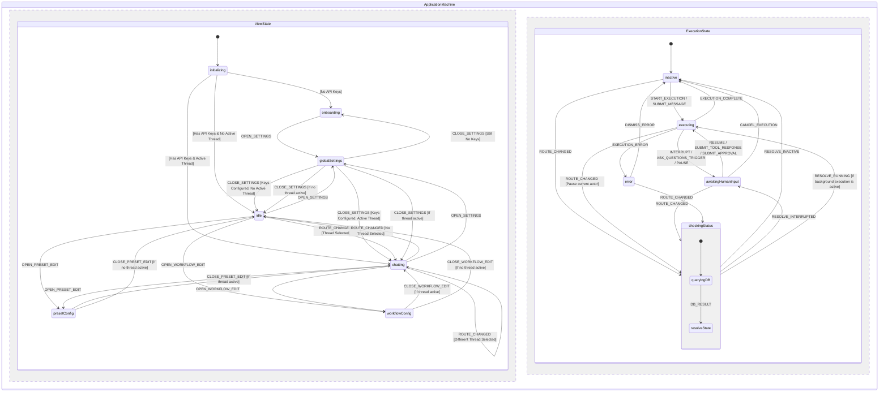

# Scratchpad

This a scratchpad for writing down vague ideas for building this LLM chat app for personal use. The goal is to provide a clear specification so that the coding agent can later build the app with minimal human intervention while still aligning with the user's vision.

This file will be collaboratively updated by the human user and the coding agent, by default the coding agent should ask open questions before editing this scratchpad as per the [Open questions](#open-questions) section, don't jump into editing the other parts of this scratchpad directly.

## Tech stack

- Deployed to GitHub Pages as static client side-only application. Build pipeline may use Node scripts/dependencies.
- LangGraph.js `@langchain/langgraph/web` for LLM agent orchestraion in-browser.
- React frontend.
- XState and `@xstate/react`, all the application and UI states should be fully driven by state machine(s).
- Carbon Design System `@carbon/react` as is without custom design/styling overrides (no custom glassmorphism, HSL custom palettes, or custom animations). Support switching between dark and light mode, defaulting to the same as system settings. Auto-detect and sync with system color scheme by default. Provide a selector in the header/settings to manually override it to "Light" (Carbon `g10` / `white`) or "Dark" (Carbon `g100` / `g90`), saving this preference as a global setting in IndexedDB.
- TypeScript: Install package `@typescript/native-preview` instead of package `typescript`.
- Lint: `oxlint-tsgolint@latest` instead of ESLint.
  - Turn on type-aware linting and react/vitest plugins inside `.oxlintrc.json`.
  - The `package.json` scripts should simply call `oxlint` and `oxlint --fix` without command-line parameter overrides.
- Formatting: `oxfmt` instead of Prettier.
- Zod v4 for parsing/validating data.
- Vite for bundling.
- Vitest for tests. "Write tests. Not too many. Mostly integration."
- No E2E test.
- Persistance with IndexedDB via `idb` (and `fake-indexeddb` in test) instead of localStorage/sessionStorage. This is to ensure the storage has higher quota.
- Markdown & Math Rendering: `react-markdown`, `rehype-katex`, `remark-gfm`, and `remark-math` for rendering markdown messages and LaTeX equations.
- Support using OpenRouter and Gemini API as LLM API provider, and potentially switching to another provider in the future.
  - Prefer using the official `@openrouter/sdk` and `@google/genai` client libraries within custom LangGraph nodes to execute direct browser API calls rather than a custom fetch wrapper, while retaining full control over streaming and reasoning configurations.
  - API keys are stored in IndexedDB in plain text.
  - Direct API calls are made from the browser. CORS is handled by OpenRouter and Gemini API.
- `AGENTS.md` should be kept up-to-date to run the tool chains e.g. formatting, typecheck, lint with autofix, test, build.

Fill in anything missing.

## Features and use cases to support

"Be yet another poweruser LLM chat app" so the LLM chat UI basics and some features need to be there, plus:

- The user is always chatting with a workflow (an orchestration graph with 0-many LLM agents) directly instead of a single agent.
  - The normal chat feature for chatting to one single LLM agent like in an average LLM chat app still works, just that behind the scene it should go through the same code path as if chatting with an orchestration with many LLM agents.
  - The default selected workflow when creating a new chat is still the good old workflow where there's only 1 human user and 1 agent with a system prompt like "you are an helpful assistant".
  - The UI should also support running orchestration workflow without an user input (but still requires the user to manuall approve to start such a workflow).
- Workflow management CRUD:
  - Workflow = agent orchestration graph like for LangGraph
    - Built-in workflow can be anything LangGraph supported.
    - User-defined workflow needs to be able to be serialised to/deserialised from persistance.
    - The editing interface for custom workflows is a text-based JSON editor (no graphical/visual editor required). See the [Workflow Management CRUD View](#3-workflow-management-crud-view) section in the UI Specification for details.
    - Here is where the user can define which are the agents involved in an orchestration and their system prompts.
  - Node execution sequence and underlying LLM threads should be visible in the chat feed, rendered as flatly as possible so they look like working within one single thread, including reasoning tokens.
  - To begin with, there should be a built-in debate workflow, where the user should be able to seed the debate with a topic, then let 2 agents debate infinitely in a loop until they come to consensus, the agents come to consensus by making tool call to suggest leaving the debate loop, then finally another agent summarise the debate for the user to review.
- LLM provider preset management CRUD:
  - Preset = combination of LLM API provider, API key, LLM model, and configs like reasoning/thinking level, API retry policy, budget policy (e.g. force asking for human approval after X steps in the workflow without human user sending an message).
  - When opening a new chat thread, the thread selects the default preset as the initial preset. The selected preset ID is saved per thread in the database.
  - When switching back to an old thread: if the saved preset is still available, it is used; otherwise, it falls back to the default preset.
  - Onboarding and First-Time User Experience: Guides users on first load if no presets or API keys exist. See the [Global Settings View](#5-global-settings-view) in the UI Specification for warning banner details.
- Thread management CRUD
  - Current thread ID is sync with URL so refreshing should lead to the same thread
- System message management CRUD for automatically inserting system message to agents upon API request, but these automatically inserted messages shouldn't be persisted in the chat history.
  - Should support insertion depth (similar to SillyTavern, should be able to specify to attach system message at the Nth message from the beginning/end of the chat messages thread).
  - Configured via a global settings list. See the [Global Settings View](#5-global-settings-view) in the UI Specification for details.
- Render agent and user messages with rich markdown formatting, GitHub Flavored Markdown, and LaTeX math support using the specified rendering packages.
- Render reasoning tokens (collapsed by default).
- Render tool call message and tool result message (collapsed by default).
  - There should be a built-in "ask_questions" tool which LLM can invoke to render a specific form directly in the chat feed to let users answer questions with check-boxes and comments.
  - There should be built-in tools for creating/updating custom workflows interactively via LLM chat. Any database-modifying tools (like custom workflow creation) require explicit user confirmation via an inline approval card.
- Manual history edit and branching: Allow editing/deleting any message in history, inserting new messages with selectable roles (prefill), and branching threads.
- API Payload Preview: Allow inspecting the exact payload sent to the LLM API (including injected system messages).
- _Note_: See the [Main Chat Interface](#2-main-chat-interface) section in the UI Specification for the exact layout and component details for all the above elements.

## Technical Architecture Proposals

### 1. Database Schema (IndexedDB)

We propose using the following stores in the `in-browser-llm-chat-db` database:

- **`settings`**: For global configs (API keys stored in plain text, active theme, default presets).
  - Key: `key` (string, e.g., `"api_keys"`, `"ui_config"`)
  - Value: `{ value: any }`
- **`presets`**: LLM configurations.
  - Key: `id` (UUID)
  - Fields: `name`, `provider` (`"openrouter" | "gemini"`), `model` (string), `apiKey` (if not global), `temperature`, `maxTokens`, `reasoningLevel`, `budgetPolicy` (`{ maxStepsWithoutUser: number }`)
- **`workflows`**: Serialized LangGraph definitions.
  - Key: `id` (string/UUID)
  - Fields: `name`, `description`, `isBuiltIn` (boolean), `nodes` (Array of node definitions), `edges` (Array of transition definitions)
- **`threads`**: Chat sessions.
  - Key: `id` (UUID)
  - Fields: `title`, `workflowId`, `activePresetId`, `createdAt`, `updatedAt`, `parentThreadId` (null or parent UUID for branched threads)
- **`messages`**: Individual messages in threads.
  - Key: `id` (UUID)
  - Fields: `threadId`, `role` (`"system" | "user" | "assistant" | "tool"`), `content`, `type` (`"text" | "reasoning" | "tool_call" | "tool_result"`), `toolCallId` (optional), `name` (agent/tool name), `createdAt`, `metadata` (reasoning tokens, raw response, etc.)
- **`checkpoints`**: LangGraph checkpointer state to enable resuming active graph execution across page reloads.
  - Key: `threadId` (UUID)
  - Fields: LangGraph checkpoint state objects (checkpoints, metadata, writes).

### 2. Custom Workflow JSON Serialization

To allow serializing graphs in IndexedDB, we define a declarative schema that is compiled into a LangGraph graph at runtime. There is no limit to the topology size or complexity, allowing users to define any custom workflow just as if they were hand-coding it:

```typescript
interface WorkflowNode {
  id: string; // unique within graph
  type: "agent" | "input" | "tool" | "consensus_check" | "summary";
  name: string;
  systemPrompt?: string;
  presetId?: string; // inherits default if empty
  tools?: string[]; // e.g. ["ask_questions"]
}

interface WorkflowEdge {
  from: string;
  to: string; // The destination node
  condition?: "on_tool_call" | "on_tool_result" | "on_consensus" | "on_no_consensus";
}
```

During runtime, a factory function converts this JSON schema into a compiled `@langchain/langgraph` `StateGraph`. The factory maps each `WorkflowNode` type to its concrete execution behavior:

- **`agent`**: Invokes the LLM specified by `presetId` (or the default preset) using the `systemPrompt`, passing the thread's message history. It binds the tools specified in the `tools` array.
- **`input`**: Execution is interrupted/paused, waiting for a user message (uses a LangGraph interrupt).
- **`tool`**: Executes tool calls returned by agent nodes (e.g. `ask_questions`, `declare_consensus`, or other custom database tools) and generates the corresponding `tool` messages.
- **`consensus_check`**: Runs an LLM node or rule-based evaluator to analyze the message history and determine if consensus is reached, routing the graph outcome to the next state based on the consensus evaluation.
- **`summary`**: Runs a specialized LLM node to summarize the chat history up to the current point.

### 3. XState Application States

A single high-level state machine will coordinate the application:

- `idle`: Ready for user actions (switching thread, editing preset, starting chat).
- `configuringPreset`: Editing LLM presets.
- `configuringWorkflow`: Customizing or creating workflows.
- `chatting`: Active thread view, waiting for user input.
- `graphExecuting`: Running LangGraph steps in-browser.
- `awaitingHumanInput`: Graph execution paused (either via manual approval requirement or `ask_questions` tool popup).
- `error`: Failed API requests or execution exceptions.

### 4. `ask_questions` Tool Schema & Flow

The `ask_questions` tool is defined as:

- **Input Parameters (Zod)**:
  ```typescript
  const AskQuestionsSchema = z.object({
    questions: z.array(
      z.object({
        id: z.string(),
        text: z.string(),
        options: z.array(z.string()), // suggested multi-select options
        allowFreetext: z.boolean().default(true),
      }),
    ),
  });
  ```
- **Flow**:
  1. The LLM agent invokes `ask_questions` with specific questions.
  2. The LangGraph runner intercepts the tool call and pauses execution (using LangGraph interrupts).
  3. The UI detects the pending interrupt and renders a premium inline card form directly in the chat feed with checkboxes, freetext comment fields, and a "Refuse to answer" button with optional reasoning. Multiple tool calls per agent turn can be rendered as multiple inline cards. Once answered/refused, form inputs become disabled/read-only to preserve the history.
  4. Once submitted, the user's answers are formatted as a `tool` role message and execution resumes.

### 5. Debate Workflow Execution Details

- **Nodes**:
  - `Initiator`: Sets the debate topic and seeds the conversation.
  - `Debater_A` & `Debater_B`: Two agent nodes with conflicting stances or system messages (e.g., Pro vs. Con).
  - `Consensus_Evaluator`: Checks if consensus is reached or if maximum loops are exceeded. If yes, routes to `Summarizer`; if no, loops back to the next debater.
- **Safety / Cost Control & Loop Controls**:
  - Max loop limit (default: 5 rounds of debate / 10 turns) to prevent infinite loops and runaway API costs.
  - The debaters themselves must call a `declare_consensus` tool when they agree, which terminates the loop.
  - The workflow configuration must support forcing a minimum of X rounds of loop before the `declare_consensus` tool is given to the debaters (X can be set to 0 to disable this forced loop).
  - General Loop Control Panel: Any workflow with loops (including the debate workflow) should render a control card in the UI showing the current round, number of turns, and estimated cost, with buttons to Pause, Resume, or Force Consensus / Summarize early. On mobile viewports, the panel collapses into a compact, sticky bottom bar (or overlay) showing the round count and estimated cost, where a single tap opens a full-screen control overlay detailing all stats and controls.
  - Cost and Token Tracking Details: Each LLM request response stores usage statistics (e.g., `prompt_tokens`, `completion_tokens`) inside the message's `metadata` field under `metadata.usage`. The LangGraph runner updates the `loopControl.estimatedCost` context property in real-time by summing up the usage statistics from new messages generated during the current execution run.

### 6. System Message Injection Details

- System messages to automatically inject are configured per workflow or globally.
- **Insertion Depth**:
  - Depth `0`: Prepend to the very beginning of the messages list.
  - Depth `N` (positive): Insert after the N-th message.
  - Depth `-N` (negative): Insert N messages from the end of the history.
  - _Note_: If the active message history length is less than the calculated injection index, the insertion index is clamped to the range of valid indices: `Math.max(0, Math.min(messages.length, targetIndex))`.
- When sending context to the LLM API, these messages are inserted on-the-fly but are **never** persisted to the IndexedDB `messages` store for that thread. They are invisible in the main chat feed, and can only be viewed/previewed within a "Preview API Payload" overlay or in the workflow settings panel.

## User Interface (UI) Specification

The application layout is built using the Carbon Design System (`@carbon/react`) out-of-the-box. There are no custom styling overrides (no custom glassmorphism, HSL custom palettes, or custom animations). The UI is structured into a persistent navigation layout with a primary content area that switches depending on the active view.

### 1. Global Navigation and Layout

- **Left Sidebar Navigation (Carbon `SideNav`)**:
  - **Header Area**: App branding, manual theme toggle selector (Light / Dark / Auto-sync with System), and a hamburger menu button.
  - **Thread List**: A scrollable list of chat threads, showing thread titles, active workflow/preset indicators, and a branch indicator if a thread was cloned.
  - **Quick Links / Accordion**: Dedicated tabs or accordion navigation options to switch the main content area between:
    - **Chat Interface** (Active Thread)
    - **Workflow Management**
    - **LLM Preset Settings**
    - **Global Settings**
  - **Mobile Adaptation**: On viewports `< 672px`, the sidebar collapses completely. Tapping the header's hamburger icon slides the sidebar in from the left as an overlay (max-width `280px` to leave a tap-to-close backdrop area). Tapping any menu item or the backdrop backdrop auto-collapses it.

### 2. Main Chat Interface

- **Chat Header**:
  - Displays the active thread's title.
  - Displays the active preset and active workflow.
  - **Preview API Payload Button**: Clicking it opens a Modal showing the exact JSON structure of messages (including injected system messages) that would be sent to the LLM API next. Injected messages are highlighted with a distinct background/border and marked with an `[INJECTED]` badge to assist debugging. Since a workflow may contain multiple agents, the modal includes a dropdown selector showing all agents in the current workflow (defaulting to the next scheduled agent based on the graph's execution checkpoint) so the user can inspect the preview payload for any specific agent.
- **Loop Control Panel (Sticky)**:
  - **Desktop**: Rendered as a sticky control bar at the top of the chat area.
  - **Mobile**: Collapses into a compact floating action button (FAB) or thin top status bar to save vertical space; tapping it opens a modal overlay with the detailed turn counters and control actions.
  - **Controls**: Displays the current loop round, turn count, and estimated cost. The estimated cost is calculated as a simple counter of steps/turns and a running count of estimated input/output tokens (without currency calculation). Contains buttons to Pause, Resume, or Force Consensus / Summarize early.
- **Chat Feed**:
  - **Message Bubbles**: Render user and assistant/agent messages with rich markdown formatting, GitHub Flavored Markdown (e.g. tables, checkboxes), and LaTeX math support (both inline and block equations).
  - **Message Options Menu**: Each message bubble includes a small, low-profile overflow button (three-dots icon) with a minimum `44x44px` target. This button is permanently visible (with a light opacity like `0.6`) on both desktop and mobile viewports (no hover-only requirements; this no-hover, permanently visible approach is globally applied for all UI elements). Clicking/tapping it opens a menu (or slide-up bottom sheet on mobile) containing "Edit", "Delete", and "Branch Thread" options.
  - **Inline Message Editing**: Clicking "Edit" transforms the message bubble inline into a text area to save changes.
  - **Reasoning Process Accordion**: Collapsed by default under a "Reasoning Process" header inside the assistant's message. Capped at `max-height: 250px` with vertical scrollbars. Both reasoning tokens and text content are streamed in real-time. The accordion must remain collapsed by default during streaming and after response completion. Use a fallback renderer or debounced updates to handle malformed partial markdown or math blocks.
  - **Tool Call / Result Accordion**: Collapsed by default under a "Tool: [Name]" header. Expanding reveals a formatted JSON block of arguments or return outputs. Note: the `ask_questions` tool card form is rendered inline directly in the chat feed and must render/remain visible even when the tool call message itself is collapsed.
  - **Scroll Anchoring**: Expanding accordions preserves chat scroll anchoring so the user does not lose their viewing position.
  - **`ask_questions` Tool Card Form**: Rendered inline directly in the chat feed when execution is interrupted. Sized with a minimum of `44x44px` touch targets. Includes checkboxes for multi-select, freetext comment fields, and a "Refuse to Answer" button. The user must either answer all questions in the card or explicitly click "Refuse to Answer" to submit the form. The form controls become read-only once submitted.
  - **Proposed Action Card**: Rendered inline for database-modifying tools (e.g., creating/updating a workflow). Shows a diff or description of the changes, with "Approve" or "Deny" buttons.
- **Chat Input Area**:
  - A main auto-resizing text input area.
  - **Role Selector Dropdown**: Next to the text input (defaulting to "User"), allowing the user to select "Assistant" or "System" to manually insert/prefill messages at the end of the history.
  - Send button.
  - **Input Blocking**: The main chat input field is blocked/disabled while the workflow is waiting for tool answers (e.g. from `ask_questions` interrupts) or manual approval, since typing a normal chat message would violate the graph execution state. All form controls are sized with a minimum of 44x44px touch targets.

### 3. Workflow Management CRUD View

- **Workflow List**: Scrollable list of built-in and user-defined workflows, each with active edit/delete buttons.
- **Workflow JSON Editor Pane**:
  - Text-based JSON editor containing a `TextArea` displaying the JSON content.
  - **Mobile**: Rendered as a simple `TextArea` with word-wrap and scrolling, relying on the native mobile keyboard (no helper keyboard bar or custom virtual buttons).
  - Validation: Performed when the user clicks "Save" (or dynamically as they type, debounced). If invalid, helper text describing the schema validation errors is displayed directly under the `TextArea`, and the "Save" button is disabled. No modal dialog validation interrupts should be used.

### 4. LLM Preset CRUD View

- **Preset List**: List of configured LLM presets with options to edit or delete.
- **Preset Configuration Panel**:
  - Fields for configuring Name, Provider (`"openrouter" | "gemini"`), Model ID (string), API Key (optional override), Temperature, Max Tokens, Reasoning/Thinking Level, and Budget Policy (e.g. max steps without user message).

### 5. Global Settings View

- **Global Config Form**:
  - **API Keys Section**: Password-masked input fields (masked by default with a show/hide toggle button) for OpenRouter and Gemini API keys (stored in IndexedDB).
  - **Theme Override Selector**: Selector for manually forcing Light/Dark mode.
  - **Injected System Messages Section**: Global UI list configuration for system messages that apply to all workflows.
- **Onboarding / Warning Banner**:
  - Displays a persistent, clickable warning banner at the very top of the workspace: `"No API keys configured. Click here to configure settings."`.
  - Disables the main chat input field until a preset/API key is successfully configured in Settings.

## State Machine Specification

The application state is managed by a central XState machine configured with parallel state regions. This design decouples UI view navigation from LangGraph background execution, allowing background workflows to run concurrently while the user navigates settings or configurations.

### State Transition Graph



### 1. Machine Context (State Schema)

The state machine context maintains the following variables:

- `currentThreadId`: `string | null` - The ID of the currently selected chat thread (synced with the URL path).
- `activeWorkflowId`: `string | null` - The ID of the workflow loaded for the active thread.
- `activePresetId`: `string | null` - The ID of the LLM configuration preset selected for the active thread.
- `editingPresetId`: `string | null` - The ID of the preset currently being modified.
- `editingWorkflowId`: `string | null` - The ID of the custom workflow configuration currently being modified.
- `loopControl`:
  - `currentRound`: `number` - Current iteration count of the executing graph.
  - `turnCount`: `number` - Total messages or turns exchanged in the current run.
  - `estimatedCost`: `number` - Cumulative steps/tokens count.
- `errorMessage`: `string | null` - Details of the most recent execution or validation error.
- `apiKeysConfigured`: `boolean` - Indicates whether required API keys are available in IndexedDB.
- `graphRunnerActor`: `any` - A reference to the active spawned child actor managing LangGraph execution.

### 2. State Descriptions

#### ViewState (Navigation Region)

- **`initializing`**: Reads the configuration settings, API keys, presets, custom workflows, and active thread ID from the database.
- **`onboarding`**: A blocker state when API keys are not yet configured. The main chat input is disabled, prompting the user to click the warning banner to add API keys.
- **`idle`**: Ready for user interactions, with no thread loaded.
- **`chatting`**: Viewing an active thread. The main input is enabled and ready to accept user messages.
- **`presetConfig`**: Modifying or creating an LLM preset.
- **`workflowConfig`**: Modifying or creating custom workflows in the JSON `TextArea` editor.
- **`globalSettings`**: Modifying API keys, manual theme override, and injected system messages.

#### ExecutionState (Execution Region)

- **`inactive`**: No background workflow execution is running for the active thread.
- **`executing`**: Running `@langchain/langgraph/web` steps in the browser (input disabled).
- **`awaitingHumanInput`**: Graph execution is suspended (either due to a manual approval card or an `ask_questions` tool interrupt).
- **`error`**: Displays error information if an API request or state transition fails.

_Transition on Route Changes_:
When a `ROUTE_CHANGED` event is received in the parallel regions, the `ExecutionState` first transitions to a transient `checkingStatus` state. This state queries IndexedDB asynchronously to load the new thread's execution checkpoint and active background state:

- If the database indicates the new thread has a pending interrupt or approval, the machine transitions to `awaitingHumanInput`.
- If background execution is supported and the thread has an active background execution running, it transitions to `executing` and resumes/spawns the runner actor.
- Otherwise, it transitions to `inactive`.
- Any active runner actor executing for the previous thread is paused/suspended as an exit action of the previous state or entry action of `checkingStatus`.

### 3. Resolved State Machine Design Decisions

- **Navigation during active graph execution**: Resolved using XState **parallel states** (separate `ViewState` and `ExecutionState` regions). Users can navigate away to edit presets, customize workflows, or adjust global settings while a LangGraph run continues executing in the background. If the user switches the active thread (via a route change), the state machine executes an action to pause/suspend the child actor running for the previous thread, preventing resource and API cost runaway.
- **React Router integration**: Resolved by making **React Router the single source of truth** for thread navigation. URL route changes emit a `ROUTE_CHANGED` event containing the route details (e.g. `threadId`), triggering the corresponding state machine transitions (e.g., loading the selected thread). Non-route navigation (such as opening settings modals or CRUD sub-views) is driven directly by XState events. Direct redirects initiated by XState (e.g., redirecting to settings on first-load key checking) are executed as side effects that call React Router's `navigate` function.
- **LangGraph execution state storage**: Resolved by using the **XState Actor Model**. The state machine invokes or spawns a child actor (`graphRunnerActor`) whenever entering the `executing` state. This actor encapsulates the non-serializable LangGraph `CompiledStateGraph` instance and manages execution handles, streaming promises, and DB connections. The parent machine context only stores serializable metadata and handles state transitions by receiving events (`STEP`, `INTERRUPT`, `COMPLETE`, `ERROR`) from the child actor.

## Open questions

### Process of handling open questions

When updating this file with open questions, please only add to the current open questions list below.

Each distinct decision or sub-question must be structured as its own separate `#### Question: <title>` section with its own suggested options and response placeholder. Do not group multiple distinct questions or decisions under a single question header, as this makes it difficult to respond to them one by one.

Always use the following format:

```md
#### Question: <short title of question here>

<Description of the question and the suggested options>

##### Response

[UNRESOLVED]
```

The human user will replace the `[UNRESOLVED]` tag with their response. The human user will then prompt the coding agent to incorporate the responses into this scratchpad file, and remove those already incorporated open questions, along with any questions that are no longer relevant.

### Current open questions:

#### Question: Background Multi-Thread Execution vs. Active-Only Execution

Should the application support executing multiple LangGraph workflows in the background simultaneously (e.g. running a debate in Thread A while chatting with another agent in Thread B), or should it only support execution on the active thread (pausing/suspending background runs when switching threads)?

##### Response

[UNRESOLVED]

#### Question: Token Usage and Cost Tracking Persistence

The Loop Control Panel tracks estimated token usage and turn counts during workflow runs. Where should these stats be persisted? We propose adding a `stats` field (e.g. `{ totalTokens: number, totalTurns: number }`) to the `threads` database store so the historical usage remains visible on thread reload. Alternatively, these stats could be transient and only computed/displayed for the active run.

##### Response

[UNRESOLVED]

#### Question: Default Presets Seeding for First-Time Users

When a new user loads the application for the first time, they will not have any presets or API keys in the database. When they configure their first API key(s) in Global Settings, should the application automatically seed a set of default presets (e.g., "Default Gemini" using `gemini-2.5-flash`, "Default OpenRouter" using `google/gemini-2.5-flash` or similar) so they can start chatting immediately?

##### Response

[UNRESOLVED]

#### Question: LangGraph Checkpoint Cleanup and Size Management

As users run various agents and workflows, LangGraph creates checkpoints for each state step and persists them in IndexedDB. Over time, these checkpoints can grow significantly in size. Should we implement an automatic cleanup policy (e.g., keeping only the last X checkpoints or cleaning up checkpoints when a thread is deleted/completed), or should we keep all checkpoints indefinitely to allow full historical navigation?

##### Response

[UNRESOLVED]

#### Question: Custom User-Defined JavaScript Tools

Database-modifying actions trigger inline approval cards. However, how should we handle tool execution customizability? Can users define custom JavaScript tools directly in their custom workflow JSON schemas, or are they limited to the built-in system tools (such as `ask_questions` and preset database updates)? If custom tools are permitted, should they run inside a sandboxed environment to prevent security/malicious code risks?

##### Response

[UNRESOLVED]

#### Question: Debating Agent Context Window and Memory Management

In a debate workflow loop, two agents debate potentially infinitely. As the conversation progresses, the message history grows and may exceed the model's token limits or increase API call costs. Should the orchestration graph support a memory-pruning or summary-sliding-window mechanism for agent nodes, or should they always receive the full history?

##### Response

[UNRESOLVED]
