# Scratchpad

This is a scratchpad for writing down vague ideas for building this LLM chat app for personal use. The goal is to provide a clear specification so that the coding agent can later build the app with minimal human intervention while still aligning with the user's vision.

This file will be collaboratively updated by the human user and the coding agent, by default the coding agent should ask open questions before editing this scratchpad as per the [Open questions](#open-questions) section, don't jump into editing the other parts of this scratchpad directly.

## Tech stack

- Deployed to GitHub Pages as static client side-only application. Build pipeline may use Node scripts/dependencies. Offline support / PWA is out of scope; standard browser caching is sufficient for asset loading, as core LLM integration requires active internet connectivity anyway.
- LangGraph.js `@langchain/langgraph/web` for LLM agent orchestraion in-browser.
- React frontend.
- XState and `@xstate/react`, all the application and UI states should be fully driven by state machine(s).
- Carbon Design System `@carbon/react` as is without custom design/styling overrides (no custom glassmorphism, HSL custom palettes, or custom animations). Support switching between dark and light mode, defaulting to the same as system settings. Auto-detect and sync with system color scheme by default. Provide a selector in the header/settings to manually override it to "Light" (Carbon `g10` / `white`) or "Dark" (Carbon `g100` / `g90`), saving this preference as a global setting in IndexedDB.
- TypeScript: Install package `@typescript/native-preview` instead of package `typescript`.
- Lint: `oxlint-tsgolint@latest` instead of ESLint.
  - Turn on type-aware linting and react/vitest plugins inside `.oxlintrc.json`.
  - The `package.json` scripts should simply call `oxlint` and `oxlint --fix` without command-line parameter overrides.
- Formatting: `oxfmt` instead of Prettier.
- Zod v4 for parsing/validating data.
- Vite for bundling.
- Vitest for tests. "Write tests. Not too many. Mostly integration."
- No E2E test.
- Persistence with IndexedDB via `idb` (and `fake-indexeddb` in test) instead of localStorage/sessionStorage. This is to ensure the storage has higher quota.
- Markdown & Math Rendering: `react-markdown`, `rehype-katex`, `remark-gfm`, and `remark-math` for rendering markdown messages and LaTeX equations.
- Support using OpenRouter and Gemini API as LLM API provider, and potentially switching to another provider in the future.
  - Prefer using the official `@openrouter/sdk` and `@google/genai` client libraries within custom LangGraph nodes to execute direct browser API calls rather than a custom fetch wrapper, while retaining full control over streaming and reasoning configurations.
  - API keys are stored in IndexedDB in plain text by default, with an option to encrypt them using a master password (utilizing the Web Crypto API, deriving an AES-GCM key from the master password via PBKDF2 with a random salt stored in settings). To verify the master password on input, the app encrypts a static verification constant (e.g., `"verification_token"`) using the derived key and stores it in settings under `"encryption_settings"`. When the user enters a password, the app derives the key, attempts to decrypt this constant, and if it succeeds, the password is confirmed correct. Since threads, messages, and custom workflows are not encrypted in the database, the master password only protects the API keys. The derived encryption key is stored in-memory as a non-serializable variable in a secure singleton service (e.g., a KeyStore or EncryptionService) and is never written to IndexedDB, localStorage, or XState context. Reloading the page clears the in-memory key, requiring the user to re-enter the master password upon the next execution attempt or settings access. The user can view settings and read/navigate chat histories while the keys are locked. The UI displays an unlock modal prompting for the master password only when the user attempts to run a workflow (e.g., sending a message or resuming execution) or view/edit the locked API keys. If the user enters an incorrect master password in the unlock modal, the decryption check fails. The UI displays an error message inline within the modal, keeping the state machine in the `awaitingUnlock` state so the user can retry. The state machine only transitions when `UNLOCK_SUCCESS` or `CANCEL_UNLOCK` is dispatched. If a CORS proxy is configured, the runner overrides the base URL of the client library (e.g. passing `baseUrl` to OpenRouter or `@google/genai` clients) to route requests through the proxy.
  - Direct API calls are made from the browser. CORS is handled by OpenRouter and Gemini API.
- `AGENTS.md` should be kept up-to-date to run the tool chains e.g. formatting, typecheck, lint with autofix, test, build.

Fill in anything missing.

## Features and use cases to support

"Be yet another poweruser LLM chat app" so the LLM chat UI basics and some features need to be there, plus:

- The user is always chatting with a workflow (an orchestration graph with 0-many LLM agents) directly instead of a single agent.
  - The normal chat feature for chatting to one single LLM agent like in an average LLM chat app still works, just that behind the scene it should go through the same code path as if chatting with an orchestration with many LLM agents.
  - The default selected workflow when creating a new chat is still the good old workflow where there is only 1 human user and 1 agent with a system prompt like "you are a helpful assistant".
  - The UI should also support running orchestration workflow without user input (but still requires the user to manually approve to start such a workflow).
- Workflow management CRUD:
  - Workflow = agent orchestration graph like for LangGraph
    - Built-in workflow can be anything LangGraph supported.
    - User-defined workflow needs to be able to be serialized to/deserialized from persistence.
    - The editing interface for custom workflows is a text-based JSON editor (no graphical/visual editor required). See the [Workflow Management CRUD View](#3-workflow-management-crud-view) section in the UI Specification for details.
    - Here is where the user can define which are the agents involved in an orchestration and their system prompts.
    - _Safety Rules_: The user cannot delete built-in workflows. Deleting a custom workflow that is currently in use by any threads is blocked, and an inline notification is displayed showing the active threads referencing it.
  - Node execution sequence and underlying LLM threads should be visible in the chat feed, rendered as flatly as possible so they look like working within one single thread, including reasoning tokens.
  - To begin with, there should be a built-in debate workflow, where the user should be able to seed the debate with a topic, then let 2 agents debate infinitely in a loop until they come to consensus, the agents come to consensus by making tool call to suggest leaving the debate loop, then finally another agent summarize the debate for the user to review.
- LLM provider preset management CRUD:
  - Preset = combination of LLM API provider, API key, LLM model, and configs like reasoning/thinking level, API retry policy, budget policy (e.g. force asking for human approval after X steps or Y tokens in the workflow execution cycle without human user sending a message).
  - When opening a new chat thread, the thread selects the default preset as the initial preset. The selected preset ID is saved per thread in the database.
  - When switching back to an old thread: if the saved preset is still available, it is used; otherwise, it falls back to the default preset.
  - Onboarding and First-Time User Experience: Guides users on first load if no presets or API keys exist. See the [Global Settings View](#5-global-settings-view) in the UI Specification for warning banner details. When the user configures and saves their API keys for the first time, the application automatically seeds a set of default presets ("Default Gemini Flash" using `gemini-2.5-flash` and "Default OpenRouter Flash" using `google/gemini-2.5-flash`) into the database.
  - _Safety Rules_: The user cannot delete the designated global default preset (the preset whose ID matches `default_preset_id` in global settings). Deleting a custom preset that is currently set as the active preset for any threads or referenced in any workflow node definitions is blocked, and the UI displays an inline notification listing the referencing threads or workflows.
- Thread management CRUD
  - Current thread ID is synced with the URL so refreshing leads to the same thread.
  - Thread-level presets are strictly inherited from the selected preset. The active preset is displayed as a dropdown trigger in the Chat Header, allowing quick switching. A configure icon next to it allows editing the preset in a modal panel. If a built-in preset is edited, the UI prompts the user to "Clone and Customize" to create a new custom preset copy.
  - Cascading deletes for thread checkpoints and messages are performed in batched transactions (deleting up to 500 records per chunk) scheduled asynchronously via microtasks or `requestIdleCallback` to keep the UI responsive.
  - Active thread workflows use a snapshot (`workflowSnapshot`) stored in the thread record. If the custom workflow definition is modified in the Workflow Manager, it does not affect already active/paused threads. Users can manually sync the thread to the latest workflow definition via a "Sync to Latest Workflow" button in the thread settings. The sync feature automatically detects if the update is a simple update to system prompts or presets (i.e. identical node IDs and edges). If so, it performs a "Soft Sync" that updates the `workflowSnapshot` inline without clearing the message history or checkpoints, allowing execution to resume with the new prompts/presets. If the graph topology has changed (nodes or edges added, removed, or renamed), it performs a "Hard Sync" (destructive) which prompts the user for confirmation, updates the snapshot, and purges all checkpoints/messages for the thread. A Hard Sync purges all checkpoints and message history, resetting the thread's chat feed to an empty state, while preserving the thread's metadata (such as its title, creation date, and selected preset ID).
- System message management CRUD for automatically inserting system message to agents upon API request, but these automatically inserted messages shouldn't be persisted in the chat history.
  - Should support insertion depth (similar to SillyTavern, should be able to specify to attach system message at the Nth message from the beginning/end of the chat messages thread).
  - Configured via a global settings list. See the [Global Settings View](#5-global-settings-view) in the UI Specification for details.
- Render agent and user messages with rich markdown formatting, GitHub Flavored Markdown, and LaTeX math support using the specified rendering packages.
- Render reasoning tokens (collapsed by default).
- Render tool call message and tool result message (collapsed by default).
  - Custom tools will remain strictly built-in for the initial release to keep execution simple, secure, and performant. Users can configure custom workflows by composing existing built-in tools within their graph definitions.
  - There should be a built-in "ask_questions" tool which LLM can invoke to render a specific form directly in the chat feed to let users answer questions with check-boxes and comments.
  - There should be built-in tools for creating/updating custom workflows interactively via LLM chat. Any database-modifying tools (like custom workflow creation) require explicit user confirmation via an inline approval card.
- Manual history edit and branching: Allow editing/deleting any message in history, inserting new messages with selectable roles (prefill), and branching threads. Editing or deleting a message (say, message M at sequence `idx`) in-place in a thread's history truncates the history and rolls back the LangGraph state using these steps:
  1. Identify the checkpoint associated with the message immediately preceding the edited/deleted message (i.e. message M-1's `checkpointId` and `checkpointNs`). If editing the first message, there is no preceding checkpoint, so the latest checkpoint is set to null.
  2. Set the thread's `latestCheckpointId` and `latestCheckpointNs` to those of the preceding checkpoint.
  3. Delete all checkpoints and checkpoint writes whose creation timestamp is greater than the preceding checkpoint's creation timestamp, or that descend from it in parent-child lineage traversal.
  4. Truncate the message history by deleting all messages in that thread where `sequence >= idx` (for deletion) or `sequence > idx` (for inline editing).
     Following any truncation, edit, or branching, the cumulative token statistics for the affected thread(s) are recalculated by summing the usage metadata of their remaining messages, and the thread record is updated in IndexedDB.
     _Note on Message Role Behaviors_: For inline editing of a user message, the message content is updated, and when the user clicks "Resubmit", execution is triggered from the preceding checkpoint with the updated user message. For inline editing of an assistant message, the message is updated in the database, but resuming execution directly would cause the agent to rerun and overwrite it; to avoid this, the user can insert a user message after the edited assistant message before resuming.
- API Payload Preview: Allow inspecting the exact payload sent to the LLM API (including injected system messages).
- _Note_: See the [Main Chat Interface](#2-main-chat-interface) section in the UI Specification for the exact layout and component details for all the above elements.

## Technical Architecture Proposals

### 1. Database Schema (IndexedDB)

We propose using the following stores in the `in-browser-llm-chat-db` database:

- **`settings`**: For global configs (API keys stored in plain text or optionally encrypted, active theme, default presets, global CORS proxy URL).
  - Key: `key` (string, e.g., `"api_keys"`, `"ui_config"`, `"encryption_settings"`, `"default_preset_id"`)
  - Value: `{ value: any }` or `{ encrypted: true, ciphertext: string, iv: string, salt: string }` when encryption is enabled (e.g. for `"api_keys"`).
- **`presets`**: LLM configurations.
  - Key: `id` (UUID)
  - Fields: `name`, `provider` (`"openrouter" | "gemini"`), `model` (string), `apiKey` (stored as a plain string, or if master-password encryption is enabled/unlocked, stored as an encrypted object `{ encrypted: true, ciphertext: string, iv: string, salt: string }`), `temperature`, `maxTokens`, `reasoningLevel`, `budgetPolicy` (`{ maxStepsWithoutUser: number, maxTokensPerRun: number | null }`), `corsProxy` (null or string)
- **`workflows`**: Serialized LangGraph definitions.
  - Key: `id` (string/UUID)
  - Fields: `name`, `description`, `isBuiltIn` (boolean), `nodes` (Array of node definitions), `edges` (Array of transition definitions), `injectedSystemMessages` (optional Array of `{ content: string, depth: number }`)
- **`threads`**: Chat sessions.
  - Key: `id` (UUID)
  - Fields: `title`, `workflowId`, `workflowSnapshot` (a copy of workflow configuration JSON, copied from the workflow definition upon thread creation for both built-in and custom workflows to ensure execution stability against schema modifications), `activePresetId`, `createdAt`, `updatedAt`, `parentThreadId` (null or parent UUID for branched threads), `parentMessageId` (null or parent message UUID at which branching occurred), `status` (`"inactive" | "executing" | "awaiting_input" | "error"`), `errorMessage` (null or string), `latestCheckpointId` (null or string), `latestCheckpointNs` (null or string), `tokenStats` (`{ promptTokens: number, completionTokens: number, totalTokens: number } | null`)
  - _Branching Behavior_: When branching a thread, the messages from the parent thread up to and including the `parentMessageId` are copied (cloned) to the new thread in the `messages` store under the new thread's ID (with their `sequence` order preserved). The `workflowSnapshot` is also copied from the parent thread to the new thread's record in the `threads` store to preserve execution consistency. To ensure that the branched thread's history can be edited or rewound later, ALL checkpoints and `checkpoint_writes` associated with the copied messages (i.e. all checkpoints in the parent thread's history up to and including the checkpoint associated with the `parentMessageId`) must be copied/cloned to the `checkpoints` and `checkpoint_writes` stores under the `newThreadId`. Subsequent checkpoints are not copied. Child threads remain fully functional even if their parent thread is later deleted (as they hold independent clones of historical messages and checkpoints); in such cases, their `parentThreadId` is retained for provenance but resolves to null/absent in reference checks.
- **`messages`**: Individual messages in threads.
  - Key: `id` (UUID)
  - Fields: `threadId` (indexed for query performance), `sequence` (integer index within thread for deterministic sorting and truncation), `role` (`"system" | "user" | "assistant" | "tool"`), `content`, `type` (`"text" | "reasoning" | "tool_call" | "tool_result"`), `toolCallId` (optional), `name` (agent/tool name), `createdAt`, `metadata` (reasoning tokens, raw response, etc.), `checkpointId` (null or string), `checkpointNs` (null or string)
  - _Message Compilation for LLM APIs_: To ensure compatibility with strict LLM API providers (like Gemini, Anthropic, or OpenRouter) that enforce strictly alternating user/assistant message roles and forbid consecutive messages of the same role, the compiler compiles the history for any given active agent node's LLM call using these rules:
    1. **Identify the Active Agent**: Identify the specific agent node making the LLM call.
    2. **Assign Roles**:
       - The active agent's own previous messages are kept as `assistant` role.
       - The active agent's own tool calls/results are kept in their native roles (`assistant` for tool calls, `tool` for results) and kept in sequence.
       - All other messages (actual user messages, other agents' messages, and other agents' tool calls/results) are mapped to the `user` role.
    3. **On-the-fly Context Pruning**: If the agent node specifies `maxHistoryMessages`, the compiler truncates the base history on-the-fly before preparing the API payload. It traverses the compiled messages backward from the latest message, keeping up to `maxHistoryMessages` messages.
    4. **Pruning Boundary Adjustment**: If the cutoff point falls within a tool call/response transaction (i.e., a tool result is kept but its preceding tool call is excluded, or vice versa), the compiler adjusts the cutoff boundary backward to include the complete tool transaction. The compiler must never split a tool call and its corresponding tool result. Let the resulting list of pruned messages be `H`.
    5. **Compile and Inject System Messages**:
       - Retrieve all active global system messages and workflow-specific system messages configured to be injected automatically.
       - For each system message, calculate its insertion index relative to `H`:
         - If depth `D` is positive or zero (`D >= 0`), `targetIndex = D`.
         - If depth `D` is negative (`D < 0`), `targetIndex = H.length + D` (e.g., depth `-1` means inserting at index `H.length - 1`, right before the last message).
         - Clamp the index: `targetIndex = Math.max(0, Math.min(H.length, targetIndex))`.
       - **Deduplication**: If any two system messages have the exact same `content`, keep only the one with the highest precedence (workflow-specific over global; and if same type, the one with the smaller depth / earlier index). Discard the other.
       - **Merging at Same Index**: If multiple distinct system messages resolve to the same `targetIndex`, merge their content using double newlines (`\n\n`), with workflow-specific content preceding global content, and other messages sorted by their configuration order.
       - **Insertion**: Insert the unique/merged system messages into `H` at their calculated indices.
    6. **Assign Prefix and Format for Strict APIs**:
       - For messages in `H` mapped to the `user` role that did not originate from the human user (such as other agents' messages or tool results), prefix the content with the sender's name/identifier (e.g., `[Agent Name]: ...` or `[Tool Name Result]: ...`).
       - For APIs that do not support arbitrary `system` role messages in the conversation contents (like Gemini):
         - If a system message is at index `0` (the very start), merge it into the main `systemInstruction` or `systemPrompt` parameter of the LLM call (concatenated with double newlines).
         - If a system message is at index `> 0`, convert its role to `user` and prefix its content with `[System Notification]: ...`.
    7. **Merge Consecutive Messages of the Same Role**:
       - Merge consecutive `user` messages (including actual user messages, mapped-to-user messages, and converted system messages) into a single logical `user` message, concatenating their content with double newlines.
       - Merge consecutive `assistant` messages from the active agent (e.g. separate reasoning, text, or tool_call entries) into a single logical `assistant` message, combining text/reasoning contents and populating the `tool_calls` array.
         This maintains strictly alternating user/assistant roles (or user/assistant/user/assistant) and ensures compatibility with strict API providers without losing the distinct identities of the debating agents.
- **`checkpoints`**: LangGraph checkpointer state to enable resuming active graph execution and supporting history rewinding/branching.
  - Key: `[threadId, checkpointNs, checkpointId]` (compound key)
  - Indices: `threadId` (indexed to support cascading cleanup on thread deletion)
  - Fields:
    - `threadId`: `string`
    - `checkpointNs`: `string`
    - `checkpointId`: `string`
    - `checkpoint`: `any` (the serialized LangGraph checkpoint state)
    - `metadata`: `any` (serialized LangGraph checkpoint metadata, e.g. timestamp, step, source)
    - `parentCheckpointId`: `string | null` (referenced parent checkpoint ID for lineage)
    - `createdAt`: `number` (timestamp for sorting and rollbacks)
- **`checkpoint_writes`**: Stores intermediate writes for LangGraph tasks.
  - Key: `[threadId, checkpointNs, checkpointId, taskId, idx]` (compound key)
  - Indices: `threadId` (indexed to support cascading cleanup on thread deletion)
  - Fields:
    - `threadId`: `string`
    - `checkpointNs`: `string`
    - `checkpointId`: `string`
    - `taskId`: `string`
    - `idx`: `number`
    - `channel`: `string`
    - `value`: `any`
    - `createdAt`: `number`

### 2. Custom Workflow JSON Serialization

To allow serializing graphs in IndexedDB, we define a declarative schema that is compiled into a LangGraph graph at runtime. There is no limit to the topology size or complexity, allowing users to define any custom workflow just as if they were hand-coding it:

```typescript
interface WorkflowNode {
  id: string; // unique within graph
  type: "agent" | "input" | "tool" | "consensus_check" | "summary";
  name: string;
  systemPrompt?: string;
  presetId?: string; // inherits default if empty
  tools?: string[]; // e.g. ["ask_questions"]
  loopHeader?: boolean; // designates a node where a new loop round starts
  maxHistoryMessages?: number; // optional message pruning/trimming threshold to control API cost
  excludeToolsBeforeRound?: { [toolName: string]: number }; // optional mapping of tool name to the 1-indexed loop round number before which the tool is excluded from LLM bindings (e.g. {"declare_consensus": 3} forces 2 rounds of loop before the tool becomes available in round 3)
}

interface WorkflowEdge {
  from: string;
  to: string; // The destination node
  condition?: "on_tool_call" | "on_tool_result" | "on_consensus" | "on_no_consensus";
}

interface GraphState {
  messages: any[]; // message history reducer to append/update messages
  lastAgentId: string | null; // records the ID of the agent node executed last (resolves routing back after tool runs)
  consensusReached: boolean; // boolean flag populated by consensus_check nodes for conditional routing
  turnCount: number; // tracks total steps/messages in execution
  currentRound: number; // tracks active loop iterations
}
```

During runtime, a factory function converts this JSON schema into a compiled `@langchain/langgraph` `StateGraph`. The factory maps each `WorkflowNode` type to its concrete execution behavior:

- **`agent`**: Invokes the LLM specified by `presetId` (or the default preset) using the `systemPrompt`, passing the thread's message history. It binds the tools specified in the `tools` array. During execution, the agent node also updates the `lastAgentId` state property in the `GraphState` to its own node ID, ensuring that subsequent tool nodes can route results back to it. If the `presetId` is missing or has been deleted from the database, compilation and execution will not fail; instead, the compiler automatically falls back to the thread's active preset, and if that is also invalid, it falls back to the global default preset, displaying a non-blocking warning notification in the execution control panel.
- **`input`**: Execution is interrupted/paused, waiting for a user message (uses a LangGraph interrupt).
- **`tool`**: Executes tool calls returned by agent nodes (e.g. `ask_questions`, `declare_consensus`, or other custom database tools) and generates the corresponding `tool` messages.
- **`consensus_check`**: Runs an LLM node or rule-based evaluator to analyze the message history and determine if consensus is reached, routing the graph outcome to the next state based on the consensus evaluation. If a `consensus_check` node has a configured `systemPrompt`, it runs as an LLM-based evaluator that analyzes the message history and updates the state's `consensusReached` flag. If `systemPrompt` is omitted or empty, the node operates as a pure rule-based evaluator that only checks if the `consensusReached` state flag has been set to `true` (e.g. by a previous tool call such as `declare_consensus`), bypassing any LLM API call to conserve tokens. The system prompt for LLM-based `consensus_check` nodes is defined in the workflow's node configuration (`systemPrompt` field) and uses standard evaluation guidelines, instructing the LLM to output a JSON structure containing `consensusReached` and `reasoning`.
- **`summary`**: Runs a specialized LLM node to summarize the chat history up to the current point.

#### Conditional Routing and Edge Compilation Rules

During graph compilation, the factory function maps conditional routes by creating custom router functions passed to `StateGraph.addConditionalEdges`:

- **Agent Routing**: If an `agent` node has tools, the graph needs to check if the agent produced a tool call. The compiled graph evaluates whether the state's last message is a tool call request. If yes, it routes along the edge with `condition: "on_tool_call"` (typically to a `tool` node). If no, it routes along the direct/unconditional edge (typically to a user input or another agent node).
- **Tool Node Routing**: A `tool` node routes back to the agent node that triggered the tool call. The routing logic inspects `lastAgentId` in the `GraphState` and routes along the outgoing edge whose destination (`to`) matches `lastAgentId` with `condition: "on_tool_result"`.
- **Consensus Routing**: A `consensus_check` node returns a state flag (e.g. `consensusReached: boolean`). The routing function evaluates this flag: if `true`, it routes to the destination defined in the edge with `condition: "on_consensus"`; if `false`, it routes to the edge with `condition: "on_no_consensus"`.
- **Default Fallback**: If a node has multiple outbound edges and none of the specific conditions match the node execution outcome, the compiler uses the unconditional edge (i.e. where `condition` is omitted) as the default fallback target. If no fallback is defined, execution throws an error.

#### Custom Workflow Structural Validation Rules

Before a custom workflow is compiled or saved, the editor performs structural validation. The validation checks must verify:

1. **Connectivity**: Every node (except the initial input/entry node) must have at least one incoming path from the entry node, and there must be no completely isolated nodes.
2. **Edge Validity**: The `from` and `to` properties of every edge must reference existing node IDs in the `nodes` array.
3. **Graph Entry Point**: There must be exactly one entry point node (defined either as an `input` node or a node with no incoming edges). If multiple entry nodes or none are found, compilation fails.
4. **Loop Exit Paths**: Any loop/cycle in the graph must contain at least one conditional routing node (such as a `consensus_check` node or an `agent` node with tool capabilities) that can branch out of the loop, preventing compile-time or run-time infinite loop errors.
5. **Topology Restrictions**: The workflow topology must be restricted to sequential and conditional execution DAGs. Parallel execution branches (where a node has multiple concurrent outgoing paths executing at once) are not supported.
6. **No Ambiguous Routing**: To prevent non-deterministic routing, no node may have more than one unconditional outbound edge. Additionally, except for `tool` nodes with `on_tool_result` edges (which route dynamically based on `lastAgentId`), no node may have multiple outbound edges with the same `condition`.
7. **Consensus Check Routing**: For `consensus_check` nodes, there must be edges defined for both `on_consensus` and `on_no_consensus` conditions, OR one conditional edge and one unconditional edge acting as the default fallback.
8. **Routing Completeness**: To prevent runtime routing failures, any node with conditional outgoing edges must have outgoing paths covering all possible outcomes (e.g. both `on_consensus` and `on_no_consensus` for `consensus_check` nodes; both `on_tool_call` and an unconditional default fallback edge for `agent` nodes), or a single default fallback unconditional edge.

#### Dynamic Prompt Placeholders

To allow workflows to adapt to different user requests, system prompts in `WorkflowNode` definitions support dynamic placeholders (e.g. `{{user_input}}` or `{{topic}}`). The LangGraph runner resolves these placeholders dynamically during node execution (using the thread's first message or title/topic from the state) rather than once at compilation time, ensuring they are correctly populated even when execution starts on an empty thread. This enables creating re-usable, dynamic multi-agent workflows.

### 3. XState Application States

A single high-level state machine will coordinate the application using two parallel regions to decouple view/navigation from background graph execution:

- **`ViewState` (Navigation Region)**:
  - `initializing`: Reads config, API keys, presets, workflows, and active thread from IndexedDB.
  - `onboarding`: Blocker state active when no API keys are configured.
  - `idle`: Main screen active with no loaded thread.
  - `chatting`: Thread view active, showing message history and enabling input.
  - `presetConfig`: Active when modifying or creating an LLM preset.
  - `workflowConfig`: Active when modifying or creating workflows in the JSON editor.
  - `globalSettings`: Active when configuring API keys, themes, and injected system messages.
- **`ExecutionState` (Execution Region)**:
  - `inactive`: No active workflow execution.
  - `checkingStatus`: Asynchronously queries IndexedDB to resolve execution checkpoints and active background runner status on route/thread changes.
  - `executing`: Running `@langchain/langgraph/web` steps in the browser.
  - `awaitingHumanInput`: Paused/interrupted (e.g. for `ask_questions` tool input or database-modifying approvals).
  - `error`: Active when execution or API error occurs.

### 4. `ask_questions` Tool Schema & Flow

The `ask_questions` tool is defined as:

- **Input Parameters (Zod)**:
  ```typescript
  const AskQuestionsSchema = z.object({
    questions: z.array(
      z.object({
        id: z.string(),
        text: z.string(),
        type: z.enum(["single-select", "multi-select", "free-text"]).default("multi-select"),
        options: z.array(z.string()).optional(), // suggested options (required for select types)
        allowFreetext: z.boolean().default(true), // allows comments/free-text alongside select options
      }),
    ),
  });
  ```
- **Output Parameters (Response Schema)**:
  ```typescript
  interface AskQuestionsResponse {
    answers: {
      [questionId: string]: {
        selected?: string[]; // Selected options (for single-select / multi-select options)
        text?: string; // Freetext input or comment
        refused?: boolean; // True if the user clicked "Refuse to Answer" for this question
        refusalReason?: string; // Optional reasoning for refusal
      };
    };
  }
  ```
- **Flow**:
  1. The LLM agent invokes `ask_questions` with specific questions.
  2. The LangGraph runner intercepts the tool call and pauses execution (using LangGraph interrupts).
  3. The UI detects the pending interrupt and renders a premium inline card form directly in the chat feed with checkboxes, freetext comment fields, and a "Refuse to answer" button with optional reasoning. Multiple tool calls per agent turn can be rendered as multiple inline cards. Once answered/refused, form inputs become disabled/read-only to preserve the history.
  4. Once submitted, the user's answers are formatted according to the `AskQuestionsResponse` structure as a `tool` role message and execution resumes.

### 5. `declare_consensus` Tool Schema

The `declare_consensus` tool is used by debating agents to signal agreement and exit the loop.

- **Input Parameters (Zod)**:
  ```typescript
  const DeclareConsensusSchema = z.object({
    reasoning: z
      .string()
      .describe("The reasoning details explaining how consensus has been reached"),
    agreedPoints: z
      .array(z.string())
      .describe("A list of key points and conclusions both sides have agreed upon"),
  });
  ```

### 6. Workflow Creation and Modification Tools Schema

These tools allow LLM agents to interactively create or modify custom workflows in the database, subject to user approval via an inline approval card.

- **`create_workflow` Input Parameters (Zod)**:

  ```typescript
  const CreateWorkflowSchema = z.object({
    name: z.string().describe("The name of the new custom workflow"),
    description: z.string().describe("A short description of what the workflow does"),
    nodes: z
      .array(
        z.object({
          id: z.string().describe("A unique node identifier within the graph"),
          type: z.enum(["agent", "input", "tool", "consensus_check", "summary"]),
          name: z.string().describe("Human-readable name of the node"),
          systemPrompt: z
            .string()
            .optional()
            .describe("System prompt for agent/summary/consensus_check nodes"),
          presetId: z.string().optional().describe("Preset ID to use for LLM execution"),
          tools: z.array(z.string()).optional().describe("List of bound tool names"),
          loopHeader: z.boolean().optional().describe("True if node represents a loop boundary"),
          maxHistoryMessages: z.number().optional(),
          excludeToolsBeforeRound: z.record(z.number()).optional(),
        }),
      )
      .describe("The nodes comprising the workflow graph"),
    edges: z
      .array(
        z.object({
          from: z.string().describe("Source node ID"),
          to: z.string().describe("Destination node ID"),
          condition: z
            .enum(["on_tool_call", "on_tool_result", "on_consensus", "on_no_consensus"])
            .optional(),
        }),
      )
      .describe("The transition edges connecting the nodes"),
    injectedSystemMessages: z
      .array(
        z.object({
          content: z.string().describe("System message text to inject"),
          depth: z.number().describe("Insertion depth (0 for start, N/ -N for relative position)"),
        }),
      )
      .optional()
      .describe("Workflow-specific system messages to inject at runtime"),
  });
  ```

- **`update_workflow` Input Parameters (Zod)**:
  ```typescript
  const UpdateWorkflowSchema = z.object({
    id: z.string().uuid().describe("The UUID of the workflow to update"),
    name: z.string().optional(),
    description: z.string().optional(),
    nodes: z
      .array(
        z.object({
          id: z.string(),
          type: z.enum(["agent", "input", "tool", "consensus_check", "summary"]),
          name: z.string(),
          systemPrompt: z.string().optional(),
          presetId: z.string().optional(),
          tools: z.array(z.string()).optional(),
          loopHeader: z.boolean().optional(),
          maxHistoryMessages: z.number().optional(),
          excludeToolsBeforeRound: z.record(z.number()).optional(),
        }),
      )
      .optional(),
    edges: z
      .array(
        z.object({
          from: z.string(),
          to: z.string(),
          condition: z
            .enum(["on_tool_call", "on_tool_result", "on_consensus", "on_no_consensus"])
            .optional(),
        }),
      )
      .optional(),
    injectedSystemMessages: z
      .array(
        z.object({
          content: z.string(),
          depth: z.number(),
        }),
      )
      .optional(),
  });
  ```

### 7. Debate Workflow Execution Details

- **Graph State Variable Initialization**:
  When starting a new debate thread:
  - `messages`: Initialized as an empty array (the first user-provided message/topic is appended to the graph state upon start).
  - `lastAgentId`: Initialized to `null`.
  - `consensusReached`: Initialized to `false`.
  - `turnCount`: Initialized to `0`.
  - `currentRound`: Initialized to `1`.

- **Nodes and Edge Routing Logic**:
  - `Initiator`:
    - Receives the initial topic/user input message.
    - Invokes the active preset's LLM to generate a seeding response (introducing the topic, setting the stage, and formulating the core questions for the debaters).
    - Appends the generated message to the history.
    - Sets `lastAgentId` to `"Initiator"`.
    - Increments `turnCount` by 1.
    - Routes unconditionally (default fallback edge) to the `Debater_A` node.
  - `Debater_A` (designated as the `loopHeader` node):
    - When entered, the graph runner increments `currentRound` by 1 if the execution transitioned from `Consensus_Evaluator_B` (detecting a loop boundary entry).
    - Invokes the LLM using the `Debater_A` system prompt and message history. The agent can output a response, call `ask_questions`, or call `declare_consensus`.
    - Appends the response to the history, sets `lastAgentId` to `"Debater_A"`, and increments `turnCount` by 1.
    - Routes unconditionally (default fallback edge) to `Consensus_Evaluator_A`.
  - `Debater_B`:
    - Invokes the LLM using the `Debater_B` system prompt and message history. The agent can output a response, call `ask_questions`, or call `declare_consensus`.
    - Appends the response to the history, sets `lastAgentId` to `"Debater_B"`, and increments `turnCount` by 1.
    - Routes unconditionally (default fallback edge) to `Consensus_Evaluator_B`.
  - `Consensus_Evaluator_A` & `Consensus_Evaluator_B` (Consensus Check Nodes):
    - Check if the maximum loop limit (`maxLoopLimit`, default 5 rounds) has been reached. If `currentRound >= maxLoopLimit`:
      - Set `consensusReached` in the graph state to `false`.
      - Bypasses LLM evaluation to conserve tokens, and routes directly to the `Summarizer` node along the `on_no_consensus` edge (acting as a loop termination override).
    - Check if `consensusReached` is already `true` (set by a preceding `declare_consensus` tool call). If so:
      - Bypasses LLM evaluation and routes to the `Summarizer` node along the `on_consensus` edge.
    - Otherwise, runs an LLM evaluation call (using the active preset and its custom evaluation prompt) to analyze the debate history. If the evaluator LLM returns `{"consensusReached": true}`:
      - Sets the state's `consensusReached` to `true` and routes to `Summarizer` along the `on_consensus` edge.
    - If the evaluator LLM returns `{"consensusReached": false}`:
      - Routes to the opposing debater (`Consensus_Evaluator_A` routes to `Debater_B`, and `Consensus_Evaluator_B` routes to `Debater_A`) along the `on_no_consensus` edge.
  - `Summarizer`:
    - Invokes a specialized summarization LLM node to analyze the entire debate history.
    - Appends the compiled final summary message to the history.
    - Sets `lastAgentId` to `"Summarizer"`, increments `turnCount` by 1, and terminates the workflow execution (transitions graph status to `"inactive"`).

- **Safety / Cost Control & Loop Controls**:
  - Max loop limit (default: 5 rounds of debate / 10 turns) to prevent infinite loops and runaway API costs.
  - The debaters themselves must call a `declare_consensus` tool when they agree, which terminates the loop.
  - **Tool Exclusion Policy**: The workflow configuration must support forcing a minimum of X rounds of loop before the `declare_consensus` tool is given to the debaters (X can be set to 0 to disable this forced loop). During the first X rounds, the compiler excludes the `declare_consensus` tool from the tool bindings for the debater LLM calls, making the tool unavailable to them.
  - **General Loop Control Panel**: Any workflow with loops (including the debate workflow) should render a control card in the UI showing the current round, number of turns, and token usage, with buttons to Pause, Resume, or Force Consensus / Summarize early. On mobile viewports, the panel collapses into a compact, sticky bottom bar (or overlay) showing the round count and token statistics, where a single tap opens a full-screen control overlay detailing all stats and controls.
  - **Budget Policy and Run Enforcement Details**:
    - **Definition of an Execution Run**: An execution run (or cycle) is the sequence of automated graph steps executed from the moment the user triggers execution (either by sending a new message or clicking "Resume" / "Increase Budget & Resume") until the workflow pauses (e.g., at an `input` node, tool interrupt, or error) or terminates.
    - **Run-Level Tracking Context**: The `Graph Runner Actor` maintains three local tracking variables in its context:
      - `stepsInCurrentRun`: A counter tracking the number of graph node execution steps completed during this run.
      - `tokensInCurrentRun`: A counter tracking the sum of all tokens (both prompt and completion) consumed during this run.
      - `budgetOverride`: A temporary budget configuration structure `{ maxStepsWithoutUser: number, maxTokensPerRun: number | null } | null`, initialized to `null`.
    - **Verification and Enforcement Checks**: Immediately after each step of the LangGraph execution is completed:
      1. If the step generated an LLM response containing token usage statistics inside the message's `metadata.usage`, the runner actor extracts `prompt_tokens` and `completion_tokens`.
      2. It adds these counts to the `tokensInCurrentRun` counter (as well as updating the cumulative thread stats in the database).
      3. It increments `stepsInCurrentRun` by `1`.
      4. It resolves the active budget limits: if `budgetOverride` is not `null`, it uses the overridden limits; otherwise, it falls back to the preset's configured `maxStepsWithoutUser` and `maxTokensPerRun`.
      5. It checks if the budget is exceeded:
         - If `stepsInCurrentRun >= activeMaxSteps`
         - Or if `activeMaxTokens !== null` and `tokensInCurrentRun >= activeMaxTokens`
      6. If either condition is met, it halts execution, persists the current checkpoint to IndexedDB, dispatches a `BUDGET_EXCEEDED` event (containing `currentTokens: tokensInCurrentRun`, `maxTokens: activeMaxTokens`, and `stepCount: stepsInCurrentRun`) to the parent coordinator machine, and transitions its own state to `interrupted.budgetExceeded`.
    - **Temporary Budget Overrides**:
      - Upon receiving `BUDGET_EXCEEDED`, the parent coordinator machine transitions its `ExecutionState` to `awaitingHumanInput.budgetExceeded`, causing the chat feed to render the inline `Budget Exceeded Card` and disabling the main chat text input.
      - If the user clicks "Increase Budget & Resume" in the card, the card transitions to `resuming` and dispatches `RESUME_WITH_BUDGET_OVERRIDE` to the parent coordinator.
      - The parent coordinator calculates the temporary override limits:
        - `stepsOverride = stepsInCurrentRun + originalMaxSteps` (or `+10` if `originalMaxSteps` was 0).
        - `tokensOverride = tokensInCurrentRun + (originalMaxTokens || 100000)`.
      - The parent coordinator transitions back to `executing`, sends the `RESUME` event with these overrides to the runner actor, and dispatches `RESUME_SUCCESS` to the card (transitioning the card state to `completed`).
      - The runner actor saves these overrides to its local `budgetOverride` context, transitions to `running`, and resumes execution.
    - **Resetting Run Trackers and Overrides**:
      - The runner's local trackers (`stepsInCurrentRun` and `tokensInCurrentRun`) and the `budgetOverride` context are reset to `0` and `null` respectively when the execution run concludes (transitions to `completed` or `paused` due to normal termination or user input interrupts), or when the user submits a new message (which begins a new execution run).
  - **Force Consensus / Force Summarize early**:
    - **Force Consensus**: Sets the state's `consensusReached` flag to `true` via `graph.updateState` and resumes the graph execution, causing the routing logic to bypass further debate rounds and transition straight to the summarizer node.
    - **Force Summarize early**: Bypasses any remaining evaluation and uses a state update or routing override (via `graph.updateState` or router override logic) to transition the graph execution directly to the summarizer node.
    - **Availability**: Force Consensus and Force Summarize early are available when execution is paused/inactive. If the graph is running, the user must first click Pause to suspend the run before these buttons become active, avoiding concurrent state update conflicts.
  - **Error Recovery and Resume Policy**:
    - The application performs automatic retries with exponential backoff (up to 3 times) for transient API or network errors. If the error persists, the graph runner pauses execution, transitions the state machine to the `error` state, and displays a "Retry Step" button in the UI to allow manually resuming execution from the last successful checkpoint.
  - **Abort and Token Preservation on Interruption**:
    - When thread execution is paused or the user switches threads, the `AbortController` aborts any active API request immediately. Any partially received tokens/content for the active node execution step are discarded. Upon resumption, execution restarts from the beginning of the interrupted node using the state stored in the last persisted checkpoint.
  - **Loop Round & Turn Tracking**: `turnCount` is defined as the total number of agent execution steps (nodes executed or messages generated) during the active run. `currentRound` tracks loop iterations and is incremented each time execution transitions back to a designated loop header node (e.g. `Debater_A` in the debate workflow). The workflow JSON schema supports designating a node as the `loopHeader` to identify where a round boundary is.
  - **Step-by-Step Execution and Pausing**: Pausing a loop is implemented using LangGraph's step-by-step streaming capability. The graph runner consumes the stream generator step-by-step. When "Pause" is clicked or the thread is switched, the runner stops pulling from the generator, aborts any active streaming LLM connection using an `AbortController` (to save costs and prevent orphaned calls), persists the current checkpoint, and transitions the state machine to `awaitingHumanInput` or `inactive`.
  - **Cost and Token Tracking Details**: Each LLM request response stores usage statistics (e.g., `prompt_tokens`, `completion_tokens`) inside the message's `metadata` field under `metadata.usage`. The LangGraph runner updates the `loopControl.tokenStats` context property in real-time by summing up the usage statistics from new messages generated during the current execution run, tracking both `promptTokens` and `completionTokens` separately, and persists these updated stats to the active thread's record in IndexedDB at the completion of each execution step. The token statistics in `loopControl.tokenStats` are cumulative for the entire thread. When loading a thread, the stats are populated from the thread's persisted `tokenStats` in IndexedDB. During execution, the runner actor updates these stats by adding the tokens consumed in each new step, and the updated cumulative stats are written back to the thread record in IndexedDB. If a thread is truncated or edited (such as when editing/deleting messages or branching), the thread's cumulative tokenStats are dynamically recalculated by summing the token usage in the metadata of all remaining messages in the thread, ensuring the stats remain accurate and synchronized.
  - **Streaming Buffer & Performance**: To prevent performance bottlenecks during real-time streaming, text tokens and reasoning tokens are buffered within the `graphRunnerActor`'s local state and sent to the parent machine's context via throttled events (e.g., every 100ms) for UI display. The cumulative stream content is only written to the IndexedDB `messages` store upon completion of the active node execution step, rather than on every individual token received. This prevents excessive database write transactions and UI re-renders.

### 8. LangGraph Runner and Checkpointer Integration Details

To run orchestration graphs directly in the browser, the application integrates `@langchain/langgraph/web` with a custom checkpointer class and a dedicated runner lifecycle.

#### IndexedDB Checkpointer Mapping to LangGraph Saver

A custom checkpointer class extending `@langchain/langgraph`'s `BaseCheckpointSaver` maps LangGraph's internal persistence protocol to the `checkpoints` and `checkpoint_writes` IndexedDB stores.

The checkpointer implements the following core API mapping:

- **`getTuple(config: RunnableConfig): Promise<CheckpointTuple | undefined>`**
  1. Retrieves the `thread_id` and `checkpoint_id` (and optionally `checkpoint_ns`) from the `config.configurable` object.
  2. If `checkpoint_id` is not specified, it queries the `checkpoints` store to retrieve the latest checkpoint record for the matching `threadId` and `checkpointNs` (sorted by `createdAt` descending).
  3. If no matching checkpoint is found in IndexedDB, it returns `undefined`, prompting LangGraph to initialize the graph state from scratch.
  4. Retrieves the checkpoint record using the compound key `[threadId, checkpointNs, checkpointId]`.
  5. Queries the `checkpoint_writes` store to retrieve all intermediate writes matching `threadId`, `checkpointNs`, and `checkpointId`.
  6. Maps and returns the retrieved values as a `CheckpointTuple` containing:
     - `config`: The associated thread configuration.
     - `checkpoint`: The parsed checkpoint state (containing the `GraphState` variables).
     - `metadata`: The checkpoint metadata (timestamps, step number, parent links).
     - `pendingWrites`: Reconstructed write tasks from the retrieved `checkpoint_writes`.
     - `parentConfig`: A configuration object pointing to the parent checkpoint ID (stored in `metadata.parent_checkpoint_id`).

- **`put(config: RunnableConfig, checkpoint: Checkpoint, metadata: CheckpointMetadata): Promise<RunnableConfig>`**
  1. Extracts `threadId` and `checkpointNs` from `config.configurable`. Generates or extracts `checkpointId` for the new checkpoint.
  2. Writes a complete record to the `checkpoints` store in IndexedDB:
     ```typescript
     {
       threadId: string,
       checkpointNs: string,
       checkpointId: string,
       checkpoint: any, // LangGraph state values (messages, consensusReached, etc.)
       metadata: any,
       parentCheckpointId: string | null, // extracted from metadata
       createdAt: number // Date.now()
     }
     ```
  3. Updates the `threads` store record for the corresponding thread, setting `latestCheckpointId` and `latestCheckpointNs` to point to this new checkpoint.
  4. Returns the updated `RunnableConfig` containing the new `checkpoint_id`.

- **`putWrites(config: RunnableConfig, writes: PendingWrite[], taskId: string): Promise<void>`**
  1. Extracts `threadId`, `checkpointNs`, and `checkpointId` from `config.configurable`.
  2. For each write in the `writes` array at index `idx`, saves a record to the `checkpoint_writes` store in IndexedDB:
     ```typescript
     {
       threadId: string,
       checkpointNs: string,
       checkpointId: string,
       taskId: string,
       idx: number,
       channel: string,
       value: any,
       createdAt: number // Date.now()
     }
     ```

- **`list(config: RunnableConfig, limit?: number, before?: RunnableConfig): AsyncGenerator<CheckpointTuple>`**
  1. Extracts `threadId` and `checkpointNs` from `config.configurable`.
  2. Queries the `checkpoints` store to retrieve all checkpoint records matching the thread and namespace, sorted by `createdAt` descending.
  3. If `before` is provided (containing a `checkpoint_id`), filters out all checkpoints created at or after the timestamp of that checkpoint.
  4. Yields a stream of `CheckpointTuple` objects up to the optional `limit`.

#### Rollback and Resubmission Sequence

When a user deletes or edits a message at sequence index `idx`, or branches a thread, the thread's execution checkpoint is rolled back:

1. **Find Target Checkpoint**: Find the database message preceding the target message (i.e. message at sequence `idx - 1`). Extract its stored `checkpointId` and `checkpointNs` fields. If no preceding message exists, the rollback target is `null` (resets the thread to the beginning).
2. **Truncate Messages Store**: Perform a transaction on the `messages` store to delete all records for the active thread where `sequence >= idx` (for deletions) or `sequence > idx` (for inline editing).
3. **Purge Descendant Checkpoints**: Query the `checkpoints` store using the `threadId` index. Delete all checkpoints (and matching writes in `checkpoint_writes`) where `createdAt` is strictly greater than the target checkpoint's `createdAt` timestamp.
4. **Update Thread Reference**: Update the active thread record in the `threads` store:
   - Set `latestCheckpointId` and `latestCheckpointNs` to those of the target checkpoint (or `null` if resetting to start).
   - Recalculate the cumulative `tokenStats` by summing up the token usage fields in the `metadata` of all remaining messages in the thread, and update the thread's `tokenStats` record.
5. **Execution Resumption & Message Appending**:
   - If the user resubmitted an edited user message:
     - Save the new message to the `messages` store with `sequence = idx` and with its `checkpointId`/`checkpointNs` set to the target checkpoint's values.
     - Re-compile the `StateGraph` and initialize the runner config with `{ configurable: { thread_id: threadId, checkpoint_ns: latestCheckpointNs || "", checkpoint_id: latestCheckpointId || undefined } }`.
     - Prior to starting the graph execution stream, the runner calls `await graph.updateState(config, { messages: [newEditedUserMessage] })` (passing the target config and edited message). This updates the checkpointer state and appends the edited message to the state graph's message history.
     - Invoke `graph.stream(null, config)` to resume execution. The graph starts from the target checkpoint, incorporates the appended message, and flows to the next scheduled node.
   - If resuming a paused execution without new user input (e.g. resuming after clicking Resume on a loop control card):
     - Initialize the runner config with `{ configurable: { thread_id: threadId, checkpoint_ns: latestCheckpointNs || "", checkpoint_id: latestCheckpointId || undefined } }`.
     - Invoke `graph.stream(null, config)` directly to resume execution from the last persisted checkpoint.

### 9. System Message Injection Details

- System messages to automatically inject are configured per workflow or globally.
- **Integration with Pruning**: The compilation pipeline performs system message injection _after_ "On-the-fly Context Pruning" has been applied to the message history. The insertion depth indices are computed and applied relative to the pruned base history `H` rather than the unpruned total history. This ensures injected system messages are correctly positioned within the active context window sent to the LLM and are not lost during truncation.
- **Insertion Depth**:
  - Depth `0`: Prepend to the very beginning of the message list (target index `0`).
  - Depth `N` (positive): Insert after the N-th message (target index `N` in the 0-indexed list).
  - Depth `-N` (negative): Insert N messages from the end of the history (target index `H.length - N` in the 0-indexed list). For example, depth `-1` inserts the message right before the last message (target index `H.length - 1`).
  - _Note_: The calculated target index is clamped to the range of valid insertion indices: `targetIndex = Math.max(0, Math.min(H.length, targetIndex))`.
- **Deduplication**: If two or more system messages have the exact same `content`, only one copy is kept to prevent redundant prompt pollution. Precedence is determined as follows:
  - Workflow-specific system messages take precedence over global system messages.
  - If multiple duplicates are of the same configuration type (e.g., both are global), the one configured with the shallower insertion depth (yielding the smaller target index) is kept.
- **Merging at Same Index**: If multiple distinct system messages (after deduplication) resolve to the exact same `targetIndex`, they are merged into a single system message by concatenating their text content with double newlines (`\n\n`). In this merged message, workflow-specific system messages are ordered before global system messages, and if they are of the same type, they are sorted by their original configuration order.
- **Dynamic On-the-Fly Injection**: When sending context to the LLM API, these messages are injected dynamically immediately prior to calling the LLM within the agent node execution. They are **never** persisted to the IndexedDB `messages` store or stored in the LangGraph state/checkpoint history. This ensures that the message list in the checkpoint remains clean and matches the user's persisted database messages. Injected messages are invisible in the main chat feed, and can only be viewed/previewed within a "Preview API Payload" overlay or in the workflow settings panel.
- **Role Mapping and Compatibility with Strict APIs**:
  - For models/APIs that support `system` role messages at arbitrary positions (like OpenRouter), injected system messages are sent in the payload as `role: "system"`.
  - For APIs that do not support arbitrary system messages (like Gemini, which expects a single `systemInstruction` in the API configuration and only `user`/`model` roles in the contents list):
    - If an injected system message resolves to index `0` (the very start of the payload), the compiler concatenates its content with the model's main system prompt (`systemInstruction`), separated by double newlines.
    - If an injected system message resolves to index `> 0`, it is mapped to a `user` role message with a prefix `[System Notification]: ...` to ensure compatibility with alternating role requirements while conveying the injected context.

## User Interface (UI) Specification

The application layout is built using the Carbon Design System (`@carbon/react`) out-of-the-box. There are no custom styling overrides (no custom glassmorphism, HSL custom palettes, or custom animations). The UI is structured into a persistent navigation layout with a primary content area that switches depending on the active view.

### 1. Global Navigation and Layout

- **Left Sidebar Navigation (Carbon `SideNav`)**:
  - **Header Area**: App branding, manual theme toggle selector (Light / Dark / Auto-sync with System), and a hamburger menu button.
  - **Thread List**: A scrollable list of chat threads, showing thread titles, active workflow/preset indicators, and a branch indicator if a thread was cloned.
  - **Quick Links / Accordion**: Dedicated tabs or accordion navigation options to switch the main content area between:
    - **Chat Interface** (Active Thread)
    - **Workflow Management**
    - **LLM Preset Settings**
    - **Global Settings**
  - **Mobile Adaptation**: On viewports `< 672px`, the sidebar collapses completely. Tapping the header's hamburger icon slides the sidebar in from the left as an overlay (max-width `280px` to leave a tap-to-close backdrop area). Tapping any menu item or the backdrop auto-collapses it.

### 2. Main Chat Interface

- **Chat Header**:
  - Displays the active thread's title.
  - Displays the active workflow.
  - **Preset Dropdown Switcher**: The active preset is displayed as a dropdown trigger in the Chat Header, allowing quick preset switching. Next to it, a configure icon allows editing the preset in a modal panel. If a built-in preset is edited, the UI prompts the user to "Clone and Customize" to create a new custom preset copy.
  - **Preview API Payload Button**: Clicking it opens a Modal showing the exact JSON structure of messages (including injected system messages) that would be sent to the LLM API next. Injected messages are highlighted with a distinct background/border and marked with an `[INJECTED]` badge to assist debugging. Since a workflow may contain multiple agents, the modal includes a dropdown selector showing all agents in the current workflow (defaulting to the workflow's entry agent node if the thread is empty, or the next scheduled agent based on the graph's execution checkpoint) so the user can inspect the preview payload for any specific agent. For new or empty threads with no message history, the payload preview displays the initial system prompt configuration for the selected agent, combined with any active injected system messages. During active background execution, the preview button is disabled to prevent race conditions with running state updates.
- **Execution & Loop Control Panel (Sticky)**:
  - **Desktop**: Rendered as a sticky control bar at the top of the chat area.
  - **Mobile**: Collapses into a compact, sticky status bar at the top or bottom of the viewport to save vertical space (avoiding custom Floating Action Buttons (FABs) to adhere strictly to Carbon layout patterns); tapping it opens a modal overlay containing detailed turn counters and control actions.
  - **Controls**: Displays the current execution stats. For workflows with loops, it shows the current loop round, turn count, and token usage. For sequential workflows, it shows the current node/step, turn count, and token usage (prompt and completion tokens tracked separately, without currency calculation). Contains buttons to Pause, Resume, or Abort execution, plus "Force Consensus" / "Summarize early" buttons specifically visible during loop workflows.
- **Chat Feed**:
  - **Message Bubbles**: Render user and assistant/agent messages with rich markdown formatting, GitHub Flavored Markdown (e.g. tables, checkboxes), and LaTeX math support (both inline and block equations).
  - **Performance & Virtualization**: The message feed uses standard browser rendering. Virtualization (only rendering messages in the viewport) is deferred unless performance benchmarks degrade for threads exceeding 200+ messages.
  - **Message Options Menu**: Each message bubble includes a small, low-profile overflow button (three-dots icon) with a minimum `44x44px` target. This button is permanently visible (with a light opacity like `0.6`) on both desktop and mobile viewports (no hover-only requirements; this no-hover, permanently visible approach is globally applied for all UI elements). Clicking/tapping it opens a Carbon `OverflowMenu` (or a native Carbon `Modal` on mobile viewports for easier touch interaction) containing "Edit", "Delete", and "Branch Thread" options.
  - **Inline Message Editing**: Clicking "Edit" transforms the message bubble inline into a text area to save changes.
  - **Reasoning Process Accordion**: Collapsed by default under a "Reasoning Process" header inside the assistant's message. Capped at `max-height: 250px` with vertical scrollbars. Both reasoning tokens and text content are streamed in real-time. The accordion must remain collapsed by default during streaming and after response completion. Use a fallback renderer or debounced updates to handle malformed partial markdown or math blocks.
  - **Tool Call / Result Accordion**: Collapsed by default under a "Tool: [Name]" header. Expanding reveals a formatted JSON block of arguments or return outputs. Note: the `ask_questions` tool card form is rendered inline directly in the chat feed and must render/remain visible even when the tool call message itself is collapsed.
  - **Scroll Anchoring**: Expanding accordions preserves chat scroll anchoring so the user does not lose their viewing position.
  - **`ask_questions` Tool Card Form**: Rendered inline directly in the chat feed (using a Carbon `Tile` component to structure the form contents) when execution is interrupted. Sized with a minimum of `44x44px` touch targets. The form displays options using Carbon `RadioButtonGroup`/`RadioButton` for `single-select` questions, `Checkbox` for `multi-select` questions, and `TextArea`/`TextInput` fields for `free-text` comments and inputs. Includes a "Refuse to Answer" button. The user must either answer all questions in the card or explicitly click "Refuse to Answer" to submit the form. The form controls become read-only once submitted.
  - **Budget Exceeded Card**: Rendered inline directly in the chat feed if the cumulative execution token limit is exceeded. Shows token usage and options to "Increase Budget & Resume" (temporarily raising the token threshold for the active execution run) or "Abort".
  - **Proposed Action Card**: Rendered inline for database-modifying tools (e.g., creating/updating a workflow). Shows a diff or description of the changes, with "Approve" or "Deny" buttons.
- **Chat Input Area**:
  - A main auto-resizing text input area.
  - **Role Selector Dropdown**: Next to the text input (defaulting to "User"), allowing the user to select "Assistant" or "System" to manually insert/prefill messages at the end of the history.
  - Send button.
  - **Input Blocking**: The main chat input field is blocked/disabled while the workflow is executing, waiting for tool answers (e.g. from `ask_questions` interrupts), waiting for manual approval, or paused/inactive, unless the graph is explicitly interrupted at an `input` node (or the thread is brand new and has not yet started execution). This prevents users from entering arbitrary messages that violate the graph state. All form controls are sized with a minimum of 44x44px touch targets.
- **New Chat Selection Panel**:
  - When no thread is active (i.e. the `ViewState` is in `idle`), the main content area displays a "New Chat" panel. This panel includes a dropdown selector to choose a Workflow (defaulting to the standard 1-agent workflow), a dropdown selector to choose a Preset (defaulting to the global default preset), and a text input for the initial message/topic. Submitting this form creates a new thread in IndexedDB with a copy of the selected workflow in `workflowSnapshot`, updates the URL to sync with the new thread ID, and initiates the execution.

### 3. Workflow Management CRUD View

- **Workflow List**: Scrollable list of built-in and user-defined workflows, each with active edit/delete buttons.
- **Workflow JSON Editor Pane**:
  - Text-based JSON editor containing a `TextArea` displaying the JSON content.
  - **Mobile**: Rendered as a simple `TextArea` with word-wrap and scrolling, relying on the native mobile keyboard (no helper keyboard bar or custom virtual buttons).
  - **Import/Export & Clipboard**: Includes buttons to "Export to File" (downloads the active workflow configuration as a `.json` file), "Import from File" (allows uploading a `.json` configuration file), and "Copy JSON" to quickly copy the schema to the clipboard.
  - Validation: Performed when the user clicks "Save" (or dynamically as they type, debounced). If invalid, helper text describing the schema validation errors is displayed directly under the `TextArea`, and the "Save" button is disabled. No modal dialog validation interrupts should be used.

### 4. LLM Preset CRUD View

- **Preset List**: List of configured LLM presets with options to edit or delete.
- **Preset Configuration Panel**:
  - Fields for configuring Name, Provider (`"openrouter" | "gemini"`), Model ID (string), API Key (optional override), Temperature, Max Tokens, Reasoning/Thinking Level, Budget Policy (e.g. max steps without user message, max tokens per run limit), and CORS Proxy URL (optional override).
  - **Connection Testing**: Includes a "Test Connection" button next to the API Key and CORS Proxy fields to verify custom or local provider settings. Clicking it triggers an asynchronous mock API request (e.g. querying the `/v1/models` endpoint or requesting a 1-token dummy response) using the configured API Key, Endpoint, and CORS proxy, passing any custom headers. Displays a loading spinner while testing, a green success badge (showing provider/model and latency), or a red warning banner detailing status codes, CORS block warnings, or network errors on failure. This test is optional and non-blocking.

### 5. Global Settings View

- **Global Config Form**:
  - **API Keys & Security Section**: Password-masked input fields (masked by default with a show/hide toggle button) for OpenRouter and Gemini API keys. Includes a checkbox to enable optional master-password encryption for storage (requiring the user to input a master password decrypted in-memory per session; note that reloading the page clears the in-memory password, requiring the user to re-enter it to unlock settings and resume execution) and visual status indicators (spinner, green check for valid, red cross for invalid) that asynchronously perform lightweight validation requests immediately on-save. When master-password encryption is toggled on/off, all API keys (both global keys in `settings` and any preset-specific `apiKey` overrides in the `presets` store) are encrypted or decrypted in a single batched database transaction.
  - **Network & Proxy Section**: Global input field for configuring an optional custom CORS proxy URL and custom request headers.
  - **Theme Override Selector**: Selector for manually forcing Light/Dark mode.
  - **Injected System Messages Section**: Global UI list configuration for system messages that apply to all workflows.
  - **Thread Operations Section**: Includes a "Compact Thread" button to allow manual purging of older checkpoints (preserving only the latest active checkpoint) for the active thread to reclaim IndexedDB storage. A confirmation dialog warns the user that compacting deletes the execution checkpoint history, which prevents rewinding, editing, or branching from older messages.
- **Onboarding / Warning Banner**:
  - Displays a persistent, clickable warning banner at the very top of the workspace: `"No API keys configured. Click here to configure settings."`.
  - Disables the main chat input field until a preset/API key is successfully configured in Settings.

## State Machine Specification

### UI State Machine Detail Policy

All UI elements, interactive controls, buttons, fields, forms, and modals that possess any form of dynamic behavior must have their state management fully and explicitly driven by XState state machines. This policy mandates that:

- Every interactive element (e.g., each button's disabled/active/loading/focused state, each form field's validation/dirty status, and each modal's transition states) must map directly to states, events, and transitions defined in the respective component's state machine.
- Micro-interactions, loading indicators, API request phases, retry actions, and inline error states must be explicitly modeled in the machine definitions.
- The state machines must not omit transition rules for edge cases, error recovery, or cancel actions, ensuring the UI remains robust, predictable, and fully testable under all conditions.

The application state is managed by a central XState machine (the Parent Coordinator Machine) configured with parallel state regions. This design decouples UI view navigation from LangGraph background execution, allowing background workflows to run concurrently (in active-only execution mode) while the user navigates settings or configurations.

### State Transition Graph

```mermaid
stateDiagram-v2
    state ApplicationMachine {
        state ViewState {
            [*] --> initializing
            initializing --> onboarding : [No API Keys]
            initializing --> idle : [API Keys Configured & No Active Thread]
            initializing --> chatting : [API Keys Configured & Active Thread]

            onboarding --> globalSettings : OPEN_SETTINGS
            globalSettings --> onboarding : CLOSE_SETTINGS [Still No Keys]
            globalSettings --> idle : CLOSE_SETTINGS [Keys Configured, No Active Thread] / API_KEYS_CONFIGURED [No Active Thread]
            globalSettings --> chatting : CLOSE_SETTINGS [Keys Configured, Active Thread] / API_KEYS_CONFIGURED [Active Thread]

            idle --> chatting : ROUTE_CHANGED [Thread Selected]
            idle --> presetConfig : OPEN_PRESET_EDIT
            idle --> workflowConfig : OPEN_WORKFLOW_EDIT
            idle --> globalSettings : OPEN_SETTINGS

            chatting --> idle : ROUTE_CHANGED [No Thread Selected]
            chatting --> chatting : ROUTE_CHANGED [Different Thread Selected]
            chatting --> presetConfig : OPEN_PRESET_EDIT
            chatting --> workflowConfig : OPEN_WORKFLOW_EDIT
            chatting --> globalSettings : OPEN_SETTINGS

            presetConfig --> chatting : CLOSE_PRESET_EDIT [If thread active]
            presetConfig --> idle : CLOSE_PRESET_EDIT [If no thread active]
            presetConfig --> chatting : ROUTE_CHANGED [Thread Selected]
            presetConfig --> idle : ROUTE_CHANGED [No Thread Selected]

            workflowConfig --> chatting : CLOSE_WORKFLOW_EDIT [If thread active]
            workflowConfig --> idle : CLOSE_WORKFLOW_EDIT [If no thread active]
            workflowConfig --> chatting : ROUTE_CHANGED [Thread Selected]
            workflowConfig --> idle : ROUTE_CHANGED [No Thread Selected]

            globalSettings --> chatting : CLOSE_SETTINGS [If thread active]
            globalSettings --> idle : CLOSE_SETTINGS [If no thread active]
            globalSettings --> chatting : ROUTE_CHANGED [Thread Selected & Keys Configured]
            globalSettings --> idle : ROUTE_CHANGED [No Thread Selected & Keys Configured]
            globalSettings --> onboarding : ROUTE_CHANGED [No Keys Configured]

            chatting --> onboarding : API_KEYS_REMOVED
            idle --> onboarding : API_KEYS_REMOVED
            presetConfig --> onboarding : API_KEYS_REMOVED
            workflowConfig --> onboarding : API_KEYS_REMOVED
        }
        --
        state ExecutionState {
            [*] --> inactive

            inactive --> checkingKeys : START_EXECUTION / SUBMIT_MESSAGE / FORCE_CONSENSUS / FORCE_SUMMARIZE
            checkingKeys --> executing : [Keys Unlocked]
            checkingKeys --> awaitingUnlock : [Keys Locked]

            awaitingUnlock --> executing : UNLOCK_SUCCESS
            awaitingUnlock --> inactive : CANCEL_UNLOCK

            executing --> awaitingHumanInput : INTERRUPT / ASK_QUESTIONS_TRIGGER / PAUSE / BUDGET_EXCEEDED
            executing --> inactive : EXECUTION_COMPLETE
            executing --> error : EXECUTION_ERROR

            awaitingHumanInput --> executing : RESUME / SUBMIT_TOOL_RESPONSE / SUBMIT_APPROVAL / RESUME_WITH_BUDGET_OVERRIDE
            awaitingHumanInput --> checkingKeys : FORCE_CONSENSUS / FORCE_SUMMARIZE
            awaitingHumanInput --> inactive : CANCEL_EXECUTION

            executing --> inactive : API_KEYS_REMOVED
            awaitingHumanInput --> inactive : API_KEYS_REMOVED

            error --> inactive : DISMISS_ERROR
            error --> checkingKeys : RETRY_STEP / RESUME

            %% Route Change & Initial Checkpoint Loading
            inactive --> checkingStatus : ROUTE_CHANGED [apiKeysConfigured] / INITIALIZE_CHECKPOINT [apiKeysConfigured] / API_KEYS_CONFIGURED
            executing --> checkingStatus : ROUTE_CHANGED [apiKeysConfigured, Pause current actor] / INITIALIZE_CHECKPOINT [apiKeysConfigured]
            awaitingHumanInput --> checkingStatus : ROUTE_CHANGED [apiKeysConfigured] / INITIALIZE_CHECKPOINT [apiKeysConfigured]
            error --> checkingStatus : ROUTE_CHANGED [apiKeysConfigured] / INITIALIZE_CHECKPOINT [apiKeysConfigured]

            checkingStatus --> inactive : DB_CHECK_INACTIVE
            checkingStatus --> awaitingHumanInput : DB_CHECK_INTERRUPTED
            checkingStatus --> checkingKeys : DB_CHECK_RUNNING [If background execution is active]
            checkingStatus --> error : DB_CHECK_ERROR
        }
    }
```



### 1. Parent Coordinator Machine Context (State Schema)

The parent coordinator state machine context maintains the following variables:

- `currentThreadId`: `string | null` - The ID of the currently selected chat thread (synced with the URL path).
- `activeWorkflowId`: `string | null` - The ID of the workflow loaded for the active thread.
- `activePresetId`: `string | null` - The ID of the LLM configuration preset selected for the active thread.
- `editingPresetId`: `string | null` - The ID of the preset currently being modified.
- `editingWorkflowId`: `string | null` - The ID of the custom workflow configuration currently being modified.
- `loopControl`:
  - `currentRound`: `number` - Current iteration count of the executing graph.
  - `turnCount`: `number` - Total messages or turns exchanged in the current run.
  - `tokenStats`: `{ promptTokens: number; completionTokens: number; totalTokens: number } | null` - Statistics tracking input and output tokens for the current execution.
- `errorMessage`: `string | null` - Details of the most recent execution or database error.
- `apiKeysConfigured`: `boolean` - Indicates whether required API keys (either a global API key or at least one preset-specific API key) are configured in the database.
- `graphRunnerActor`: `any` - A reference to the active spawned child actor managing LangGraph execution.

### 2. State Descriptions

#### ViewState (Navigation Region)

- **`initializing`**: Reads the configuration settings, API keys, presets, custom workflows, and active thread ID from the database.
  - _Interactive Controls_: None. A global page skeleton loader is displayed.
- **`onboarding`**: A blocker state when API keys are not yet configured.
  - _Interactive Controls_:
    - Global Warning Banner: Clickable, triggers `OPEN_SETTINGS` to open the Global Settings view.
    - Main Chat Input: Disabled.
    - Send/Role Select Buttons: Disabled.
- **`idle`**: Ready for user interactions, with no thread loaded.
  - _Interactive Controls_:
    - Sidebar menu links: Enabled.
    - New Chat Selection Form:
      - Workflow Dropdown Selector: Enabled.
      - Preset Dropdown Selector: Enabled.
      - Initial message/topic input field: Enabled.
      - Submit Button: Disabled if initial message input is empty. Shows loader if submitting.
- **`chatting`**: Viewing an active thread. The main input is enabled and ready to accept user messages.
  - _Interactive Controls_:
    - Main Chat Input: Enabled (unless blocked by `ExecutionState` executing/awaiting approval).
    - Role Selector Dropdown: Enabled (User / Assistant / System).
    - Send Message Button: Enabled if chat input is not empty, and `ExecutionState` is not in `executing` or `awaitingUnlock` / `checkingStatus`.
    - Message list: Options menus for each message are enabled.
    - Chat Header controls (Preset Dropdown Switcher, Configure Preset Icon, API Payload Preview Button, Thread Settings): Enabled.
- **`presetConfig`**: Modifying or creating an LLM preset.
  - _Interactive Controls_:
    - Preset configuration forms (inputs for Name, Provider, Model, temperature, policies, CORS proxy): Enabled.
    - Save / Cancel / Delete buttons: Enabled.
- **`workflowConfig`**: Modifying or creating custom workflows in the JSON `TextArea` editor.
  - _Interactive Controls_:
    - JSON text area input, Clipboard copy/paste, Import/Export buttons: Enabled.
    - Save / Cancel / Delete buttons: Enabled.
- **`globalSettings`**: Modifying API keys, manual theme override, and injected system messages.
  - _Interactive Controls_:
    - API keys input fields, toggle show/hide buttons: Enabled.
    - Encryption toggle checkbox, Master Password prompts: Enabled.
    - CORS proxy and injected messages inputs: Enabled.
    - Thread Compaction controls: Enabled.
    - Save / Close buttons: Enabled.

#### ExecutionState (Execution Region)

- **`inactive`**: No background workflow execution is running for the active thread.
  - _Interactive Controls_:
    - Send button: Triggers `SUBMIT_MESSAGE` when clicked.
    - "Run Workflow" / "Resume" buttons in execution control panel: Enabled.
- **`checkingStatus`**: A transient state that queries IndexedDB asynchronously to load the active thread's execution checkpoint and status.
  - _Interactive Controls_:
    - Execution Control Panel: All buttons are disabled.
    - Main Chat Input / Send Button: Disabled.
- **`checkingKeys`**: A transient state that checks if the API keys are encrypted and locked.
  - _Interactive Controls_:
    - Execution Control Panel: All buttons are disabled.
    - Main Chat Input / Send Button: Disabled.
- **`awaitingUnlock`**: Active when API keys are encrypted and locked, and the user has initiated or resumed a workflow run. Displays the master password unlock modal.
  - _Interactive Controls_:
    - Unlock Modal form fields (password input): Enabled.
    - Unlock Modal Submit button: Enabled if password input is not empty; disabled during decryption validation.
    - Unlock Modal Cancel button: Enabled, aborts the unlock and returns state to `inactive`.
    - Chat Input / Send Button: Disabled.
- **`executing`**: Running `@langchain/langgraph/web` steps in the browser.
  - _Interactive Controls_:
    - Execution Control Panel:
      - Pause button: Enabled, triggers `PAUSE`.
      - Resume / Force Consensus / Summarize Early buttons: Disabled.
      - Abort button: Enabled, triggers `CANCEL_EXECUTION`.
    - Main Chat Input / Send Button: Disabled.
    - Preset switcher dropdown: Disabled.
    - API Payload Preview button: Disabled.
- **`awaitingHumanInput`**: Graph execution is suspended (either due to a manual approval card, an `ask_questions` tool interrupt, a step/token budget limit being exceeded, or a CORS proxy request failure).
  - Substates:
    - `idle`: Paused at an interactive tool/approval card.
      - _Interactive Controls_:
        - Main Chat Input: Disabled.
        - Inline Tool Cards (`ask_questions` fields, checkboxes, submits): Enabled.
        - Inline Database Approval Card (Approve / Deny): Enabled.
        - Execution Control Panel:
          - Pause / Resume: Disabled.
          - Force Consensus / Summarize Early: Enabled.
          - Abort: Enabled, triggers `CANCEL_EXECUTION`.
    - `budgetExceeded`: Paused because step or token execution limits have been exceeded.
      - _Interactive Controls_:
        - Main Chat Input / Send Button: Disabled.
        - Inline Budget Exceeded Card buttons ("Increase Budget & Resume", "Abort"): Enabled.
        - Execution Control Panel:
          - Pause / Resume: Disabled.
          - Force Consensus / Summarize Early: Enabled.
          - Abort: Enabled, triggers `CANCEL_EXECUTION`.
    - `proxyFallback`: Paused because a request routed through the CORS proxy has failed, and is awaiting user fallback selection.
      - _Interactive Controls_:
        - Main Chat Input / Send Button: Disabled.
        - Inline/Modal Proxy Fallback Dialog buttons ("Retry with Proxy", "Try Direct Request", "Cancel"): Enabled.
        - Execution Control Panel:
          - Pause / Resume / Force Consensus / Force Summarize: Disabled.
          - Abort: Enabled, triggers `CANCEL_EXECUTION`.
- **`error`**: Displays error information if an API request or state transition fails.
  - _Interactive Controls_:
    - Error Banner Retry Button: Enabled, triggers `RETRY_STEP` or `RESUME`.
    - Error Banner Dismiss Button: Enabled, transitions to `inactive`.
    - Execution Control Panel: All execution buttons are disabled.

### 3. Resolved State Machine Design Decisions

- **Navigation during active graph execution**: Resolved using XState **parallel states** (separate `ViewState` and `ExecutionState` regions). Users can navigate away to edit presets, customize workflows, or adjust global settings.
  - **Active-Only Execution Mode**: Switching away from a thread pauses the runner actor, and the thread state in the DB is saved as paused (resolving to `inactive` or `awaitingHumanInput` when queried again). This mode is used to prevent resource runaway and simplify client-side DB tracking.
- **React Router integration**: Resolved by making **React Router the single source of truth** for thread navigation. URL route changes emit a `ROUTE_CHANGED` event containing the route details (e.g. `threadId`), triggering the corresponding state machine transitions (e.g., loading the selected thread). Non-route navigation (such as opening settings modals or CRUD sub-views) is driven directly by XState events. Direct redirects initiated by XState (e.g., redirecting to settings on first-load key checking) are executed as side effects that call React Router's `navigate` function.
- **LangGraph execution state storage**: Resolved by using the **XState Actor Model**. The state machine invokes or spawns a child actor (`graphRunnerActor`) whenever entering the `executing` state. This actor encapsulates the non-serializable LangGraph `CompiledStateGraph` instance and manages execution handles, streaming promises, and DB connections. The parent machine context only stores serializable metadata and handles state transitions by receiving events (`STEP`, `INTERRUPT`, `COMPLETE`, `ERROR`) from the child actor. Any transition exiting the `executing` state (or stopping the spawned actor) triggers the actor's cleanup sequence which immediately aborts active LLM streaming/HTTP requests via `AbortController.abort()` to prevent dangling requests and save costs.
- **IndexedDB Checkpointer Integration**: A custom checkpointer class extending `@langchain/langgraph`'s `BaseCheckpointSaver` is implemented. When compilation of a workflow happens, this checkpointer is passed to the LangGraph compilation routine. It interfaces directly with the `checkpoints` and `checkpoint_writes` stores in IndexedDB, automatically loading and saving state transitions keyed by `threadId`, `checkpointNs`, and `checkpointId` during graph execution steps.
- **View-Level Database Error Handling**: Errors occurring during CRUD operations (e.g., editing/deleting threads, presets, or workflows) do not trigger execution-level `ExecutionState.error` transitions. Instead, they write to the context's `errorMessage` property and render a transient Carbon inline notification (`InlineNotification`) in the active CRUD panel or sidebar, allowing the user to retry the action without interrupting any ongoing background execution.
- **API Key Removal Behavior**: If API keys are removed or invalidated in settings, a global event `API_KEYS_REMOVED` is dispatched. This triggers the `ViewState` to transition to `onboarding` from any other state, and the `ExecutionState` to transition to `inactive` (pausing/terminating the current runner actor).

- **Thread Status and Checkpoint Mapping to Database**: To maintain strict consistency between the in-memory XState coordinator states, the active LangGraph execution checkpoint state, and the persistent IndexedDB records:
  - **Thread `status` DB Mapping**: The `status` field of the active thread record in the `threads` store is updated in IndexedDB whenever the `ExecutionState` transitions:
    - `ExecutionState.inactive` -> `status: "inactive"`
    - `ExecutionState.checkingStatus` / `checkingKeys` -> No DB update (transient states).
    - `ExecutionState.awaitingUnlock` -> `status: "inactive"` (keys are locked, execution hasn't resumed).
    - `ExecutionState.executing` -> `status: "executing"`
    - `ExecutionState.awaitingHumanInput` (all substates: `idle`, `budgetExceeded`, `proxyFallback`) -> `status: "awaiting_input"`
    - `ExecutionState.error` -> `status: "error"`
  - **Checkpoint Consistency and Thread Truncation**: Every successful execution step completes by persisting a new checkpoint to the `checkpoints` and `checkpoint_writes` stores. The thread record's `latestCheckpointId` and `latestCheckpointNs` are updated in the same write transaction. When the user edits or deletes a message in history, the rollback procedure (deleting downstream checkpoints/messages and updating `latestCheckpointId`/`latestCheckpointNs`) must be completed in a single batched database transaction before the parent coordinator is notified via `SAVE_SUCCESS` / `DELETE_SUCCESS`. Upon receiving this success event, the parent coordinator dispatches `INITIALIZE_CHECKPOINT` to query the updated checkpoint references from IndexedDB and reset the active execution state to `inactive` (with a clean, rolled-back state ready to resume).
  - **Active-Only Execution on Route Switch**: Switching threads in the UI triggers `ROUTE_CHANGED`. If the parent coordinator is in `ExecutionState.executing`, the router event triggers an automatic pause: the parent coordinator dispatches `STOP` to the child `graphRunnerActor` (which calls `AbortController.abort()` to terminate active fetch requests), updates the active thread's `status` to `"inactive"` / `"paused"` in the database, and transitions `ExecutionState` to `inactive`. The new thread is then initialized via `checkingStatus`. This prevents multi-thread run conflicts and database write race conditions.

### 4. UI Component State Machines

To support rich user interactions and manage complex local UI lifecycle, several key UI components are governed by their own structured state machines:

#### A. Master Password Unlock Modal State Machine

Manages the modal overlay displayed when the user attempts to run a workflow, view/edit keys in the Preset Editor or Global Settings while the database keys are encrypted and locked.

- **Context**:
  - `passwordInput`: `string`
  - `errorMessage`: `string | null`
- **States**:
  - `closed`: The modal is completely hidden. Upon entry, both `passwordInput` and `errorMessage` are reset and cleared to avoid state leakage.
  - `opened`: The modal is visible.
    - `opened.idle`: Waiting for the user to input the master password.
      - _Submit Button_: Enabled only if `passwordInput` is non-empty.
      - _Cancel Button_: Enabled, dismisses modal.
      - _Password Input Field_: Enabled and focused.
    - `opened.deriving`: Deriving the 256-bit AES-GCM key from the password using PBKDF2 (configured with 600,000 iterations and SHA-256) in the Web Crypto API.
      - _Submit/Cancel Buttons_: Disabled.
      - _Password Input Field_: Disabled.
      - _Loading status_: Shows spinning progress indicator.
    - `opened.decrypting`: Attempting to decrypt the static verification token using the derived key.
      - _Submit/Cancel Buttons_: Disabled.
      - _Password Input Field_: Disabled.
      - _Loading status_: Shows decrypting progress indicator.
    - `opened.success`: Verification succeeded. The derived key is stored in memory, the modal transitions to `closed`, and the parent machine/context is notified via `UNLOCK_SUCCESS`.
    - `opened.error`: Verification or derivation failed. Displays an error message inline and remains in the modal.
      - _Password Input Field_: Enabled and auto-selected.
      - _Error notification_: Displays "Incorrect master password. Please try again" or native Web Crypto error description.
      - _Submit Button_: Enabled if password input is non-empty.
      - _Cancel Button_: Enabled.
- **Transitions / Events**:
  - `TRIGGER_UNLOCK`: Transitions `closed` to `opened.idle`.
  - `UPDATE_PASSWORD` (contains password): Updates `passwordInput` context.
  - `SUBMIT`: Transitions `opened.idle` or `opened.error` to `opened.deriving`.
  - `DERIVE_SUCCESS`: Transitions `opened.deriving` to `opened.decrypting`.
  - `DECRYPT_SUCCESS`: Transitions `opened.decrypting` to `opened.success`.
  - `DECRYPT_FAILURE`: Transitions `opened.decrypting` to `opened.error` (updates `errorMessage` to "Incorrect master password").
  - `CRYPTO_ERROR` (triggered if Web Crypto APIs fail natively): Transitions from `opened.deriving` or `opened.decrypting` to `opened.error` (updates `errorMessage` to "Cryptographic operation failed: [error details]").
  - `CANCEL_UNLOCK`: Transitions any `opened` state to `closed` (sends `CANCEL_UNLOCK` to parent machine, halting the action/execution).

#### B. Preset Connection Tester State Machine

Governs the "Test Connection" button lifecycle within the LLM Preset Configuration panel.

- **Context**:
  - `latency`: `number | null`
  - `errorMessage`: `string | null`
  - `details`: `any`
  - `abortController`: `AbortController | null` (used to abort in-flight requests)
- **States**:
  - `idle`: Initial state. Displays the "Test Connection" button.
    - _Test Connection Button_: Enabled.
    - _Cancel Button_: Hidden.
    - _Fields (API Key, Proxy URL)_: Enabled.
  - `testing`: Asynchronously executing a lightweight dummy request (e.g. model listing or 1-token request) using the configured API Key, Endpoint, and CORS proxy. A 10-second timeout timer is started upon entry.
    - _Test Connection Button_: Disabled, displays loading spinner.
    - _Cancel Button_: Visible and enabled, allowing user to abort the request.
    - _Fields (API Key, Proxy URL)_: Disabled.
  - `success`: Test succeeded. Displays a green badge showing the latency and model info.
    - _Test Connection Button_: Enabled, label updated to "Test Connection".
    - _Badge_: Visible, displays latency (e.g., `120ms`) and model name.
  - `failure`: Test failed. Displays a red banner detailing status codes, CORS block warnings, or network errors.
    - _Test Connection Button_: Enabled, label updated to "Retry Test".
    - _Error Banner_: Visible below inputs, shows error string and recommendations.
- **Transitions / Events**:
  - `TEST_CONNECTION` (contains config):
    - If the preset's API key is stored encrypted in the database and the keys are currently locked, clicking "Test Connection" with the stored key will first dispatch a `TRIGGER_UNLOCK` event to the Master Password Unlock Modal. If the user successfully unlocks the keys (`UNLOCK_SUCCESS`), the Connection Tester proceeds to the `testing` state. If the user cancels (`CANCEL_UNLOCK`), the tester returns to the `idle` state.
    - Otherwise, aborts any active in-flight request via `abortController`, instantiates a new `AbortController`, updates context with parameters, and transitions `idle`, `success`, or `failure` to `testing`.
  - `TEST_SUCCESS` (contains latency and metadata): Transitions `testing` to `success` (updates context).
  - `TEST_FAILURE` (contains error details): Transitions `testing` to `failure` (updates context).
  - `TIMEOUT`: Triggered if the 10-second test request timer expires. Aborts the request via `abortController` and transitions `testing` to `failure` (updates `errorMessage` to "Connection test timed out after 10s").
  - `INPUT_CHANGED` (when preset fields are modified): Transitions `success` or `failure` back to `idle`.
  - `CANCEL`: Aborts active request via `abortController` and transitions to `idle`.

#### C. `ask_questions` Tool Form State Machine

Governs the lifecycle of the inline form rendered in the chat feed when execution is interrupted by the `ask_questions` tool. All events are dispatched to the parent coordinator machine, which handles routing/forwarding events to the active `graphRunnerActor`.

- **Context**:
  - `toolCallId`: `string`
  - `questions`: `Array<Question>`
  - `answers`: `Record<QuestionId, { selected?: string[]; text?: string }>`
  - `isValid`: `boolean`
  - `validationErrors`: `Record<QuestionId, string>` (field name mapping to error descriptions)
  - `refusalReason`: `string`
  - `errorMessage`: `string | null`
- **States**:
  - `active`: The form card is rendered and editable.
    - `active.editing`: User is interacting with form controls. On entry and on `UPDATE_ANSWER`, the current state of `answers` is persisted to the thread's record in IndexedDB under `draftAnswers` to ensure it survives page reloads or switching threads.
      - _Form inputs (Radio, Checkbox, Text Area)_: Enabled.
      - _Submit Button_: Disabled if `isValid` is false.
      - _Refuse to Answer Button_: Enabled.
    - `active.validating`: Auto-checking if all required/non-optional questions have been answered.
      - _Form inputs (Radio, Checkbox, Text Area)_: Disabled.
      - _Submit/Refuse Buttons_: Disabled.
  - `submitting`: Sending responses back to the parent coordinator machine (dispatches `SUBMIT_TOOL_RESPONSE` containing the compiled `AskQuestionsResponse` JSON payload to the parent coordinator machine, which forwards it to the active runner actor).
    - _Form inputs_: Disabled.
    - _Submit Button_: Disabled, displays loading spinner.
    - _Refuse Button_: Disabled.
  - `submitted`: Response successfully submitted. Form controls become disabled/read-only. Clears the `draftAnswers` field from the thread's database record.
    - _Form inputs_: Disabled (Read-only view).
    - _Submit Button_: Hidden.
    - _Refuse Button_: Hidden.
    - _Badge_: Shows "Submitted" in green.
  - `refused`: User clicked "Refuse to Answer". Form controls become disabled/read-only, showing the refusal reason. Clears the `draftAnswers` field from the thread's database record.
    - _Form inputs_: Disabled (Read-only view).
    - _Submit Button_: Hidden.
    - _Refuse Button_: Hidden.
    - _Refusal details_: Displays refusal reason text entered by user.
    - _Badge_: Shows "Refused" in red.
- **Transitions / Events**:
  - `LOAD_QUESTIONS` (contains toolCallId, questions, and optional draftAnswers): Transitions to `active.editing` (populates `toolCallId` and `questions`, and initializes `answers` with `draftAnswers` if available).
  - `UPDATE_ANSWER` (contains questionId and answer): Transitions to `active.validating` (updates the `answers` record).
  - `VALIDATION_RESULT` (contains isValid and validationErrors): Transitions back to `active.editing` (updates `isValid` and `validationErrors` context).
  - `SUBMIT` (guard: `isValid` is true): Transitions to `submitting`.
  - `SUBMIT_SUCCESS`: Transitions to `submitted`.
  - `SUBMIT_FAILURE` (contains error): Transitions `submitting` back to `active.editing` (updates `errorMessage` to display the submission failure).
  - `REFUSE` (contains refusalReason): Transitions to `refused` (formats the refusal response, marking all questions as `refused: true` with the provided `refusalReason`, and dispatches `SUBMIT_TOOL_RESPONSE` containing the compiled `AskQuestionsResponse` JSON payload to the parent coordinator machine).

#### D. Proposed Action Card (Approval Form) State Machine

Governs database-modifying tool calls (like creating or updating a workflow) that require explicit user approval before execution. All events are dispatched to the parent coordinator machine, which handles routing/forwarding events to the active `graphRunnerActor`.

- **Context**:
  - `toolCallId`: `string`
  - `actionDetails`: `any` (diff or description)
  - `errorMessage`: `string | null`
- **States**:
  - `pending`: Active card with "Approve" and "Deny" buttons.
    - _Approve Button_: Enabled, triggers `APPROVE`.
    - _Deny Button_: Enabled, triggers `DENY`.
  - `approving`: Asynchronously executing the database modification transaction.
    - _Approve Button_: Disabled, displays loading spinner.
    - _Deny Button_: Disabled.
  - `approved`: Successfully completed. Buttons disabled, status badge shown.
    - _Approve/Deny Buttons_: Hidden.
    - _Badge_: Shows "Approved" in green.
  - `denied`: User denied the action. Form controls become disabled/read-only, showing the denial message.
    - _Approve/Deny Buttons_: Hidden.
    - _Badge_: Shows "Denied" in red.
  - `error`: Database write failed. Shows retry button and error details.
    - _Approve Button_: Hidden.
    - _Deny Button_: Enabled.
    - _Retry Button_: Visible and enabled, triggers `RETRY_APPROVE`.
    - _Error text_: Displays DB error details inline.
- **Transitions / Events**:
  - `APPROVE`: Transitions `pending` or `error` to `approving`.
  - `DENY`: Transitions `pending` to `denied` (dispatches `SUBMIT_TOOL_RESPONSE` with a standardized "Operation denied by user" tool result to the parent coordinator machine to be forwarded to the active runner actor).
  - `APPROVE_SUCCESS` (contains tool result): Transitions `approving` to `approved` (dispatches `SUBMIT_TOOL_RESPONSE` with the successful database transaction results as the tool result to the parent coordinator machine to be forwarded to the active runner actor).
  - `APPROVE_FAILURE` (contains error): Transitions `approving` to `error` (updates `errorMessage`).
  - `RETRY_APPROVE`: Transitions `error` to `approving`.

#### E. Budget Exceeded Card State Machine

Rendered inline within the chat feed when a running thread execution cycle exceeds its token budget or step limits.

- **Context**:
  - `currentTokens`: `number` (extracted from `tokensInCurrentRun` when the interrupt triggered)
  - `maxTokens`: `number | null` (the token budget limit that was exceeded)
  - `stepCount`: `number` (the step limit that was exceeded)
  - `errorMessage`: `string | null`
- **States**:
  - `prompting`: Displays warning card inline. "Increase Budget & Resume" and "Abort" buttons are active.
    - _Increase Budget Button_: Enabled, triggers `INCREASE_BUDGET`.
    - _Abort Button_: Enabled, triggers `ABORT`.
  - `resuming`: User clicked resume; waiting for parent machine to apply override, notify the runner actor, and restart execution.
    - _Increase Budget Button_: Disabled, displays loading spinner.
    - _Abort Button_: Disabled.
  - `aborted`: User clicked abort; waiting for parent machine to cancel execution, terminate runner actor, and mark thread status as inactive.
    - _Increase Budget Button_: Disabled.
    - _Abort Button_: Disabled, displays loading spinner.
  - `completed`: The card's actions are disabled/read-only (transitioned once execution is successfully resumed or aborted).
    - _All Buttons_: Hidden.
    - _Status badge_: Shows "Resumed" or "Aborted" matching the final action.
- **Transitions / Events**:
  - `INCREASE_BUDGET`: Transitions `prompting` to `resuming` (sends `RESUME_WITH_BUDGET_OVERRIDE` to parent machine).
  - `ABORT`: Transitions `prompting` to `aborted` (sends `CANCEL_EXECUTION` to parent machine).
  - `RESUME_SUCCESS`: Transitions `resuming` to `completed` (dispatched by parent machine upon starting the resumed run).
  - `RESUME_FAILURE` (contains error): Transitions `resuming` back to `prompting` (updates `errorMessage`).
  - `ABORT_SUCCESS`: Transitions `aborted` to `completed` (dispatched by parent machine upon terminating the run).
  - `ABORT_FAILURE` (contains error): Transitions `aborted` back to `prompting` (updates `errorMessage`).

#### F. Workflow Syncing (Soft/Hard Sync) State Machine

Triggered from Thread Settings to synchronize a thread's workflow snapshot with the latest definition in the database.

- **Context**:
  - `threadId`: `string`
  - `isDestructive`: `boolean` (true if graph topology node/edge structure changed, false if only system prompts/presets changed)
  - `diffDetails`: `any`
  - `errorMessage`: `string | null`
- **States**:
  - `idle`: Initial state. Button visible in thread settings.
    - _Sync Button_: Enabled.
  - `analyzing`: Diffing `workflowSnapshot` against the latest database workflow.
    - _Sync Button_: Disabled, displays loading spinner.
  - `promptingSoftSync`: Prompts confirmation to update prompts/presets without clearing messages/checkpoints.
    - _Modal Overlay_: Visible.
    - _Confirm Button_: Enabled.
    - _Cancel Button_: Enabled.
  - `promptingHardSync`: Displays destructive update warning, confirming messages/checkpoints will be purged.
    - _Modal Overlay_: Visible.
    - _Confirm Button_: Enabled, colored red (Carbon danger button).
    - _Cancel Button_: Enabled.
  - `syncing`: Updating thread record and optionally purging checkpoints/messages in DB.
    - _Modal controls_: All disabled.
    - _Confirm Button_: Disabled, shows loading spinner.
  - `success`: Sync complete. Displays success inline message.
    - _Modal_: Closed.
    - _Notification_: Shows "Sync completed successfully" in green for 3 seconds, then returns to `idle`.
  - `failure`: Sync failed, showing error.
    - _Modal_: Closed.
    - _Notification_: Shows error banner with error details.
    - _Dismiss Button_: Enabled, returns to `idle`.
- **Transitions / Events**:
  - `START_SYNC`: Transitions `idle` to `analyzing`.
  - `ANALYSIS_COMPLETE` (contains `isDestructive` and diff details):
    - If `isDestructive` is true, transitions to `promptingHardSync`.
    - If `isDestructive` is false, transitions to `promptingSoftSync`.
  - `ANALYSIS_FAILURE` (contains error): Transitions `analyzing` to `failure` (updates `errorMessage`).
  - `CONFIRM_SYNC` (from prompting states): Transitions to `syncing`.
  - `CANCEL_SYNC`: Transitions prompting/analyzing states back to `idle`.
  - `SYNC_SUCCESS`: Transitions `syncing` to `success` (updates the thread record in the database, and if a Hard Sync was performed, deletes all message and checkpoint records for the thread and dispatches `INITIALIZE_CHECKPOINT` to the parent coordinator to reset the active execution state to `inactive` and reload the empty thread state).
  - `SYNC_FAILURE` (contains error): Transitions `syncing` to `failure` (updates `errorMessage`).
  - `DISMISS`: Transitions `success` or `failure` back to `idle`.

#### G. API Payload Preview Modal State Machine

Governs the modal displaying compiled messages and injected system messages for LLM API calls.

- **Context**:
  - `selectedAgentId`: `string | null`
  - `payload`: `any | null`
  - `errorMessage`: `string | null`
- **States**:
  - `closed`: Hidden.
  - `opened`: Visible.
    - `opened.loading`: Compiling payload, fetching messages, resolving injected system messages for the selected agent.
      - _Agent Selection Dropdown_: Disabled.
      - _Loading Status_: Skeleton screen displayed inside the modal content.
      - _Close Button_: Enabled.
    - `opened.displaying`: Displaying compiled JSON payload.
      - _Agent Selection Dropdown_: Enabled.
      - _JSON Code block view_: Rendered with scrollbars.
      - _Close Button_: Enabled.
    - `opened.error`: Fetching or compilation failed, showing error details.
      - _Agent Selection Dropdown_: Enabled.
      - _Error Banner_: Visible.
      - _Close Button_: Enabled.
- **Transitions / Events**:
  - `OPEN`: Transitions `closed` to `opened.loading` (sets default `selectedAgentId`).
  - `LOADED` (contains compiled payload): Transitions `opened.loading` to `opened.displaying`.
  - `LOAD_FAILURE` (contains error): Transitions `opened.loading` to `opened.error` (updates `errorMessage`).
  - `CHANGE_AGENT` (contains agentId): Transitions `opened.displaying` or `opened.error` to `opened.loading` (updates `selectedAgentId`).
  - `CLOSE`: Transitions any `opened` state to `closed` (clears context).
  - `ROUTE_CHANGED`: Transitions any `opened` state to `closed` (clears context) to prevent showing outdated payload data from a previous thread.

#### H. Checkpoint Compaction Dialog State Machine

Triggered in Global Settings to purge old checkpoints of a thread.

- **Context**:
  - `threadId`: `string`
  - `errorMessage`: `string | null`
- **States**:
  - `idle`: Button visible.
    - _Compact Button_: Enabled.
  - `confirming`: Displaying warning dialog.
    - _Modal_: Visible.
    - _Confirm Compact Button_: Enabled, colored red (Carbon danger button).
    - _Cancel Button_: Enabled.
  - `compacting`: Executing database deletion of historical checkpoints.
    - _Modal buttons_: Disabled.
    - _Confirm Compact Button_: Disabled, displays loading spinner.
  - `success`: Compaction complete. Displays confirmation.
    - _Modal_: Closed.
    - _Status Notification_: Inline success banner displayed.
    - _Dismiss Button_: Enabled, returns to `idle`.
  - `failure`: Compaction failed. Displays error details.
    - _Modal_: Closed.
    - _Status Notification_: Inline error banner displayed.
    - _Dismiss Button_: Enabled, returns to `idle`.
- **Transitions / Events**:
  - `START_COMPACT`: Transitions `idle` to `confirming`.
  - `CONFIRM_COMPACT`: Transitions `confirming` to `compacting`.
  - `CANCEL_COMPACT`: Transitions `confirming` to `idle`.
  - `COMPACT_SUCCESS`: Transitions `compacting` to `success`.
  - `COMPACT_FAILURE` (contains error): Transitions `compacting` to `failure` (updates `errorMessage`).
  - `DISMISS`: Transitions `success` or `failure` back to `idle`.

_Note on Compaction Consequences_: Once compaction deletes historical checkpoints, the message options to Edit, Delete, or Branch from those historical messages (whose associated checkpoints were purged) are disabled in the UI, and a descriptive tooltip is shown explaining that historical checkpoints have been compacted.

#### I. Inline Message Editor State Machine

Governs editing a single message in the chat history. Note: The Edit option is disabled if the message's corresponding checkpoint was removed (e.g., due to compaction).

- **Context**:
  - `messageId`: `string`
  - `originalContent`: `string`
  - `editContent`: `string`
  - `role`: `string`
  - `isValidContent`: `boolean`
  - `errorMessage`: `string | null`
- **States**:
  - `viewing`: Standard rendering mode.
    - _Message Content_: Rendered as markdown.
    - _Edit / Delete / Branch options in OverflowMenu_: Enabled (subject to checkpoint availability).
  - `editing`: Textarea input is active.
    - `editing.idle`: User is editing the content.
      - _Text Area Field_: Enabled, focused.
      - _Save Button_: Disabled if `isValidContent` is false.
      - _Cancel Button_: Enabled.
    - `editing.validating`: Validation active (e.g. checks that the message content is non-empty for `user` roles).
      - _Text Area Field_: Disabled.
      - _Save/Cancel Buttons_: Disabled.
  - `promptingDiscard`: Confirmation dialog displayed to prevent accidental loss of edits when cancelling.
    - _Confirmation Modal_: Visible.
    - _Confirm Discard Button_: Enabled.
    - _Cancel Discard Button_: Enabled.
  - `saving`: Truncating history/checkpoints and writing new message content in the database.
    - _Text Area Field_: Disabled.
    - _Save Button_: Disabled, shows loading spinner.
    - _Cancel Button_: Disabled.
  - `error`: Saving failed, showing retry/error inline.
    - _Text Area Field_: Enabled.
    - _Save Button_: Enabled.
    - _Cancel Button_: Enabled.
    - _Error text_: Displayed inline.
- **Transitions / Events**:
  - `EDIT`: Transitions `viewing` to `editing.idle` (clones `originalContent` to `editContent`).
  - `UPDATE_CONTENT` (contains content): Transitions to `editing.validating` (updates `editContent`).
  - `VALIDATION_RESULT` (contains isValid): Transitions back to `editing.idle` (updates `isValidContent` flag).
  - `SAVE` (guard: `isValidContent` is true): Transitions `editing.idle` or `error` to `saving`.
  - `SAVE_SUCCESS`: Transitions `saving` to `viewing` (updates thread cumulative token stats in the database and dispatches `INITIALIZE_CHECKPOINT` to the parent coordinator to reload the thread's checkpoint state and update UI execution controls).
  - `SAVE_FAILURE` (contains error): Transitions `saving` to `error` (updates `errorMessage`).
  - `CANCEL_EDIT`:
    - If `editContent === originalContent`, transitions directly to `viewing`.
    - If `editContent !== originalContent`, transitions to `promptingDiscard`.
  - `CONFIRM_DISCARD`: Transitions `promptingDiscard` to `viewing` (discards edits).
  - `ABORT_DISCARD`: Transitions `promptingDiscard` back to `editing.idle`.

#### J. Main Application Layout State Machine

Governs the top-level application shell, responsive navigation drawer, and global UI theme.

- **Context**:
  - `sidebarOpen`: `boolean` (mobile menu expanded status)
  - `theme`: `"light" | "dark" | "system"`
  - `currentRoute`: `string`
  - `isMobile`: `boolean`
- **States**:
  - `idle`: Layout is loaded and active. On entry, resolves the theme preference and binds window media listeners if theme is `"system"`.
    - _Theme Dropdown_: Enabled.
    - _Hamburger Menu Button_: Enabled (visible only on mobile viewports).
    - _Sidebar Backdrop_: Clickable if `sidebarOpen` is true and in mobile viewport.
- **Transitions / Events**:
  - `TOGGLE_SIDEBAR`: Toggles `sidebarOpen` boolean status.
  - `OPEN_SIDEBAR`: Sets `sidebarOpen` to `true`.
  - `CLOSE_SIDEBAR`: Sets `sidebarOpen` to `false`.
  - `SET_THEME` (contains theme): Updates `theme` in context, updates system override class in the document element, and writes setting to IndexedDB settings.
  - `SYSTEM_THEME_CHANGED` (contains `isDark`): When in `idle` and the `theme` context is `"system"`, dynamically updates the document's applied theme classes matching `isDark` (without altering the saved `theme` context value) to ensure real-time synchronization with OS dark/light mode switches.
  - `WINDOW_RESIZED` (contains isMobile): Updates `isMobile` context. If `isMobile` transitions to `false`, forces `sidebarOpen` to `false`.
  - `ROUTE_CHANGED` (contains route): Updates `currentRoute`. If `isMobile` is `true`, sets `sidebarOpen` to `false` to close the navigation overlay.

#### K. Left Sidebar State Machine

Manages the active thread list loading, searching, and thread-level cascading deletion interactions.

- **Context**:
  - `threads`: `Array<Thread>`
  - `searchQuery`: `string`
  - `activeThreadId`: `string | null`
  - `deletingThreadId`: `string | null`
  - `errorMessage`: `string | null`
- **States**:
  - `idle`: Displaying the search input and thread list.
    - _Search Input Field_: Enabled.
    - _Thread list items_: Enabled, clicking triggers navigation.
    - _Delete icons_: Enabled, clicking triggers `TRIGGER_DELETE`.
    - _New Chat button_: Enabled.
  - `confirmingDelete`: Displaying confirmation popover/modal for deleting `deletingThreadId`.
    - _Confirmation Modal_: Visible.
    - _Confirm Delete Button_: Enabled, colored red (Carbon danger button).
    - _Cancel Button_: Enabled.
    - _Search input / Thread list_: Blocked/disabled.
  - `deleting`: Asynchronously executing database transactions to delete the thread and its checkpoints.
    - _Modal buttons_: Disabled.
    - _Confirm Delete Button_: Disabled, displays loading spinner.
    - _Cancel Button_: Disabled.
- **Transitions / Events**:
  - `LOAD_THREADS` (contains threads): Updates the `threads` list.
  - `FILTER_THREADS` (contains query): Updates `searchQuery`.
  - `TRIGGER_DELETE` (contains threadId): Sets `deletingThreadId` and transitions to `confirmingDelete`.
  - `CONFIRM_DELETE`: Transitions `confirmingDelete` to `deleting`.
  - `CANCEL_DELETE`: Transitions `confirmingDelete` back to `idle` (clears `deletingThreadId`).
  - `DELETE_SUCCESS`: Transitions `deleting` back to `idle` (clears `deletingThreadId`, dispatches URL navigate if the deleted thread was active).
  - `DELETE_FAILURE` (contains error): Transitions `deleting` to `idle` (sets `errorMessage` and displays sidebar error warning, clears `deletingThreadId`).

#### L. Preset Editor State Machine

Governs the lifecycle of modifying or creating an LLM Preset Configuration.

- **Context**:
  - `presetId`: `string | null` (null if creating a new preset)
  - `presetData`: `PresetData` (containing name, provider, model, API keys, temperature, policies, etc.)
  - `originalData`: `PresetData | null` (stored for dirty checking and reset operations)
  - `validationErrors`: `Record<string, string>` (field name mapping to error descriptions)
  - `isDirty`: `boolean`
  - `isBuiltIn`: `boolean`
  - `errorMessage`: `string | null`
- **States**:
  - `idle`: Rendering editor input fields.
    - `idle.clean`: Data matches `originalData`. Can exit safely.
      - _Form Fields_: Enabled.
      - _Save Button_: Disabled.
      - _Cancel Button_: Enabled.
      - _Delete Button_: Enabled (if custom and not default preset).
      - _Test Connection Button_: Enabled.
    - `idle.dirty`: Data differs. Exiting requires dirty confirmation warning.
      - _Form Fields_: Enabled.
      - _Save Button_: Enabled.
      - _Cancel Button_: Enabled.
      - _Delete Button_: Enabled.
      - _Test Connection Button_: Enabled.
  - `validating`: Parsing fields (requires a non-empty name, model string, valid temperature between 0.0 and 2.0, temperature/maxTokens formatting, etc.).
    - _Form controls_: Disabled.
    - _Save/Cancel/Delete/Test buttons_: Disabled.
  - `promptingClone`: Prompting "Clone and Customize" for built-in presets when edits are submitted.
    - _Modal Overlay_: Visible.
    - _Clone and Save Button_: Enabled, triggers `CONFIRM_CLONE`.
    - _Cancel Button_: Enabled.
  - `saving`: Running IndexedDB transaction to insert or update the preset.
    - _Form controls / Modal buttons_: Disabled.
    - _Save Button / Clone Button_: Disabled, shows loading spinner.
  - `savingSuccess`: DB write succeeded. Navigates back / closes the preset configurator.
  - `deleting`: Executing safety validation and database deletion of the preset.
    - _Form controls_: Disabled.
    - _Delete Button_: Disabled, shows loading spinner.
  - `promptingDiscard`: Active modal prompting confirmation to discard unsaved edits.
    - _Confirmation Modal_: Visible.
    - _Confirm Discard Button_: Enabled.
    - _Cancel Discard Button_: Enabled.
  - `error`: DB transaction failed.
    - _Form controls_: Enabled.
    - _Save Button_: Enabled.
    - _Cancel Button_: Enabled.
    - _Error Notification Banner_: Visible, displays DB transaction error.
- **Transitions / Events**:
  - `LOAD_PRESET` (contains data): Populates `presetData`, `originalData`, `isBuiltIn`, and sets `isDirty` to `false`. Transitions to `idle.clean`.
  - `EDIT_FIELD` (contains field and value): Updates `presetData` field, sets `isDirty` to `true`, and transitions to `idle.dirty`.
  - `SAVE`: Transitions `idle.dirty` or `error` to `validating`.
  - `VALIDATION_SUCCESS`:
    - If `isBuiltIn` is true, transitions to `promptingClone`.
    - If `isBuiltIn` is false, transitions to `saving`.
  - `CONFIRM_CLONE`: Generates a new UUID for `presetId`, sets `isBuiltIn` to false, prefixes name with `"Copy of "`, and transitions to `saving`.
  - `CANCEL_CLONE`: Transitions back to `idle.dirty`.
  - `VALIDATION_FAILURE` (contains errors): Transitions back to `idle.dirty` (populates `validationErrors` to display inline under invalid fields).
  - `SAVE_SUCCESS`: Transitions to `savingSuccess`.
  - `SAVE_FAILURE` (contains error): Transitions to `error` (updates `errorMessage`).
  - `DELETE_PRESET` (contains presetId): Transitions `idle` or `error` to `deleting`. Checks if the preset is the designated global default preset, or is active in any threads/workflows. If blocked, transitions back to `idle` (updates `errorMessage` with blocking details). If safe, performs the delete and transitions to `savingSuccess`.
  - `CANCEL`:
    - If `isDirty` is `false`, exits/closes editor.
    - If `isDirty` is `true`, transitions to `promptingDiscard`.
  - `CONFIRM_DISCARD`: Closes preset editor and discards unsaved edits.
  - `ABORT_DISCARD`: Transitions back to `idle.dirty`.

#### M. Workflow JSON Editor State Machine

Governs the JSON editor interface used to inspect or build custom agent orchestration workflows.

- **Context**:
  - `workflowId`: `string | null` (null if creating a new workflow)
  - `jsonContent`: `string`
  - `originalContent`: `string`
  - `isDirty`: `boolean`
  - `isBuiltIn`: `boolean`
  - `validationErrors`: `Array<string>` (JSON parse or structural schema check failures)
  - `errorMessage`: `string | null`
- **States**:
  - `viewing`: Read-only JSON view for built-in workflows (editing disabled).
    - _Textarea_: Read-only.
    - _Save/Delete Buttons_: Hidden/Disabled.
    - _Clipboard Copy, Export to File Buttons_: Enabled.
    - _Import from File Button_: Disabled.
  - `editing`: Textarea input is active.
    - `editing.clean`: Text content matches `originalContent`.
      - _Text Area Field_: Enabled.
      - _Save Button_: Disabled.
      - _Cancel Button_: Enabled.
      - _Delete Button_: Enabled (if custom).
      - _Clipboard / Import / Export buttons_: Enabled.
    - `editing.dirty`: Text content modified.
      - _Text Area Field_: Enabled.
      - _Save Button_: Enabled.
      - _Cancel Button_: Enabled.
      - _Delete Button_: Enabled.
      - _Clipboard / Import / Export buttons_: Enabled.
  - `validating`: Parsing JSON syntax and evaluating structural constraints (Connectivity, Entry Point, Loop Exit Paths, Routing Completeness, etc.).
    - _Editor controls_: Disabled.
  - `saving`: Executing IndexedDB transaction to save the workflow definition.
    - _Editor controls / buttons_: Disabled.
    - _Save Button_: Disabled, shows loading spinner.
  - `deleting`: Executing safety validation and database deletion of the workflow.
    - _Editor controls_: Disabled.
    - _Delete Button_: Disabled, shows loading spinner.
  - `promptingDiscard`: Confirmation dialog for exiting editor with unsaved changes.
    - _Confirmation Modal_: Visible.
    - _Confirm Discard Button_: Enabled.
    - _Cancel Discard Button_: Enabled.
  - `error`: DB transaction failed.
    - _Text Area Field_: Enabled.
    - _Save Button_: Enabled.
    - _Cancel Button_: Enabled.
    - _Error Notification Banner_: Visible, displays DB transaction error.
- **Transitions / Events**:
  - `LOAD_WORKFLOW` (contains id, content, and isBuiltIn): Sets `workflowId`, `jsonContent`, `originalContent`, `isBuiltIn`, `isDirty` to `false`, and transitions to `viewing` (if `isBuiltIn` is true) or `editing.clean` (if `isBuiltIn` is false).
  - `EDIT_JSON` (contains content): Updates `jsonContent` in context, sets `isDirty` to `true`, and transitions to `editing.dirty`.
  - `SAVE`: Transitions `editing.dirty` or `error` to `validating`.
  - `VALIDATE_SUCCESS`: Transitions to `saving`.
  - `VALIDATE_FAILURE` (contains errors): Transitions back to `editing.dirty` (populates `validationErrors` list rendered under the editor text area).
  - `SAVE_SUCCESS`: Transitions to `editing.clean` (updates `originalContent`, navigates back to list).
  - `SAVE_FAILURE` (contains error): Transitions to `error` (updates `errorMessage`).
  - `DELETE_WORKFLOW` (contains workflowId): Transitions `editing` or `viewing` to `deleting`. Checks if the workflow is built-in, or is currently in use by any threads. If blocked, transitions back to `editing` / `viewing` (updates `errorMessage` with referencing threads). If safe, performs the delete and transitions to `SAVE_SUCCESS`.
  - `CANCEL`:
    - If `isDirty` is `false`, transitions to list view.
    - If `isDirty` is `true`, transitions to `promptingDiscard`.
  - `CONFIRM_DISCARD`: Transitions to workflow list view.
  - `ABORT_DISCARD`: Transitions back to `editing.dirty`.

#### N. Master Password Setup / Toggle State Machine

Governs toggling master-password encryption on or off in the Global Settings panel.

- **Context**:
  - `action`: `"enable" | "disable" | "reset"`
  - `passwordInput`: `string`
  - `confirmPasswordInput`: `string`
  - `errorMessage`: `string | null`
- **States**:
  - `idle`: Toggling is inactive.
    - _Master Password encryption checkbox_: Enabled.
  - `promptingEnable`: Modal open to enter and confirm new master password.
    - `promptingEnable.idle`: Waiting for input.
      - _Password & Confirm Password fields_: Enabled.
      - _Submit Button_: Disabled.
      - _Cancel Button_: Enabled.
    - `promptingEnable.validating`: Verifying that password is at least 8 characters and matches the confirmation password.
      - _Form fields / Buttons_: Disabled.
  - `promptingDisable`: Modal open to enter current master password to disable encryption.
    - _Password field_: Enabled.
    - _Submit Button_: Enabled if password is non-empty.
    - _Cancel Button_: Enabled.
    - _Reset Keys Button_: Enabled, colored red (Carbon danger button).
  - `processing`: Performing batch database transaction (encrypting or decrypting all keys in `settings` and `presets` stores, writing/deleting verification tokens, or purging keys on reset).
    - _Modal fields / Buttons_: Disabled.
    - _Submit/Reset Buttons_: Disabled, show loading spinner.
  - `success`: Toggle complete.
    - _Modal_: Closed.
    - _Status Notification_: Inline success banner displayed.
    - _Dismiss Button_: Enabled, returns to `idle`.
  - `error`: Failed to toggle, displaying error inline.
    - _Form fields_: Enabled.
    - _Submit Button_: Enabled.
    - _Cancel Button_: Enabled.
    - _Error Notification Banner_: Visible inside the modal.
- **Transitions / Events**:
  - `TOGGLE_ENCRYPTION` (contains action):
    - If `action` is `"enable"`, transition to `promptingEnable.idle`.
    - If `action` is `"disable"`, transition to `promptingDisable`.
  - `SUBMIT_ENABLE` (guard: inputs match and are valid): Transition to `processing`.
  - `SUBMIT_DISABLE`: Transition to `processing` (after verifying entered password decrypts the verification token).
  - `RESET_KEYS`: Transitions from `promptingDisable` or `error` to `processing` (sets `action` to `"reset"`). In `processing`, it purges all stored API keys (global settings and preset overrides), disables encryption, deletes the verification token, and transitions to `success` with a warning message that keys have been reset. This serves as a safety reset option if the user forgets their master password.
  - `PROCESS_SUCCESS`: Transition to `success` (clears password inputs).
  - `PROCESS_FAILURE` (contains error): Transition to `error` (updates `errorMessage`).
  - `CANCEL`: Transition back to `idle`.
  - `DISMISS`: Transition from `success` or `error` back to `idle`.

#### O. Graph Runner Actor State Machine

Governs the lifecycle of the LangGraph background execution runner, which runs as a spawned child actor.

- **Context**:
  - `threadId`: `string`
  - `workflowSnapshot`: `any`
  - `presetConfig`: `any`
  - `abortController`: `AbortController | null`
  - `currentStepIndex`: `number`
  - `stepsInCurrentRun`: `number` (tracks steps in the active execution cycle)
  - `tokensInCurrentRun`: `number` (tracks cumulative tokens in the active execution cycle)
  - `budgetOverride`: `{ maxStepsWithoutUser: number; maxTokensPerRun: number | null } | null` (active temporary budget override values)
- **States**:
  - `initializing`: Compiles the `StateGraph` using the `workflowSnapshot`, instantiates the custom checkpointer, and prepares the runner.
  - `running`: Actively invoking `graph.stream()` or resuming the stream generator step-by-step.
    - `running.requesting`: Sending request to LLM API (direct client call or through CORS proxy).
    - `running.streaming`: Buffering text and reasoning tokens in real-time, throttling UI updates.
  - `paused`: Suspended, persisting state and waiting for further instructions.
  - `interrupted`: Suspended awaiting human action, response, or decisions.
    - `interrupted.awaitingToolInput`: Paused at a tool call interrupt (such as the `ask_questions` tool).
    - `interrupted.awaitingApproval`: Paused at a database-modifying action tool requiring user approval.
    - `interrupted.budgetExceeded`: Paused because step or token execution limits have been exceeded.
    - `interrupted.awaitingProxyFallback`: Paused because a request routed through the CORS proxy has failed, and is awaiting user fallback selection.
  - `completed`: Workflow has finished execution successfully.
  - `failed`: An unhandled execution or connection error occurred.
- **Transitions / Events**:
  - `START`: Transition from `initializing` to `running.requesting`.
  - `RECEIVE_TOKEN` (contains token, reasoning, and delta): Updates buffering state, emits throttled event to parent.
  - `STEP_COMPLETE` (contains message, checkpointId, and usage): Writes message and token usage to database, persists checkpoint, updates `currentStepIndex`, updates `stepsInCurrentRun` and `tokensInCurrentRun`, and performs budget checks:
    - If budget limits (from `budgetOverride` or `presetConfig`) are exceeded, sends `BUDGET_EXCEEDED` to parent coordinator and transitions to `interrupted.budgetExceeded`.
    - Otherwise, routes to next node.
  - `PAUSE`: Aborts active API requests via `abortController`, persists checkpoint, transitions to `paused` (notifies parent machine).
  - `STOP` (triggered during thread switches or unspawning): Aborts any active request, cleans up listeners, and terminates.
  - `TIMEOUT`: Triggered if the active step API call exceeds the timeout (e.g. 30 seconds without response/token activity). Aborts request and transitions to `failed` (updates thread status to `"error"`, notifies parent machine).
  - `INTERRUPT` (contains interrupt details/form schema): Persists checkpoint, transitions to `interrupted.awaitingToolInput` (for interactive form tool calls) or `interrupted.awaitingApproval` (for DB modification tool calls) and notifies parent machine.
  - `SUBMIT_TOOL_RESPONSE` (contains tool response): Transition from `interrupted.awaitingToolInput`, `interrupted.awaitingApproval`, or `interrupted.awaitingProxyFallback` back to `running.requesting` (passes tool response to graph state, and resets `stepsInCurrentRun` and `tokensInCurrentRun` to `0` and `budgetOverride` to `null` due to human intervention/new execution cycle).
  - `RESUME_WITH_BUDGET_OVERRIDE` (contains stepOverride and tokenOverride): Transition from `interrupted.budgetExceeded` back to `running.requesting` (stores overrides in `budgetOverride` and resumes).
  - `PROXY_ERROR` (contains error details and proxy URL): Transitions from `running.requesting` to `interrupted.awaitingProxyFallback` and notifies the parent coordinator (rendering the proxy fallback dialog).
  - `RETRY_WITH_PROXY`: Transition from `interrupted.awaitingProxyFallback` back to `running.requesting` (attempts requesting again using proxy).
  - `TRY_DIRECT_REQUEST`: Transition from `interrupted.awaitingProxyFallback` back to `running.requesting` (attempts requesting directly, bypassing proxy for the current step).
  - `COMPLETE`: Persists final state, updates thread status to `"inactive"`, transitions to `completed`.
  - `ERROR` (contains error details): Transitions to `failed` (updates thread status to `"error"`, notifies parent machine).

#### P. Execution & Loop Control Panel State Machine

Governs the state, buttons, counters, and mobile overlay visibility of the execution control panel. All execution events are dispatched to the parent coordinator machine, which handles routing/forwarding to the active `graphRunnerActor`.

- **Context**:
  - `threadId`: `string`
  - `workflowType`: `"loop" | "sequential"`
  - `currentRound`: `number` (only applicable for loop workflows)
  - `turnCount`: `number`
  - `tokenStats`: `{ promptTokens: number; completionTokens: number; totalTokens: number }`
  - `isMobileOverlayOpen`: `boolean`
  - `errorMessage`: `string | null`
- **States**:
  - `hidden`: Hidden if the active thread is empty and has no loaded workflow snapshot or message history.
  - `visible`: Rendered in the UI.
    - **Mobile Overlay Region**:
      - `overlayClosed`: The full-screen mobile control overlay is closed. The compact sticky bottom status bar (or header bar) is visible on mobile viewports.
      - `overlayOpened`: The full-screen mobile control overlay is open, displaying all counters and control actions.
    - **Action Region**:
      - `idle`: No user action is currently in progress.
      - `requestingPause`: User clicked "Pause"; dispatches `PAUSE` to parent coordinator and disables control actions.
      - `requestingResume`: User clicked "Resume"; dispatches `RESUME` to parent coordinator and disables control actions.
      - `requestingAbort`: User clicked "Abort"; dispatches `CANCEL_EXECUTION` to parent coordinator and disables control actions.
      - `requestingForceConsensus`: User clicked "Force Consensus"; dispatches `FORCE_CONSENSUS` to parent coordinator and disables control actions.
      - `requestingForceSummarize`: User clicked "Force Summarize"; dispatches `FORCE_SUMMARIZE` to parent coordinator and disables control actions.
      - `actionError`: Action failed (e.g. database write or command dispatch failed). Displays an inline error notification within the panel.
- **Transitions / Events**:
  - `SHOW_PANEL` (contains workflowType and initial stats): Transition from `hidden` to `visible.overlayClosed`.
  - `HIDE_PANEL`: Transition from `visible` to `hidden`.
  - `TOGGLE_MOBILE_OVERLAY`: Transition between `overlayClosed` and `overlayOpened` (only on mobile viewports).
  - `CLOSE_MOBILE_OVERLAY`: Transition `overlayOpened` to `overlayClosed`.
  - `CLICK_PAUSE`: Transitions `idle` or `actionError` to `requestingPause`.
  - `CLICK_RESUME`: Transitions `idle` or `actionError` to `requestingResume`.
  - `CLICK_ABORT`: Transitions `idle` or `actionError` to `requestingAbort`.
  - `CLICK_FORCE_CONSENSUS`: Transitions `idle` or `actionError` to `requestingForceConsensus`.
  - `CLICK_FORCE_SUMMARIZE`: Transitions `idle` or `actionError` to `requestingForceSummarize`.
  - `ACTION_SUCCESS` / `PARENT_STATE_CHANGED`: Transition from any `requesting*` state back to `idle`.
  - `ACTION_FAILURE` (contains error): Transition from any `requesting*` state to `actionError` (updates `errorMessage`).
  - `UPDATE_STATS` (contains round, turns, tokenStats): Updates the context stats in real-time.
  - `DISMISS_ERROR`: Transition `actionError` to `idle` (clears `errorMessage`).

- **Button State Rules driven by Parent ExecutionState**:
  - **Pause Button**:
    - Visible: Always.
    - Enabled: When parent coordinator `ExecutionState` is `executing` and `Action Region` is `idle`.
    - Disabled: Otherwise.
  - **Resume Button**:
    - Visible: Always.
    - Enabled: When parent coordinator `ExecutionState` is `inactive` (and thread has a saved checkpoint) or `error`, and `Action Region` is `idle`.
    - Disabled: Otherwise.
  - **Abort/Cancel Button**:
    - Visible: Always.
    - Enabled: When parent coordinator `ExecutionState` is `executing` or `awaitingHumanInput`, and `Action Region` is `idle`.
    - Disabled: Otherwise.
  - **Force Consensus / Force Summarize Buttons**:
    - Visible: Only when `workflowType === "loop"`.
    - Enabled: When parent coordinator `ExecutionState` is `executing` or `awaitingHumanInput` (specifically during the debate or other loop phases), and `Action Region` is `idle`.
    - Disabled: Otherwise.

#### Q. CORS Proxy Fallback Prompt State Machine

Governs the fallback dialog rendered inline or as a modal overlay when a CORS proxy API request fails during execution. All selected actions are dispatched to the parent coordinator machine to be forwarded to the active `graphRunnerActor`.

- **Context**:
  - `failedUrl`: `string`
  - `proxyUrl`: `string`
  - `errorMessage`: `string`
- **States**:
  - `prompting`: Displays the warning details and options.
    - _Retry with Proxy Button_: Enabled, triggers `RETRY_WITH_PROXY`.
    - _Try Direct Request Button_: Enabled, triggers `TRY_DIRECT_REQUEST`.
    - _Cancel Button_: Enabled, triggers `CANCEL_EXECUTION`.
  - `submitting`: Dispatches the selected action to the parent coordinator machine and awaits transition.
    - _All Buttons_: Disabled, shows loading spinner next to selected option.
  - `completed`: The prompt has been answered and is removed/hidden.
- **Transitions / Events**:
  - `LOAD_ERROR` (contains failedUrl, proxyUrl, errorMessage): Initializer, enters `prompting`.
  - `RETRY_WITH_PROXY`: Transitions `prompting` to `submitting` (dispatches `RETRY_WITH_PROXY` to the parent coordinator).
  - `TRY_DIRECT_REQUEST`: Transitions `prompting` to `submitting` (dispatches `TRY_DIRECT_REQUEST` to the parent coordinator).
  - `CANCEL_EXECUTION`: Transitions `prompting` to `submitting` (dispatches `CANCEL_EXECUTION` to the parent coordinator).
  - `ACTION_DISPATCHED`: Transitions `submitting` to `completed`.

## Open questions

### Process of handling open questions

When updating this file with open questions, please only add to the current open questions list below.

Each distinct decision or sub-question must be structured as its own separate `#### Question: <title>` section with its own suggested options and response placeholder. Do not group multiple distinct questions or decisions under a single question header, as this makes it difficult to respond to them one by one.

Always use the following format:

```md
#### Question: <short title of question here>

<Description of the question and the suggested options>

##### Response

[UNRESOLVED]
```

The human user will replace the `[UNRESOLVED]` tag with their response. The human user will then prompt the coding agent to incorporate the responses into this scratchpad file, and remove those already incorporated open questions, along with any questions that are no longer relevant.

### Current open questions:

None.

### Resolved open questions:

#### Question: CORS proxy error handling and fallback behavior

If a custom CORS proxy is configured for a preset or globally in settings, but requests routed through it fail (e.g., due to proxy timeout, proxy 502/504 errors, or SSL issues on the proxy host), how should the runner behave?

##### Response

[RESOLVED] Option C (User Prompt Retry/Fallback Dialog) is selected.
If a CORS proxy request fails (due to network error, timeout, or proxy server errors), the runner pauses execution and the UI displays a prompt dialog offering three choices:

1. **Retry with Proxy**: Re-attempts the request using the same CORS proxy configuration.
2. **Try Direct Request**: Attempts to bypass the CORS proxy for the current step and send the request directly to the API provider.
3. **Cancel / Abort**: Halts the execution run and returns the runner to the `inactive` state, allowing the user to modify settings.
   This balances usability and safety without assuming a direct connection will always succeed or silently bypassing proxy privacy/routing configurations.

#### Question: Handle concurrent background execution of multiple threads

The application supports navigating to other views and threads while a background workflow is running. However, the active execution policy currently specifies that switching away from a thread pauses the runner actor, and the thread state in the DB is saved as paused ("Active-Only Execution Mode").
Should we support true concurrent background execution of multiple threads in the browser (e.g. using Web Workers or multiple spawned runner actors running in parallel in the background), or is the "Active-Only Execution Mode" (which pauses the current thread runner on switch) sufficient?

##### Response

[RESOLVED] Option A (Active-Only Execution Mode) is selected.
Running multiple concurrent graph execution threads in a single browser window can lead to rapid resource exhaustion, API rate limits, and complex concurrent write conflicts in the IndexedDB checkpointer. Limiting active execution to the currently open thread provides a reliable, secure user experience, matching standard multi-agent interfaces.

#### Question: Handling of browser tab closure during active workflow execution

Since execution happens entirely client-side in the browser, closing the browser tab or window during active workflow execution will abruptly terminate the running process.
When the app initializes or the user re-opens the app, how should it handle threads that were left in the `"executing"` status?

##### Response

[RESOLVED] Option B (Mark as paused/inactive) is selected.
Upon application load, any thread records with `"executing"` status are automatically transitioned to `"inactive"` / `"paused"` in the database. When the thread is subsequently opened, a warning banner is displayed offering a manual "Resume" option. This is necessary because API keys are encrypted under a session-only in-memory key derived from the master password (which is lost when the browser tab is closed). The runner cannot resume execution automatically without first prompting the user to unlock the keys.

#### Question: Master password reset and recovery policy for user-defined workflows

If a user encrypts their settings using a master password and subsequently forgets it, they can use the `RESET_KEYS` action to purge all stored API keys and disable encryption.
However, if a user-defined workflow has preset configurations with custom API key overrides, should those custom preset keys also be purged during a master password reset?

##### Response

[RESOLVED] Option A (Purge all key overrides) is selected.
A master password reset must perform a clean, batched transaction that purges all API keys in the database—both global settings keys and any preset-specific API key overrides. This prevents orphan, un-decryptable ciphertext from remaining in the database and ensures a consistent security posture where a password reset completely clears all credentials.
